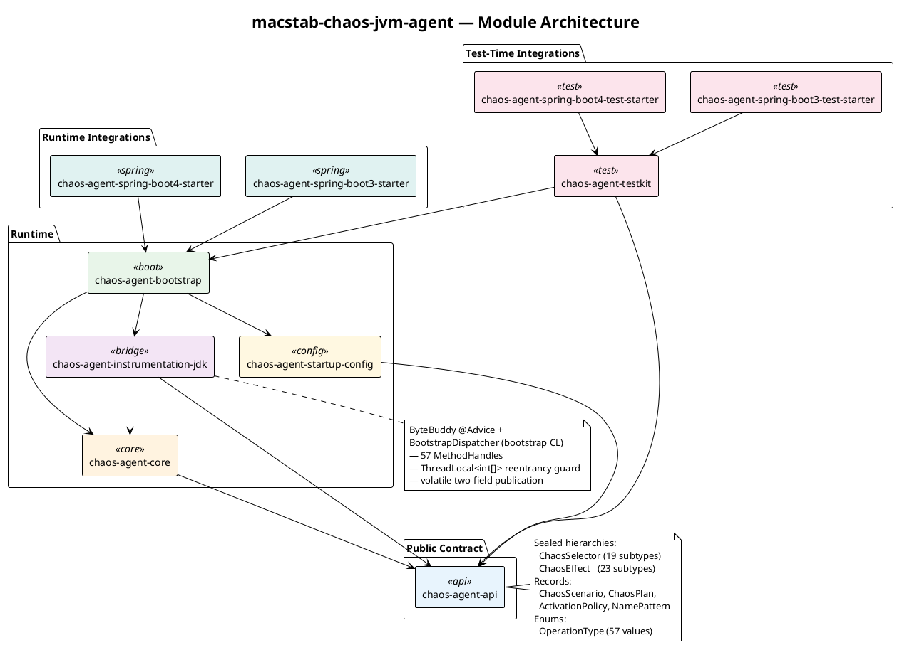

<!--
━━━━━━━━━━━━━━━━━━━━━━━━━━━━━━━━━━━━━━━━━━━━━━━━━━━━━━━━━━━━━
  Engineered by  Christian Schnapka
                 Embedded Principal+ Engineer
                 Macstab GmbH · Hamburg, Germany
                 https://macstab.com
━━━━━━━━━━━━━━━━━━━━━━━━━━━━━━━━━━━━━━━━━━━━━━━━━━━━━━━━━━━━━
-->

<div align="center">

# chaos-testing-java-agent

**Pipeline-grade chaos engineering for the JVM. The failures that page your on-call become commits that fail in PR review.**

[](https://openjdk.org/projects/jdk/21/)
[](LICENSE)
[](https://bytebuddy.net/)
[](https://spring.io/projects/spring-boot)
[](https://quarkus.io/)
[](https://micronaut.io/)

*Designed and engineered by* **[Christian Schnapka](https://macstab.com)** —
Principal+ Engineer · [Macstab GmbH](https://macstab.com) · Hamburg, Germany

</div>

---

## The Short Version

Your Redis cluster is fine 99.9 % of the time.

Then a pod drains. Replication lag spikes to 300 ms. Your retry logic hammers the primary. p99 doubles. PagerDuty fires at 3 AM.

You've been in this room before. Toxiproxy didn't catch it — it's TCP-blind, it never sees `HikariPool.getConnection()` blocking. Your unit tests didn't catch it — they mocked the Redis client. Your integration tests didn't catch it — Testcontainers gave you a perfect Redis. The last game day was three months ago.

**Add eight lines to your test suite. Catch it on the next PR.**

```java
@ChaosTest
void retryLogicSurvivesReplicationLag(ChaosControlPlane chaos) {
    chaos.activate(ChaosScenario.builder("replica-lag-300ms")
        .selector(ChaosSelector.network(
            Set.of(OperationType.SOCKET_READ),
            NamePattern.prefix("redis-replica.")))
        .effect(ChaosEffect.delay(Duration.ofMillis(300)))
        .activationPolicy(ActivationPolicy.always())
        .build());

    assertThat(service.read1000Keys().latencyP99()).isLessThan(BUDGET);
}
```

No sidecar. No mocks. No application code changes. The bytecode of `java.net.Socket` reads is rewritten at JVM startup; chaos applies surgically inside the JVM that's already running your production code paths. **62 JDK call sites** auto-wired across DNS, SSL, JDBC, HTTP, NIO, sockets, virtual threads, monitors, scheduler, GC, class loading, file I/O, ThreadLocal, JNDI, JMX, serialization, native libraries, queues, executors, async completion, and more. One annotation. Zero `--add-opens` flags. The agent self-grants every JDK module open it needs at install time.

Works in JUnit 5 with **Spring Boot 3, Spring Boot 4, Micronaut, and Quarkus** out of the box.

### What questions does it answer?

The questions your on-call has to answer at 3 AM — turned into PR-blocking assertions:

- *"Will a 3-second network outage kill my HikariCP pool, or will it recover?"*
- *"If one connection has 1 s latency, does my repeatable-read transaction still produce consistent data, or does it return stale rows?"*
- *"Is `read_from = REPLICA_PREFERRED` actually routing reads correctly when the primary is slow?"*
- *"Does my circuit breaker open before my caller's timeout fires?"*
- *"When DNS resolution slows from 1 ms to 800 ms, does anything in my stack actually time out, or does it deadlock?"*
- *"If GC pauses 200 ms during a burst, do my queue consumers fall behind permanently or catch up?"*

Every one of those becomes a `@ChaosTest` method that runs on every PR. No game day required. No SRE team required. No production blast radius. **Failures become commits, not incidents.**

---

## Part of a Three-Layer Chaos Engineering Stack

`chaos-testing-java-agent` is the **JVM bytecode layer** of a vertically-integrated chaos engineering toolkit. This repo is self-contained — everything in this README works standalone — but it composes with two sibling layers when broader coverage is needed.

| Layer | Repo | What it covers |
|---|---|---|
| **JVM bytecode** (this repo) | [`macstab/chaos-testing-java-agent`](https://github.com/macstab/chaos-testing-java-agent) | 62 JDK call sites instrumented in-process. Spring Boot 3/4 + Micronaut + Quarkus integration. JUnit 5 `@ChaosTest`. Selector × effect × policy DSL. Live config reload. |
| **Container orchestration** | [`macstab/chaos-testing`](https://github.com/macstab/chaos-testing) | Annotation-driven chaos on top of Testcontainers. CPU throttling, memory pressure, disk I/O, network partitions, DNS failures, pre-built Redis Sentinel + replication-lag scenarios, Toxiproxy adapter, Redis-aware fault injection. |
| **LD_PRELOAD libc** | [`macstab/chaos-testing-libraries`](https://github.com/macstab/chaos-testing-libraries) | Pure C99 LD_PRELOAD shared objects: file I/O (latency / `errno` / torn / corrupt), network, DNS, clock, process, memory. **glibc + musl × amd64 + arm64**, 100 % line coverage on shipped sources, Docker runtime validation as a quality gate. Language-agnostic — works for any process inside any container, not just JVM. |

**Start here** if you're on the JVM. This is the entry point and the richest layer.

**Compose layers** for full distributed-system coverage:
- Add the LD_PRELOAD layer to inject *kernel-real* time skew, slow disks, and DNS slowdowns into containers — chaos for failure modes the JVM can't see (e.g. `clock_gettime` is a syscall the JVM can't intrinsically intercept; the LD_PRELOAD lib can).
- Add the orchestration layer to wire `@ChaosTest` annotations directly to Testcontainers-managed Redis, Postgres, Kafka — including pre-built scenarios like *replication lag during pod drainage*.

Three repos, one mental model: **the same selector × effect × policy DSL spans the libc layer, the JVM layer, and the orchestration layer.** No cross-layer coupling — each layer is independently adoptable, independently versioned, independently released.

---

<!-- TOC -->
* [chaos-testing-java-agent](#chaos-testing-java-agent)
  * [The Short Version](#the-short-version)
    * [What questions does it answer?](#what-questions-does-it-answer)
  * [Part of a Three-Layer Chaos Engineering Stack](#part-of-a-three-layer-chaos-engineering-stack)
  * [Floor 0 — What it does (plain English)](#floor-0--what-it-does-plain-english)
  * [Floor -1 — Architecture (senior engineer territory)](#floor--1--architecture-senior-engineer-territory)
  * [Floor -2 — Runtime mechanics (principal-level)](#floor--2--runtime-mechanics-principal-level)
    * [Evaluation Pipeline](#evaluation-pipeline)
    * [Classloader Bridge](#classloader-bridge)
    * [Reentrancy Guard](#reentrancy-guard)
  * [Floor -3 — JVM internals, bytecode, and OS mechanics (the 1% layer)](#floor--3--jvm-internals-bytecode-and-os-mechanics-the-1-layer)
    * [ByteBuddy Advice and the JVM Retransformation Mechanism](#bytebuddy-advice-and-the-jvm-retransformation-mechanism)
    * [JMM Happens-Before in the Bootstrap Bridge](#jmm-happens-before-in-the-bootstrap-bridge)
    * [`AtomicLong.incrementAndGet()` on x86-64](#atomiclongincrementandget-on-x86-64)
    * [`synchronized(this)` — Rate Limit and the HotSpot Lock Inflation Protocol](#synchronizedthis--rate-limit-and-the-hotspot-lock-inflation-protocol)
    * [`LockSupport.park()` and OS Thread Scheduling](#locksupportpark-and-os-thread-scheduling)
    * [Safepoint Mechanics and `SafepointStormStressor`](#safepoint-mechanics-and-safepointstormstressor)
    * [Virtual Threads and Carrier-Thread Pinning Risk](#virtual-threads-and-carrier-thread-pinning-risk)
    * [`SplittableRandom` — Why Not `ThreadLocalRandom`?](#splittablerandom--why-not-threadlocalrandom)
  * [Quick Start](#quick-start)
    * [1. Add the dependency](#1-add-the-dependency)
    * [2. Annotate your test](#2-annotate-your-test)
    * [3. Or attach at startup for production-like testing](#3-or-attach-at-startup-for-production-like-testing)
  * [Core Concepts](#core-concepts)
  * [Selectors — Full Reference](#selectors--full-reference)
  * [Effects — Full Reference](#effects--full-reference)
    * [Choosing an effect](#choosing-an-effect)
      * [Latency and timing](#latency-and-timing)
      * [Errors and failure handling](#errors-and-failure-handling)
      * [Resource pressure (background stressors)](#resource-pressure-background-stressors)
      * [Threading and concurrency](#threading-and-concurrency)
      * [JVM-wide pause pressure](#jvm-wide-pause-pressure)
    * [Inline effects (execute on the calling thread)](#inline-effects-execute-on-the-calling-thread)
    * [Background stressor effects](#background-stressor-effects)
  * [Activation Policy](#activation-policy)
  * [Session Isolation](#session-isolation)
  * [Recipes](#recipes)
    * [Recipe 1 — Flaky downstream under a retry policy](#recipe-1--flaky-downstream-under-a-retry-policy)
    * [Recipe 2 — Circuit breaker verification under sustained failure](#recipe-2--circuit-breaker-verification-under-sustained-failure)
    * [Recipe 3 — Memory pressure soak without crashing CI](#recipe-3--memory-pressure-soak-without-crashing-ci)
  * [Startup Configuration (JSON)](#startup-configuration-json)
    * [Live config reload (file watch)](#live-config-reload-file-watch)
  * [Diagnostics](#diagnostics)
  * [Architecture](#architecture)
    * [Module responsibilities](#module-responsibilities)
    * [Runtime dispatch](#runtime-dispatch)
    * [Structural diagram](#structural-diagram)
    * [Module reference](#module-reference)
  * [Spring Boot Integration](#spring-boot-integration)
    * [Test Starter](#test-starter)
    * [Runtime Starter](#runtime-starter)
  * [Performance](#performance)
    * [Real-world service impact](#real-world-service-impact)
    * [Hot-path overhead targets](#hot-path-overhead-targets)
    * [What the JIT does](#what-the-jit-does)
    * [Benchmarks](#benchmarks)
  * [Build](#build)
  * [Detailed Documentation](#detailed-documentation)
  * [License](#license)
  * [About the Engineer](#about-the-engineer)
    * [Timeline](#timeline)
    * [Specific evidence in this project](#specific-evidence-in-this-project)
    * [Available for senior engineering engagements](#available-for-senior-engineering-engagements)
<!-- TOC -->

---

## Floor 0 — What it does (plain English)

You have a Java service. You want to know what happens when:
- the database connection pool is always slow
- the executor that processes your orders gets delayed
- `System.currentTimeMillis()` lies to your TTL checks
- `Selector.select()` wakes up for no reason, like the Linux kernel actually does
- the GC is under pressure while your request is in-flight

This library lets you **turn those scenarios on and off programmatically**, scoped to a single test thread, without touching production code. Multiple tests run in parallel in the same JVM — each test's chaos is invisible to every other test.

---

## Floor -1 — Architecture (senior engineer territory)

The agent loads via the standard Java Instrumentation API (`-javaagent:` or dynamic self-attach). ByteBuddy weaves `@Advice` hooks into selected JDK methods at startup. Those hooks call a static dispatcher that routes to the live scenario registry, evaluates matching scenarios against an 8-check activation pipeline, and executes the decision inline on the calling thread.

```
Application Thread
  └─► instrumented JDK method (e.g. ThreadPoolExecutor.execute)
        └─► ByteBuddy @Advice (inlined bytecode)
              └─► BootstrapDispatcher (bootstrap classloader)
                    └─► ChaosBridge → ChaosRuntime (agent classloader)
                          └─► ScenarioRegistry.match() → evaluate() × N
                                └─► RuntimeDecision: delay + gate + terminal action
```

**57 interception handles** span: thread lifecycle, executor submission, scheduled ticks, blocking queues, `CompletableFuture`, NIO selectors, TCP sockets, clock (`currentTimeMillis`/`nanoTime`), GC, `System.exit`, reflection, `ObjectInputStream`, class loading, `LockSupport.park`, AQS acquire, JNDI, JMX, ZIP compression, `ThreadLocal`, native library loading, HTTP client send, JDBC execute, DNS resolve, SSL handshake, `Thread.sleep`, file I/O, and arbitrary method entry/exit.

**Session isolation**: each test gets a `ChaosSession` backed by a `ThreadLocal<String>`. Session-scoped chaos evaluates only when the session ID on the current thread matches. Executor submissions within a `session.bind()` scope carry the session ID into worker threads via task decoration — chaos propagates exactly where intended and nowhere else.

---

## Floor -2 — Runtime mechanics (principal-level)

### Evaluation Pipeline

Every intercepted JVM operation runs through `ScenarioController.evaluate()` — an 8-gate pipeline that short-circuits on the first failed check:

1. `started.get()` — `AtomicBoolean`, maps to a volatile read + memory barrier
2. `sessionId` equality — `String.equals()`, null means JVM-scope (passes all)
3. `SelectorMatcher.matches()` — exhaustive sealed-type `switch` over `ChaosSelector` subtypes; stateless; zero allocation
4. `matchedCount.incrementAndGet()` + activation-window check — `AtomicLong` CAS → lazy INACTIVE transition
5. Warm-up gate: `matched <= activateAfterMatches`
6. Rate limit: `synchronized(this)` sliding-window token bucket — `rateWindowStartMillis + rateWindowPermits`
7. Probability: `new SplittableRandom(baseSeed ^ matched ^ id.hashCode()).nextDouble()`
8. Max-applications: CAS loop on `appliedCount` — prevents overshoot under concurrent access

**Why the CAS loop at step 8?** A naive `incrementAndGet()` then compare pattern allows N racing threads to simultaneously read `count < max`, all increment past the cap, and all apply the effect. The CAS loop (`compareAndSet(current, current+1)` with retry on collision) is the only correct solution under the Java Memory Model.

### Classloader Bridge

JDK classes (`Thread`, `Socket`, `System`, etc.) are loaded by the **bootstrap classloader** — the root of the classloader hierarchy with no parent. ByteBuddy advice woven into these classes executes *in* the bootstrap classloader's namespace, which cannot see agent classes by name. The bridge:

1. At startup, `BootstrapDispatcher.class` bytecode is extracted from the agent JAR, written to a temp JAR, and appended to the bootstrap classpath via `Instrumentation.appendToBootstrapClassLoaderSearch`
2. A 57-slot `MethodHandle[]` array is built against `BridgeDelegate.class` using `MethodHandles.publicLookup()` and wired into `BootstrapDispatcher.install()` via reflection against the bootstrap-classloader version (`Class.forName("...BootstrapDispatcher", true, null)`)
3. `handles` is written to the `volatile` field **before** `delegate` — the Java Memory Model's happens-before rule on volatile writes guarantees any thread that observes `delegate != null` also observes the fully-initialized `handles` array

### Reentrancy Guard

Chaos code itself calls instrumented JDK methods (`Thread.sleep`, `LockSupport.park`, `ConcurrentHashMap` internals). Without protection, each chaos dispatch would trigger another chaos dispatch, recursing until stack overflow. The guard:

```
DEPTH : ThreadLocal<int[]>  (bootstrap-classloader resident)
invoke():
  if DEPTH.get() > 0 → return fallback immediately
  DEPTH.set(DEPTH.get() + 1)
  try { ... dispatch ... }
  finally { if --depth == 0: DEPTH.remove() }
```

The `ThreadLocal.remove()` in the `finally` block is critical for thread pool longevity — without it, the `ThreadLocal` entry accumulates on pooled threads, creating a slow per-thread memory leak across thousands of requests.

A second recursion risk: `ThreadLocal.get()` is itself instrumented in Phase 2. Reading `DEPTH.get()` inside `invoke()` would re-trigger `ThreadLocalGetAdvice`, which would call `invoke()`, which would call `DEPTH.get()` ... The advice contains an identity check:

```java
if (threadLocal == BootstrapDispatcher.depthThreadLocal()) return false;
```

This single pointer-equality check is the only thing preventing infinite recursion at that specific callsite.

---

## Floor -3 — JVM internals, bytecode, and OS mechanics (the 1% layer)

### ByteBuddy Advice and the JVM Retransformation Mechanism

ByteBuddy instrumentation uses `AgentBuilder` with `RedefinitionStrategy.RETRANSFORMATION` and `disableClassFormatChanges()`. What this means at the bytecode level:

- **`disableClassFormatChanges()`** constrains ByteBuddy to inline-only transformations: no new fields, no new constant pool entries that change the class format, no changes to method signatures. The transformed class must be accepted by `ClassFileTransformer.transform()` under the constraints of JVMTI's `RetransformClasses`. This is enforced by JVMTI spec §11.2.2 ("Retransformation Incapable") — specifically, that retransformable transformers may only modify method bodies, not the class schema.
- **`@Advice.OnMethodEnter`** bytecode is copied verbatim (not called — *copied*) into the target method's bytecode at the entry point. The JVM sees one contiguous method body. After JIT compilation (`-XX:CompileThreshold` default 10,000 calls for C2 on HotSpot), the advice body is inlined by the JIT compiler as part of the compiled native frame. There is no virtual dispatch overhead after warm-up.
- **Native method interception** (specifically `System.currentTimeMillis()`, `System.nanoTime()`): these are `@IntrinsicCandidate` native methods. HotSpot replaces them with Architecture-specific intrinsics during JIT compilation — on x86-64, `currentTimeMillis()` becomes a direct `RDTSC` + conversion sequence; on AArch64, it uses `MRS X0, CNTVCT_EL0`. ByteBuddy advice on the Java wrapper is dead code after JIT compilation. The `ClockSkewEffect` cannot intercept production clock reads via bytecode instrumentation alone — it works only via the direct `ChaosRuntime.applyClockSkew()` API.

### JMM Happens-Before in the Bootstrap Bridge

The two-field publication in `BootstrapDispatcher.install()`:

```java
handles = methodHandles;  // volatile write W1
delegate = bridgeDelegate; // volatile write W2
```

By JSR-133 §17.4.5 ([https://jcp.org/aboutJava/communityprocess/mrel/jsr133/index.html](https://jcp.org/aboutJava/communityprocess/mrel/jsr133/index.html)):

> A write to a volatile field happens-before every subsequent read of that field.

W1 happens-before W2 (program order + volatile ordering). Any thread T that reads `delegate != null` (volatile read R2) has R2 synchronizes-with W2, and W2 happens-after W1. By transitivity: `handles` is visible to T. On x86-64, the `volatile` write compiles to a `MOV` + `LOCK XCHG` or `MFENCE` (depending on JIT strategy) to enforce store-ordering. On AArch64, it emits `STLR` (Store-Release) which provides release semantics, ensuring all prior stores are visible before this store completes.

### `AtomicLong.incrementAndGet()` on x86-64

```java
matchedCount.incrementAndGet()
// compiles to:
LOCK XADD [rsi+offset], 1   ; atomic fetch-and-add on x86-64
// or equivalently via CAS loop:
LOCK CMPXCHG [rsi+offset], rax
```

The `LOCK` prefix on x86 asserts the cache coherency protocol (MESI) for the cache line containing the field, issues a full memory barrier (both acquire and release semantics), and ensures atomicity across hyperthreads sharing an L1 cache. On AMD Zen and Intel Architectures with MESIF, this causes a cache-line ownership transfer if another core holds the line in Modified state — the latency spike is 40–70 cycles for cross-core coherency vs. ~4 cycles for same-core hits.

**False sharing risk**: `ScenarioController` packs `matchedCount` and `appliedCount` as adjacent `AtomicLong` fields. Both fields fit in the same 64-byte cache line on typical JVMs. Under high-concurrency scenarios where many threads increment `matchedCount` while others CAS `appliedCount`, the cache line bounces between cores. This is a known trade-off in the current implementation — `@Contended` (JDK internal) padding could eliminate it at the cost of 128 bytes per controller.

### `synchronized(this)` — Rate Limit and the HotSpot Lock Inflation Protocol

The rate-limit check is `synchronized(this)` on the `ScenarioController` instance. HotSpot's lock protocol ([JVM Spec §6.5 monitorenter](https://docs.oracle.com/javase/specs/jvms/se21/html/jvms-6.html#jvms-6.5.monitorenter)):

1. **Biased locking** (if `-XX:+UseBiasedLocking`, JDK < 21): the thread ID is CAS-written into the mark word of the object header. Subsequent acquires by the same thread are lock-free — just a mark word read. JDK 21 removed biased locking ([JEP 374](https://openjdk.org/jeps/374)).
2. **Lightweight lock**: CAS on the object's mark word to install a pointer to the current thread's stack frame. The `monitorenter` bytecode (opcode `0xC2` in the JVM instruction set) triggers this.
3. **Heavyweight lock (inflated)**: when contention is detected, HotSpot inflates to an OS mutex — `pthread_mutex_lock(3)` on Linux, which maps to `futex(2)` with `FUTEX_WAIT` on the lock word. The inflated monitor (`ObjectMonitor` in JVM internals) contains an entry queue and a wait set backed by `ParkEvent` objects.

For the rate-limit case, contention is expected to be near-zero (rate-limited scenarios are rare by design). Biased or lightweight locking dominates — the synchronized block executes in ~5 ns under the uncontended path.

### `LockSupport.park()` and OS Thread Scheduling

`LockSupport.park(blocker)` ([JDK source: `java.util.concurrent.locks.LockSupport`](https://github.com/openjdk/jdk/blob/master/src/java.base/share/classes/java/util/concurrent/locks/LockSupport.java)) maps to `Unsafe.park(false, 0L)` → JVM intrinsic → OS-level thread suspension:

- **Linux**: `pthread_cond_timedwait(3)` → `futex(2)` with `FUTEX_WAIT_BITSET` or `FUTEX_WAIT`. The thread is removed from the kernel run queue, its `task_struct` state set to `TASK_INTERRUPTIBLE`, and control returned to the scheduler. Wakeup via `LockSupport.unpark()` calls `futex(FUTEX_WAKE)`.
- **macOS**: `mach_wait_until(2)` or `semaphore_timedwait` via the Mach port abstraction.
- **Minimum scheduler quanta**: on a Linux kernel with `CONFIG_HZ=1000` (1ms tick), the thread cannot be rescheduled faster than 1ms. `Thread.sleep(delayMillis)` with `delayMillis=1` may actually sleep 1–2ms depending on scheduler load. High-resolution timers (`CONFIG_HIGH_RES_TIMERS=y`) reduce this to sub-millisecond on modern kernels.

The `THREAD_PARK` instrumentation fires a `beforeThreadPark()` dispatch before the actual park. If a `DelayEffect` is configured, `Thread.sleep(delayMillis)` is called — which itself calls `park`, which the reentrancy DEPTH guard intercepts and returns the fallback immediately. Without the DEPTH guard, a 100ms chaos delay on `THREAD_PARK` would cause infinite `sleep → park → chaos eval → sleep → park ...` recursion.

### Safepoint Mechanics and `SafepointStormStressor`

HotSpot safepoints are JVM-global stop-the-world pauses. All application threads must reach a "safe point" — a location in the bytecode where the JVM knows the full GC root set. The `SafepointStormStressor` deliberately triggers them by calling both `System.gc()` and `Instrumentation.retransformClasses()` on a timer.

How safepoints work at the JVM level:
1. The JVM sets a "safepoint flag" in a polling page (a memory-mapped page set to no-access)
2. JIT-compiled code contains safepoint polls at loop back-edges and method returns — a load from the polling page. If the page is no-access, the resulting `SIGSEGV` is caught by the JVM signal handler which parks the thread at the safepoint
3. Interpreted code polls at each bytecode boundary
4. Once all threads are parked, the JVM performs the safepoint operation (GC, retransformation, deoptimization, etc.) and releases all threads

`SafepointStormStressor` calling `Instrumentation.retransformClasses()` forces a safepoint on the calling timer thread, which blocks all application threads for the duration of the transformation. This simulates STW pause pressure that would appear in production under heavy GC load or JVM agent activity.

### Virtual Threads and Carrier-Thread Pinning Risk

On JDK 21+ ([JEP 444 — Virtual Threads](https://openjdk.org/jeps/444)), virtual threads (`Thread.ofVirtual()`) are scheduled by the JVM's `ForkJoinPool`-based scheduler, mounted on platform carrier threads. A virtual thread that calls `synchronized` blocks *pins* its carrier thread — the carrier cannot be reassigned to another virtual thread while the virtual thread holds a monitor.

The `MONITOR_ENTER` interception instruments `AbstractQueuedSynchronizer.acquire()` — a proxy for `java.util.concurrent.locks.ReentrantLock`, not for `synchronized` blocks. The `beforeMonitorEnter()` chaos dispatch (if configured with a `DelayEffect`) adds latency to every AQS lock acquisition. On virtual threads, this delay occurs while the virtual thread is pinned to its carrier (if the lock is reentrant), which blocks that carrier from serving other virtual threads. Under high concurrency, this can cascade into carrier thread exhaustion.

This is documented in JEP 444: "A virtual thread cannot be unmounted when it is pinned to its carrier" — specifically in the case of `synchronized` blocks and JNI calls. AQS-based locks (`ReentrantLock`) do not pin virtual threads; the virtual thread is unmounted when parked inside AQS.

### `SplittableRandom` — Why Not `ThreadLocalRandom`?

`ScenarioController.passesProbability()` creates `new SplittableRandom(baseSeed ^ matched ^ id.hashCode())` per call. Why not `ThreadLocalRandom.current().nextDouble()`?

1. **Reproducibility**: `ThreadLocalRandom` seeds are non-deterministic (seeded from `/dev/urandom` or `nanoTime()`). With a fixed `randomSeed` in `ActivationPolicy`, we need deterministic sampling across runs — same seed + same `matchedCount` = same draw. `SplittableRandom` with an explicit seed satisfies this; `ThreadLocalRandom` does not.
2. **Thread-safety**: `SplittableRandom` is not thread-safe ([JDK API](https://docs.oracle.com/en/java/docs/api/java.base/java/util/SplittableRandom.html)). Creating a new instance per call (cheap — 3 `long` fields) avoids any shared-state issue. The seed is varied by `matched` to prevent the same `Random(seed)` from always returning the same first value.
3. **Why not `Random(seed).nextDouble()`?** `java.util.Random` uses a linear congruential generator with `AtomicLong` state — it's thread-safe but that safety is achieved via CAS, adding unnecessary contention. `SplittableRandom` uses a non-linear generator (a variant of `xorshift`) with no internal synchronization.

---

## Quick Start

### 1. Add the dependency

```kotlin
// build.gradle.kts
testImplementation("com.macstab:chaos-agent-testkit:0.1.0-SNAPSHOT")
```

### 2. Annotate your test

```java
@ExtendWith(ChaosAgentExtension.class)
class MyServiceTest {

    @Test
    void shouldHandleExecutorDelays(ChaosSession session) {
        session.activate(ChaosScenario.builder("slow-executor")
            .scope(ChaosScenario.ScenarioScope.SESSION)
            .selector(ChaosSelector.executor(Set.of(OperationType.EXECUTOR_SUBMIT, OperationType.EXECUTOR_WORKER_RUN)))
            .effect(ChaosEffect.delay(Duration.ofMillis(200)))
            .build());

        try (ChaosSession.ScopeBinding scope = session.bind()) {
            myService.doWork(); // executor submissions delayed 200ms
        }
    }
}
```

`ChaosAgentExtension` self-attaches the agent, opens a fresh `ChaosSession` per test, and closes it after. No `-javaagent` flag required for tests.

### 3. Or attach at startup for production-like testing

```bash
java -javaagent:chaos-agent-bootstrap-0.1.0-SNAPSHOT.jar=configFile=/etc/chaos/plan.json \
     -jar your-app.jar
```

---

## Core Concepts

| Concept | What it is |
|---------|-----------|
| **Scenario** | One selector + one effect + one activation policy |
| **Selector** | Matching rule: which JVM operation(s) trigger this scenario |
| **Effect** | What happens: delay, reject, suppress, gate, exception, corrupt, stress, skew |
| **Activation policy** | Gating: probability, rate limit, warm-up, time window, max applications |
| **Session** | Thread-local isolation scope — chaos targets only session-bound threads |
| **Handle** | `AutoCloseable` returned by `activate()`; close to stop the scenario |

---

## Selectors — Full Reference

Every selector factory takes a `Set<OperationType>`. Pass an empty set to accept every operation the selector understands. For pattern-based filters, pass a `NamePattern` (e.g. `NamePattern.prefix(...)`, `NamePattern.regex(...)`, `NamePattern.any()`).

| Factory | Intercepts |
|---------|------------|
| `ChaosSelector.executor(Set<OperationType>)` | `ThreadPoolExecutor.execute()` / `submit()` / `invokeAll()` |
| `ChaosSelector.scheduling(Set<OperationType>)` | `ScheduledExecutorService.schedule*()` |
| `ChaosSelector.thread(Set<OperationType>, ThreadKind)` | `Thread.start()` — platform and virtual threads |
| `ChaosSelector.queue(Set<OperationType>)` | `BlockingQueue.put()` / `take()` / `offer()` / `poll()` |
| `ChaosSelector.async(Set<OperationType>)` | `CompletableFuture.complete()` / `completeExceptionally()` / `cancel()` |
| `ChaosSelector.network(Set<OperationType>[, NamePattern remoteHostPattern])` | `Socket` connect / read / write, `ServerSocket.accept()` |
| `ChaosSelector.nio(Set<OperationType>[, NamePattern channelClassPattern])` | `SocketChannel`, `ServerSocketChannel`, `Selector.select()` |
| `ChaosSelector.method(Set<OperationType>, NamePattern classPattern, NamePattern methodPattern)` | Arbitrary method entry (`METHOD_ENTER`) and exit (`METHOD_EXIT`) |
| `ChaosSelector.classLoading(Set<OperationType>, NamePattern loaderClassPattern, NamePattern classNamePattern)` | `ClassLoader.loadClass()` / `defineClass()` / `getResource()` |
| `ChaosSelector.monitor(Set<OperationType>)` | `synchronized` monitor enter/exit |
| `ChaosSelector.jvmRuntime(Set<OperationType>)` | `currentTimeMillis()`, `nanoTime()`, `gc()`, `exit()`, `halt()` |
| `ChaosSelector.threadLocal(Set<OperationType>[, NamePattern valueClassPattern])` | `ThreadLocal.get()` / `ThreadLocal.set()` |
| `ChaosSelector.shutdown(Set<OperationType>)` | `System.exit()` / `Runtime.halt()` / shutdown hook register/remove |
| `ChaosSelector.httpClient(Set<OperationType>[, NamePattern urlPattern])` | `HttpClient.send()` / `sendAsync()` |
| `ChaosSelector.jdbc()` / `ChaosSelector.jdbc(OperationType...)` | JDBC `Connection`, `Statement`, `PreparedStatement`, `ResultSet` |
| `ChaosSelector.dns(Set<OperationType>[, NamePattern hostnamePattern])` | `InetAddress.getAllByName()` |
| `ChaosSelector.ssl(Set<OperationType>)` | `SSLEngine.wrap()` / `unwrap()` handshake |
| `ChaosSelector.fileIo(Set<OperationType>)` | `FileInputStream` / `FileOutputStream` / `RandomAccessFile` / `Files` |
| `ChaosSelector.stress(StressTarget)` | Background stressor lifecycle binding |

For full parameter semantics and edge-case behaviour of every selector, see [`docs/configuration-reference.md`](docs/configuration-reference.md).

---

## Effects — Full Reference

### Choosing an effect

The decision guide below maps **testing goals** to effects. Every effect in the two reference tables that follow is listed here at least once; effects with multiple distinct use cases (for example `skewClock` with three modes) appear on multiple rows so the goal-to-effect mapping is direct.

#### Latency and timing

| I want to test… | Effect |
|---|---|
| What happens when a downstream is slow | `delay(Duration)` — fixed pause |
| Behaviour under variable latency (realistic network jitter) | `delay(Duration min, Duration max)` — uniform-random pause |
| A caller's timeout logic when the callee blocks indefinitely | `gate(Duration maxBlock)` — block until released or capped |
| Clock-based logic (TTLs, retries, token expiry) under continuous drift | `skewClock(Duration, ClockSkewMode.DRIFT)` |
| Behaviour when the clock stops advancing | `skewClock(Duration, ClockSkewMode.FREEZE)` |
| Behaviour under a fixed clock offset (positive or negative) | `skewClock(Duration, ClockSkewMode.FIXED)` |
| Code that handles `Selector.select()` spurious wakeups | `spuriousWakeup()` |

#### Errors and failure handling

| I want to test… | Effect |
|---|---|
| A downstream returning "not available" | `reject(String message)` — throws a semantically correct exception for the intercepted operation type |
| A call that silently fails (returns `null` / `false` / empty) | `suppress()` |
| A `CompletableFuture` completing exceptionally mid-pipeline | `exceptionalCompletion(FailureKind, String)` |
| A callee throwing a *specific* exception class | `injectException(String className, String message)` |
| A return value that is technically valid but semantically wrong | `corruptReturnValue(ReturnValueStrategy.NULL / ZERO / EMPTY / BOUNDARY_MAX / BOUNDARY_MIN)` |

#### Resource pressure (background stressors)

| I want to test… | Effect |
|---|---|
| Behaviour under sustained heap pressure | `heapPressure(long bytes, int chunkSize)` |
| GC behaviour under high allocation churn | `gcPressure(long bytesPerSecond, Duration)` |
| Metaspace (class metadata) pressure from dynamic class loading | `metaspacePressure(int classCount, int fieldsPerClass)` |
| Direct (off-heap) buffer pressure | `directBufferPressure(long totalBytes, int bufferSize)` |
| JIT code cache filling up (inline-cache thrash, deopt) | `codeCachePressure(int classCount, int methodsPerClass)` |
| String intern pool growth (permanent root retention) | `stringInternPressure(int count, int length)` |
| Reference-queue flood (phantom-reference reclamation delay) | `referenceQueueFlood(int count, Duration interval)` |
| Finalizer backlog stalling GC | `finalizerBacklog(int objectCount, Duration delay)` |

#### Threading and concurrency

| I want to test… | Effect |
|---|---|
| A real JVM monitor deadlock between N participants | `deadlock(int participantCount)` — requires `ActivationPolicy.withDestructiveEffects()` |
| Thread-leak behaviour (unbounded thread creation) | `threadLeak(int count, String prefix, boolean daemon)` — requires `ActivationPolicy.withDestructiveEffects()` |
| `ThreadLocal` leaks on a pooled thread | `threadLocalLeak(int entries, int valueSize)` |
| Monitor contention on a shared lock | `monitorContention(...)` |
| A keep-alive thread preventing clean shutdown | `keepAlive(String name, boolean daemon, Duration heartbeat)` |

#### JVM-wide pause pressure

| I want to test… | Effect |
|---|---|
| Application behaviour during stop-the-world pauses | `safepointStorm(Duration gcInterval)` — periodic `System.gc()` + `Instrumentation.retransformClasses()` |

Two behavioural notes that the table cannot express:

- **Effects compose across matching scenarios.** Delays from all matching scenarios accumulate; terminal actions (`reject` / `suppress` / `exception` / `corruptReturnValue`) resolve by `precedence` — higher wins. This lets you layer e.g. "slow every call + reject 10 % of calls" without conflict.
- **Stressors are background-attached, not per-call.** Their selector pairing (`ChaosSelector.stress(StressTarget)`) is a lifecycle binding — the stressor starts when the scenario activates and persists until the handle is closed or `activeFor` elapses, independent of operation traffic on the JVM.

### Inline effects (execute on the calling thread)

| Factory | Description |
|---------|-------------|
| `ChaosEffect.delay(Duration)` | Fixed pause before the operation proceeds |
| `ChaosEffect.delay(Duration min, Duration max)` | Uniform random pause in `[min, max]` |
| `ChaosEffect.gate(Duration maxBlock)` | Block until `handle.release()` is called (or `maxBlock` elapses) |
| `ChaosEffect.reject(String message)` | Throw a semantically correct exception for the operation type |
| `ChaosEffect.suppress()` | Silently discard; return `null` / `false` per operation contract |
| `ChaosEffect.exceptionalCompletion(FailureKind, String message)` | Complete a `CompletableFuture` with a failure |
| `ChaosEffect.injectException(String className, String message)` | Inject arbitrary exception at method entry via reflection |
| `ChaosEffect.corruptReturnValue(ReturnValueStrategy)` | Corrupt return value: `NULL`, `ZERO`, `EMPTY`, `BOUNDARY_MAX`, `BOUNDARY_MIN` |
| `ChaosEffect.skewClock(Duration, ClockSkewMode)` | Skew `currentTimeMillis()` / `nanoTime()`: `FIXED`, `DRIFT`, `FREEZE` |
| `ChaosEffect.spuriousWakeup()` | Force `Selector.select()` to return 0 immediately |

### Background stressor effects

| Factory | What it does | Recoverable? |
|---------|--------------|:---:|
| `ChaosEffect.heapPressure(long bytes, int chunkSizeBytes)` | Retain `byte[]` allocations on heap | ✅ |
| `ChaosEffect.keepAlive(String threadName, boolean daemon, Duration heartbeat)` | Spawn an idle keep-alive thread | ✅ |
| `ChaosEffect.metaspacePressure(int classCount, int fieldsPerClass)` | Define synthetic classes into an isolated classloader | ✅ (slow GC) |
| `ChaosEffect.directBufferPressure(long totalBytes, int bufferSizeBytes)` | Allocate off-heap `ByteBuffer.allocateDirect` | ✅ (GC-dependent) |
| `ChaosEffect.gcPressure(long allocationRateBytesPerSecond, Duration duration)` | Continuously allocate short-lived objects | ✅ |
| `ChaosEffect.finalizerBacklog(int objectCount, Duration finalizerDelay)` | Flood the finalizer queue | ✅ |
| `ChaosEffect.deadlock(int participantCount)` | Create a real JVM monitor deadlock between N threads | ✅ |
| `ChaosEffect.threadLeak(int threadCount, String namePrefix, boolean daemon)` | Start permanently-parked threads that are never joined | ✅ |
| `ChaosEffect.threadLocalLeak(int entriesPerThread, int valueSizeBytes)` | Leak `ThreadLocal` entries on a background thread | ✅ (partial) |
| `ChaosEffect.monitorContention(…)` | Saturate a shared lock with background contenders | ✅ |
| `ChaosEffect.codeCachePressure(int classCount, int methodsPerClass)` | Generate ByteBuddy classes to fill the JIT code cache | ✅ |
| `ChaosEffect.safepointStorm(Duration gcInterval)` | Trigger periodic GC + retransformation (STW pauses) | ✅ |
| `ChaosEffect.stringInternPressure(int internCount, int stringLengthBytes)` | Intern unique strings into the JVM string pool | ✅ (pool is GC root) |
| `ChaosEffect.referenceQueueFlood(int referenceCount, Duration floodInterval)` | Flood the JVM reference queue with phantom refs | ✅ |

> ⚠️ `deadlock()` and `threadLeak()` with `daemon=false` prevent a clean JVM exit until the activation handle is closed. Both require `ActivationPolicy.withDestructiveEffects()` at registration time. Closing the handle interrupts all participating threads and releases all locks.

For full parameter semantics, bounds, and edge-case behaviour of every effect, see [`docs/configuration-reference.md`](docs/configuration-reference.md).

---

## Activation Policy

`ActivationPolicy` is a record. Use the static factories for the common cases, or construct the canonical record directly for fine-grained control. Probability must be in `(0.0, 1.0]` — pass `null` / omit the JSON field for the `1.0` default; omit the scenario entirely to disable it.

```java
// Always fire (default)
ActivationPolicy fire = ActivationPolicy.always();

// Fire on every match, but start paused until handle.start() is called
ActivationPolicy armed = ActivationPolicy.manual();

// Explicit opt-in for deadlock() / threadLeak()
ActivationPolicy destructive = ActivationPolicy.withDestructiveEffects();

// Fine-grained: 30% probability, rate-limit 10/s, warm-up, auto-expire, cap, seed
ActivationPolicy tuned = new ActivationPolicy(
    ActivationPolicy.StartMode.AUTOMATIC,
    0.30,                                              // probability (in (0, 1])
    5L,                                                // activateAfterMatches (warm-up)
    100L,                                              // maxApplications
    Duration.ofSeconds(30),                            // activeFor
    new ActivationPolicy.RateLimit(10, Duration.ofSeconds(1)),
    42L,                                               // randomSeed
    false);                                            // allowDestructiveEffects
```

All guards compose as AND. Fields may be `null` (Long / Duration / RateLimit / Long) to opt out of that axis.

---

## Session Isolation

```java
@Test void testA(ChaosSession sessionA) {
    sessionA.activate(delayScenario);
    try (var b = sessionA.bind()) {
        // only threads carrying sessionA's ID see this chaos
        executor.execute(sessionA.wrap(() -> myService.doWork()));
    }
}

@Test void testB(ChaosSession sessionB) {
    // completely independent, even in parallel — different session UUID
    sessionB.activate(rejectScenario);
}
```

---

## Recipes

Three worked examples showing how selectors, effects, and activation policy compose for real testing goals. Each recipe is self-contained — copy, adapt the selector pattern, and run.

### Recipe 1 — Flaky downstream under a retry policy

**Goal.** Verify that a client's retry logic correctly recovers when 30 % of outgoing HTTP calls to a specific host fail with a connection reset, mixed with variable latency on the successes.

```java
var flakyDownstream = ChaosScenario.builder("flaky-payments-api")
    .selector(ChaosSelector.httpClient(
        Set.of(OperationType.HTTP_CLIENT_SEND, OperationType.HTTP_CLIENT_SEND_ASYNC),
        NamePattern.prefix("https://payments.internal/")))
    .effect(ChaosEffect.reject("chaos: connection reset by peer"))
    .activationPolicy(new ActivationPolicy(
        ActivationPolicy.StartMode.AUTOMATIC,
        0.30,                                               // 30 % of matched calls reject
        0L, null, null, null,
        42L,                                                // deterministic seed — reproducible failure pattern
        false))
    .precedence(10)                                         // reject wins over delay when both match
    .build();

var slowDownstream = ChaosScenario.builder("slow-payments-api")
    .selector(ChaosSelector.httpClient(
        Set.of(OperationType.HTTP_CLIENT_SEND, OperationType.HTTP_CLIENT_SEND_ASYNC),
        NamePattern.prefix("https://payments.internal/")))
    .effect(ChaosEffect.delay(Duration.ofMillis(50), Duration.ofMillis(400)))
    .build();

session.activate(flakyDownstream);
session.activate(slowDownstream);
// 100 % of calls experience jitter; 30 % of calls additionally fail.
// The retry policy under test sees a realistic mixed-failure signal.
```

**What this exercises.** Delays accumulate across matching scenarios, but terminal actions resolve by precedence — the `reject` (precedence=10) wins over the default `delay`, so the 30 % of calls that lose the probability roll see `reject` *after* the latency jitter is applied. `randomSeed=42L` makes the pattern reproducible across runs — same input produces same failure sequence, so a failing test bisects cleanly.

### Recipe 2 — Circuit breaker verification under sustained failure

**Goal.** Prove that a Resilience4j `CircuitBreaker` transitions to `OPEN` state after 20 downstream failures, then rejects further calls fast with `CallNotPermittedException`.

```java
var sustainedFailure = ChaosScenario.builder("circuit-breaker-trigger")
    .selector(ChaosSelector.jdbc(OperationType.JDBC_STATEMENT_EXECUTE))
    .effect(ChaosEffect.injectException(
        "java.sql.SQLTransientConnectionException",
        "chaos: pool exhausted"))
    .activationPolicy(new ActivationPolicy(
        ActivationPolicy.StartMode.AUTOMATIC,
        1.0,                                                // 100 % — every call fails
        0L,
        20L,                                                // hard cap: after 20 applications, stop
        null, null, null,
        false))
    .build();

session.activate(sustainedFailure);

// Drive 25 calls through the circuit breaker.
// Calls 1-20: fail with SQLTransientConnectionException — circuit breaker counts failures.
// Calls 21-25: fail with CallNotPermittedException — circuit breaker is now OPEN, fast-rejecting.
for (int i = 0; i < 25; i++) {
    try {
        circuitBreaker.executeCallable(() -> jdbcTemplate.queryForList("SELECT 1"));
    } catch (CallNotPermittedException e) {
        // assert: transition happened after exactly 20 failures
    }
}
```

**What this exercises.** `maxApplications=20L` caps the chaos at exactly 20 effect applications — the 21st matched call passes through uninstrumented, so the circuit-breaker's fast-reject behaviour is observable on real calls instead of being masked by further injected failures. The CAS loop on `appliedCount` (Floor -2, step 8) guarantees the cap holds even under concurrent test threads hitting the connection pool in parallel.

### Recipe 3 — Memory pressure soak without crashing CI

**Goal.** Verify that a service holds its SLO under sustained heap pressure for 30 seconds, then the chaos self-releases so CI does not OOM-kill the test JVM.

```java
var heapSoak = ChaosScenario.builder("heap-pressure-soak")
    .selector(ChaosSelector.stress(StressTarget.HEAP))
    .effect(ChaosEffect.heapPressure(
        512L * 1024 * 1024,                                 // 512 MiB total retention
        1024 * 1024))                                       // 1 MiB chunks — avoids single-allocation OOM
    .activationPolicy(new ActivationPolicy(
        ActivationPolicy.StartMode.AUTOMATIC,
        1.0, 0L, null,
        Duration.ofSeconds(30),                             // auto-release after 30 s — CI safety
        null, null, false))
    .build();

try (var handle = session.activate(heapSoak)) {
    // Run your soak test here. The stressor holds 512 MiB for up to 30 s,
    // then self-releases. If your test finishes sooner, the try-with-resources
    // closes the handle and the heap is freed immediately.
    runWorkloadFor(Duration.ofSeconds(20));
}
// After handle.close() or activeFor expiry, the 512 MiB is eligible for GC.
// CI's next test starts from a clean heap.
```

**What this exercises.** Stressors are background-attached (they do not fire per call) — activation spins up the stressor once, it holds memory for the lifetime of the handle, and closing the handle (via try-with-resources or `activeFor` expiry) releases the retained arrays. Using 1 MiB chunks instead of one 512 MiB allocation avoids a single `OutOfMemoryError` if the JVM is already close to its ceiling — pressure builds gradually, so the service under test experiences GC thrash rather than instant death.

---

## Startup Configuration (JSON)

```json
{
  "name": "soak-test-plan",
  "scenarios": [
    {
      "id": "executor-latency",
      "scope": "JVM",
      "selector": { "type": "executor" },
      "effect": { "type": "delay", "minDelay": "PT0.1S", "maxDelay": "PT0.5S" },
      "activationPolicy": { "probability": 0.5 }
    }
  ]
}
```

```bash
-javaagent:agent.jar=configFile=/etc/chaos/plan.json
-javaagent:agent.jar=configBase64=<base64-json>
-javaagent:agent.jar=configJson={"name":"..."}
-javaagent:agent.jar=configFile=/etc/plan.json,debugDumpOnStart=true
```

Environment variables: `MACSTAB_CHAOS_CONFIG_FILE`, `MACSTAB_CHAOS_CONFIG_JSON`, `MACSTAB_CHAOS_CONFIG_BASE64`.

### Live config reload (file watch)

Point the agent at a file and enable watch mode — the agent polls the file at the configured interval, computes the diff, and updates only what changed while the JVM runs:

```bash
# poll every 500 ms
-javaagent:agent.jar=configFile=/etc/chaos/plan.json,configWatchInterval=500

# or via environment
MACSTAB_CHAOS_CONFIG_FILE=/etc/chaos/plan.json
MACSTAB_CHAOS_WATCH_INTERVAL=500
```

The diff algorithm is structural: scenarios with the same `id` **and** identical content are kept running untouched. Scenarios that are new or whose content changed are stopped and re-activated. Scenarios that were removed are stopped. Programmatically activated scenarios (via `ChaosControlPlane.activate()`) are never touched by the poller.

---

## Diagnostics

```java
ChaosDiagnostics diag = controlPlane.diagnostics();
ChaosDiagnostics.Snapshot snap = diag.snapshot();

snap.scenarios().forEach(r ->
    System.out.printf("%s: state=%s matched=%d applied=%d reason=%s%n",
        r.id(), r.state(), r.matchedCount(), r.appliedCount(), r.reason()));

System.out.println(diag.debugDump()); // full text dump
```

JMX MBean: `com.macstab.chaos.jvm:type=ChaosDiagnostics` — inspect from `jconsole` without code changes.

**Diagnosing zero applications**:
- `matchedCount > 0 && appliedCount == 0` → selector works; activation policy is filtering
- `matchedCount == 0` → selector not matching; verify operation type, class name pattern, and `session.bind()` is active

---

## Architecture

The agent is a multi-module Gradle project organised as a strict directed dependency graph: the stable public API at the top, bytecode instrumentation and the bootstrap bridge at the bottom, with runtime core, startup configuration, and framework integrations layered between. Every module is independently versioned and independently publishable — consumers depend on `chaos-agent-api` for contract stability and pull in exactly one integration module (test or runtime, Boot 3 or Boot 4) for the chosen environment.

### Module responsibilities

- **Public contract** — `chaos-agent-api` is the only module application code compiles against. Sealed hierarchies (`ChaosSelector`, `ChaosEffect`), records (`ChaosScenario`, `ChaosPlan`, `ActivationPolicy`, `NamePattern`), and the `ChaosControlPlane` / `ChaosSession` interfaces form the stable surface. Everything else is implementation.
- **Runtime core** — `chaos-agent-core` holds the scenario registry, the 8-gate evaluation pipeline, session scoping, and every stressor implementation (heap, metaspace, direct-buffer, GC, finalizer, deadlock, thread-leak, monitor, code-cache, safepoint, string-intern, reference-queue, thread-local, keep-alive, virtual-thread carrier pinning). Hot-path code (`ChaosDispatcher`, `ScenarioController`) is profiled against JMH benchmarks.
- **Bytecode instrumentation** — `chaos-agent-instrumentation-jdk` defines the ByteBuddy `@Advice` classes and the bootstrap-classloader bridge. `BootstrapDispatcher` (bootstrap-resident, appended via `Instrumentation.appendToBootstrapClassLoaderSearch`) is the only path by which instrumented JDK methods reach the agent classloader — a `volatile` two-field publication protocol guarantees JMM visibility of the 57-slot `MethodHandle[]` dispatch table.
- **Agent lifecycle** — `chaos-agent-bootstrap` owns the `premain` / `agentmain` entry points, the singleton `ChaosControlPlane` installation, and JMX MBean registration.
- **Configuration resolution** — `chaos-agent-startup-config` resolves plans from `configFile`, `configJson`, `configBase64`, and environment variables, deserialises them via Jackson polymorphic mapping, and runs the live-reload file watcher.
- **Test integrations** — `chaos-agent-testkit` provides `ChaosAgentExtension` (JUnit 5) and `ChaosPlatform.installLocally()` for self-attach. `chaos-agent-spring-boot3-test-starter` and `chaos-agent-spring-boot4-test-starter` compose `@ChaosTest` on top and wire a class-scoped `ChaosSession` into Spring Boot tests.
- **Runtime integrations** — `chaos-agent-spring-boot3-starter` and `chaos-agent-spring-boot4-starter` expose `ChaosControlPlane` as a Spring bean and register the `/actuator/chaos` endpoint for live plan activation against running applications.

### Runtime dispatch

Every intercepted JVM operation travels through five bytecode frames before a decision is reached:

1. **Instrumented JDK method** — e.g. `ThreadPoolExecutor.execute()`, with ByteBuddy advice woven into the method body at agent startup (not called — *copied* inline)
2. **`BootstrapDispatcher`** — bootstrap-classloader-resident static entry point holding the 57-slot `MethodHandle[]` and a `ThreadLocal<int[]>` reentrancy depth guard (a one-element `int` array avoids `Integer` autoboxing per call)
3. **`BridgeDelegate`** — agent-classloader bridge that unboxes arguments and forwards to the active runtime
4. **`ChaosDispatcher` / `ScenarioController`** — registry lookup + the 8-gate evaluation pipeline: `started` → session match → selector match → `matchedCount++` + activation window → warm-up → rate limit → probability → max-applications CAS
5. **`ChaosEffect`** — terminal action executed inline on the calling thread (`delay` / `reject` / `suppress` / `gate` / `exception` / `corruptReturnValue` / `skewClock` / stressor handle)

The reentrancy guard short-circuits when chaos code itself calls instrumented JDK methods (e.g. a delay effect's own `Thread.sleep` would otherwise recurse into `THREAD_PARK` interception). Removing the `ThreadLocal` entry in the `finally` block is critical for thread-pool longevity — without it the entry accumulates on pooled threads, creating a slow per-thread memory leak.

### Structural diagram



`plantuml` code fences do not render on GitHub directly — copy the source into the IntelliJ PlantUML plugin, `plantuml.jar`, or [plantuml.com/plantuml](https://www.plantuml.com/plantuml) to render. Pre-rendered diagrams for this and all downstream sequences live in [`docs/overall-agent.md`](docs/overall-agent.md).

### Module reference

| Module | Role |
|--------|------|
| `chaos-agent-api` | **Stable public API** — the only module application code should depend on |
| `chaos-agent-bootstrap` | Agent entry point (`premain`/`agentmain`), singleton, MBean registration |
| `chaos-agent-core` | Scenario registry, evaluation pipeline, session scoping, stressors |
| `chaos-agent-instrumentation-jdk` | ByteBuddy advice, bootstrap bridge (57 interception handles) |
| `chaos-agent-startup-config` | JSON/base64/file config resolution and Jackson mapping |
| `chaos-agent-testkit` | JUnit 5 extension, `ChaosPlatform.installLocally()` for self-attach |
| `chaos-agent-spring-boot3-test-starter` | `@ChaosTest` + `ChaosAgentExtension` for Spring Boot 3 tests |
| `chaos-agent-spring-boot4-test-starter` | `@ChaosTest` + `ChaosAgentExtension` for Spring Boot 4 tests |
| `chaos-agent-spring-boot3-starter` | Runtime starter with Actuator endpoint for Spring Boot 3 |
| `chaos-agent-spring-boot4-starter` | Runtime starter with Actuator endpoint for Spring Boot 4 |
| `chaos-agent-examples` | Runnable usage examples |

---

## Spring Boot Integration

Two axes, four modules: test-time vs runtime, Boot 3 vs Boot 4. All four are `compileOnly` against their Spring Boot BOM — they are inert until the consuming application supplies Spring Boot on the classpath.

### Test Starter

The test starters give a `@SpringBootTest` class one-annotation access to chaos instrumentation. Add the dependency, put `@ChaosTest` on the class, declare a `ChaosSession` parameter on any test method.

```kotlin
// build.gradle.kts — Spring Boot 3
testImplementation("com.macstab:chaos-agent-spring-boot3-test-starter:0.1.0-SNAPSHOT")

// Spring Boot 4
testImplementation("com.macstab:chaos-agent-spring-boot4-test-starter:0.1.0-SNAPSHOT")
```

```java
@ChaosTest
class OrderServiceChaosTest {

    @Test
    void slowDatabaseRejectsOrdersGracefully(ChaosSession chaos) {
        chaos.activate(ChaosScenario.builder("slow-jdbc")
            .scope(ChaosScenario.ScenarioScope.SESSION)
            .selector(ChaosSelector.jdbc())
            .effect(ChaosEffect.delay(Duration.ofSeconds(3)))
            .build());

        try (var binding = chaos.bind()) {
            assertThrows(OrderTimeoutException.class,
                () -> orderService.placeOrder(testOrder));
        }
    }
}
```

`@ChaosTest` composes `@SpringBootTest` and `@ExtendWith(ChaosAgentExtension.class)`. The extension self-attaches the agent (idempotent across the JVM), opens a class-scoped `ChaosSession`, injects it into test method parameters, and closes it after the last test method runs. `@Nested` classes inherit the same session. `ChaosControlPlane` can also be injected as a parameter. No `-javaagent` flag is needed for test JVMs.

### Runtime Starter

The runtime starters wire the chaos agent into a running Spring Boot application and optionally expose a Spring Boot Actuator endpoint for runtime activation and control.

```kotlin
// build.gradle.kts — Spring Boot 3
implementation("com.macstab:chaos-agent-spring-boot3-starter:0.1.0-SNAPSHOT")

// Spring Boot 4
implementation("com.macstab:chaos-agent-spring-boot4-starter:0.1.0-SNAPSHOT")
```

```yaml
# application.yml — opt-in required; all flags default to false
macstab:
  chaos:
    enabled: true
    config-file: /etc/chaos/soak-plan.json  # optional startup plan
    debug-dump-on-start: false
    actuator:
      enabled: true   # exposes /actuator/chaos — protect with Spring Security
```

When `enabled: true`, the starter installs the agent and exposes `ChaosControlPlane` as a Spring bean with `destroyMethod = "close"`. If `config-file` is set, the plan is loaded and activated on `ApplicationReadyEvent`. When `actuator.enabled: true` (and `spring-boot-actuator` is on the classpath), the `/actuator/chaos` endpoint becomes available:

```bash
# Inspect active scenarios
curl http://localhost:8080/actuator/chaos

# Activate a plan inline
curl -X POST http://localhost:8080/actuator/chaos \
     -H 'Content-Type: application/json' \
     -d '{"name":"latency","scenarios":[{"id":"slow-executor","scope":"JVM","selector":{"type":"executor"},"effect":{"type":"delay","minDelay":"PT0.2S","maxDelay":"PT0.5S"}}]}'

# Stop a specific scenario by ID
curl -X DELETE http://localhost:8080/actuator/chaos/slow-executor

# Stop all starter-managed scenarios
curl -X DELETE http://localhost:8080/actuator/chaos
```

> The `/actuator/chaos` endpoint can activate arbitrary fault injection in the live JVM. Protect it as you would a shutdown endpoint — never expose it unauthenticated to the public internet.

For deep technical detail on all four modules — lifecycle, conditional wiring, `@Nested` session propagation, `ChaosHandleRegistry` design, `ChaosAgentInitializer` timing, Boot 3 vs Boot 4 factory differences, and PlantUML sequence diagrams — see [`docs/spring-integration.md`](docs/spring-integration.md).

---

## Performance

The agent is designed to be invisible on any I/O-bound path. All numbers below are for the **hot path after JIT warm-up** (~10 000 invocations for C2 tier on HotSpot).

### Real-world service impact

The number that matters is not nanoseconds per call — it is the total overhead on your service
while chaos is active. For a typical Java microservice handling **2 000 requests/sec** with a
realistic mix of file reads, DNS lookups, SSL connections, and timed retries:

| Agent state | Total dispatch overhead | % of one CPU core (2.5 GHz) |
|---|---|---|
| Agent installed, **no scenarios** | ~0.31 ms/sec | **0.003 %** |
| **4 active scenarios**, all Phase 4 operation types | ~1.74 ms/sec | **0.017 %** |
| **4 exhausted scenarios** left resident in registry | ~1.74 ms/sec | **0.017 %** |

Two hundredths of one percent. That is the tax for running four simultaneous chaos scenarios
across all instrumented operation types in a busy service.

The practical implication by operation type:

| Operation | Cost matters when… | Cost is negligible when… |
|---|---|---|
| File I/O read (page cache hot) | Exhausted scenarios left resident; >100 K reads/sec | Container under memory pressure, page cache evicted → syscall dominates |
| DNS resolution | JVM address cache hit + exhausted scenarios | Real DNS query involved → network roundtrip (≥500 µs) dwarfs 300 ns |
| SSL handshake | Never — TLS crypto (1–10 ms) is always 3–4 orders of magnitude larger | Always |
| Thread.sleep | Never — the sleep duration dominates completely | Always |

**One rule to remember:** call `ChaosActivationHandle.stop()` when a scenario is done.
An exhausted scenario (one that hit `maxApplications`) costs as much to evaluate per call as one
that is actively firing — and delivers nothing. Stopping it returns overhead to the zero-scenario
floor immediately.

### Hot-path overhead targets

| Scenario | Target | What drives the cost |
|----------|--------|----------------------|
| Agent installed, zero active scenarios | **< 60 ns** | Registry empty check + early return |
| One scenario active, no selector match | **< 100 ns** | Operation-type mismatch exits before pattern evaluation |
| One scenario active, match, no terminal effect | **< 300 ns** | Full 8-check evaluation pipeline, no effect applied |
| Session scope miss (wrong session ID) | **< 20 ns additional** | ThreadLocal read + identity compare, exits before selector evaluation |
| 10 active scenarios, one match | **< 1 µs** | Linear registry scan, all misses exit at selector check |

For reference: HikariCP connection borrow ~5–15 µs · local TCP roundtrip ~50–200 µs · `Thread.sleep(1)` ~1 ms.

### What the JIT does

ByteBuddy advice bytecode is **copied verbatim into the target method body** at retransformation time — not called, *inlined at the bytecode level*. After JIT warm-up, the C2 compiler inlines the `MethodHandle.invoke()` dispatch chain through `ChaosBridge` into `ChaosDispatcher`. In the zero-scenario case the entire hot path reduces to a null check and an untaken branch.

The `volatile` read of `ChaosDispatcher`'s scenario registry is a single acquire load. On x86 TSO (total store order) the hardware guarantees load-load ordering without an `MFENCE` instruction — the acquire semantics cost zero additional cycles versus a plain read on Intel/AMD. On AArch64 it compiles to `LDAR` (load-acquire), which prevents speculative execution of dependent loads past the registry pointer.

### Benchmarks

`chaos-agent-benchmarks` contains a full JMH 1.37 suite across JDBC, HTTP client, Thread, DNS,
SSL, and File I/O hot paths at all scenario-count variants. Run with:

```bash
./gradlew :chaos-agent-benchmarks:run
```

See [`docs/benchmarks.md`](docs/benchmarks.md) for the full analysis: JIT warm-up reasoning,
per-operation throughput impact tables, CPU cycle breakdown at 2.5 GHz, and realistic mixed
microservice modelling.

---

## Build

```bash
./gradlew build                        # compile + test all modules
./gradlew test                         # tests only
./gradlew :chaos-agent-bootstrap:jar   # produce the agent JAR
./gradlew :chaos-agent-benchmarks:run  # run JMH benchmarks
```

Requires JDK 21+ at runtime. Build toolchain targets JDK 25; `--release 21` is enforced.

---

## Detailed Documentation

Internal Architecture documentation lives in [`docs/`](docs/):

| Document | What it covers |
|----------|---------------|
| [`overall-agent.md`](docs/overall-agent.md) | System Architecture, all analysis dimensions, stack walkdown, PlantUML diagrams |
| [`api.md`](docs/api.md) | Stable API contract: builders, selectors, effects, diagnostics |
| [`core.md`](docs/core.md) | Evaluation pipeline, session scoping, stressor lifecycle, JMM analysis |
| [`instrumentation.md`](docs/instrumentation.md) | ByteBuddy advice, bootstrap bridge, reentrancy guard, 57-handle table |
| [`bootstrap.md`](docs/bootstrap.md) | Agent initialization, self-attach, MBean registration |
| [`startup-config.md`](docs/startup-config.md) | Config source resolution, JSON schema, path safety |
| [`testkit.md`](docs/testkit.md) | JUnit 5 extension, session lifecycle, anti-patterns |
| [`spring-integration.md`](docs/spring-integration.md) | Spring Boot 3 and 4 starters: `@ChaosTest`, `ChaosAgentExtension`, Actuator endpoint, configuration reference |
| [`benchmarks.md`](docs/benchmarks.md) | JMH benchmark suite: hot-path targets, JIT analysis, result interpretation, `ChaosDispatcher` vs `ChaosRuntime` profiling |

---

## License

Apache License 2.0 — see [LICENSE](LICENSE). Use it in production, ship it in your products, fork it, build a business around it. The only thing you cannot do is claim you wrote it.

---

## About the Engineer

This three-repo stack — `chaos-testing-java-agent`, [`chaos-testing`](https://github.com/macstab/chaos-testing), [`chaos-testing-libraries`](https://github.com/macstab/chaos-testing-libraries) — is the work of one engineer: **Christian Schnapka**, Hamburg, Germany.

### Timeline

| Year | What I was shipping |
|---|---|
| **1984** *(age 10)* | 6502 assembler on the Commodore 64 |
| **1989** *(age 15)* | International demoscene — active in **Razor 1911**, **Sanity**, **Anthrox**, **Incal**, **Quartex**; multiple demo-competition wins with my groups |
| **1990** | x86 assembler + C / C++ on PC. Part-time at German game studios (**Software 2000**, **Rainbow Arts**) and short stints at studios in Birmingham, UK — shipping on cartridges and floppies, where there was no patch button |
| **1996** | Transitioned to business / enterprise software engineering — the arc that runs to today |
| **2002** | Python — 24 years and counting |
| **~2015** | Go — distributed-system internals, network programming |

**Diplom Informatiker** — German pre-Bologna 5-year computer-science degree, equivalent to a master's. 42 years of programming, 36 years of professional systems work, 30 years of enterprise software, 24 of Python, 10 of Go.

The depth shown in this project — JVMTI re-entrancy debugging on JDK 25, `@IntrinsicCandidate` JIT bypass analysis for the clock-skew limitation, ByteBuddy advice composition with `disableClassFormatChanges()`, the post-install retransform pass for classes that escape `installOn()`, the agent self-granting JDK module opens via manifest *and* `Instrumentation.redefineModule` — comes from a path that started with peeking C64 memory at 10, ran through the demoscene where every cycle counted on the wire, through game studios that shipped on cartridges with no recall option, and then 30 years of production enterprise software. Most engineers enter at the framework layer and look down. **This stack reads from below.** Principal-engineer titles are job descriptions; assembler at 10, the demoscene at 15, and shipping for game studios at 16 — that is a starting line.

### Specific evidence in this project

Concrete artifacts a reviewer can read:

- **62 of 67 `OperationType` values auto-wired** across modern JDK internals — including JDK 25 changes most chaos tools haven't caught up to (`Socket$SocketInputStream` rename, `sun.nio.ch.NioSocketImpl` as default `SocketImpl`, `jdk.internal.loader.NativeLibraries.load` going `native`)
- **Single-annotation `@ChaosTest` integration** working on Spring Boot 3, Spring Boot 4, Micronaut, and Quarkus — four frameworks with four different test-context conventions, one annotation
- **Honest documentation** of what *cannot* work and why — `SYSTEM_CLOCK_MILLIS` documented with the actual JVM constraints (native `@IntrinsicCandidate`, JIT replacement with `RDTSC`/`MRS CNTVCT_EL0`), not papered over
- **Cross-libc and cross-arch validation** in the sister C repo — `glibc + musl × amd64 + arm64`, 100 % line coverage on shipped sources, Docker runtime validation as a quality gate
- **Apache 2.0 throughout** — usable in production, in commercial products, no lock-in

### Available for senior engineering engagements

Limited capacity. Typically:

- **Fractional / interim Principal Engineer** — architecture, mentoring, hardest-problem ownership
- **Reliability engineering** — chaos-engineering / SRE-tooling enablement, post-incident systemic fixes, "we keep getting paged for X" investigations
- **JVM performance** — agents, GC tuning, instrumentation, deep profiling
- **Systems-level work** — C / C++ / assembler-adjacent investigations, native libraries, Linux internals

If your team is fighting production issues that "more tests" hasn't fixed:

- **[macstab.com](https://macstab.com)** — engagement enquiries
- **info@macstab.com** — direct contact
- **[GitHub @macstab](https://github.com/macstab)** — more open-source work

A small number of engagements per year. The work is deep — production systems with receipts in `git log`, not slide decks.

---

<div align="center">

**[Christian Schnapka](https://macstab.com)**
Principal+ Engineer
[Macstab GmbH](https://macstab.com) · Hamburg, Germany

*Building systems that operate correctly at the edges — including the ones you deliberately break.*

</div>
