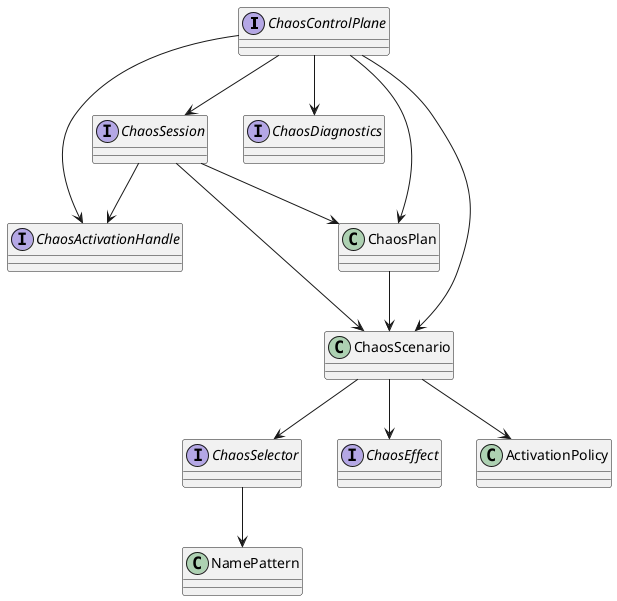

# 1. Overview

## Purpose

`chaos-agent-api` is the stable contract boundary of the project. It defines the types a caller uses to describe chaos, activate it, scope it, and inspect runtime state.

## Scope

In scope:

- scenario and plan modeling
- activation and session contracts
- diagnostics model
- selector, effect, and activation policy types

Out of scope:

- implementation strategy
- instrumentation mechanics
- configuration resolution
- exact operational semantics of every effect on every hook

Those behaviors are implemented by internal modules and documented in the corresponding internal docs.

## Assumptions

- Callers are expected to treat these types as the supported contract.
- Callers should not infer unimplemented behavior from the presence of a field alone.
- Serialization shape matters because startup config maps directly into these records.

## Non-Goals

- hiding all implementation caveats behind a perfectly abstract API
- offering a remote wire protocol
- guaranteeing transactional activation semantics

# 2. Architectural Context

The API module sits between user code and the internal runtime. Dependency direction is intentionally one-way:

- callers depend on `chaos-agent-api`
- bootstrap, core, instrumentation, startup config, and testkit also depend on `chaos-agent-api`

This is a conventional layered boundary. The API is a contract layer; the runtime is an execution layer.

The module includes Jackson annotations because the plan and polymorphic selector/effect model are intended to be serialized and deserialized as configuration.

# 3. Key Concepts And Terminology

- Control plane: `ChaosControlPlane`, the root activation interface
- Session: a scoped activation context represented by `ChaosSession`
- Plan: a collection of scenarios plus metadata
- Scenario: the unit of matching and effect application
- Selector: identifies which runtime events a scenario applies to
- Effect: defines what happens on a match
- Activation policy: defines when a scenario may fire
- Diagnostics: runtime-visible state of activated controllers and recorded activation failures

# 4. End-to-End Behavior

From the API perspective, the expected flow is:

1. Construct `ChaosScenario` or `ChaosPlan`.
2. Activate it through `ChaosControlPlane` or `ChaosSession`.
3. Receive a `ChaosActivationHandle`.
4. Start, stop, or release the handle as needed.
5. Inspect runtime state via `ChaosDiagnostics`.

Important contract caveat derived from the current implementation:

- `activate(ChaosPlan)` is sequential and non-atomic. If one child activation fails, previously activated children remain active.

# 5. Architecture Diagrams

## Public Type Diagram

Question answered: what are the major API relationships that callers need to understand?

Main takeaway: the API surface is intentionally small. Almost everything a caller controls collapses into `ChaosScenario`, `ChaosPlan`, and the activation/session handles.

No deployment diagram is included because this document is about the contract boundary, not the in-process placement model.

# 6. Component Breakdown

## `ChaosControlPlane`

Public root for JVM-global activation and diagnostics.

Important contract notes:

- global activation is for `JVM` scope
- `close()` is part of the interface, but the current bootstrap/runtime implementation treats it as controller shutdown, not as agent uninstall

## `ChaosSession`

Public root for localized activation.

Important contract notes:

- session activation is for `SESSION` scope
- `bind()` and `wrap(...)` expose explicit context propagation
- binding discipline matters; callers should treat bindings as strictly nested scopes

## `ChaosActivationHandle`

Control object for one activated scenario or an aggregate plan handle.

Important contract notes:

- `release()` is meaningful for gate behavior
- `close()` defaults to `stop()`
- current internal behavior stops controllers but does not remove them from the registry

## `ChaosDiagnostics`

Read-only state view.

Important contract notes:

- it is a snapshot/reporting surface, not a consistency protocol
- the enum and failure categories are broader than what the current implementation emits

# 7. Data Model And State

## `ChaosPlan`

Invariants:

- `scenarios` must be present and non-empty
- default metadata is `("default", "")`
- default observability is `(true, true, false)`

Important caveat:

- the presence of `Observability` in the API does not mean the runtime currently enforces those flags

## `ChaosScenario`

Invariants:

- `id` must be non-blank
- `selector` and `effect` are mandatory
- default scope is `JVM`
- default activation policy is `ActivationPolicy.always()`

## `ActivationPolicy`

Fields:

- `startMode`
- `probability`
- `activateAfterMatches`
- `maxApplications`
- `activeFor`
- `rateLimit`
- `randomSeed`

Important caveat:

- the constructor normalizes `probability == 0.0` to `1.0`, so an explicit zero probability is not representable through this API

## `NamePattern`

Modes:

- `ANY`
- `EXACT`
- `PREFIX`
- `GLOB`
- `REGEX`

Important caveat derived from the current implementation:

- `GLOB` is converted to regex by a custom translator that escapes only a subset of regex metacharacters. Patterns containing characters such as `[` or `{` should therefore be treated with caution.

# 8. Concurrency And Threading Model

The API does not declare thread-safety annotations, so callers should reason from the current implementation:

- session scope is thread-associated and wrapper-propagated
- handles may be observed or controlled from multiple threads
- diagnostics are snapshot-oriented rather than strongly serialized

The relevant concurrency contract for callers is operational rather than formal:

- use `wrap(...)` when work crosses thread boundaries
- close `ScopeBinding` objects in strict LIFO order
- do not assume activation and deactivation are globally serialized across threads

# 9. Error Handling And Failure Modes

## Expected Caller-Facing Exceptions

- `ChaosActivationException`
- `ChaosValidationException`
- `ChaosUnsupportedFeatureException`
- `IllegalArgumentException` from record validation and config mapping paths

## Misuse Cases

### Misuse: assuming plan activation is atomic

This is unsafe. The current runtime activates child scenarios one by one and does not roll back prior children if a later activation fails.

### Misuse: activating the wrong scope

- `ChaosControlPlane.activate(...)` is for JVM-global scenarios
- `ChaosSession.activate(...)` is for session-scoped scenarios

The current runtime enforces this and throws on scope mismatch.

# 10. Security Model

The API itself has no authn/authz model. Security considerations are about who is allowed to construct and activate scenarios.

- scenario definitions can intentionally block threads, retain memory, and inject exceptions
- serialized config should therefore be treated as privileged operational input
- diagnostics may expose scenario ids, descriptions, and runtime details to operators

There is no tenant isolation or policy layer in the API.

# 11. Performance Model

The API surface itself is lightweight. Performance sensitivity comes from what the runtime does with the model.

Caller-relevant performance facts:

- large plans expand into multiple independent scenario activations
- richer selector sets and more active scenarios increase per-intercept evaluation cost
- some effects intentionally add latency or resource consumption

# 12. Observability And Operations

The API exposes:

- scenario state
- match counts
- apply counts
- recorded activation failures
- runtime details

Current implementation caveats:

- `ChaosMetricsSink.recordDuration(...)` exists in the API but is not used by the current core
- `ChaosEventListener` exists as an API type, but the current repository does not expose a public listener registration path
- `ChaosPlan.Observability` exists, but current bootstrap/runtime code does not honor its flags
- `ChaosSelector.ExecutorSelector.scheduledOnly` exists in the API shape, but the current matcher does not consult it

# 13. Configuration Reference

From the API standpoint, configuration-relevant types are:

- `ChaosPlan`
- `ChaosScenario`
- `ChaosSelector` subtypes
- `ChaosEffect` subtypes
- `ActivationPolicy`
- `NamePattern`

Operational configuration precedence and parsing rules are documented in [startup-config.md](startup-config.md).

# 14. Extension Points And Compatibility Guarantees

Stable by intent:

- the top-level API interfaces and records in this module

Not guaranteed stable by this module alone:

- whether every field is fully wired in the runtime
- the exact diagnostics state machine
- the precise per-hook semantics of each effect

When extending the system, treat the API as necessary but not sufficient. New fields and new selector/effect variants require matching implementation in the core and instrumentation layers.

# 15. Stack Walkdown

## API Layer

This module defines the type system and control-plane contract. It does not execute chaos by itself.

## Runtime Layer

Materially relevant because the runtime decides how API fields are interpreted. Several API fields are presently broader than the implemented behavior.

## JVM Layer

Relevant because selector and effect semantics depend on instrumented JDK method shapes and Java runtime capabilities.

## Memory / Concurrency Layer

Relevant because session propagation and live diagnostics are concurrency-sensitive, even though this module only exposes the contract.

## OS / Network / Container Layer

Not materially relevant at the pure API layer. Those concerns appear when the bootstrap and instrumentation layers execute inside a real JVM process.

## Infrastructure Layer

Not materially relevant here except where serialized plans are produced or stored externally.

# 16. References

- Reference: Java Language Specification
- Reference: Java Virtual Machine Specification
- Reference: Java Platform SE API Specification — `java.lang.instrument`
- Reference: JSR-133 — Java Memory Model
- Reference: JEP 444 — Virtual Threads
