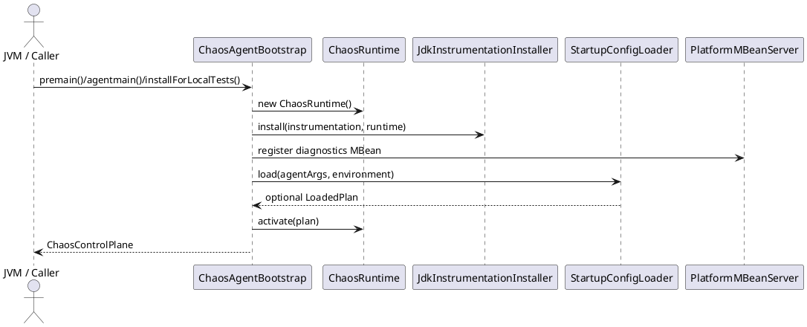

# 1. Overview

## Purpose

`chaos-agent-bootstrap` is the deployment-facing entrypoint layer. It converts JVM agent entry hooks or local self-attach into a live `ChaosRuntime`, wires instrumentation, loads optional startup configuration, and exposes diagnostics through JMX.

## Scope

In scope:

- `premain` and `agentmain`
- local self-attach for tests and examples
- singleton runtime installation
- startup plan loading
- MBean registration
- deployable agent jar packaging

Out of scope:

- scenario matching
- per-invocation decision logic
- selector/effect semantics

## Assumptions

- installation is a privileged action performed by a trusted operator or test harness
- bootstrap is effectively a one-time process initialization step

## Non-Goals

- true runtime uninstall
- remote lifecycle management
- concurrent multi-owner initialization coordination

# 2. Architectural Context

This module sits at the boundary between JVM process startup or attach mechanisms and the internal runtime.

Dependency direction:

- depends on `chaos-agent-api`
- depends on `chaos-agent-core`
- depends on `chaos-agent-instrumentation-jdk`
- depends on `chaos-agent-startup-config`
- depends on Byte Buddy Agent for local self-attach

Trust boundary:

- same trust domain as the target JVM
- no internal authz boundary before installation

Deployment boundary:

- this is the jar you ship for `-javaagent`

# 3. Key Concepts And Terminology

- Agent entrypoint: `premain` or `agentmain`
- Local install: self-attach path used by tests
- Runtime singleton: the `AtomicReference<ChaosRuntime>` held by `ChaosAgentBootstrap`
- Loaded plan: startup config materialized into `StartupConfigLoader.LoadedPlan`
- Diagnostics MBean: `com.macstab.chaos:type=ChaosDiagnostics`

# 4. End-to-End Behavior

## Startup Install

1. JVM launches with `-javaagent:...`.
2. `premain(...)` invokes `initialize(...)`.
3. A new `ChaosRuntime` is created if one is not already visible.
4. JDK instrumentation is installed.
5. The diagnostics MBean is registered.
6. Startup config is resolved from agent args and environment.
7. If a plan exists, it is activated immediately.
8. Optional debug dump is printed to `stderr`.

## Local Install

1. Caller invokes `ChaosPlatform.installLocally()`.
2. `ByteBuddyAgent.install()` attaches the agent to the current JVM.
3. `initialize("", instrumentation, Map.of())` runs with no environment-based startup config.
4. The returned object is the same singleton control plane used by subsequent calls.

## Important Current Semantics

- repeated installation returns the existing runtime if already published
- `ChaosPlatform.current()` is only valid after installation
- `ChaosControlPlane.close()` on the returned runtime does not uninstall the agent or clear the singleton reference

# 5. Architecture Diagrams

## Bootstrap Sequence

Question answered: what does bootstrap do before the application ever hits an instrumented path?



Main takeaway: bootstrap is front-loaded work. Once installation completes, the steady-state behavior moves into instrumentation and core.

No deployment diagram is included because placement is trivial: one JVM, one agent, one runtime singleton.

# 6. Component Breakdown

## `ChaosAgentBootstrap`

Responsibility:

- own installation entrypoints
- own the singleton runtime reference
- orchestrate instrumentation and startup plan activation

Why this design exists:

- centralizes all installation modes behind one initialization path
- keeps startup behavior consistent between `premain`, `agentmain`, and local attach

## `ChaosPlatform`

Responsibility:

- provide a smaller public facade for application and test code

Why this design exists:

- hides the lower-level bootstrap class from ordinary consumers

## `ChaosDiagnosticsMxBean`

Responsibility:

- expose `debugDump()` over JMX

Why this design exists:

- provide a low-friction operational introspection surface with no extra dependencies

# 7. Data Model And State

## Singleton State

The module owns:

- `AtomicReference<ChaosRuntime> RUNTIME`

This is the bootstrap-level lifecycle anchor. Once populated, later callers reuse the same runtime.

## Startup Config State

`StartupConfigLoader.LoadedPlan` carries:

- parsed `ChaosPlan`
- source description
- debug dump flag

The bootstrap layer currently uses:

- the plan itself
- the debug dump flag

It does not otherwise preserve source metadata for later operator-facing use.

## Packaging State

The bootstrap jar manifest declares:

- `Premain-Class`
- `Agent-Class`
- `Can-Redefine-Classes`
- `Can-Retransform-Classes`

The jar task also folds runtime dependencies into the artifact, making bootstrap the deployable unit.

# 8. Concurrency And Threading Model

Initialization is intended to be effectively single-threaded, but the code is only partially hardened against concurrent installs.

Important details:

- `initialize(...)` checks the singleton before work, but publishes it only after instrumentation, MBean registration, and plan activation
- two concurrent initializations can therefore duplicate pre-publication work before one wins the `compareAndSet`
- MBean registration uses a check-then-register pattern rather than an atomic register-if-absent primitive

This is acceptable for the intended usage pattern, but it is not a strong concurrent bootstrap protocol.

# 9. Error Handling And Failure Modes

Expected bootstrap failures:

- local self-attach unavailable or denied
- instrumentation installation failure
- startup config file unreadable
- startup config JSON invalid
- MBean registration failure

Important operational limitation:

- a successful install followed by `close()` leaves instrumentation in place and leaves `RUNTIME` populated. The process is still instrumented; it just no longer has active scenarios.

This is a major semantic distinction. `close()` is controller shutdown, not agent removal.

# 10. Security Model

Bootstrap is a privileged layer.

- attaching an agent to a JVM is already a high-trust operation
- startup config is executed as control-plane input with full effect on thread behavior and resource consumption
- JMX exposure inherits the process’s JMX exposure posture

There is no additional security boundary inside this module.

# 11. Performance Model

Bootstrap cost is front-loaded:

- Byte Buddy installation
- bridge injection into the bootstrap classloader
- optional JSON parse and plan activation
- MBean registration

Steady-state runtime cost is not owned by this module after initialization completes.

# 12. Observability And Operations

Operator-visible surfaces created by bootstrap:

- MBean `com.macstab.chaos:type=ChaosDiagnostics`
- optional `stderr` debug dump on startup

Bootstrap does not create health checks, readiness semantics, or any external telemetry pipeline. It only exposes the core diagnostics object.

# 13. Configuration Reference

Bootstrap consumes:

- raw agent args
- environment variables interpreted by `StartupConfigLoader`

Examples:

```bash
java -javaagent:chaos-agent-bootstrap.jar=configFile=/opt/app/chaos-plan.json -jar app.jar
```

```java
ChaosControlPlane controlPlane = ChaosPlatform.installLocally();
```

For exact config precedence and parsing rules, see [startup-config.md](startup-config.md).

# 14. Extension Points And Compatibility Guarantees

Treat this module as internal runtime machinery. Stable caller-facing entrypoints are limited to:

- `ChaosPlatform.installLocally()`
- `ChaosPlatform.current()`

Everything else is bootstrap implementation detail.

# 15. Stack Walkdown

## API Layer

Bootstrap returns a `ChaosControlPlane`, but does not define its contract.

## Application / Runtime Layer

This is the handoff boundary from install-time orchestration into steady-state runtime behavior.

## JVM Layer

Materially relevant. `premain`, `agentmain`, instrumentation, retransformation, and self-attach all depend on JVM-level capabilities.

## Memory / Concurrency Layer

Relevant only for singleton publication and concurrent initialization races.

## OS / Container Layer

Materially relevant for local attach, which may be restricted by JVM flags, process privileges, or container hardening.

## Infrastructure Layer

Only indirectly relevant through whatever environment variables, startup scripts, or JMX export configuration the surrounding platform provides.

# 16. References

- Reference: Java Platform SE API Specification — `java.lang.instrument`
- Reference: Java Platform SE API Specification — `java.lang.management`
- Reference: Java Platform SE API Specification — `javax.management`

