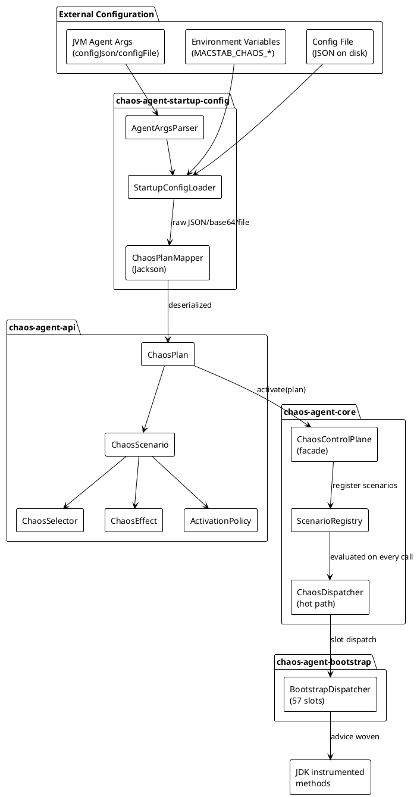
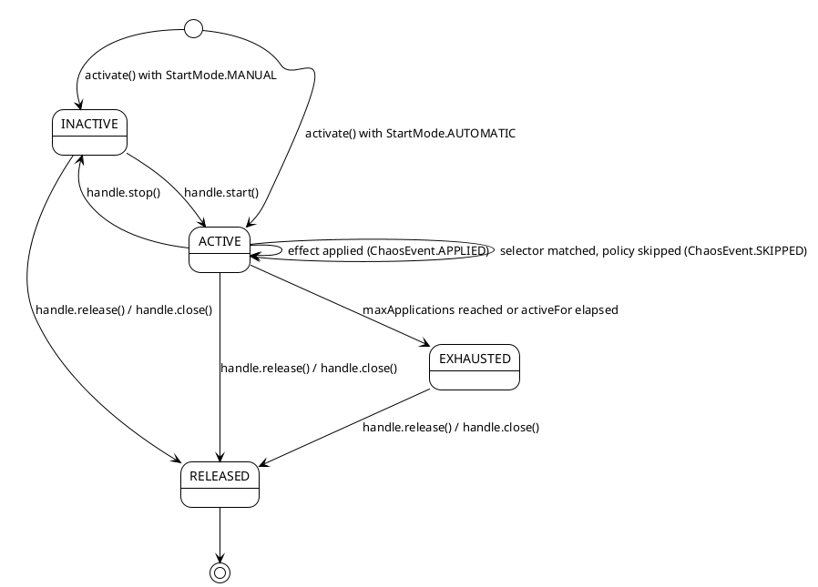

<!--
━━━━━━━━━━━━━━━━━━━━━━━━━━━━━━━━━━━━━━━━━━━━━━━━━━━━━━━━━━━━━
  Engineered by  Christian Schnapka
                 Embedded Principal+ Engineer
                 Macstab GmbH · Hamburg, Germany
                 https://macstab.com
━━━━━━━━━━━━━━━━━━━━━━━━━━━━━━━━━━━━━━━━━━━━━━━━━━━━━━━━━━━━━
-->

# Chaos Agent — Configuration & Chaos Types Reference

> Authoritative engineering reference for every selector, effect, operation type, activation policy field, stressor, and configuration source supported by the chaos agent.
>
> *Engineered by* **[Christian Schnapka](https://macstab.com)** — Embedded Principal+ Engineer · [Macstab GmbH](https://macstab.com) · Hamburg, Germany

---

## Table of Contents

1. [Overview](#1-overview)
2. [Architectural Context](#2-architectural-context)
3. [Key Concepts and Terminology](#3-key-concepts-and-terminology)
4. [End-to-End Behavior](#4-end-to-end-behavior)
5. [Architecture Diagrams](#5-architecture-diagrams)
6. [Component Breakdown](#6-component-breakdown)
7. [Data Model and State](#7-data-model-and-state)
8. [Concurrency and Threading Model](#8-concurrency-and-threading-model)
9. [Error Handling and Failure Modes](#9-error-handling-and-failure-modes)
10. [Security Model](#10-security-model)
11. [Performance Model](#11-performance-model)
12. [Observability and Operations](#12-observability-and-operations)
13. [Configuration Reference](#13-configuration-reference)
14. [Extension Points and Compatibility](#14-extension-points-and-compatibility)
15. [Stack Walkdown](#15-stack-walkdown)
16. [References](#16-references)

---

# 1. Overview

## Purpose

This document is the authoritative technical reference for configuring chaos scenarios in the Macstab Chaos Agent. It covers:

- Every **selector type** — how to target specific JVM operations for interception
- Every **effect type** — what chaos behavior fires when a selector matches
- Every **operation type** — the exact JVM interception points available
- Every **activation policy field** — how to control when, how often, and under what conditions an effect fires
- Every **NamePattern mode** — how to express class/method/host/URL matching predicates
- The complete **configuration source priority chain** — how the agent resolves its startup plan from JVM arguments and environment variables
- The **JSON plan schema** — the exact structure for declarative chaos plans
- The **programmatic API** — how to activate scenarios and plans from Java code

## Scope

In scope:
- `com.macstab.chaos.jvm.api.*` public API types: `ChaosSelector`, `ChaosEffect`, `OperationType`, `ActivationPolicy`, `NamePattern`, `ChaosScenario`, `ChaosPlan`, `ChaosControlPlane`, `ChaosSession`, `ChaosActivationHandle`
- Startup configuration resolution: `StartupConfigLoader`, `AgentArgsParser`, configuration source priority
- JSON plan format as deserialized by `ChaosPlanMapper` (Jackson)
- Selector ↔ effect ↔ operation compatibility matrix
- Stressor lifecycle and cleanup guarantees

Out of scope:
- ByteBuddy instrumentation internals (see `docs/instrumentation.md`)
- Bootstrap classloader bridge mechanics (see `docs/bootstrap.md`)
- JMX / Actuator runtime control (see `docs/user-guide.md`)
- Test extension integration (see `docs/testkit.md`, `docs/spring-integration.md`)

## Assumptions

- JDK 21+ is the minimum supported runtime
- `VIRTUAL_THREAD_START` and `VirtualThreadCarrierPinningEffect` require Project Loom (JDK 21+); the agent probes availability at startup and rejects activation on older runtimes
- JSON deserialization uses Jackson with `@JsonSubTypes` polymorphic dispatch; the `type` discriminator field is mandatory in JSON for all selector and effect types
- All API types in `com.macstab.chaos.jvm.api` are stable public contracts; all implementation types in `com.macstab.chaos.jvm.core` are internal

## Non-Goals

- This document does not explain how instrumentation advice is woven (ByteBuddy detail)
- This document does not cover the BootstrapDispatcher slot assignment
- This document does not prescribe which chaos scenarios to run in which test environments — that is application-specific

---

# 2. Architectural Context

## System Boundaries

```
┌─────────────────────────────────────────────────────────────┐
│  JVM Process under test                                      │
│                                                              │
│  ┌─────────────────┐      ┌───────────────────────────────┐ │
│  │  Application    │      │  Chaos Agent Runtime          │ │
│  │  code           │      │                               │ │
│  │                 │      │  ChaosControlPlane (facade)   │ │
│  │                 │─────▶│  ChaosDispatcher  (hot-path)  │ │
│  │                 │      │  ScenarioRegistry             │ │
│  │  Test/CI code   │      │  BootstrapDispatcher          │ │
│  │                 │─────▶│  (bootstrap classloader)      │ │
│  └─────────────────┘      └───────────────────────────────┘ │
│                                                              │
│  ┌─────────────────────────────────────────────────────────┐ │
│  │  JDK classes (Thread, Executor, Socket, …)              │ │
│  │  Instrumented by ByteBuddy at premain/agentmain time    │ │
│  └─────────────────────────────────────────────────────────┘ │
└─────────────────────────────────────────────────────────────┘

External configuration inputs:
  -javaagent:…=configJson=…   (agent argument)
  -javaagent:…=configFile=…   (agent argument)
  MACSTAB_CHAOS_CONFIG_JSON   (environment variable)
  MACSTAB_CHAOS_CONFIG_FILE   (environment variable)
```

## Configuration Source Priority

Six sources are evaluated in strict priority order. **First match wins; no merging.**

| Priority | Source | Form |
|----------|--------|------|
| 1 | JVM arg `configJson` | Inline JSON string |
| 2 | Env `MACSTAB_CHAOS_CONFIG_JSON` | Inline JSON string |
| 3 | JVM arg `configBase64` | Base64-encoded JSON |
| 4 | Env `MACSTAB_CHAOS_CONFIG_BASE64` | Base64-encoded JSON |
| 5 | JVM arg `configFile` | File path |
| 6 | Env `MACSTAB_CHAOS_CONFIG_FILE` | File path |

If no source is present, the agent starts with no active scenarios. Programmatic activation is still possible at any time after startup via `ChaosControlPlane`.

## Trust Boundaries

- **Agent arguments** are set by the process launcher (CI scripts, test harness, Docker entrypoint). They are fully trusted; no further validation of their origin is performed.
- **Environment variables** are subject to the same trust as the OS process environment. In containerized deployments, they originate from the Kubernetes secret/configmap injection path.
- **Config files** are validated for path safety (no symlink traversal, no path outside a configured root) by `StartupConfigLoader` before reading.
- **Exception class names** in `ExceptionInjectionEffect` are restricted to `java.`, `javax.`, `jakarta.`, and `com.macstab.chaos.jvm.` packages to prevent `Class.forName` from loading arbitrary attacker-controlled classes from a hostile config file.

---

# 3. Key Concepts and Terminology

| Term | Definition |
|------|-----------|
| **Scenario** | A triplet of (selector, effect, activationPolicy) bound to a unique string ID. The atomic unit of chaos configuration. |
| **Plan** | An ordered, named collection of scenarios that activate atomically as a unit. The primary vehicle for startup-time chaos. |
| **Selector** | A predicate that determines which JVM operation invocations are eligible for chaos. Evaluated on every instrumented call. |
| **Effect** | The chaos behavior applied when a selector matches: a delay, exception, rejection, suppression, value corruption, stressor start, etc. |
| **OperationType** | An enum value identifying a specific JVM interception point (e.g., `EXECUTOR_SUBMIT`, `SOCKET_CONNECT`). A selector declares which operation types it matches. |
| **ActivationPolicy** | Controls the probability, rate, count, time-window, and start-mode governing when an effect fires after a selector match. |
| **NamePattern** | A string-matching predicate (ANY / EXACT / PREFIX / GLOB / REGEX) used by selectors to filter class names, method names, hostnames, URLs, etc. |
| **Handle** | A `ChaosActivationHandle` returned by `activate()`. Provides start/stop/release/close lifecycle control over one or more active scenarios. |
| **Interceptor effect** | An effect that modifies an in-flight JVM operation: delay, reject, suppress, exception injection, return-value corruption, clock skew, gate, spurious wakeup. |
| **Stressor effect** | An effect that runs as a background task independent of any specific JVM operation: heap pressure, deadlock, thread leak, GC pressure, etc. Used with `StressSelector`. |
| **Session scope** | A `ChaosSession` creates an isolated scope where scenarios only fire for threads explicitly bound to that session via `session.bind()`. Enables per-test isolation in shared JVMs. |
| **JVM scope** | The default scope: a scenario fires for any thread in the JVM that triggers a matching operation. |
| **Precedence** | An integer tie-breaker. When multiple terminal effects (reject, suppress, exception) match the same operation simultaneously, the highest-precedence effect wins. Delay effects always accumulate across all matching scenarios regardless of precedence. |

---

# 4. End-to-End Behavior

## Startup-time Plan Activation

```
1. JVM starts; premain() runs in the bootstrap classloader context
2. Phase 1 instrumentation is woven (Thread, Executor, ForkJoin, BlockingQueue,
   CompletableFuture, ClassLoader, ShutdownHook, ScheduledThreadPoolExecutor)
3. Phase 2 instrumentation is woven (Socket/NIO, HTTP, JDBC, TLS, DNS, clock,
   GC, JNDI, JMX, Serialization, file I/O) — premain only
4. StartupConfigLoader resolves configuration source (priority 1–6)
5. ChaosPlanMapper.read() deserializes the JSON plan
6. ChaosRuntime.activate(plan) registers all scenarios atomically:
   a. Each scenario is validated (selector ↔ effect compatibility)
   b. Each scenario is registered in ScenarioRegistry under its ID
   c. AUTOMATIC-start scenarios transition to ACTIVE immediately
   d. MANUAL-start scenarios remain INACTIVE until handle.start()
7. Agent startup completes; application main() is called
```

## Runtime Interception Path (hot path)

```
1. Application thread calls an instrumented JVM method
   (e.g., Thread.start(), Socket.connect(), Statement.execute())
2. ByteBuddy Advice fires BEFORE the method body
3. BootstrapDispatcher slot for this OperationType is called
4. Reentrancy guard (ThreadLocal<int[]> DEPTH) checked:
   - If depth > 0, skip all chaos (prevents infinite recursion)
   - If depth == 0, increment depth and proceed
5. ChaosDispatcher.evaluate(invocationContext):
   a. For each active scenario:
      - If scenario is SESSION-scoped: check current thread is bound to the session
      - If scenario is JVM-scoped: always eligible
      - Evaluate selector against invocationContext
      - If selector matches: evaluate activationPolicy (probability, rate, count, time)
      - If policy passes: apply effect
   b. Delay effects: all delays sum; thread sleeps for total
   c. Terminal effects (reject/suppress/exception): highest-precedence wins
6. Reentrancy guard depth decremented
7. Method body executes (or is suppressed, or throws)
```

## Programmatic Activation (test/runtime)

```java
ChaosControlPlane cp = ChaosAgentBootstrap.current();

ChaosActivationHandle h = cp.activate(
    ChaosScenario.builder("slow-db")
        .selector(ChaosSelector.jdbc(JDBC_CONNECTION_ACQUIRE))
        .effect(ChaosEffect.delay(Duration.ofMillis(500)))
        .activationPolicy(ActivationPolicy.always())
        .build());

// … run test …

h.close(); // stops the scenario; future matches no longer fire
```

## Plan Activation via JSON

```bash
java -javaagent:chaos-agent-bootstrap.jar=configFile=/etc/chaos/plan.json \
     -jar myapp.jar
```

The plan file is deserialized by `ChaosPlanMapper` (Jackson) at startup. The exact JSON schema is documented in [Section 13](#13-configuration-reference).

---

# 5. Architecture Diagrams

## 5.1 Component Diagram — Configuration and Activation Path

*Answers: what are the major components and how does configuration flow into scenario activation?*



**Takeaway:** configuration is a one-way flow from external sources through deserialization into the ScenarioRegistry. At runtime, `ChaosDispatcher` evaluates active scenarios on every instrumented call without touching the configuration path.

---

## 5.2 State Diagram — Scenario Lifecycle

*Answers: what states can a scenario be in and what transitions are possible?*



**Takeaway:** `ACTIVE` does not mean "effect always fires" — the activation policy filters matches via probability, rate, count, and time constraints. `EXHAUSTED` is a terminal state that still allows `release()` for cleanup. `close()` implies `release()`.

---

## 5.3 Selector ↔ Effect Compatibility Matrix

Not diagrammed — tabular representation is clearer. See [Section 13.4 — Compatibility Matrix](#134-selector--effect-compatibility-matrix).

---

# 6. Component Breakdown

## 6.1 `ChaosSelector` — Targeting Predicate

**Responsibility:** Determine whether a given JVM operation invocation is eligible for chaos.

**Design:** Sealed interface with 19 permit types, each implemented as a Java record. Jackson polymorphic dispatch via `@JsonSubTypes` and `@JsonTypeInfo(property = "type")`. The `type` field value is the JSON discriminator.

**Patterns:** Sealed-interface discriminated union (Java 17+ `sealed`/`permits`). Each record encapsulates its valid operation set as a static `VALID_OPS` `EnumSet` and validates at construction time.

**Extension risk:** Adding new selector types requires a new `permits` clause (source change). The sealed contract is intentional — arbitrary selector implementations outside the module are not supported.

**Safety constraint on `MethodSelector`:** at least one of `classPattern` or `methodNamePattern` must be non-ANY. A fully wildcard `MethodSelector` would instrument every method in the JVM; the constructor rejects this with `IllegalArgumentException`.

**Note on `signaturePattern`:** The `MethodSelector.signaturePattern` field exists in the record but the runtime does not currently propagate the JVM method descriptor. Non-null non-ANY `signaturePattern` values throw at construction. Use `null` or `NamePattern.any()` until descriptor filtering ships.

---

## 6.2 `ChaosEffect` — Chaos Behavior

**Responsibility:** Describe what happens when a selector matches. Interceptor effects modify in-flight operations; stressor effects launch background chaos tasks.

**Design:** Sealed interface with 24 permit types (8 interceptors, 16 stressors), each as a Java record. Jackson polymorphic dispatch via `type` discriminator.

**Interceptors** run on the calling thread during the operation interception. They must complete before the operation proceeds (or is terminated). Their latency budget is directly added to the operation's latency.

**Stressors** are started as background tasks (daemon threads, allocating loops, deadlock sequences) when the scenario activates. They are independent of any specific operation and continue until the activation handle is closed or the policy expires.

**Destructive effects:** `DeadlockEffect` and `ThreadLeakEffect` create non-recoverable JVM state. They require `ActivationPolicy.allowDestructiveEffects = true`. Activation without this flag throws `ChaosActivationException` immediately at registration time, not on first application.

---

## 6.3 `ActivationPolicy` — Firing Control

**Responsibility:** Filter matches after a selector matches, controlling the probability, rate, count, time-window, and start-mode under which an effect fires.

**All constraints are conjunctive.** A match must satisfy every active constraint before the effect fires. A `null` constraint means "no restriction on this axis."

**`probability = 0.0` is rejected.** The constructor treats `probability ≤ 0.0` as an error (redirecting the operator to omit the scenario entirely to express "never fire"). This prevents the common misconfiguration of setting `probability: 0.0` in a config file, expecting the effect to be disabled, while it silently fires on every match.

---

## 6.4 `NamePattern` — String Predicate

**Responsibility:** Provide a reusable, cached, pattern-matched string predicate for class names, method names, hostnames, URLs, thread names, and any other string-valued attribute in a selector.

**Performance:** GLOB and REGEX patterns are compiled once on `NamePattern` construction and cached in JVM-wide `ConcurrentHashMap`s (capacity 1024 each). Hot-path `matches()` calls do not recompile. The cache is non-evicting once at capacity (inserts are skipped, not evicted) to preserve correctness under concurrent access.

**Safety:** Pattern strings are capped at 4096 characters to mitigate ReDoS risk (Java regex is a backtracking NFA). Patterns are compiled eagerly at construction; syntax errors surface at plan-build time, not at first dispatch.

**Null semantics:** A null candidate matches only `ANY` mode. All other modes return `false` for a null candidate.

---

## 6.5 `ChaosControlPlane` — Runtime Entry Point

**Responsibility:** Primary interface for activating scenarios and plans, opening sessions, querying diagnostics, and attaching event listeners. Implemented by `ChaosControlPlaneImpl` in `chaos-agent-core` (internal, not part of the public API).

**Access:** `ChaosAgentBootstrap.current()` in production; `ChaosAgentBootstrap.installForLocalTests()` in unit tests (installs a lightweight local agent without premain instrumentation for JDK-internal classes — only session-scope interception is available).

---

## 6.6 `ChaosSession` — Per-Test Isolation Scope

**Responsibility:** Create an isolated scope where SESSION-scoped scenarios fire only for threads explicitly bound to the session. Enables multiple tests to run concurrently in the same JVM without interfering with each other's chaos state.

**Thread binding:** `session.bind()` associates the current thread to the session. `session.unbind()` removes it. Threads that are not bound to any session are only eligible for JVM-scoped scenarios.

**Restriction:** SESSION-scoped scenarios cannot use JVM-global selectors: `ThreadSelector`, `ShutdownSelector`, `ClassLoadingSelector`, `StressSelector`. These selectors target JVM-wide events that cannot be attributed to a single test thread.

---

# 7. Data Model and State

## 7.1 `ChaosScenario` Record

```
ChaosScenario {
  id               : String         // non-blank; unique within a plan and within the active registry
  description      : String         // optional; normalised to "" if null
  scope            : ScenarioScope  // JVM (default) or SESSION
  selector         : ChaosSelector  // required; one of the 19 selector types
  effect           : ChaosEffect    // required; one of the 24 effect types
  activationPolicy : ActivationPolicy // defaults to ActivationPolicy.always() if null
  precedence       : int            // default 0; higher wins terminal-effect conflicts
  tags             : Map<String,String> // optional metadata; preserved in insertion order
}
```

**Invariants:**
- `id` must be unique within any `ChaosPlan` (enforced at plan construction) and unique across all simultaneously active scenarios in the `ScenarioRegistry` (enforced at activation time).
- `selector` and `effect` must be non-null.
- `scope = SESSION` prohibits `ThreadSelector`, `ShutdownSelector`, `ClassLoadingSelector`, `StressSelector`.

---

## 7.2 `ChaosPlan` Record

```
ChaosPlan {
  metadata      : Metadata      // plan name (non-blank) + description
  observability : Observability // jmxEnabled, structuredLoggingEnabled, debugDumpOnStart
  scenarios     : List<ChaosScenario> // non-empty, no nulls, no duplicate IDs
}
```

**Invariants:**
- `scenarios` is immutable after construction (`List.copyOf`).
- Duplicate `scenario.id` values within the list are rejected at construction.
- All scenarios in a plan must be JVM-scoped when activated via `ChaosControlPlane.activate(ChaosPlan)`. SESSION-scoped plan activation is via `ChaosSession.activate(ChaosPlan)`.

**`Observability` defaults:** `jmxEnabled=true, structuredLoggingEnabled=true, debugDumpOnStart=false`. `debugDumpOnStart=true` prints a full diagnostics dump to `System.err` at activation — useful for verifying that a plan parsed correctly in a new environment.

---

## 7.3 `ActivationPolicy` Record

```
ActivationPolicy {
  startMode              : StartMode   // AUTOMATIC (default) or MANUAL
  probability            : double      // (0.0, 1.0]; default 1.0
  activateAfterMatches   : long        // >= 0; skip this many matches before effect becomes eligible
  maxApplications        : Long        // null = unlimited; > 0 when set
  activeFor              : Duration    // null = unlimited; positive when set
  rateLimit              : RateLimit   // null = unlimited; see below
  randomSeed             : Long        // null = non-deterministic; explicit = reproducible sampling
  allowDestructiveEffects: boolean     // false; must be true for DeadlockEffect / ThreadLeakEffect
}

RateLimit {
  permits : long     // max applications within one window; > 0
  window  : Duration // rolling window duration; positive; must fit in Long nanos
}
```

**Evaluation order at match time:**
1. Is the scenario ACTIVE (not INACTIVE, EXHAUSTED, or RELEASED)?
2. Has `activateAfterMatches` been satisfied (match counter ≥ threshold)?
3. Does `probability` sampling pass (`ThreadLocalRandom.nextDouble() < probability`)?
4. Does the sliding-window `rateLimit` permit another application?
5. Has `maxApplications` not been reached?
6. Has `activeFor` not elapsed since `handle.start()` was called?

All six conditions must hold. Failure at any step records a `ChaosEvent.SKIPPED` event.

---

## 7.4 `NamePattern` Record

```
NamePattern {
  mode  : MatchMode  // ANY | EXACT | PREFIX | GLOB | REGEX
  value : String     // interpretation depends on mode; "* " for ANY (normalised)
}
```

**Match semantics:**

| Mode | Behaviour | Null candidate | Cost |
|------|-----------|----------------|------|
| `ANY` | Always true | true | O(1) |
| `EXACT` | `candidate.equals(value)` | false | O(n) string equals |
| `PREFIX` | `candidate.startsWith(value)` | false | O(k) where k = prefix length |
| `GLOB` | `*` = any sequence, `?` = one char; compiled to regex | false | O(m) regex match |
| `REGEX` | Full `java.util.regex.Pattern` match (anchored `^…$`) | false | O(m) regex match |

---

# 8. Concurrency and Threading Model

## 8.1 Hot Path Thread Safety

The hot path (`BootstrapDispatcher` → `ChaosDispatcher`) is designed for concurrent access from arbitrary application threads. All mutable state accessed on the hot path must be either:
- Immutable (scenario records, effect records, selector records, NamePattern)
- Accessed via `AtomicLong` or `volatile` (application counters, state flags)
- Protected by `synchronized` only for infrequent state transitions (start/stop/release)

## 8.2 Reentrancy Guard

A `ThreadLocal<int[]> DEPTH` in `BootstrapDispatcher` prevents re-entrant dispatch. When the chaos runtime itself calls an instrumented JVM method (e.g., the `DelayEffect` calls `Thread.sleep()`), the depth counter blocks re-evaluation. This is a correctness requirement: without it, a `ThreadSelector` intercepting `THREAD_SLEEP` with a `DelayEffect.delay()` would recurse infinitely.

**Implication for stressors:** stressor background threads are platform daemon threads launched by the chaos runtime itself. They run with `DEPTH > 0` for the duration of their chaos-generating loop to prevent their own operations from triggering further chaos evaluation.

## 8.3 Session Scope Thread Binding

`ChaosSession.bind()` stores a session reference in a `ThreadLocal`. The `ChaosDispatcher` reads this on every SESSION-scoped scenario evaluation. `unbind()` removes it. There is no propagation to child threads — virtual threads and thread-pool tasks spawned by a bound thread are **not** automatically bound to the same session. Explicit `bind()` is required on each thread that should participate in a session-scoped scenario.

**JMM relevance (JSR-133):** `ThreadLocal` reads/writes are always visible to the owning thread only. No cross-thread visibility concern applies to session binding state.

## 8.4 Stressor Threads

All stressor effects (HeapPressure, Deadlock, ThreadLeak, etc.) spawn platform daemon threads from the `ChaosRuntime` internal executor. These threads hold a reference to the stressor state. When `handle.close()` is called, the stressor is signalled to stop and the background threads are interrupted. `DeadlockEffect` and `ThreadLeakEffect` are exceptions: `DeadlockEffect` threads are interrupted and locks released on close; `ThreadLeakEffect` daemon threads cannot be terminated without JVM restart when `daemon=false` and `lifespan=null`.

## 8.5 Virtual Thread Compatibility

Interceptors run on the calling virtual thread if the application uses Project Loom. `Thread.sleep()` within a `DelayEffect` on a virtual thread yields the carrier — this is the expected behavior. The `VirtualThreadCarrierPinningEffect` stressor explicitly exploits this by holding carrier platform threads inside `synchronized` blocks, preventing virtual thread unmounting and simulating the JDK 21 pinning behavior described in JEP 444.

**Reference:** JEP 444 — Virtual Threads (JDK 21).

---

# 9. Error Handling and Failure Modes

## 9.1 Activation-time Failures

| Failure | Exception | When |
|---------|-----------|------|
| Selector ↔ effect mismatch | `ChaosValidationException` | At `activate()` call |
| Duplicate scenario ID | `ChaosActivationException` | At `activate()` call |
| Destructive effect without `allowDestructiveEffects` | `ChaosActivationException` | At `activate()` call |
| Feature not available (e.g., virtual threads on JDK 17) | `ChaosUnsupportedFeatureException` | At `activate()` call |
| Invalid `ActivationPolicy` field | `IllegalArgumentException` | At `ActivationPolicy` construction |
| Invalid `NamePattern` regex | `IllegalArgumentException` | At `NamePattern` construction |
| Invalid `NamePattern` glob | `IllegalArgumentException` | At `NamePattern` construction |
| Invalid exception class name in `ExceptionInjectionEffect` | `IllegalArgumentException` | At `ExceptionInjectionEffect` construction |
| `probability = 0.0` | `IllegalArgumentException` | At `ActivationPolicy` construction |

## 9.2 Runtime Failures (Hot Path)

The chaos runtime is designed to be non-fatal to the application. If an effect throws unexpectedly, the exception is caught, a `ChaosEvent.FAILED` is emitted, and the operation proceeds as if no chaos fired. The application thread is never left in an undefined state due to a chaos internal error.

## 9.3 Config Loading Failures

| Failure | Result |
|---------|--------|
| No config source present | Agent starts with no active scenarios; no error |
| JSON parse failure | `ConfigLoadException` thrown; agent startup fails with a clear error message |
| File not found / path safety violation | `ConfigLoadException` thrown; agent startup fails |
| Base64 decode failure | `ConfigLoadException` thrown |

## 9.4 `GateEffect` Timeout

`GateEffect(maxBlock=null)` blocks the matched operation's thread indefinitely until `handle.release()` is called. If the test fails to call `release()`, the application thread is permanently blocked. Use `maxBlock` to set a safety timeout. The testkit extensions call `stopTracked()` which releases all tracked handles in `afterEach`/`afterAll`.

---

# 10. Security Model

## 10.1 Configuration Trust

**Agent arguments** are set by the process owner (same trust as the JVM itself). No authentication is required or performed. If an attacker can modify JVM arguments, they already have the ability to inject arbitrary `-javaagent` code.

**Environment variables** are trusted at the OS process level. In container deployments, restrict access to the environment via Kubernetes RBAC and secret management.

**Config files** receive path safety checks to prevent symlink traversal and directory escape. Only files within a configured safe root are readable. This prevents a hostile config file reference from reading `/etc/passwd` or other sensitive paths.

## 10.2 Exception Class Injection Safety

`ExceptionInjectionEffect.exceptionClassName` is validated against an allowlist of package prefixes at construction time:

```
java.*
javax.*
jakarta.*
com.macstab.chaos.jvm.*
```

This prevents `Class.forName` from loading an arbitrary class with a malicious static initializer from a hostile config file. Extending the allowlist requires a code change — it is intentional.

## 10.3 JVM-Wide Impact

A `StressSelector` / stressor effect combination applies JVM-wide chaos (heap exhaustion, deadlock, GC pressure) regardless of which test is running. In shared CI environments where multiple tests share a JVM, JVM-scoped stressors must be used with care. SESSION-scoped scenarios do not support stressors and provide isolation at the thread level.

## 10.4 Observability of Chaos Activity

All chaos events are emitted to registered `ChaosEventListener`s and to JMX (`com.macstab.chaos.jvm:type=ChaosDiagnostics`). Chaos activity is therefore visible to any JMX-capable monitoring tool attached to the JVM. In security-sensitive environments where the fact of chaos testing must not be visible to external observers, disable JMX via `ChaosPlan.Observability.jmxEnabled = false`.

---

# 11. Performance Model

## 11.1 Hot Path Cost

The evaluation path for each instrumented operation call has the following cost components:

| Step | Cost |
|------|------|
| `BootstrapDispatcher` slot read | One array index + virtual dispatch; O(1) |
| `ThreadLocal<int[]> DEPTH` read | `ThreadLocalMap` lookup; O(1) amortized |
| Active scenario iteration | O(N) where N = active scenarios; typically < 10 in tests |
| `NamePattern.matches()` per scenario | O(1) for ANY/EXACT/PREFIX; O(m) for GLOB/REGEX |
| `ActivationPolicy` evaluation | O(1); atomic reads + RNG sample |
| `DelayEffect` | `Thread.sleep(t)` or virtual-thread park; dominates overall cost |
| No-match path (most common in benchmarks) | ~50–120 ns per intercepted call |

**Reference benchmark (from `docs/benchmarks.md`):** `OneMatchNoEffectState` measures a one-shot policy scenario where the single application is consumed immediately, leaving subsequent calls on the no-match path. Throughput: ~8.4M ops/s (i.e., ~120 ns/call overhead).

## 11.2 NamePattern Cache

GLOB and REGEX patterns are compiled once per unique expression string and cached. Cache capacity is 1024 entries per mode. Plans that generate distinct patterns dynamically at test time (anti-pattern) will miss the cache after 1024 unique expressions and pay `Pattern.compile` cost repeatedly.

## 11.3 Stressor Memory Impact

| Stressor | Memory impact |
|----------|--------------|
| `HeapPressureEffect` | `bytes` bytes retained on JVM heap until handle.close() |
| `DirectBufferPressureEffect` | `totalBytes` native direct memory; not reclaimed by GC, only on handle.close() |
| `MetaspacePressureEffect` | JVM Metaspace used for synthetic classes; not reclaimed until classloader is collected |
| `ThreadLeakEffect` | ~1 MiB native stack per leaked thread (OS kernel allocation) |
| `DeadlockEffect` | N platform threads parked; minimal heap; holds OS thread handles |
| `CodeCachePressureEffect` | JIT code cache; deoptimization timing after close() is JIT-controlled, not guaranteed immediate |

## 11.4 Reentrancy Guard Overhead

`ThreadLocal<int[]>` access costs ~10–20 ns per instrumented call (JMH benchmark on JDK 21 with Loom). The int array wrapper avoids boxing on every read/write. This is measured to be the second-largest hot-path cost after the active-scenario iteration.

---

# 12. Observability and Operations

## 12.1 JMX

All active scenarios are published to `com.macstab.chaos.jvm:type=ChaosDiagnostics`. Attributes include:
- Scenario state (INACTIVE / ACTIVE / EXHAUSTED / RELEASED)
- Application count per scenario
- Skip count per scenario
- Failure count per scenario
- Last applied timestamp

Access via `jconsole`, `jmc`, or any JMX client. Disable per-plan via `Observability.jmxEnabled = false`.

## 12.2 Structured Logging

Chaos events are written to `java.util.logging` at `FINE` level by default. Enable with `-Djava.util.logging.config.file=logging.properties` or configure programmatically. Event payload includes: scenario ID, operation type, effect type, thread name, timestamp, result (APPLIED/SKIPPED/FAILED).

## 12.3 JFR Integration

When `jdk.jfr` is available on the classpath (JDK 11+ default), the agent automatically installs a `ChaosEventListener` that emits `ChaosApplicationEvent` JFR events. These correlate chaos activity with JFR profiling data. View in JDK Mission Control or `jfr print`.

## 12.4 `ChaosDiagnostics` API

```java
ChaosDiagnostics diag = controlPlane.diagnostics();
diag.scenarioState("my-scenario-id");  // INACTIVE | ACTIVE | EXHAUSTED | RELEASED
diag.applicationCount("my-scenario-id");
diag.skipCount("my-scenario-id");
```

`ChaosDiagnostics` is **not injectable** via the testkit extension's parameter resolver. Obtain it via `controlPlane.diagnostics()`.

## 12.5 `debugDumpOnStart`

Set `ChaosPlan.Observability.debugDumpOnStart = true` to print a full diagnostics summary to `System.err` when the plan activates. Useful for verifying that JSON deserialized correctly and all scenarios are in the expected state. Not for production use.

## 12.6 Event Bus

Register custom listeners via `controlPlane.addEventListener(listener)`. Listeners are called synchronously on the thread that triggers the event. They must be non-blocking and must not throw. Use for custom metrics bridges (Micrometer, Prometheus), test assertion hooks, or audit logging.

---

# 13. Configuration Reference

## 13.1 Configuration Sources

### Agent Argument Syntax

```
-javaagent:/path/to/chaos-agent-bootstrap.jar=key1=value1,key2=value2
```

- Values are comma-separated key=value pairs
- Escaped comma `\,` is a literal comma within a value
- Duplicate keys: last value wins
- Boolean flags (key without `=`): treated as `true`

### Supported Agent Args

| Argument | Type | Description |
|----------|------|-------------|
| `configJson` | String | Inline JSON plan |
| `configBase64` | String | Base64-encoded JSON plan |
| `configFile` | Path | File system path to JSON plan file |
| `debugDump` | Boolean flag | Equivalent to `debugDumpOnStart=true` in plan observability |

### Supported Environment Variables

| Variable | Equivalent to arg |
|----------|------------------|
| `MACSTAB_CHAOS_CONFIG_JSON` | `configJson` |
| `MACSTAB_CHAOS_CONFIG_BASE64` | `configBase64` |
| `MACSTAB_CHAOS_CONFIG_FILE` | `configFile` |

---

## 13.2 JSON Plan Schema

### Top-Level Structure

```json
{
  "metadata": {
    "name": "my-chaos-plan",
    "description": "Optional description"
  },
  "observability": {
    "jmxEnabled": true,
    "structuredLoggingEnabled": true,
    "debugDumpOnStart": false
  },
  "scenarios": [ ...ChaosScenario objects... ]
}
```

`metadata` and `observability` are optional; defaults apply if absent.

### Scenario Object

```json
{
  "id": "unique-scenario-id",
  "description": "Optional description",
  "scope": "JVM",
  "selector": { "type": "...", ... },
  "effect": { "type": "...", ... },
  "activationPolicy": { ... },
  "precedence": 0,
  "tags": { "env": "ci", "owner": "platform-team" }
}
```

`scope` defaults to `"JVM"` if absent. `activationPolicy` defaults to `always()` if absent.

### ActivationPolicy JSON

```json
{
  "startMode": "AUTOMATIC",
  "probability": 0.5,
  "activateAfterMatches": 10,
  "maxApplications": 100,
  "activeFor": "PT30S",
  "rateLimit": {
    "permits": 10,
    "window": "PT1S"
  },
  "randomSeed": 42,
  "allowDestructiveEffects": false
}
```

- `probability` omitted → defaults to `1.0`. Explicit `0.0` is rejected.
- `activeFor` and `rateLimit.window` use ISO-8601 duration strings (`PT30S` = 30 seconds).
- All fields are optional except the implicit defaults.

### NamePattern JSON

```json
{ "mode": "EXACT",  "value": "io.lettuce.core.RedisClient" }
{ "mode": "PREFIX", "value": "io.lettuce" }
{ "mode": "GLOB",   "value": "io.lettuce.*.RedisClient" }
{ "mode": "REGEX",  "value": "io\\.lettuce\\..*" }
{ "mode": "ANY" }
```

Absent `mode` normalises to `ANY`.

---

## 13.3 Selector Reference

All selectors use `"type"` as the JSON discriminator.

---

### `thread` — ThreadSelector

**JSON type:** `"thread"`  
**Operations:** `THREAD_START`, `VIRTUAL_THREAD_START`, `THREAD_SLEEP`  
**Purpose:** Intercept thread lifecycle events and `Thread.sleep()` calls.

**Fields:**

| Field | Type | Default | Description |
|-------|------|---------|-------------|
| `operations` | Set\<OperationType\> | required | One or more of: `THREAD_START`, `VIRTUAL_THREAD_START`, `THREAD_SLEEP` |
| `kind` | ThreadKind | `ANY` | `ANY` \| `PLATFORM` \| `VIRTUAL` |
| `threadNamePattern` | NamePattern | `ANY` | Matched against `Thread.getName()` at intercept time |
| `daemon` | Boolean | `null` (both) | `true` = daemon threads only; `false` = non-daemon only |

**JSON example:**
```json
{
  "type": "thread",
  "operations": ["THREAD_START"],
  "kind": "VIRTUAL",
  "threadNamePattern": { "mode": "PREFIX", "value": "worker-" },
  "daemon": null
}
```

**Notes:**
- `VIRTUAL_THREAD_START` requires JDK 21+ at runtime.
- `THREAD_SLEEP` suppression is useful for exposing race conditions hidden by retry backoffs.

---

### `executor` — ExecutorSelector

**JSON type:** `"executor"`  
**Operations:** `EXECUTOR_SUBMIT`, `EXECUTOR_WORKER_RUN`, `EXECUTOR_SHUTDOWN`, `EXECUTOR_AWAIT_TERMINATION`, `FORK_JOIN_TASK_RUN`  
**Purpose:** Intercept task submission, worker execution, and executor shutdown across `ThreadPoolExecutor`, `ForkJoinPool`, and `ScheduledThreadPoolExecutor`.

**Fields:**

| Field | Type | Default | Description |
|-------|------|---------|-------------|
| `operations` | Set\<OperationType\> | required | Subset of valid operations |
| `executorClassPattern` | NamePattern | `ANY` | Matched against executor's runtime class name |
| `taskClassPattern` | NamePattern | `ANY` | Matched against submitted task's class name |
| `scheduledOnly` | Boolean | `null` (both) | `true` = scheduled executors only |

---

### `queue` — QueueSelector

**JSON type:** `"queue"`  
**Operations:** `QUEUE_PUT`, `QUEUE_OFFER`, `QUEUE_TAKE`, `QUEUE_POLL`  
**Purpose:** Intercept `BlockingQueue` producer/consumer operations.

**Fields:**

| Field | Type | Default | Description |
|-------|------|---------|-------------|
| `operations` | Set\<OperationType\> | required | Subset of valid operations |
| `queueClassPattern` | NamePattern | `ANY` | Matched against queue implementation class name |

---

### `async` — AsyncSelector

**JSON type:** `"async"`  
**Operations:** `ASYNC_COMPLETE`, `ASYNC_COMPLETE_EXCEPTIONALLY`, `ASYNC_CANCEL`  
**Purpose:** Intercept `CompletableFuture` completion and cancellation calls.

**Fields:**

| Field | Type | Default | Description |
|-------|------|---------|-------------|
| `operations` | Set\<OperationType\> | required | Subset of valid operations |

---

### `scheduling` — SchedulingSelector

**JSON type:** `"scheduling"`  
**Operations:** `SCHEDULE_SUBMIT`, `SCHEDULE_TICK`  
**Purpose:** Intercept `ScheduledExecutorService` task registration and timer firings.

**Fields:**

| Field | Type | Default | Description |
|-------|------|---------|-------------|
| `operations` | Set\<OperationType\> | required | `SCHEDULE_SUBMIT` and/or `SCHEDULE_TICK` |
| `executorClassPattern` | NamePattern | `ANY` | Matched against executor class name |
| `periodicOnly` | Boolean | `null` (both) | `true` = periodic schedules only (`scheduleAtFixedRate`/`scheduleWithFixedDelay`) |

---

### `shutdown` — ShutdownSelector

**JSON type:** `"shutdown"`  
**Operations:** `SHUTDOWN_HOOK_REGISTER`, `EXECUTOR_SHUTDOWN`, `EXECUTOR_AWAIT_TERMINATION`  
**Purpose:** Intercept JVM shutdown hook registration and executor shutdown sequences.

**Fields:**

| Field | Type | Default | Description |
|-------|------|---------|-------------|
| `operations` | Set\<OperationType\> | required | Subset of valid operations |
| `targetClassPattern` | NamePattern | `ANY` | Matched against shutdown target class name |

---

### `classLoading` — ClassLoadingSelector

**JSON type:** `"classLoading"`  
**Operations:** `CLASS_LOAD`, `CLASS_DEFINE`, `RESOURCE_LOAD`  
**Purpose:** Intercept class loading, bytecode definition, and classpath resource lookups.

**Fields:**

| Field | Type | Default | Description |
|-------|------|---------|-------------|
| `operations` | Set\<OperationType\> | required | Subset of valid operations |
| `targetNamePattern` | NamePattern | `ANY` | Matched against class/resource name |
| `loaderClassPattern` | NamePattern | `ANY` | Matched against `ClassLoader` implementation class name |

---

### `method` — MethodSelector

**JSON type:** `"method"`  
**Operations:** `METHOD_ENTER`, `METHOD_EXIT`  
**Purpose:** Intercept entry to or exit from any method in any class. The most powerful selector.

**Fields:**

| Field | Type | Default | Description |
|-------|------|---------|-------------|
| `operations` | Set\<OperationType\> | required | `METHOD_ENTER` and/or `METHOD_EXIT` |
| `classPattern` | NamePattern | `ANY` | Matched against fully-qualified declaring class name (binary form, dots) |
| `methodNamePattern` | NamePattern | `ANY` | Matched against method name |
| `signaturePattern` | NamePattern | `ANY` | **Reserved; must be `ANY` or null**. Non-ANY values throw at construction. |

**Safety constraint:** both `classPattern` and `methodNamePattern` cannot both be `ANY` simultaneously.

**Paired effects:**
- `METHOD_ENTER` + `ExceptionInjectionEffect` → inject any exception into any method before execution
- `METHOD_EXIT` + `ReturnValueCorruptionEffect` → corrupt the return value on method exit

**JSON example:**
```json
{
  "type": "method",
  "operations": ["METHOD_ENTER"],
  "classPattern": { "mode": "PREFIX", "value": "io.lettuce.core" },
  "methodNamePattern": { "mode": "ANY" }
}
```

---

### `monitor` — MonitorSelector

**JSON type:** `"monitor"`  
**Operations:** `MONITOR_ENTER`, `THREAD_PARK`  
**Purpose:** Intercept `synchronized` monitor acquisition and `LockSupport.park()` calls.

**Fields:**

| Field | Type | Default | Description |
|-------|------|---------|-------------|
| `operations` | Set\<OperationType\> | required | `MONITOR_ENTER` and/or `THREAD_PARK` |
| `monitorClassPattern` | NamePattern | `ANY` | Matched against the class of the monitor object |

---

### `jvmRuntime` — JvmRuntimeSelector

**JSON type:** `"jvmRuntime"`  
**Operations:** `SYSTEM_CLOCK_MILLIS`, `SYSTEM_CLOCK_NANOS`, `INSTANT_NOW`, `LOCAL_DATE_TIME_NOW`, `ZONED_DATE_TIME_NOW`, `DATE_NEW`, `SYSTEM_GC_REQUEST`, `SYSTEM_EXIT_REQUEST`, `REFLECTION_INVOKE`, `DIRECT_BUFFER_ALLOCATE`, `OBJECT_DESERIALIZE`, `OBJECT_SERIALIZE`, `NATIVE_LIBRARY_LOAD`, `JNDI_LOOKUP`, `JMX_INVOKE`, `JMX_GET_ATTR`, `ZIP_INFLATE`, `ZIP_DEFLATE`  
**Purpose:** Intercept JVM runtime services: clock reads, GC requests, process exit, reflection, direct memory, serialization, native libraries, JNDI, JMX, ZIP.

**Fields:**

| Field | Type | Default | Description |
|-------|------|---------|-------------|
| `operations` | Set\<OperationType\> | required | Any subset of the 18 valid operations |

**Note on clock interception:** `SYSTEM_CLOCK_MILLIS`/`SYSTEM_CLOCK_NANOS` intercept `System.currentTimeMillis()` and `System.nanoTime()`. `INSTANT_NOW` intercepts `Instant.now()` — necessary because `@IntrinsicCandidate` constraints block direct retransformation of `currentTimeMillis` in some JVM configurations.

---

### `nio` — NioSelector

**JSON type:** `"nio"`  
**Operations:** `NIO_SELECTOR_SELECT`, `NIO_CHANNEL_READ`, `NIO_CHANNEL_WRITE`, `NIO_CHANNEL_CONNECT`, `NIO_CHANNEL_ACCEPT`  
**Purpose:** Intercept Java NIO `Selector` and `Channel` operations (Netty, gRPC-Java, Tomcat NIO).

**Fields:**

| Field | Type | Default | Description |
|-------|------|---------|-------------|
| `operations` | Set\<OperationType\> | required | Subset of valid operations |
| `channelClassPattern` | NamePattern | `ANY` | Matched against the NIO channel's runtime class name |

---

### `network` — NetworkSelector

**JSON type:** `"network"`  
**Operations:** `SOCKET_CONNECT`, `SOCKET_ACCEPT`, `SOCKET_READ`, `SOCKET_WRITE`, `SOCKET_CLOSE`  
**Purpose:** Intercept `java.net.Socket` / `ServerSocket` operations.

**Fields:**

| Field | Type | Default | Description |
|-------|------|---------|-------------|
| `operations` | Set\<OperationType\> | required | Subset of valid operations |
| `remoteHostPattern` | NamePattern | `ANY` | For `SOCKET_CONNECT`: matched against `InetSocketAddress` host string. For others: matched against remote host recorded at connect time. |

---

### `threadLocal` — ThreadLocalSelector

**JSON type:** `"threadLocal"`  
**Operations:** `THREAD_LOCAL_GET`, `THREAD_LOCAL_SET`  
**Purpose:** Intercept `ThreadLocal.get()` and `ThreadLocal.set()` calls.

**Fields:**

| Field | Type | Default | Description |
|-------|------|---------|-------------|
| `operations` | Set\<OperationType\> | required | `THREAD_LOCAL_GET` and/or `THREAD_LOCAL_SET` |
| `threadLocalClassPattern` | NamePattern | `ANY` | Matched against the `ThreadLocal` subclass name |

**Caution:** `ThreadLocal.get()` is called pervasively inside the JVM and the chaos runtime itself. Without a restrictive `threadLocalClassPattern`, this selector will match an extremely high volume of calls. Always specify a precise pattern.

---

### `httpClient` — HttpClientSelector

**JSON type:** `"httpClient"`  
**Operations:** `HTTP_CLIENT_SEND`, `HTTP_CLIENT_SEND_ASYNC`  
**Purpose:** Intercept HTTP client requests across `java.net.http.HttpClient`, OkHttp 4.x, Apache HttpComponents 4/5, and Spring WebClient (Reactor Netty).

**Fields:**

| Field | Type | Default | Description |
|-------|------|---------|-------------|
| `operations` | Set\<OperationType\> | required | `HTTP_CLIENT_SEND` and/or `HTTP_CLIENT_SEND_ASYNC` |
| `urlPattern` | NamePattern | `ANY` | Matched against request URL in `scheme://host/path` form |

**`targetName` in invocation context:** the request URL (`scheme://host/path`). Use with `urlPattern` to restrict chaos to a specific upstream service.

**JSON example — target payment service only:**
```json
{
  "type": "httpClient",
  "operations": ["HTTP_CLIENT_SEND", "HTTP_CLIENT_SEND_ASYNC"],
  "urlPattern": { "mode": "GLOB", "value": "https://payments.internal/*" }
}
```

---

### `jdbc` — JdbcSelector

**JSON type:** `"jdbc"`  
**Operations:** `JDBC_CONNECTION_ACQUIRE`, `JDBC_STATEMENT_EXECUTE`, `JDBC_PREPARED_STATEMENT`, `JDBC_TRANSACTION_COMMIT`, `JDBC_TRANSACTION_ROLLBACK`  
**Purpose:** Intercept JDBC operations across HikariCP, c3p0, and standard `java.sql.Connection`/`Statement` implementations.

**Fields:**

| Field | Type | Default | Description |
|-------|------|---------|-------------|
| `operations` | Set\<OperationType\> | all 5 | Subset of valid operations |
| `targetPattern` | NamePattern | `ANY` | For `JDBC_CONNECTION_ACQUIRE`: matched against pool identifier. For `JDBC_STATEMENT_EXECUTE`/`JDBC_PREPARED_STATEMENT`: matched against first 200 chars of SQL. For commit/rollback: always `null` (ANY matches). |

**JSON example — slow connection acquisition from "main" pool:**
```json
{
  "type": "jdbc",
  "operations": ["JDBC_CONNECTION_ACQUIRE"],
  "targetPattern": { "mode": "EXACT", "value": "HikariPool-main" }
}
```

---

### `dns` — DnsSelector

**JSON type:** `"dns"`  
**Operations:** `DNS_RESOLVE`  
**Purpose:** Intercept `InetAddress.getByName()`, `getAllByName()`, `getLocalHost()`.

**Fields:**

| Field | Type | Default | Description |
|-------|------|---------|-------------|
| `operations` | Set\<OperationType\> | required | Must contain `DNS_RESOLVE` |
| `hostnamePattern` | NamePattern | `ANY` | Matched against hostname argument. `getLocalHost()` has `null` hostname — matches only `ANY`. |

---

### `ssl` — SslSelector

**JSON type:** `"ssl"`  
**Operations:** `SSL_HANDSHAKE`  
**Purpose:** Intercept TLS handshake initiation on `SSLSocket.startHandshake()` and `SSLEngine.beginHandshake()`.

**Fields:**

| Field | Type | Default | Description |
|-------|------|---------|-------------|
| `operations` | Set\<OperationType\> | required | Must contain `SSL_HANDSHAKE` |

---

### `fileIo` — FileIoSelector

**JSON type:** `"fileIo"`  
**Operations:** `FILE_IO_READ`, `FILE_IO_WRITE`  
**Purpose:** Intercept `FileInputStream.read()` and `FileOutputStream.write()` calls.

**Fields:**

| Field | Type | Default | Description |
|-------|------|---------|-------------|
| `operations` | Set\<OperationType\> | required | `FILE_IO_READ` and/or `FILE_IO_WRITE` |

---

### `stress` — StressSelector

**JSON type:** `"stress"`  
**Operations:** `LIFECYCLE` (internal sentinel; not set by callers)  
**Purpose:** Activate a standalone background stressor. Unlike all other selectors, `StressSelector` does not match in-flight JVM operations — it triggers the stressor immediately on activation.

**Fields:**

| Field | Type | Default | Description |
|-------|------|---------|-------------|
| `target` | StressTarget | required | Must correspond exactly to the `ChaosEffect` type in the same scenario |

**StressTarget values:**

| Value | Paired effect |
|-------|--------------|
| `HEAP` | `HeapPressureEffect` |
| `METASPACE` | `MetaspacePressureEffect` |
| `DIRECT_BUFFER` | `DirectBufferPressureEffect` |
| `GC_PRESSURE` | `GcPressureEffect` |
| `FINALIZER_BACKLOG` | `FinalizerBacklogEffect` |
| `KEEPALIVE` | `KeepAliveEffect` |
| `THREAD_LEAK` | `ThreadLeakEffect` |
| `THREAD_LOCAL_LEAK` | `ThreadLocalLeakEffect` |
| `DEADLOCK` | `DeadlockEffect` |
| `MONITOR_CONTENTION` | `MonitorContentionEffect` |
| `VIRTUAL_THREAD_CARRIER_PINNING` | `VirtualThreadCarrierPinningEffect` |
| `CODE_CACHE_PRESSURE` | `CodeCachePressureEffect` |
| `SAFEPOINT_STORM` | `SafepointStormEffect` |
| `STRING_INTERN_PRESSURE` | `StringInternPressureEffect` |
| `REFERENCE_QUEUE_FLOOD` | `ReferenceQueueFloodEffect` |

**JSON example:**
```json
{
  "type": "stress",
  "target": "HEAP"
}
```

---

## 13.4 Selector ↔ Effect Compatibility Matrix

The runtime validator enforces this at activation time. Mismatches throw `ChaosValidationException`.

| Selector type | Compatible effect types |
|---------------|------------------------|
| Any interception selector | `delay`, `reject`, `suppress`, `exceptionInjection`\*, `returnValueCorruption`\*, `gate`, `clockSkew`\*\* |
| `async` | + `exceptionalCompletion` |
| `nio` (NIO_SELECTOR_SELECT) | + `spuriousWakeup` |
| `method` (METHOD_ENTER) | `exceptionInjection` ✓ |
| `method` (METHOD_EXIT) | `returnValueCorruption` ✓ |
| `jvmRuntime` | `clockSkew` ✓ |
| `stress` | Stressor effects only (`heapPressure`, `deadlock`, etc.) |

\* `exceptionInjection` is only valid with `MethodSelector` + `METHOD_ENTER`.  
\* `returnValueCorruption` is only valid with `MethodSelector` + `METHOD_EXIT`.  
\*\* `clockSkew` is only valid with `JvmRuntimeSelector` (clock operation types).

---

## 13.5 Effect Reference

### Interceptor Effects

---

#### `delay` — DelayEffect

**JSON type:** `"delay"`  
**Purpose:** Pause the matched operation's thread for a fixed or uniformly-sampled random duration.

**Fields:**

| Field | Type | Constraint | Description |
|-------|------|-----------|-------------|
| `minDelay` | Duration (ISO-8601) | ≥ 0, ≤ 30 days | Lower bound of the injected delay |
| `maxDelay` | Duration (ISO-8601) | ≥ `minDelay`, ≤ 30 days | Upper bound of the injected delay |

If `minDelay == maxDelay`, the delay is deterministic.  
Maximum: `Duration.ofDays(30)` — a pragmatic ceiling that avoids overflow in `nextLong(min, max+1)`.

**JSON example:**
```json
{ "type": "delay", "minDelay": "PT0.1S", "maxDelay": "PT0.5S" }
```

**API:**
```java
ChaosEffect.delay(Duration.ofMillis(100), Duration.ofMillis(500))
ChaosEffect.delay(Duration.ofSeconds(2))  // deterministic
```

---

#### `gate` — GateEffect

**JSON type:** `"gate"`  
**Purpose:** Block the matched operation's thread on a `CountDownLatch`-like gate until `handle.release()` is called or `maxBlock` elapses. Tests latency-sensitive code paths that must respond within a deadline, or simulates hung upstreams.

**Fields:**

| Field | Type | Constraint | Description |
|-------|------|-----------|-------------|
| `maxBlock` | Duration (ISO-8601) | positive or null | Maximum block duration. `null` = block indefinitely. |

**JSON example:**
```json
{ "type": "gate", "maxBlock": "PT5S" }
```

**Warning:** `maxBlock=null` (indefinite gate) combined with a scenario that is not released before test completion will permanently block the application thread. The testkit `stopTracked()` cleanup protects against this in extension-managed scenarios.

---

#### `reject` — RejectEffect

**JSON type:** `"reject"`  
**Purpose:** Throw an operation-appropriate exception (e.g., `RejectedExecutionException` for `EXECUTOR_SUBMIT`, `ConnectException` for `SOCKET_CONNECT`). The exact exception type is inferred from the `OperationType` by the runtime.

**Fields:**

| Field | Type | Constraint | Description |
|-------|------|-----------|-------------|
| `message` | String | non-blank | Exception message |

**JSON example:**
```json
{ "type": "reject", "message": "chaos: executor overloaded" }
```

---

#### `suppress` — SuppressEffect

**JSON type:** `"suppress"`  
**Purpose:** Silently discard the matched operation. The caller receives `null` (for reference-returning operations) or `false` (for boolean-returning operations) depending on operation semantics. No exception is thrown.

**Fields:** none.

**JSON example:**
```json
{ "type": "suppress" }
```

**Use cases:** suppress `QUEUE_OFFER` to simulate a full queue; suppress `CLASS_LOAD` to simulate `ClassNotFoundException`; suppress HTTP calls (see also `ChaosHttpSuppressException`).

---

#### `exceptionalCompletion` — ExceptionalCompletionEffect

**JSON type:** `"exceptionalCompletion"`  
**Purpose:** Complete a matched `CompletableFuture` exceptionally before the normal completion path executes. Only valid with `AsyncSelector`.

**Fields:**

| Field | Type | Constraint | Description |
|-------|------|-----------|-------------|
| `failureKind` | FailureKind | required | Category of exception to inject |
| `message` | String | non-blank | Exception message |

**FailureKind values:**

| Value | Exception type |
|-------|---------------|
| `REJECTED` | `RejectedExecutionException` |
| `TIMEOUT` | `TimeoutException` |
| `ILLEGAL_STATE` | `IllegalStateException` |
| `CLASS_NOT_FOUND` | `ClassNotFoundException` wrapped in `IllegalStateException` |
| `IO` | `IOException` |
| `INTERRUPTED` | `InterruptedException` wrapped in `IllegalStateException` |
| `RUNTIME` | `RuntimeException` |
| `SECURITY` | `SecurityException` |

**JSON example:**
```json
{ "type": "exceptionalCompletion", "failureKind": "TIMEOUT", "message": "chaos: upstream timeout" }
```

---

#### `exceptionInjection` — ExceptionInjectionEffect

**JSON type:** `"exceptionInjection"`  
**Purpose:** Throw an instance of any exception class at method entry before the method body executes. Only valid with `MethodSelector` + `METHOD_ENTER`. Uses `Unsafe.throwException` to bypass checked-exception enforcement.

**Fields:**

| Field | Type | Constraint | Description |
|-------|------|-----------|-------------|
| `exceptionClassName` | String | Valid binary class name; allowed package prefix | Fully-qualified binary class name (e.g., `"java.io.IOException"`) |
| `message` | String | non-blank | Exception message |
| `withStackTrace` | boolean | default `true` | `false` = no stack trace; lower overhead, less detectable |

**Allowed package prefixes:** `java.`, `javax.`, `jakarta.`, `com.macstab.chaos.jvm.`

**JSON example:**
```json
{
  "type": "exceptionInjection",
  "exceptionClassName": "java.sql.SQLException",
  "message": "chaos: simulated DB error",
  "withStackTrace": true
}
```

---

#### `returnValueCorruption` — ReturnValueCorruptionEffect

**JSON type:** `"returnValueCorruption"`  
**Purpose:** Replace the actual return value of a matched method with a boundary, null, zero, or empty value. Only valid with `MethodSelector` + `METHOD_EXIT`.

**Fields:**

| Field | Type | Constraint | Description |
|-------|------|-----------|-------------|
| `strategy` | ReturnValueStrategy | required | Substitution strategy |

**ReturnValueStrategy values:**

| Value | Result | Applicable types |
|-------|--------|-----------------|
| `NULL` | `null` | Reference types |
| `ZERO` | `0` / `false` | All primitives; fallback for reference when `EMPTY` inapplicable |
| `EMPTY` | Empty collection / `Optional.empty()` / `""` | `Collection`, `Map`, `Optional`, `String` |
| `BOUNDARY_MAX` | `Integer.MAX_VALUE`, `Long.MAX_VALUE`, etc. | Numeric primitives |
| `BOUNDARY_MIN` | `Integer.MIN_VALUE`, `Long.MIN_VALUE`, etc. | Numeric primitives |

If `strategy` is inapplicable to the actual return type (e.g., `EMPTY` on a primitive), the runtime falls back to `ZERO` and emits a `ChaosEvent.APPLIED` noting the substitution.

**JSON example:**
```json
{ "type": "returnValueCorruption", "strategy": "NULL" }
```

---

#### `clockSkew` — ClockSkewEffect

**JSON type:** `"clockSkew"`  
**Purpose:** Offset or distort the JVM clock as observed through the instrumented clock operations. The OS clock and other processes are unaffected.

**Fields:**

| Field | Type | Constraint | Description |
|-------|------|-----------|-------------|
| `skewAmount` | Duration (ISO-8601) | non-zero; fits in Long nanos (±292 years) | Positive = future; negative = past |
| `mode` | ClockSkewMode | required | `FIXED` \| `DRIFT` \| `FREEZE` |

**ClockSkewMode values:**

| Value | Behaviour |
|-------|-----------|
| `FIXED` | Constant offset added to every clock read: `real + skewAmount` |
| `DRIFT` | Accumulating offset: each read adds `skewAmount` to the running total (simulates clock drift) |
| `FREEZE` | Clock is frozen at the timestamp captured at activation; every read returns the same value |

**JSON example — 1-hour future jump:**
```json
{ "type": "clockSkew", "skewAmount": "PT3600S", "mode": "FIXED" }
```

**Valid with:** `JvmRuntimeSelector` targeting `SYSTEM_CLOCK_MILLIS`, `SYSTEM_CLOCK_NANOS`, `INSTANT_NOW`, `LOCAL_DATE_TIME_NOW`, `ZONED_DATE_TIME_NOW`, `DATE_NEW`.

---

#### `spuriousWakeup` — SpuriousWakeupEffect

**JSON type:** `"spuriousWakeup"`  
**Purpose:** Cause `Selector.select()` to return 0 with no ready keys, simulating the spurious wakeup behaviour that can cause busy-loops in NIO event loops.

**Valid with:** `NioSelector` + `NIO_SELECTOR_SELECT` only.

**Fields:** none.

**JSON example:**
```json
{ "type": "spuriousWakeup" }
```

---

### Stressor Effects

Stressor effects are used exclusively with `StressSelector`. They launch background tasks on activation and run until `handle.close()` is called (or the activation policy expires).

---

#### `heapPressure` — HeapPressureEffect

**JSON type:** `"heapPressure"`  
**Paired target:** `HEAP`  
**Purpose:** Allocate and retain heap memory in chunks, simulating a memory leak or sudden memory spike.

**Fields:**

| Field | Type | Constraint | Description |
|-------|------|-----------|-------------|
| `bytes` | long | > 0, ≤ 64 GiB | Total bytes to allocate and retain |
| `chunkSizeBytes` | int | > 0, ≤ 256 MiB | Size of each individual allocation chunk |

**Cleanup:** retained chunks are released when the handle is closed.

---

#### `keepAlive` — KeepAliveEffect

**JSON type:** `"keepAlive"`  
**Paired target:** `KEEPALIVE`  
**Purpose:** Spawn a named thread that refuses to terminate. If `daemon=false`, prevents JVM shutdown until the handle is closed.

**Fields:**

| Field | Type | Constraint | Description |
|-------|------|-----------|-------------|
| `threadName` | String | non-blank | Name for the kept-alive thread |
| `daemon` | boolean | — | `false` = prevents JVM exit |
| `heartbeat` | Duration | positive | Interval between park cycles |

---

#### `metaspacePressure` — MetaspacePressureEffect

**JSON type:** `"metaspacePressure"`  
**Paired target:** `METASPACE`  
**Purpose:** Generate and load synthetic classes to fill JVM Metaspace, simulating classloader leaks.

**Fields:**

| Field | Type | Constraint | Description |
|-------|------|-----------|-------------|
| `generatedClassCount` | int | > 0 | Number of synthetic classes to generate |
| `fieldsPerClass` | int | ≥ 0 | Static fields per class (controls per-class Metaspace footprint) |
| `retain` | boolean | default `true` | `true` = strong references held to prevent GC unloading |

**Cleanup:** Metaspace is only reclaimed when the classloader that loaded the synthetic classes is collected by GC — not immediately on handle close.

---

#### `directBufferPressure` — DirectBufferPressureEffect

**JSON type:** `"directBufferPressure"`  
**Paired target:** `DIRECT_BUFFER`  
**Purpose:** Allocate off-heap `ByteBuffer.allocateDirect` buffers without a `Cleaner`, simulating NIO/Netty buffer leaks.

**Fields:**

| Field | Type | Constraint | Description |
|-------|------|-----------|-------------|
| `totalBytes` | long | > 0 | Total native memory to exhaust |
| `bufferSizeBytes` | int | > 0, ≤ `totalBytes` | Size of each buffer allocation |
| `registerCleaner` | boolean | default `false` | `false` = intentional leak; `true` = Cleaner registered but reference dropped |

**Warning:** Direct memory is not GC-managed. Buffers allocated with `registerCleaner=false` persist until JVM exit. Use `registerCleaner=true` if the scenario may outlive the test.

---

#### `gcPressure` — GcPressureEffect

**JSON type:** `"gcPressure"`  
**Paired target:** `GC_PRESSURE`  
**Purpose:** Sustain a target allocation rate to stress the garbage collector.

**Fields:**

| Field | Type | Constraint | Description |
|-------|------|-----------|-------------|
| `allocationRateBytesPerSecond` | long | > 0 | Target allocation rate |
| `objectSizeBytes` | int | > 0 | Size of each allocated object; default 1024 bytes |
| `promoteToOldGen` | boolean | — | `true` = objects held long enough to reach old generation (triggers major GC) |
| `duration` | Duration | positive | Total duration of the allocation workload |

---

#### `finalizerBacklog` — FinalizerBacklogEffect

**JSON type:** `"finalizerBacklog"`  
**Paired target:** `FINALIZER_BACKLOG`  
**Purpose:** Create objects with slow finalizers that back up the finalizer thread queue, delaying GC reclamation and eventually causing OOM conditions.

**Fields:**

| Field | Type | Constraint | Description |
|-------|------|-----------|-------------|
| `objectCount` | int | > 0, ≤ 50,000,000 | Number of finalizable objects to allocate |
| `finalizerDelay` | Duration | ≥ 0 | How long each finalizer sleeps before completing |

---

#### `deadlock` — DeadlockEffect

**JSON type:** `"deadlock"`  
**Paired target:** `DEADLOCK`  
**Purpose:** Permanently deadlock N threads by acquiring locks in conflicting orders. Tests health checks, watchdogs, and deadlock detectors.

**Fields:**

| Field | Type | Constraint | Description |
|-------|------|-----------|-------------|
| `participantCount` | int | ≥ 2, ≤ 1024 | Number of threads to deadlock |
| `acquisitionDelay` | Duration | ≥ 0; default 1 second | Pause between first and second lock acquisition |

**Requires:** `ActivationPolicy.allowDestructiveEffects = true`  
**Cleanup:** threads are interrupted and locks released on `handle.close()`.

---

#### `threadLeak` — ThreadLeakEffect

**JSON type:** `"threadLeak"`  
**Paired target:** `THREAD_LEAK`  
**Purpose:** Spawn threads that are intentionally never terminated.

**Fields:**

| Field | Type | Constraint | Description |
|-------|------|-----------|-------------|
| `threadCount` | int | > 0, ≤ 10,000 | Number of threads to leak |
| `namePrefix` | String | non-blank | Prefix for leaked thread names |
| `daemon` | boolean | — | `false` = prevents JVM exit |
| `lifespan` | Duration | positive or null | Maximum lifetime per thread; `null` = no limit |

**Requires:** `ActivationPolicy.allowDestructiveEffects = true` when `daemon=false` and `lifespan=null`.

---

#### `threadLocalLeak` — ThreadLocalLeakEffect

**JSON type:** `"threadLocalLeak"`  
**Paired target:** `THREAD_LOCAL_LEAK`  
**Purpose:** Plant `ThreadLocal` entries in common pool threads, simulating large request-scoped objects retained across requests.

**Fields:**

| Field | Type | Constraint | Description |
|-------|------|-----------|-------------|
| `entriesPerThread` | int | > 0 | Number of ThreadLocal entries per pool thread |
| `valueSizeBytes` | int | > 0 | Size of each entry's byte-array value |

**Cleanup:** planted entries are removed when the handle is closed.

---

#### `monitorContention` — MonitorContentionEffect

**JSON type:** `"monitorContention"`  
**Paired target:** `MONITOR_CONTENTION`  
**Purpose:** Create high contention on a shared monitor by spawning threads that repeatedly acquire and hold a single lock.

**Fields:**

| Field | Type | Constraint | Description |
|-------|------|-----------|-------------|
| `lockHoldDuration` | Duration | positive | How long each thread holds the lock per cycle |
| `contendingThreadCount` | int | ≥ 2, ≤ 1000 | Number of contending threads |
| `unfair` | boolean | default `false` | `true` = no FIFO ordering; increases starvation risk |

---

#### `codeCachePressure` — CodeCachePressureEffect

**JSON type:** `"codeCachePressure"`  
**Paired target:** `CODE_CACHE_PRESSURE`  
**Purpose:** Fill the JVM code cache by generating and JIT-compiling synthetic classes. Once full, JIT compilation halts; the JVM falls back to interpreter mode causing 10–50× performance degradation with no visible exceptions.

**Fields:**

| Field | Type | Constraint | Description |
|-------|------|-----------|-------------|
| `classCount` | int | > 0 | Number of synthetic classes to generate |
| `methodsPerClass` | int | > 0 | Methods per generated class |

**Cleanup note:** code-cache memory is only reclaimed when the JIT deoptimizes the compiled methods. This may not happen immediately after `handle.close()`.

---

#### `safepointStorm` — SafepointStormEffect

**JSON type:** `"safepointStorm"`  
**Paired target:** `SAFEPOINT_STORM`  
**Purpose:** Trigger repeated JVM safepoints via `System.gc()` at the configured interval, causing stop-the-world pauses visible as connection timeouts in external callers.

**Fields:**

| Field | Type | Constraint | Description |
|-------|------|-----------|-------------|
| `gcInterval` | Duration | positive | Interval between forced `System.gc()` calls |
| `retransformClassCount` | int | ≥ 0 | Number of classes to retransform per cycle (additional safepoint source) |

---

#### `stringInternPressure` — StringInternPressureEffect

**JSON type:** `"stringInternPressure"`  
**Paired target:** `STRING_INTERN_PRESSURE`  
**Purpose:** Exhaust JVM's native string table in Metaspace by interning large numbers of unique strings. Interned strings are not GC-eligible until their owning classloader is collected.

**Fields:**

| Field | Type | Constraint | Description |
|-------|------|-----------|-------------|
| `internCount` | int | > 0 | Number of unique strings to intern |
| `stringLengthBytes` | int | > 0 | Byte length of each interned string |

---

#### `referenceQueueFlood` — ReferenceQueueFloodEffect

**JSON type:** `"referenceQueueFlood"`  
**Paired target:** `REFERENCE_QUEUE_FLOOD`  
**Purpose:** Flood the `ReferenceHandler` thread's queue by creating `WeakReference` objects to immediately-unreachable objects and triggering GC. Extends STW pause durations.

**Fields:**

| Field | Type | Constraint | Description |
|-------|------|-----------|-------------|
| `referenceCount` | int | > 0 | WeakReferences created per flood cycle |
| `floodInterval` | Duration | positive | Interval between flood cycles |

---

#### `virtualThreadCarrierPinning` — VirtualThreadCarrierPinningEffect

**JSON type:** `"virtualThreadCarrierPinning"`  
**Paired target:** `VIRTUAL_THREAD_CARRIER_PINNING`  
**Purpose:** Pin JDK 21 virtual-thread carrier platform threads by holding them inside `synchronized` blocks, reducing the effective carrier-thread pool and causing virtual-thread starvation under load.

**Background (JEP 444):** In JDK 21, a virtual thread mounted on a carrier that enters a `synchronized` block cannot be unmounted until the block exits. This stressor replicates the condition by explicitly occupying platform threads in synchronized monitors.

**Fields:**

| Field | Type | Constraint | Description |
|-------|------|-----------|-------------|
| `pinnedThreadCount` | int | > 0 | Number of carrier threads to pin |
| `pinDuration` | Duration | positive | How long each thread holds the pin per cycle |

**Cleanup:** all pinning threads are interrupted and the monitor released on `handle.close()`.

---

## 13.6 Complete JSON Plan Example

```json
{
  "metadata": {
    "name": "integration-chaos-suite",
    "description": "Chaos plan for integration test phase — HTTP latency + DB connection pressure"
  },
  "observability": {
    "jmxEnabled": true,
    "structuredLoggingEnabled": true,
    "debugDumpOnStart": false
  },
  "scenarios": [
    {
      "id": "http-latency",
      "description": "50ms–200ms delay on all outbound HTTP calls to payment service",
      "scope": "JVM",
      "selector": {
        "type": "httpClient",
        "operations": ["HTTP_CLIENT_SEND", "HTTP_CLIENT_SEND_ASYNC"],
        "urlPattern": { "mode": "GLOB", "value": "https://payments.internal/*" }
      },
      "effect": {
        "type": "delay",
        "minDelay": "PT0.05S",
        "maxDelay": "PT0.2S"
      },
      "activationPolicy": {
        "startMode": "AUTOMATIC",
        "probability": 0.3,
        "maxApplications": 1000,
        "activeFor": "PT5M"
      },
      "tags": { "tier": "external", "owner": "payments-team" }
    },
    {
      "id": "jdbc-pool-latency",
      "description": "Slow connection acquisition from main HikariCP pool",
      "scope": "JVM",
      "selector": {
        "type": "jdbc",
        "operations": ["JDBC_CONNECTION_ACQUIRE"],
        "targetPattern": { "mode": "EXACT", "value": "HikariPool-main" }
      },
      "effect": {
        "type": "delay",
        "minDelay": "PT0.5S",
        "maxDelay": "PT2S"
      },
      "activationPolicy": {
        "probability": 0.1,
        "rateLimit": { "permits": 5, "window": "PT1S" }
      }
    },
    {
      "id": "dns-failure",
      "description": "Simulate DNS lookup failure for external-api hostname",
      "scope": "JVM",
      "selector": {
        "type": "dns",
        "operations": ["DNS_RESOLVE"],
        "hostnamePattern": { "mode": "EXACT", "value": "external-api.example.com" }
      },
      "effect": {
        "type": "exceptionInjection",
        "exceptionClassName": "java.net.UnknownHostException",
        "message": "chaos: DNS failure for external-api.example.com",
        "withStackTrace": false
      },
      "activationPolicy": {
        "probability": 0.05
      }
    },
    {
      "id": "heap-pressure",
      "description": "Retain 512 MiB of heap to simulate memory pressure",
      "scope": "JVM",
      "selector": {
        "type": "stress",
        "target": "HEAP"
      },
      "effect": {
        "type": "heapPressure",
        "bytes": 536870912,
        "chunkSizeBytes": 10485760
      },
      "activationPolicy": {
        "startMode": "AUTOMATIC"
      }
    }
  ]
}
```

---

## 13.7 Programmatic API Quick Reference

```java
ChaosControlPlane cp = ChaosAgentBootstrap.current();

// ── Activate a single scenario ──────────────────────────────
ChaosActivationHandle h = cp.activate(
    ChaosScenario.builder("my-scenario")
        .selector(ChaosSelector.httpClient(
            Set.of(HTTP_CLIENT_SEND),
            NamePattern.glob("https://api.example.com/*")))
        .effect(ChaosEffect.delay(Duration.ofMillis(200)))
        .activationPolicy(ActivationPolicy.always())
        .build());

// ── Control the handle ───────────────────────────────────────
h.start();    // transition INACTIVE → ACTIVE (MANUAL start mode only)
h.stop();     // transition ACTIVE → INACTIVE (re-startable)
h.release();  // permanently deactivate (no more effect applications)
h.close();    // release() + release all resources

// ── Per-test session isolation ───────────────────────────────
try (ChaosSession session = cp.openSession("test-my-feature")) {
    session.bind();  // bind current thread to this session
    ChaosActivationHandle sh = session.activate(
        ChaosScenario.builder("session-scenario")
            .scope(ScenarioScope.SESSION)
            .selector(ChaosSelector.jdbc(JDBC_STATEMENT_EXECUTE))
            .effect(ChaosEffect.delay(Duration.ofMillis(100)))
            .build());
    // ... run test assertions ...
    // session.close() stops all session scenarios and unbinds
}

// ── Inspect diagnostics ──────────────────────────────────────
ChaosDiagnostics diag = cp.diagnostics();
System.out.println(diag.scenarioState("my-scenario"));   // ACTIVE
System.out.println(diag.applicationCount("my-scenario")); // 42
```

---

# 14. Extension Points and Compatibility

## 14.1 Stable Public API (`com.macstab.chaos.jvm.api`)

All types in the `chaos-agent-api` module are stable public API:
- `ChaosSelector` and all record subtypes
- `ChaosEffect` and all record subtypes
- `OperationType`
- `ActivationPolicy` and `RateLimit`
- `NamePattern`
- `ChaosScenario`, `ChaosPlan`
- `ChaosControlPlane`, `ChaosSession`, `ChaosActivationHandle`
- `ChaosDiagnostics`, `ChaosEvent`, `ChaosEventListener`
- `ChaosActivationException`, `ChaosValidationException`, `ChaosUnsupportedFeatureException`

## 14.2 Internal Implementation (not API)

Do not depend on:
- `com.macstab.chaos.jvm.core.*` (internal implementation of ChaosControlPlane, ScenarioRegistry, ChaosDispatcher, stressor implementations)
- `com.macstab.chaos.jvm.bootstrap.*` (BootstrapDispatcher internals)
- `com.macstab.chaos.jvm.instrumentation.*` (ByteBuddy advice classes)

## 14.3 Custom Event Listeners

`ChaosEventListener` is an extension point for custom observability integration:

```java
cp.addEventListener(event -> {
    if (event.type() == ChaosEvent.Type.APPLIED) {
        myMetrics.increment("chaos.applied", "scenario", event.scenarioId());
    }
});
```

Constraints: listeners are called synchronously on the intercepting thread. Must be non-blocking. Must not throw. Multiple listeners can be registered.

## 14.4 Custom Metrics Sink

`ChaosMetricsSink` (in `chaos-agent-api`) provides an additional push-based metrics integration point distinct from the event listener model. Implement and register via `ChaosControlPlane` to receive counters for applied/skipped/failed events without the overhead of the full event object.

## 14.5 Compatibility Notes

- `MethodSelector.signaturePattern` is reserved. Non-ANY values throw at construction. This restriction will be removed when descriptor-based method filtering ships.
- `VIRTUAL_THREAD_START` and `VirtualThreadCarrierPinningEffect` require JDK 21+. The agent probes availability at startup and raises `ChaosUnsupportedFeatureException` on earlier runtimes.
- Adding scenarios to an already-activated plan (hot-reload) is not supported. New scenarios must be activated via a fresh `activate()` call.

---

# 15. Stack Walkdown

## 15.1 API / Framework Layer

The entry point for all chaos configuration is the `com.macstab.chaos.jvm.api` package. This layer is:
- Serialization-aware: all types annotated with Jackson `@JsonTypeInfo`/`@JsonSubTypes` for polymorphic JSON round-tripping
- Validation-complete: all invariants are enforced in record canonical constructors (fail-fast at plan-build time, not at dispatch time)
- Immutable: all record types; `ChaosScenario.tags` is an unmodifiable `LinkedHashMap` copy; `ChaosPlan.scenarios` is `List.copyOf`

No heap allocation occurs on the interception hot path from the API layer — all selector, effect, and policy objects are read-only after construction.

## 15.2 Application / Runtime Layer

`ChaosControlPlane` (facade) delegates to `ChaosControlPlaneImpl` which owns:
- `ScenarioRegistry`: a `ConcurrentHashMap<String, ScenarioController>` storing active scenario controllers keyed by scenario ID
- `ChaosDispatcher`: the runtime evaluator; iterates active scenarios on every instrumented call
- Event bus: a `CopyOnWriteArrayList<ChaosEventListener>` (safe for concurrent add during dispatch)

`ScenarioController` holds the per-scenario mutable state:
- `AtomicLong applicationCount`, `skipCount`, `failureCount`
- `volatile long startTimestamp` (for `activeFor` evaluation)
- `AtomicLong matchCount` (for `activateAfterMatches` evaluation)
- A `TokenBucket` for `rateLimit` (lock-free sliding window via CAS on `AtomicLong`)
- The effect's own state object (e.g., `ClockSkewState`, `GateState`, stressor thread references)

## 15.3 JVM Layer

### Instrumentation

ByteBuddy `AgentBuilder` installs `Advice` on JDK classes at premain time using `RETRANSFORMATION` strategy (requires `can-retransform-classes: true` in `MANIFEST.MF`). Advice code cannot reference chaos runtime classes directly — all dispatch goes through `BootstrapDispatcher` static methods to avoid classloader dependency issues.

### BootstrapDispatcher

57 static `InvocationContext`-shaped slots, one per `OperationType`. The slot for a given operation type holds a method handle to the `ChaosDispatcher` evaluation method. Advice woven into JDK classes calls the slot directly from the bootstrap classloader context.

### ThreadLocal Reentrancy Guard

`ThreadLocal<int[]>` with a single-element int array (avoids autoboxing on every increment). Depth is incremented on entry to `BootstrapDispatcher` and decremented on exit (in a `finally` block). A depth > 0 causes immediate return with no chaos evaluation.

## 15.4 Memory / Concurrency Layer

**JSR-133 (Java Memory Model) implications:**

- `ScenarioController.applicationCount` is an `AtomicLong`; each `getAndIncrement()` establishes a happens-before edge between the incrementing thread and any subsequent `get()`. This means `diagnostics().applicationCount()` always observes all completed applications.
- `volatile long startTimestamp` ensures that the timestamp written by `handle.start()` is visible to all subsequent dispatch evaluations on any thread.
- `ThreadLocal<int[]>` state is per-thread; no cross-thread visibility semantics apply.
- The stressor background thread's writes to its chaos state (e.g., accumulated heap arrays in `HeapPressureEffect`) are not required to be visible to the calling thread; stressors operate independently.

## 15.5 OS / Kernel / Container Layer

**`DelayEffect`:** calls `Thread.sleep(nanos)` on the intercepting thread. On Linux this invokes `clock_nanosleep(CLOCK_MONOTONIC, ...)` or `nanosleep()` via the VDSO. The sleep granularity is limited by the OS scheduler (typically 100 µs–1 ms on a standard kernel; ~50 µs with `CONFIG_HZ=1000`). Delays shorter than the scheduler quantum will sleep for one quantum.

**`HeapPressureEffect`:** allocates byte arrays on the JVM heap. The GC must not collect them during the test — the stressor holds strong references in its private list.

**`DirectBufferPressureEffect`:** calls `ByteBuffer.allocateDirect()` which invokes `malloc()` via JNI in the JVM's native memory allocator. On Linux, large allocations trigger `mmap(MAP_ANONYMOUS)`; on macOS, `vm_allocate`. Direct memory is tracked in `java.nio.Bits.MAX_MEMORY` and throws `OutOfMemoryError: Direct buffer memory` when exhausted.

**`DeadlockEffect`:** spawns N platform threads which park inside `LockSupport.park()` after acquiring their first lock. The OS scheduler removes them from the run queue. They consume kernel `task_struct` entries and native stack pages (~1 MiB each on Linux with default `ulimit -s`).

**Container memory limits:** stressors targeting heap or direct memory must be sized relative to the container's memory limit (cgroup `memory.limit_in_bytes`). Exceeding the limit causes `SIGKILL` from the container runtime (OOM kill), not a JVM `OutOfMemoryError`. This is intentional in scenarios that test OOM kill behavior.

## 15.6 Infrastructure Layer

No infrastructure dependencies at runtime. The chaos agent is a self-contained JAR. It does not make outbound network calls, does not write to databases, and does not depend on service discovery or configuration servers. All chaos state is in-process.

For CI/CD pipeline integration, the agent JAR is distributed as a build artifact (e.g., via Maven Central or a private Nexus/Artifactory instance) and referenced in the `JAVA_TOOL_OPTIONS` or test runner configuration. See `docs/user-guide.md` for pipeline integration patterns.

---

# 16. References

- **JEP 444** — Virtual Threads (JDK 21): https://openjdk.org/jeps/444
- **JSR-133** — Java Memory Model and Thread Specification (JDK 5+): https://jcp.org/en/jsr/detail?id=133
- **Java Language Specification (JLS)** — Chapter 17: Threads and Locks
- **Java Virtual Machine Specification (JVMS)** — Chapter 5: Loading, Linking, and Initializing
- **ByteBuddy** — Java agent and runtime code generation library: https://bytebuddy.net/
- **HikariCP** — JDBC connection pool intercepted by `JDBC_CONNECTION_ACQUIRE`: https://github.com/brettwooldridge/HikariCP
- **Project Loom** — Structured concurrency and virtual threads design: https://openjdk.org/projects/loom/
- **JEP 451** — Prepare to Disallow the Dynamic Loading of Agents (JDK 21+): https://openjdk.org/jeps/451 — relevant for `agentmain` (attach API) path in production deployments
- **RFC 3986** — Uniform Resource Identifier (URI): Generic Syntax — referenced by `HTTP_CLIENT_SEND` URL matching semantics
- **Jackson Databind** — `@JsonSubTypes`, `@JsonTypeInfo` polymorphic deserialization: https://github.com/FasterXML/jackson-databind
- **JFR (Java Flight Recorder)** — Used for `ChaosApplicationEvent` emission when `jdk.jfr` is available: https://openjdk.org/jeps/328

---

*End of Configuration Reference.*
