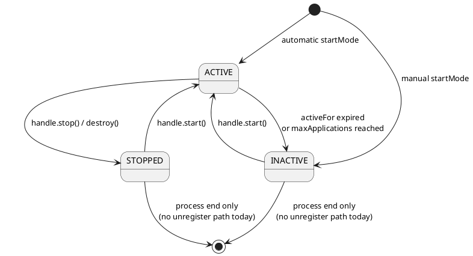

# 1. Overview

## Purpose

`chaos-agent-core` is the execution engine of the system. It owns scenario registration, validation, session scoping, per-invocation matching, effect application, diagnostics, and lifecycle-managed stressors.

## Scope

In scope:

- `ChaosRuntime`
- scenario controllers and registry
- selector matching
- effect execution semantics
- activation policies
- session propagation
- diagnostics snapshotting

Out of scope:

- JVM bytecode interception
- startup configuration resolution
- deployable agent packaging

## Non-Goals

- transactional scenario activation
- hard realtime behavior
- full removal of stopped scenarios from registry state in the current implementation

# 2. Architectural Context

This module is the internal runtime behind the public API.

Dependencies:

- depends on `chaos-agent-api`
- is called by `chaos-agent-instrumentation-jdk`
- is created and owned by `chaos-agent-bootstrap`

Trust boundary:

- none internal; this code assumes it is executing inside a trusted JVM with trusted configuration

Stable vs internal:

- `ChaosRuntime` is public only because bootstrap and tests instantiate or reference it, but operationally it should be treated as internal runtime machinery

# 3. Key Concepts And Terminology

- Registry: concurrent index of active controllers
- Controller: live owner for one registered scenario instance
- Scope key: internal registration key such as `jvm` or `session:<id>`
- Invocation context: normalized description of one intercepted operation
- Contribution: one matching controller’s impact on the current invocation
- Runtime decision: merged result across all matching contributions
- Terminal action: return, throw, or exceptional completion override
- Gate: latch-based blocker controlled by handle release or stop
- Stressor: side-effect object created at scenario start and closed at stop

# 4. End-to-End Behavior

## Activation Path

1. Caller activates a scenario or plan.
2. `ChaosRuntime` validates compatibility and scope.
3. A `ScenarioController` is created and registered.
4. A handle is returned.
5. If `startMode` is `AUTOMATIC`, the handle is started immediately.

## Invocation Path

1. Instrumentation constructs an `InvocationContext`.
2. `ScenarioRegistry.match(...)` evaluates every controller.
3. Matching controllers produce `ScenarioContribution` values.
4. Contributions are sorted by precedence descending, then id.
5. `ChaosRuntime.evaluate(...)` merges delay, gate, and terminal action state.
6. The intercepted thread applies the decision synchronously.

Important current implementation detail:

- terminal actions are precedence-resolved explicitly
- gate selection is not independently precedence-resolved; if multiple gate scenarios match, the last gate contribution encountered after sorting wins

## Session Path

1. `openSession(...)` creates a new session id.
2. The current thread is immediately bound to that session.
3. Wrapped tasks rebind that session on other threads when executed.
4. Closing the session stops its handles and removes the root binding from the thread that opened it.

# 5. Architecture Diagrams

## Scenario Lifecycle State Diagram

Question answered: what lifecycle states does a controller actually traverse?



Main takeaway: stop is not equivalent to removal. In the current implementation, controllers remain registered after stop or destroy.

No deployment diagram is included because this module has no independent deployment boundary.

# 6. Component Breakdown

## `ChaosRuntime`

Owns:

- activation entrypoints
- session creation
- invocation evaluation
- effect execution semantics
- runtime details

Why this design exists:

- centralize all stateful chaos logic behind one runtime object

## `ScenarioRegistry`

Owns:

- controller lookup and uniqueness
- activation failure collection
- diagnostics snapshot assembly

Important current caveat:

- it exposes `unregister(...)`, but the current code path never calls it

## `ScenarioController`

Owns:

- one scenario instance
- lifecycle state
- counters
- gate
- probability, rate limit, lifetime window enforcement
- optional stressor

## `ScopeContext`

Owns:

- thread-local session stack
- scope binding and propagation wrappers

## `CompatibilityValidator`

Owns:

- selector/effect/scope coherence checks
- runtime capability checks such as virtual thread support

# 7. Data Model And State

## Registration Identity

Internal controller identity is `scopeKey::scenarioId`.

Operational consequences:

- same JVM-scope id cannot be registered twice concurrently
- because stopped controllers are not unregistered, same-key reactivation can fail after close

## Handle Semantics

There are two materially different handle behaviors:

- `DefaultChaosActivationHandle` controls one controller
- `CompositeActivationHandle` controls multiple child handles and reports `ACTIVE` if any child is active

Neither handle type performs rollback for partially activated plans.

## Effect Semantics Matrix

The runtime does not implement every effect uniformly across every hook shape.

- Delay: always meaningful where the runtime can sleep before returning
- Gate: meaningful wherever the runtime can block the intercepted thread
- Reject: throws for many void hooks, but returns `false` or `null` on selected return-rewriting hooks
- Suppress: fully effective for some hooks such as boolean-return operations, scheduled tick suppression, and resource lookup; effectively a no-op on generic void pre-invocation hooks
- Exceptional completion: only valid for async completion hooks
- Heap pressure / keepalive: lifecycle side effects created at scenario start

This is not accidental abstraction leakage; it is a direct consequence of what each advice hook can legally alter.

Reject exception mapping in the current implementation is operation-sensitive:

- class-load rejection becomes `ClassNotFoundException`
- thread-start, virtual-thread-start, executor-submit, and shutdown-hook registration rejection become `RejectedExecutionException`
- most remaining rejecting paths become `IllegalStateException`

## Policy State

`ScenarioController` tracks:

- `matchedCount`
- `appliedCount`
- `startedAt`
- rate-limit window state
- gate state
- optional stressor reference

# 8. Concurrency And Threading Model

## Mutable State Ownership

- registry membership: `ConcurrentHashMap`
- activation failures: `ConcurrentLinkedQueue`
- controller counters: atomics
- controller lifecycle and reason strings: volatiles
- rate limit window: synchronized on controller
- session scope: `ThreadLocal`

## Threading Behavior

The intercepted thread performs matching and effect application inline. There is no async dispatcher inside the core.

Effects that block:

- `DelayEffect`
- `GateEffect`

Effects that create additional threads:

- `KeepAliveEffect`

Effects that allocate additional retained memory:

- `HeapPressureEffect`

## Scope Propagation Details

The current implementation immediately binds a new session to the thread that created it. This is more aggressive than a purely explicit bind model and is operationally important for test frameworks.

Misuse risk:

- `ScopeBinding.close()` pops the current stack head without validating identity. Bindings must therefore be closed in strict LIFO order.

Reference: JSR-133 — Java Memory Model

# 9. Error Handling And Failure Modes

## Validation Failures

Examples:

- session-scoped thread chaos
- virtual-thread selector on a runtime without virtual-thread support
- stress effect without matching stress selector
- exceptional completion effect on a non-async selector

## Runtime Failure Modes

- blocking indefinitely on a gate with no timeout if the operator never releases it
- increased latency from cumulative delays
- memory pressure or OOM risk from heap stress scenarios
- extra thread liveness from keepalive scenarios
- registry growth because stopped controllers are not unregistered

## Diagnostics Failure Recording

The registry currently records only `INVALID_CONFIGURATION` activation failures. Other failure categories exist in the API but are not emitted by the present core code.

## Misuse Example

Anti-pattern:

```java
controlPlane.activate(planA);
controlPlane.activate(planA);
```

Why it fails:

- the runtime enforces unique registration keys
- stopping the first handle does not currently remove the registered controller

# 10. Security Model

There is no internal privilege separation in the core.

Security-relevant consequences:

- selectors can target JVM-global surfaces
- effects can intentionally block or disrupt execution
- stress effects can intentionally consume memory or create threads
- diagnostics may reveal active scenario ids and runtime details

This code should be treated as trusted operational infrastructure, not as a safe sandbox.

# 11. Performance Model

## Hot Path Complexity

For each intercepted operation:

- scan all registered controllers
- evaluate matches
- sort matching contributions

This yields a practical cost closer to `O(n + m log m)` per event, where `n` is registered controllers and `m` is matching controllers.

## Latency Contributors

- controller scan
- sorting matches
- probability and rate-limit checks
- thread sleep
- gate wait

## Memory Contributors

- retained controller registry entries
- activation failure queue
- shutdown hook wrapper map in the runtime
- stressor allocations and threads

# 12. Observability And Operations

`ScenarioRegistry` is the concrete `ChaosDiagnostics`.

Useful operator fields:

- scenario id
- scope key
- state
- matched count
- applied count
- reason
- runtime details

Operational caveats:

- stopped controllers remain visible
- reserved enum states and failure categories may appear more expressive than current behavior really is

# 13. Configuration Reference

The core does not own parsing, but it is the layer that interprets:

- scenario scope
- selector/effect compatibility
- activation policies
- precedence

This is where configuration becomes enforceable runtime behavior.

# 14. Extension Points And Compatibility Guarantees

Extension work usually requires coordinated edits in:

- `CompatibilityValidator`
- `SelectorMatcher`
- `ChaosRuntime`
- effect-specific helpers such as `FailureFactory`
- instrumentation if a new operation surface is needed

Do not treat internal classes such as `ScenarioController`, `ScenarioRegistry`, or `ScopeContext` as stable extension APIs.

# 15. Stack Walkdown

## API Layer

The core implements the control-plane contracts but is not itself the contract of record.

## Application / Runtime Layer

This is the main behavior layer. Most incident analysis belongs here because the agent’s semantic decisions are made here.

## JVM Layer

Materially relevant for thread semantics, virtual thread capability checks, sleep/interruption behavior, and exception types surfaced to callers.

## Memory / Concurrency Layer

Highly relevant. The entire runtime is concurrency-sensitive and relies on standard Java visibility guarantees.

## OS / Container Layer

Relevant only indirectly through thread scheduling, process memory pressure, and interrupt behavior. There is no direct network protocol logic in this module.

## Infrastructure Layer

Not directly relevant except where external operators consume diagnostics or startup config.

# 16. References

- Reference: JSR-133 — Java Memory Model
- Reference: Java Language Specification
- Reference: Java Virtual Machine Specification
- Reference: JEP 444 — Virtual Threads
