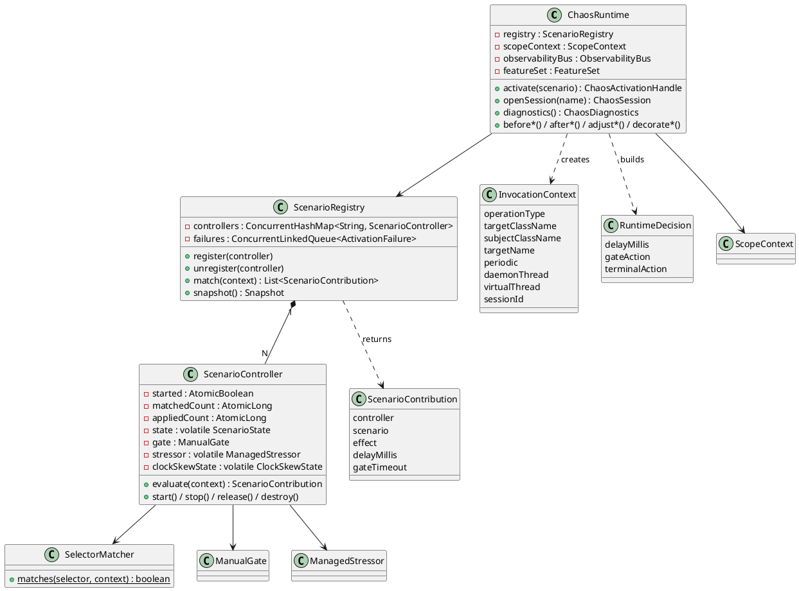
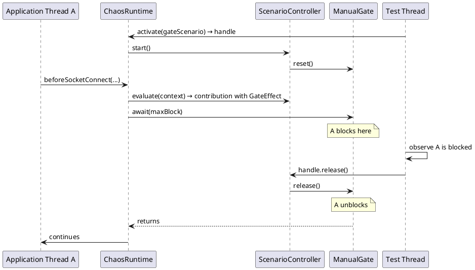

<!--
━━━━━━━━━━━━━━━━━━━━━━━━━━━━━━━━━━━━━━━━━━━━━━━━━━━━━━━━━━━━━
  Engineered by  Christian Schnapka
                 Embedded Principal+ Engineer
                 Macstab GmbH · Hamburg, Germany
                 https://macstab.com
━━━━━━━━━━━━━━━━━━━━━━━━━━━━━━━━━━━━━━━━━━━━━━━━━━━━━━━━━━━━━
-->

# chaos-agent-core — Execution Engine Reference

> Internal reference for the scenario registry, matching pipeline, activation policies, session scoping, effect execution, and stressor lifecycle.
> 
> *Engineered by* **[Christian Schnapka](https://macstab.com)** — Embedded Principal+ Engineer · [Macstab GmbH](https://macstab.com) · Hamburg, Germany

---

# 1. Overview

## Purpose

`chaos-agent-core` is the policy and execution engine. It owns everything between "the instrumented JDK method fired" and "the chaos effect was applied": scenario registration and lifecycle management, per-invocation matching, activation policy evaluation, effect dispatch, session scoping, diagnostics, and background stressor management.

## Scope

In scope:
- `ChaosRuntime` — central hub; implements `ChaosControlPlane`
- `ScenarioController` — per-scenario runtime guard with 8-check evaluation pipeline
- `ScenarioRegistry` — thread-safe store of controllers; implements `ChaosDiagnostics`
- `SelectorMatcher` — stateless invocation-context matcher
- `InvocationContext` — value object capturing per-call data
- `RuntimeDecision` — merged decision: delay + gate + terminal action
- `ScopeContext` — per-thread session ID propagation
- `DefaultChaosSession` — session lifecycle, binding, task wrapping
- `CompatibilityValidator` — structural validation at activation time
- `ObservabilityBus` — event publication + metrics increment
- `ManualGate` — count-down + condition-variable gate for blocking effects
- `ClockSkewState` — mutable state for drift/freeze clock modes
- `ReturnValueCorruptor` — return-value corruption strategies
- `FailureFactory` — operation-specific exception construction
- `StressorFactory` + all `ManagedStressor` implementations

Out of scope:
- JVM bytecode interception (that is `chaos-agent-instrumentation-jdk`)
- Startup configuration resolution (`chaos-agent-startup-config`)
- Agent packaging and MBean registration (`chaos-agent-bootstrap`)

## Non-Goals

- Transactional multi-scenario activation
- Scenario persistence across JVM restarts
- Removal of stopped controllers from registry (they stay until the handle is explicitly closed or the session is closed)

---

# 2. Engineerural Context

**Dependencies** (inbound):
- `chaos-agent-instrumentation-jdk` calls `ChaosRuntime`'s `before*`/`after*`/`adjust*`/`decorate*` methods via the `ChaosBridge` → `BootstrapDispatcher` bridge
- `chaos-agent-bootstrap` creates `ChaosRuntime`, calls `setInstrumentation()`

**Dependencies** (outbound):
- `chaos-agent-api` only

**Trust boundary**: all inputs are trusted JVM-internal calls. `ChaosRuntime` applies no security checks on callers.

**Stable vs internal**: `ChaosRuntime` has `public` visibility because bootstrap and testkit instantiate it, but it should be treated as internal runtime machinery. No API stability guarantee.

---

# 3. Key Concepts and Terminology

| Term | Definition |
|------|-----------|
| **InvocationContext** | Immutable record built at each instrumentation point: operation type, class names, target name, periodic flag, daemon/virtual thread flags, session ID. |
| **ScenarioContribution** | The value returned by `ScenarioController.evaluate()` when all 8 checks pass: carries the controller, effect, sampled delay, and gate timeout. |
| **RuntimeDecision** | Merged output of all matching contributions: accumulated delay, last gate action, highest-precedence terminal action. |
| **TerminalAction** | The final action to execute: THROW, RETURN (with value), SUPPRESS, COMPLETE_EXCEPTIONALLY, or CORRUPT_RETURN. |
| **TerminalKind** | Enum discriminating TerminalAction variants. |
| **GateAction** | A pair of (ManualGate, maxBlockDuration) triggering a conditional block on the calling thread. |
| **SessionId** | A string assigned by `DefaultChaosSession` and stored in `ScopeContext` as a `ThreadLocal`. Null means "not bound to any session" (JVM-scope applies). |
| **ScopeContext** | Single mutable source of truth for the current thread's session ID. Used by `ChaosRuntime` dispatch methods and `DefaultChaosSession.bind()`. |
| **baseSeed** | Per-controller seed for `SplittableRandom`, derived from `ActivationPolicy.randomSeed` or 0. XOR-ed with `matchedCount` and `scenarioId.hashCode()` per evaluation to produce varied-but-reproducible samples. |

---

# 4. End-to-End Behavior

## Scenario Registration

```
controlPlane.activate(scenario) or session.activate(scenario)
  ↓
ChaosRuntime.registerScenario(scenario, scopeKey, sessionId)
  ↓
CompatibilityValidator.validate(scenario, featureSet)
  — throws ChaosUnsupportedFeatureException on JVM feature mismatch
  — throws IllegalArgumentException on selector/effect incompatibility
  ↓
new ScenarioController(scenario, scopeKey, sessionId, clock, observabilityBus, instrumentationSupplier)
  — state = REGISTERED; started = false
  ↓
ScenarioRegistry.register(controller)
  — ConcurrentHashMap.putIfAbsent(key, controller)
  — throws IllegalStateException("already active") if key exists
  ↓
new DefaultChaosActivationHandle(controller, registry)
  if startMode == AUTOMATIC:
    handle.start()
      ↓
      ScenarioController.start()
        gate.reset()
        startedAt = clock.instant()
        started.set(true)
        state = ACTIVE
        stressor = StressorFactory.createIfNeeded(effect)  // starts background thread if needed
        if ClockSkewEffect: clockSkewState = new ClockSkewState(skewEffect, ...)
        observabilityBus.publish(STARTED, ...)
  ↓
return DefaultChaosActivationHandle
```

## Per-Invocation Evaluation

`ScenarioController.evaluate(InvocationContext context)` runs 8 checks:

```
1. if (!started.get()) return null
   — AtomicBoolean read; lock-free
   — Fast exit for REGISTERED, STOPPED controllers

2. if (sessionId != null && !sessionId.equals(context.sessionId())) return null
   — String equality; no lock
   — Session-scoped controllers are invisible to unbound threads

3. if (!SelectorMatcher.matches(scenario.selector(), context)) return null
   — Exhaustive sealed switch; stateless; no allocation
   — Checks: operationType in selector.operations(), pattern fields

4. long matched = matchedCount.incrementAndGet()
   if (!passesActivationWindow()) { state=INACTIVE; reason="expired"; return null }
   — matchedCount increments even if window check fails
   — This ensures warm-up counter advances even when the window is expired

5. if (matched <= activateAfterMatches) return null
   — Warm-up: skip first N matches

6. if (!passesRateLimit()) return null
   — synchronized(this): sliding window, O(1)

7. if (!passesProbability(matched)) return null
   — new SplittableRandom(baseSeed ^ matched ^ id.hashCode()).nextDouble() <= probability

8. if (maxApplications != null):
   CAS loop:
     current = appliedCount.get()
     if current >= maxApplications: state=INACTIVE; reason="max applications reached"; return null
     if compareAndSet(current, current+1): break
   else:
     appliedCount.incrementAndGet()

observabilityBus.publish(APPLIED, ...)
observabilityBus.incrementMetric("chaos.effect.applied", ...)
return new ScenarioContribution(this, scenario, effect, sampleDelayMillis(matched), gateTimeout())
```

**Note on matchedCount semantics**: `matchedCount` is incremented at step 4, before warm-up and rate-limit checks. This means it reflects the total number of times the selector matched, not the number of times the effect was applied. This is intentional: diagnostics consumers can distinguish "the selector is working" from "the effect is being suppressed by policy."

## RuntimeDecision Merge

`ChaosRuntime.evaluate(InvocationContext)` aggregates contributions:

```java
long delayMillis = 0L;                // ADDITIVE across all contributions
GateAction gateAction = null;         // LAST gate wins (only one gate blocks at a time)
TerminalAction terminalAction = null; // HIGHEST PRECEDENCE wins; ties broken by sorted order
int terminalPrecedence = Integer.MIN_VALUE;

for (ScenarioContribution contribution : contributions) {
    delayMillis += contribution.delayMillis();
    if (effect instanceof GateEffect) {
        gateAction = new GateAction(controller.gate(), contribution.gateTimeout());
    }
    TerminalAction candidate = terminalActionFor(operationType, effect, scenario);
    if (candidate != null && scenario.precedence() >= terminalPrecedence) {
        terminalAction = candidate;
        terminalPrecedence = scenario.precedence();
    }
}
```

Delay composition: multiple delay scenarios stack. Three scenarios each contributing 50 ms delay = 150 ms total. This is intentional load amplification — composing delays is a feature, not a bug.

Gate composition: only the last gate in the sorted contribution list applies. Two gate scenarios = the higher-precedence gate blocks; the lower-precedence gate is ignored. This is a limitation of the current implementation (not a deliberate multi-gate feature).

Terminal action selection: the highest-precedence scenario wins. If two scenarios share the same precedence, the lexicographically first `id` wins (due to the stable sort in `ScenarioRegistry.match()`).

## Decision Execution

```
applyPreDecision(decision):
  applyGate(gateAction):
    gate.await(maxBlock)  — blocks until release() or timeout; throws if interrupted
  if terminalAction != null:
    THROW     → throw terminalAction.throwable()
    RETURN(false) → throw RejectedExecutionException("operation suppressed")
    RETURN(other) → return normally (callers handle non-false return values differently)
    SUPPRESS  → return (no-op)
  sleep(delayMillis)  — Thread.sleep; interrupt restores flag + throws IllegalStateException
```

Note: `applyPreDecision` is not used for operations that return a value; those operations handle the terminal action inline. For example, `beforeBooleanQueueOperation` checks for RETURN and directly returns the boolean rather than throwing.

---

# 5. Architecture Diagrams

## Class Diagram — Core Component Relationships



**Takeaway**: `ChaosRuntime` is a thin orchestrator. The substantive decisions are in `ScenarioController.evaluate()` (policy) and `SelectorMatcher.matches()` (routing).

## Sequence Diagram — Gate Effect Lifecycle



**Takeaway**: `ManualGate` is a reusable barrier backed by `ReentrantLock + Condition`. Each `release()` opens the gate for all currently waiting threads. The gate is auto-reset by `start()` on the next activation.

---

# 6. Component Breakdown

## SelectorMatcher

Exhaustive `switch` over the sealed `ChaosSelector` hierarchy. Each case extracts the matching conditions from the selector variant and applies them to `InvocationContext` fields.

Key matching rules:

| Selector type | Primary match fields | Additional constraints |
|---------------|---------------------|----------------------|
| `ThreadSelector` | `operationType` in operations, `threadNamePattern.matches(targetName)` | `kind` (ANY/PLATFORM/VIRTUAL), `daemon` flag |
| `ExecutorSelector` | `operationType` in operations, `executorClassPattern.matches(targetClassName)` | `taskClassPattern.matches(subjectClassName)` |
| `QueueSelector` | `operationType` in operations, `queueClassPattern.matches(targetClassName)` | — |
| `AsyncSelector` | `operationType` in operations | No class/name filtering |
| `SchedulingSelector` | `operationType` in operations, `executorClassPattern.matches(targetClassName)` | `periodicOnly` flag |
| `ShutdownSelector` | `operationType` in operations, `targetClassPattern.matches(targetClassName)` | — |
| `ClassLoadingSelector` | `operationType` in operations, `targetNamePattern.matches(targetName)` | `loaderClassPattern.matches(targetClassName)` |
| `MethodSelector` | `operationType` in operations, `classPattern.matches(targetClassName)` | `methodNamePattern.matches(targetName)`, optional `signaturePattern` |
| `MonitorSelector` | `operationType` in operations, `monitorClassPattern.matches(targetClassName)` | — |
| `JvmRuntimeSelector` | `operationType` in operations | No class/name filtering |
| `NioSelector` | `operationType` in operations, `channelClassPattern.matches(targetClassName)` | — |
| `NetworkSelector` | `operationType` in operations, `remoteHostPattern.matches(targetName)` | — |
| `ThreadLocalSelector` | `operationType` in operations, `threadLocalClassPattern.matches(targetClassName)` | — |
| `StressSelector` | `operationType == LIFECYCLE`, `target != null` | No class/name filtering |

**null == wildcard**: Pattern fields that are `null` match anything. This is consistent across all selector types.

## CompatibilityValidator

Validates selector/effect combinations before registration. Throws `ChaosActivationException` on violation. All checks run at activation time, not at match time.

Key checks:

- Virtual thread selector requires `FeatureSet.supportsVirtualThreads()` (JDK 21+)
- Stressor effects require `StressSelector`; non-stress effects must not use `StressSelector`
- `GateEffect` requires a stress-compatible or appropriate operation selector
- `SpuriousWakeupEffect` requires `NioSelector`
- `ReturnValueCorruptionEffect` requires `MethodSelector` with `METHOD_EXIT` operation
- `ExceptionInjectionEffect` requires `MethodSelector` with `METHOD_ENTER` operation
- `ExceptionalCompletionEffect` requires `AsyncSelector`
- `ClockSkewEffect` requires `JvmRuntimeSelector` with one of: `SYSTEM_CLOCK_MILLIS`, `SYSTEM_CLOCK_NANOS`, `INSTANT_NOW`, `LOCAL_DATE_TIME_NOW`, `ZONED_DATE_TIME_NOW`, or `DATE_NEW`
- Session-scope scenarios may not use JVM-global selectors (clock, GC, exit, class loading, native library)
- **Destructive effects guard**: `DeadlockEffect` and `ThreadLeakEffect` require `activationPolicy.allowDestructiveEffects() == true`; activation without the flag throws `ChaosActivationException` at registration time

The destructive effects guard exists because deadlocked threads and leaked non-daemon threads cannot be cleaned up within the running process. The check is intentionally fail-fast and unconditional — there is no way to bypass it short of constructing an `ActivationPolicy` with `allowDestructiveEffects=true`.

## ScopeContext

Wraps a single `ThreadLocal<String>` holding the current session ID. Key operations:
- `currentSessionId()`: reads the `ThreadLocal`
- `bind(sessionId, Runnable)`: sets the `ThreadLocal`, runs the runnable, restores prior value in `finally`
- `wrap(sessionId, Runnable)`: returns a `Runnable` that, when executed, sets the `ThreadLocal` to `sessionId` for the duration of the run — used for propagating session context to executor threads

**Why ThreadLocal and not a method argument**: The session ID must be available at every instrumentation point without changing the signature of any JDK method. `ThreadLocal` is the only transparent carrier for per-thread state in a JVM agent context.

**Limitation**: Session context propagates only to threads that are explicitly wrapped via `session.wrap(task)` or `ScopeContext.wrap(sessionId, task)`. Threads spawned independently (e.g., by third-party libraries) without wrapping do not carry the session ID and will not be affected by session-scoped scenarios.

## ManualGate

Backed by `ReentrantLock + Condition`. State is a `volatile boolean open`.

- `await(maxBlock)`: if gate is closed, `condition.await(maxBlock)`. Returns immediately if open or if timeout elapses.
- `release()`: sets `open = true`, signals all waiters (`condition.signalAll()`), unlocks.
- `reset()`: sets `open = false`. Called by `ScenarioController.start()` to re-arm the gate for a new activation.

**Thread safety**: All operations are guarded by the `ReentrantLock`. Multiple threads may block simultaneously in `await()`.

**AQS usage**: `ReentrantLock` uses `AbstractQueuedSynchronizer` internally. The AQS instrumentation (`MonitorEnterAdvice`) fires on `acquire()` inside `ReentrantLock.lock()`. This fires inside the chaos runtime itself. The DEPTH guard in `BootstrapDispatcher` short-circuits before re-entering chaos evaluation, preventing infinite recursion.

## ClockSkewState

Holds reference timestamps captured at `ScenarioController.start()`:
- `referenceMillis`: `System.currentTimeMillis()` at start
- `referenceNanos`: `System.nanoTime()` at start

Mode semantics:
- **FIXED**: adds a constant offset (`skewEffect.offsetMillis()`) to every clock read
- **DRIFT**: adds `offset * callCount` — the skew grows monotonically with each clock invocation; `callCount` is a per-state `AtomicLong`
- **FREEZE**: always returns the reference value; time appears stopped at the moment the scenario started

`ClockSkewState` is `volatile` in `ScenarioController`. On `stop()`, it is set to `null`; `applyClockSkew()` in `ChaosRuntime` checks for null before calling state methods.

`applyClockSkew()` is the single generalised entry point that handles all six clock operation types: `SYSTEM_CLOCK_MILLIS`, `SYSTEM_CLOCK_NANOS`, `INSTANT_NOW`, `LOCAL_DATE_TIME_NOW`, `ZONED_DATE_TIME_NOW`, and `DATE_NEW`. Only `SYSTEM_CLOCK_NANOS` routes through the nanosecond skew channel; every other type routes through the millisecond channel. The higher-level type-specific wrappers (`adjustInstantNow`, `adjustLocalDateTimeNow`, `adjustZonedDateTimeNow`, `adjustDateNew`) each extract the underlying millisecond value, pass it to `applyClockSkew()` with the appropriate `OperationType`, then reconstruct the high-level time object — preserving zone identity for `ZonedDateTime` and nanosecond sub-millisecond precision for `Instant`.

Test coverage: `ClockSkewRuntimeTest$HigherLevelTimeApis` (8 tests) covers FIXED skew on `Instant.now`, `LocalDateTime.now`, `ZonedDateTime.now`, and `Date`; FREEZE mode on `Instant.now`; isolation between `INSTANT_NOW` and `DATE_NEW` operation types; and passthrough when no scenario matches.

## ReturnValueCorruptor

Applies a `ChaosEffect.ReturnValueCorruptionEffect.Strategy` to a (returnType, actualValue) pair:

| Strategy | int/long | float/double | String | Collection | Boolean | null return |
|----------|----------|-------------|--------|-----------|---------|-------------|
| NULL | null | null | null | null | null | null |
| ZERO | 0 / 0L | 0.0f / 0.0d | "0" | empty | false | null |
| EMPTY | "" (if String) | 0.0 | "" | empty | false | null |
| BOUNDARY_MAX | `Integer.MAX_VALUE` / `Long.MAX_VALUE` | `Float.MAX_VALUE` / `Double.MAX_VALUE` | unchanged | unchanged | true | null |
| BOUNDARY_MIN | `Integer.MIN_VALUE` / `Long.MIN_VALUE` | `Float.MIN_VALUE` / `Double.MIN_VALUE` | unchanged | unchanged | false | null |

The return type is determined from the actual value's runtime class if the declared type is erased to `Object`. Unrecognized types fall through with the actual value unchanged (no silent data corruption for unknown types).

## FailureFactory

Constructs operation-appropriate exceptions for `RejectEffect` and `ExceptionalCompletionEffect`:

| Operation type | Exception type |
|---------------|----------------|
| `SOCKET_CONNECT`, `NIO_CHANNEL_CONNECT` | `ConnectException` |
| `SOCKET_READ`, `SOCKET_ACCEPT` | `SocketTimeoutException` |
| `SOCKET_WRITE`, `NIO_CHANNEL_WRITE` | `IOException` |
| `EXECUTOR_SUBMIT` | `RejectedExecutionException` |
| `JNDI_LOOKUP` | `NamingException` |
| `CLASS_LOAD`, `CLASS_DEFINE` | `ClassNotFoundException` / `ClassFormatError` |
| `OBJECT_DESERIALIZE` | `InvalidClassException` |
| `OBJECT_SERIALIZE` | `NotSerializableException` |
| `NATIVE_LIBRARY_LOAD` | `UnsatisfiedLinkError` |
| `DIRECT_BUFFER_ALLOCATE` | `OutOfMemoryError` |
| `SYSTEM_EXIT_REQUEST` | `SecurityException` (via suppressTerminal) |
| default | `RuntimeException` with the reject message |

---

# 7. Data Model and State

## ChaosScenario (API)

```
id: String                         — unique within a registry scope key
description: String                — human-readable label
scope: JVM | SESSION               — isolation scope
precedence: int                    — tie-breaking for terminal action selection; default 0
selector: ChaosSelector            — sealed hierarchy; which operations trigger this scenario
effect: ChaosEffect                — sealed hierarchy; what to do when triggered
activationPolicy: ActivationPolicy — when and how often to apply
```

Immutable after construction.

## ActivationPolicy (API)

```
startMode: AUTOMATIC | MANUAL      — whether to start on activate() or require explicit start()
probability: double [0.0, 1.0]    — fraction of matching invocations that apply the effect
rateLimit: (permits, window)       — max applications within a sliding time window
activateAfterMatches: long ≥ 0    — skip first N matches (warm-up)
activeFor: Duration                — auto-expire after this duration from start()
maxApplications: Long              — stop after this many total applications; null = unlimited
randomSeed: Long                   — seed for probability sampling; null = 0
```

All fields are optional and compose independently (AND logic). A scenario passes all guards or fires on none.

## ScenarioReport (Diagnostics)

```
id: String
description: String
scopeKey: String ("jvm" or "session:<id>")
scope: JVM | SESSION
state: REGISTERED | ACTIVE | INACTIVE | STOPPED
matchedCount: long
appliedCount: long
reason: String  — last observed reason for no-fire or state transition
```

Snapshot value; not live-updating after capture.

---

# 8. Concurrency and Threading Model

See [overall-agent.md §8] for the full concurrency model. Core-specific notes:

## Rate Limit Synchronization

`synchronized(this)` on the `ScenarioController` instance guards `rateWindowStartMillis` and `rateWindowPermits`. The critical section is ~5 operations (compare, subtract, conditional reset, increment, compare). Lock hold time is sub-microsecond under contention-free conditions.

Under high concurrency with many threads hitting the same rate-limited scenario, this `synchronized` block becomes a serialization point. This is acceptable because rate-limited scenarios are typically not on ultra-hot paths (if you need lock-free rate limiting at microsecond granularity, this design would need to change).

## matchedCount vs appliedCount

`matchedCount.incrementAndGet()` runs at step 4, before warm-up and rate-limit checks. This is deliberate:
- `matchedCount` answers "is the selector working?"
- `appliedCount` answers "is the effect being applied?"
- `matchedCount > 0 && appliedCount == 0` diagnoses activation policy suppression

## CAS Loop for maxApplications

Without the CAS loop, two threads could simultaneously read `appliedCount < maxApplications`, both increment, and both apply the effect — overshooting the cap by N-1 where N is the number of concurrent threads that raced through. The CAS loop ensures the increment is atomic with the read.

## RateLimit Precision under High Concurrency

The `synchronized(this)` guard that protects the rate-limit window does more than prevent double-counting — it upholds the exact-permits guarantee: given `N` permits per window, _exactly_ `N` applications occur, never more and never fewer (when more threads compete than there are permits).

**Invariant (test coverage in `RateLimitUnderHighConcurrencyTest`)**:

| Scenario | Expected `appliedCount` | Assertion |
|---|---|---|
| 100 threads, 7 permits, 10 s window | `<= 7` | overshoot prevention |
| 100 threads, 10 permits, 10 s window | `== 10` | no permit wasted |
| 50 threads, `maxApplications=3`, `rateLimit=20` | `<= 3` | `maxApplications` wins when tighter |

The last row confirms that `maxApplications` and `rateLimit` are independent guards: the tighter constraint wins. When `maxApplications < permitsPerWindow`, the CAS loop on `appliedCount` fires before the rate-limit window is exhausted.

## stop() Monotonic State Transition

`ScenarioController` state transitions monotonically: `REGISTERED → ACTIVE → STOPPED`. Once a controller observes the stopped flag it never reverts.

**Guarantees (test coverage in `StopDuringEvaluationTest`)**:

- `handle.stop()` completes a sequentially-consistent write; the calling thread reads `STOPPED` immediately after `stop()` returns.
- Threads that began an evaluation pass _before_ observing the stopped flag may complete with an effect applied. This is the legally-in-flight window; it is bounded and resolves without exception.
- Threads that enter `evaluate()` _after_ the stopped flag is visible receive a null contribution — no effect is applied.
- Concurrent reader threads never observe a `STOPPED → ACTIVE` state reversal. The `stopped` flag is an `AtomicBoolean`; once `true`, `compareAndSet(false, true)` by any other writer fails.

**Implementation note**: `evaluate()` reads `stopped` at the first step of the pipeline (before the selector check). This minimizes work done on stopped controllers and ensures the evaluation short-circuits cleanly without producing partial state.

## Multi-Scenario Terminal Action Precedence

When two or more scenarios match the same invocation and both carry terminal actions (reject, suppress, exception), the merge rule is:

1. **Delays accumulate**: all matching scenarios' delay durations are summed before sleeping.
2. **Terminal action**: the scenario with the highest `precedence()` integer wins. Equal precedence is last-write (non-deterministic) but always results in exactly one terminal action being applied — never zero, never two.

**Test coverage in `TwoScenariosConflictingTerminalActionsTest`**:

- Higher-precedence REJECT (`precedence=100`) beats lower-precedence SUPPRESS (`precedence=0`) regardless of registration order.
- Delay accumulation: two 30 ms scenarios produce `>= 48 ms` observed latency (×0.8 tolerance for scheduler jitter).
- Under 80 concurrent threads × 5 iterations (400 total calls), all calls produce REJECT when reject has higher precedence — no call escapes with suppress or no effect.

**Why registration order is irrelevant**: `ChaosRuntime.evaluate()` iterates all matching controllers and builds a merged result; precedence is resolved by a final `max(precedence)` scan over contributions, not by insertion order.

## Session Isolation Invariants

Sessions provide hard isolation boundaries via `ScopeContext`, a thread-local stack of active session IDs.

**Invariants (test coverage in `SessionIsolationParallelTest`)**:

| Scenario | Invariant |
|---|---|
| 10 sessions × 10 threads × 5 iterations | Each session's `appliedCount == 50` — no cross-session bleed |
| 50 unbound threads, 10 active session scenarios | All session `appliedCount == 0` — unbound threads invisible to session selectors |
| Session closed after pre-close applications | Post-close calls on any thread are not delayed — effect stops immediately |

**Why cross-session bleed is impossible**: `ScopeContext.currentSessionId()` returns the top of the calling thread's session ID stack. The `ScenarioController` for a SESSION-scoped scenario stores its session ID at registration time. The evaluation pipeline (step 3) compares `currentSessionId()` against the controller's ID with reference equality on interned session UUIDs. A thread in session A can never satisfy the guard for a controller registered to session B.

**Root binding and lifecycle**: `DefaultChaosSession(...)` calls `scopeContext.bind(id)` in its constructor — the opening thread is automatically in-scope from construction. `session.close()` calls `rootBinding.close()` last, after all controllers are destroyed, ensuring no thread reads a dangling session ID.

---

# 9. Error Handling and Failure Modes

## Exception Injection Failure

If `Class.forName(exceptionClassName)` throws `ClassNotFoundException`, or if neither a `(String)` constructor nor a no-arg constructor is accessible via reflection, `buildInjectedExceptionTerminal()` returns a `RuntimeException` describing the failure. This is a degrade-gracefully design: the scenario fires, but injects a different exception than configured.

**Operator signal**: If injected exceptions are unexpected `RuntimeException`s containing "chaos-agent: failed to instantiate", the `exceptionClassName` in the scenario configuration is wrong or the exception class is not on the classpath.

## Stressor Creation Failure

`StressorFactory.createIfNeeded()` catches stressor-creation errors silently (by design, since stressors start background threads that may fail for resource reasons). A failed stressor returns `null`; the scenario remains ACTIVE but produces no background load. This is a silent degradation. Future improvement: propagate stressor creation errors to the diagnostics failure queue.

## Scenario Duplicate Registration

`ScenarioRegistry.register()` throws `IllegalStateException("scenario key already active: " + key)` if a controller with the same key is already present. The key is `scopeKey + "::" + scenarioId`. Two scenarios with the same ID in the same scope cannot coexist. The registration exception is caught in `ChaosRuntime.registerScenario()` and classified as `ACTIVATION_CONFLICT`.

## Session Close and Registry Cleanup

`DefaultChaosSession.close()` calls `ScenarioRegistry.unregister(controller)` for every session-scoped controller. `unregister()` uses `ConcurrentHashMap.remove(key, controller)` — identity-based conditional removal. If the controller was already replaced (e.g., by a duplicate-ID registration race), only the exact registered instance is removed.

JVM-scoped controllers are NOT removed on session close. They persist until `controlPlane.close()` or `handle.close()`.

---

# 10. Security Model

- No authentication or authorization on the `ChaosControlPlane` API
- `CompatibilityValidator` is a structural validator, not a security boundary
- Exception injection via `ExceptionInjectionEffect` uses `Class.forName()` with the current thread's classloader; the exception class must be on the application classpath
- Return-value corruption via `ReturnValueCorruptionEffect` can corrupt application data structures; misuse in production can cause data integrity issues

---

# 11. Performance Model

## Selector Matching Cost

`SelectorMatcher.matches()` is a sealed-hierarchy switch. Each case is at most 3–4 field comparisons and `Pattern.matches()` calls. For simple string patterns (exact match), this is sub-microsecond. For regex patterns, the cost depends on the regex complexity.

**Recommendation**: Use exact class name matches or simple prefix patterns rather than complex regexes in performance-sensitive scenarios.

## Evaluation Pipeline Cost (per controller, per intercepted call)

- Steps 1–3: ~10–50 ns (AtomicBoolean read + string equality + SelectorMatcher)
- Step 4 (matchedCount + window check): ~5 ns (AtomicLong CAS + instant comparison)
- Step 5 (warm-up): ~3 ns (AtomicLong comparison)
- Step 6 (rate limit): ~10–100 ns depending on synchronized contention
- Step 7 (probability): ~50 ns (SplittableRandom allocation + nextDouble)
- Step 8 (maxApplications CAS): ~5–20 ns (AtomicLong CAS)

Total per matching controller that passes all checks: ~100–300 ns exclusive of the effect itself.

## ObservabilityBus Publishing Cost

`observabilityBus.publish(APPLIED, ...)` and `incrementMetric()` are called on every successful application. With a NOOP metrics sink and no event listeners, the publish call is near-zero cost. With real listeners or a real metrics sink, the cost of the event handler adds to the hot path. **Listeners must be non-blocking.**

---

# 12. Configuration Reference

See `chaos-agent-api` for the full `ChaosScenario`, `ChaosSelector`, `ChaosEffect`, and `ActivationPolicy` builder APIs.

Key invariants enforced at construction time by the builder API or `CompatibilityValidator`:

- `probability` must be in [0.0, 1.0]
- `rateLimit.permits > 0`
- `activateAfterMatches >= 0`
- `maxApplications > 0` if set
- `randomSeed` may be any `long`; 0 is not a reserved value
- For `ClockSkewEffect.DRIFT` mode: a positive `offsetMillis` adds drift forward; negative adds drift backward
- For `ClockSkewEffect.FREEZE` mode: `offsetMillis` is ignored (the clock freezes at the reference value)

---

# 13. Extension Points

- `ChaosMetricsSink`: implement to forward `chaos.effect.applied` metrics to a custom sink
- `ChaosEventListener`: implement to subscribe to STARTED/STOPPED/RELEASED/APPLIED events
- Both are registered on `ChaosRuntime` at construction time or via `addEventListener()`

---

# 14. Stack Walkdown

**Application layer**: `ChaosRuntime.activate()` → `registerScenario()` → `ScenarioController` creation + `ScenarioRegistry.register()` + optional `start()`. Cost: one `ConcurrentHashMap.putIfAbsent()`.

**Hot path**: See Section 4 for the full call sequence from `ChaosRuntime.before*()` to `evaluate()` to decision execution.

**JVM layer**: `AtomicBoolean.get()`, `AtomicLong.incrementAndGet()`, `AtomicLong.compareAndSet()` — all mapped to x86 `LOCK CMPXCHG` / `LOCK XADD` instructions. `ConcurrentHashMap.values().stream()` — no lock acquisition on the map's read path in JDK 17+.

**OS layer**: `Thread.sleep(delayMillis)` → `nanosleep(2)` on Linux. `synchronized(this)` → OS mutex via HotSpot's biased locking / lightweight locking / inflated lock stack depending on contention level.

---

# 15. References

- Reference: Java SE API — `java.util.concurrent.atomic.AtomicBoolean`, `AtomicLong`
- Reference: Java SE API — `java.util.concurrent.ConcurrentHashMap` §lock-free read path
- Reference: Java SE API — `java.util.SplittableRandom` (not thread-safe)
- Reference: JSR-133 — Java Memory Model §17.4 — happens-before rules for `volatile` reads/writes
- Reference: Java SE API — `java.util.concurrent.atomic.AtomicBoolean`, `AtomicLong` — https://docs.oracle.com/en/java/docs/api/java.base/java/util/concurrent/atomic/AtomicLong.html
- Reference: Java SE API — `java.util.concurrent.ConcurrentHashMap` (lock-free read via segment traversal) — https://docs.oracle.com/en/java/docs/api/java.base/java/util/concurrent/ConcurrentHashMap.html
- Reference: Java SE API — `java.util.SplittableRandom` (not thread-safe; xorshift-based non-linear PRNG) — https://docs.oracle.com/en/java/docs/api/java.base/java/util/SplittableRandom.html
- Reference: JSR-133 — Java Memory Model §17.4 — happens-before rules for `volatile` reads/writes — https://jcp.org/aboutJava/communityprocess/mrel/jsr133/index.html
- Reference: JLS §17.7 — Non-atomic treatment of double and long; `volatile long` guarantees — https://docs.oracle.com/javase/specs/jls/se21/html/jls-17.html#jls-17.7
- Reference: Java SE API — `java.util.concurrent.locks.ReentrantLock`, `Condition.await(timeout, unit)` — https://docs.oracle.com/en/java/docs/api/java.base/java/util/concurrent/locks/ReentrantLock.html
- Reference: JEP 444 — Virtual Threads; `Thread.isVirtual()`; carrier-thread pinning under `synchronized` — https://openjdk.org/jeps/444
- Reference: Intel® SDM Vol. 3 — `LOCK CMPXCHG` (compare-and-swap), `LOCK XADD` (fetch-and-add) — https://www.intel.com/content/www/us/en/developer/articles/technical/intel-sdm.html
- Reference: JVMS §6.5 `monitorenter` opcode — https://docs.oracle.com/javase/specs/jvms/se21/html/jvms-6.html#jvms-6.5.monitorenter

---

<div align="center">

*Architecture, implementation, and documentation crafted with Love and Passion by*

**[Christian Schnapka](https://macstab.com)**  
Embedded Principal+ Engineer  
[Macstab GmbH](https://macstab.com) · Hamburg, Germany

*Building systems that operate correctly at the edges — including the ones you deliberately break.*

</div>
