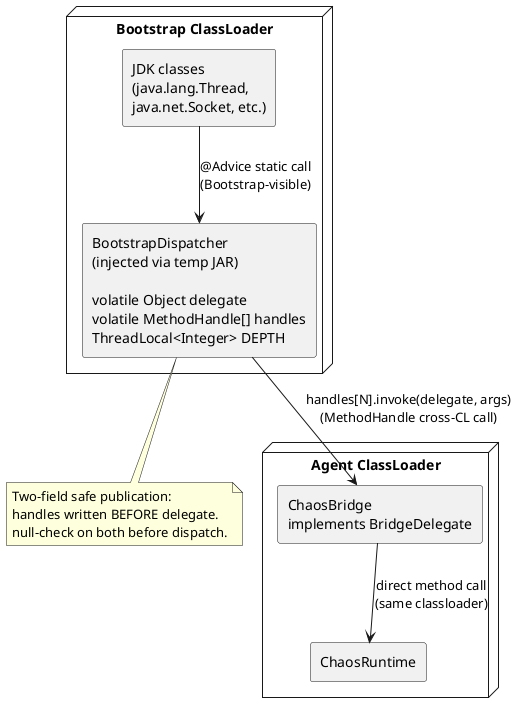
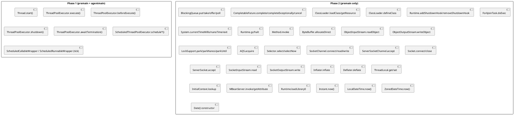
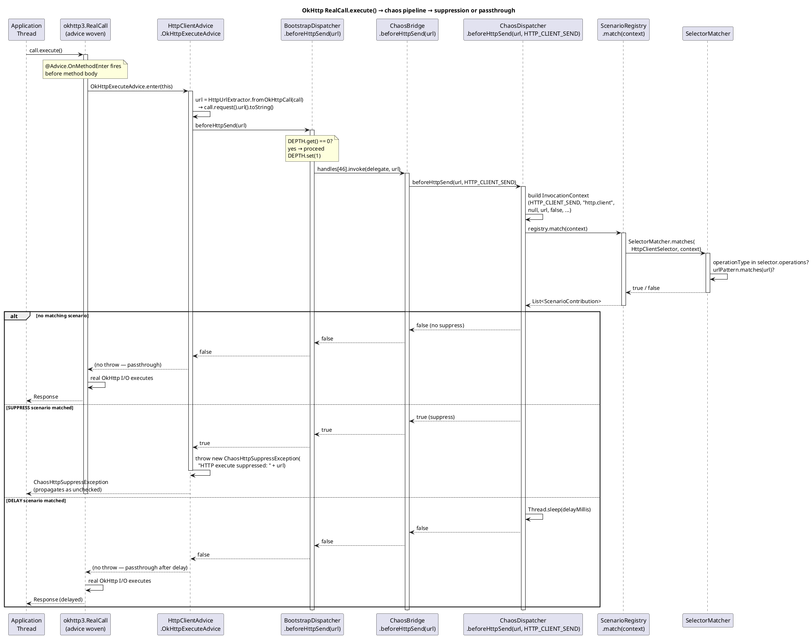
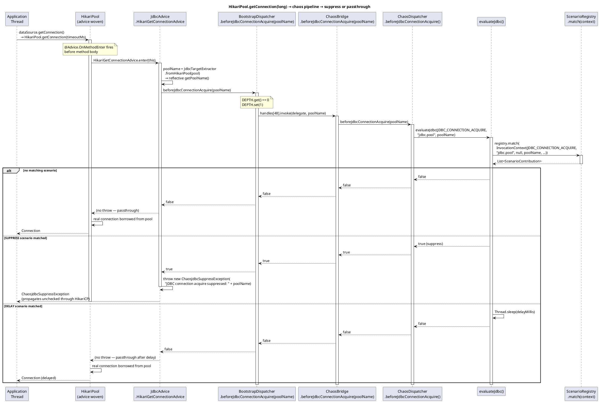

<!--
━━━━━━━━━━━━━━━━━━━━━━━━━━━━━━━━━━━━━━━━━━━━━━━━━━━━━━━━━━━━━
  Engineered by  Christian Schnapka
                 Embedded Principal+ Engineer
                 Macstab GmbH · Hamburg, Germany
                 https://macstab.com
━━━━━━━━━━━━━━━━━━━━━━━━━━━━━━━━━━━━━━━━━━━━━━━━━━━━━━━━━━━━━
-->

# chaos-agent-instrumentation-jdk — Instrumentation Layer Reference

> Internal reference for the bootstrap bridge, ByteBuddy advice classes, reentrancy guard, and the 57-handle interception surface.
> 
> *Engineered by* **[Christian Schnapka](https://macstab.com)** — Embedded Principal+ Engineer · [Macstab GmbH](https://macstab.com) · Hamburg, Germany

---

# 1. Overview

## Purpose

`chaos-agent-instrumentation-jdk` is the adapter between ByteBuddy's advice model and `ChaosRuntime`'s normalized dispatch API. Its responsibilities:

1. Package `BootstrapDispatcher` into a temp JAR and append it to the bootstrap classpath
2. Build a 57-slot `MethodHandle[]` array and wire it into `BootstrapDispatcher` via reflection
3. Assemble an `AgentBuilder` covering all Phase 1 and Phase 2 interception points and install it

After installation, this module has no further runtime role. All runtime execution paths go through `BootstrapDispatcher` → `ChaosBridge` → `ChaosRuntime`.

## Scope

In scope:
- `JdkInstrumentationInstaller` — entry point; orchestrates all startup steps
- `BootstrapDispatcher` — bootstrap-classloader-resident static dispatcher (57 dispatch methods + reentrancy guard)
- `BridgeDelegate` — interface defining the 57-method contract
- `ChaosBridge` — agent-classloader implementation of `BridgeDelegate`; thin delegation to `ChaosRuntime`
- All `@Advice` classes for Phase 1 and Phase 2 interception points
- `ScheduledCallableWrapper`, `ScheduledRunnableWrapper` — task wrappers for tick-level interception

Out of scope:
- Scenario policy evaluation (that is `chaos-agent-core`)
- Config loading (`chaos-agent-startup-config`)

## Non-Goals

- Dynamic advice deregistration (ByteBuddy transformations are permanent for the JVM lifetime)
- Intercepting non-JDK code paths
- Arbitrary user-defined instrumentation points

---

# 2. Engineerural Context

**Dependencies**:
- ByteBuddy (`net.bytebuddy`) for advice weaving and class transformation
- `chaos-agent-core` for `ChaosRuntime`, `OperationType`
- `chaos-agent-api` for `ChaosSelector`, `ChaosEffect`

**Called by**: `chaos-agent-bootstrap` during agent startup; specifically `ChaosAgentBootstrap` calls `JdkInstrumentationInstaller.install()`.

**The classloader problem**: JDK classes are loaded by the bootstrap classloader. Advice woven into JDK methods executes in whatever classloader loaded the JDK class — the bootstrap classloader, which cannot see agent-classloader classes by name. The bootstrap bridge solves this by placing `BootstrapDispatcher` in the bootstrap classpath so JDK-loaded advice can call it as a static method, then routing to agent-classloader code via `MethodHandle`.

---

# 3. Key Concepts and Terminology

| Term | Definition |
|------|-----------|
| **Bootstrap classloader** | The JVM root classloader; loads `java.*`, `javax.*`. Has no parent. Can only see classes from `rt.jar`/`java.base` and explicitly appended JARs. |
| **Agent classloader** | The classloader created for the agent JAR. Has the bootstrap classloader as parent (indirect). Can see all agent classes. |
| **Advice class** | A ByteBuddy concept: a class containing `@Advice.OnMethodEnter` and/or `@Advice.OnMethodExit` static methods, whose bytecode is inlined into the instrumented method. Not a real class instantiation at runtime — the advice body is copied as bytecode. |
| **BootstrapDispatcher** | A class that must be visible to the bootstrap classloader. Provides 57 static dispatch methods called from advice. |
| **BridgeDelegate** | Interface in the agent classloader defining the 57-method contract. Implemented by `ChaosBridge`. |
| **MethodHandle** | A typed reference to a method, invokable across classloader boundaries. Built from the agent classloader; stored in `BootstrapDispatcher.handles[]`. |
| **DEPTH guard** | `ThreadLocal<Integer>` in `BootstrapDispatcher`. Prevents infinite recursion when chaos code calls instrumented JDK methods. |
| **Phase 1** | Instrumentation installed in both premain and agentmain: `ThreadPoolExecutor`, `Thread`, `ScheduledThreadPoolExecutor`. |
| **Phase 2** | Instrumentation installed in premain only: all bootstrap-loaded JDK classes requiring retransformation. |
| **Retransformation** | Replacing the bytecode of an already-loaded class. Requires `Can-Retransform-Classes: true` in the agent manifest and premain-mode attachment. |

---

# 4. End-to-End Behavior

## Agent Startup Sequence

```
JdkInstrumentationInstaller.install(instrumentation, runtime, premainMode)
  ↓
1. injectBridge(instrumentation)
   — Read BootstrapDispatcher.class bytes from agent JAR resources
   — Read BootstrapDispatcher$ThrowingSupplier.class bytes
   — Write both into temp JAR at java.io.tmpdir
   — Register temp file for deleteOnExit()
   — instrumentation.appendToBootstrapClassLoaderSearch(new JarFile(tempJar))
   → BootstrapDispatcher is now visible to bootstrap classloader

2. installDelegate(new ChaosBridge(runtime))
   — buildMethodHandles(): 57 MethodHandle[] via MethodHandles.publicLookup() against BridgeDelegate
   — Class.forName("...BootstrapDispatcher", true, null)  // null CL = bootstrap CL
   — bootstrapDispatcherClass.getMethod("install", Object.class, MethodHandle[].class)
                              .invoke(null, bridgeDelegate, mh)
   → handles written before delegate (two-field safe publication)

3. AgentBuilder construction
   — Phase 1: ThreadPoolExecutor, Thread, ScheduledThreadPoolExecutor (always)
   — Phase 2: System, Runtime, LockSupport, AQS, NIO, Socket, BlockingQueue,
             CompletableFuture, ClassLoader, etc. (premainMode only)

4. agentBuilder.installOn(instrumentation)
   — RETRANSFORMATION strategy: retransforms already-loaded JDK classes
   — disableClassFormatChanges(): no structural changes; only adds advice bytecode inline
   — Error listener: logs warnings on per-class transformation failure; does not abort
```

## Per-Call Dispatch (hot path)

```
Instrumented method fires @Advice.OnMethodEnter
  ↓
Advice calls BootstrapDispatcher.someDispatchMethod(...)  [static call, visible from bootstrap CL]
  ↓
BootstrapDispatcher.invoke(supplier, fallback):
  if (DEPTH.get() > 0):
    return fallback    // reentrancy: return safe default immediately
  DEPTH.set(DEPTH.get() + 1)
  try:
    snapshot: MethodHandle[] h = handles; Object d = delegate;
    if (d == null || h == null): return fallback   // not yet installed
    return h[SLOT_INDEX].invoke(d, ...args...)     // ChaosBridge.method(args)
      → ChaosRuntime.method(args)
  catch Throwable t:
    sneakyThrow(t)         // rethrow without checked-exception wrapping
    return fallback        // unreachable, but satisfies compiler
  finally:
    int next = DEPTH.get() - 1;
    if (next == 0): DEPTH.remove()    // ThreadLocal cleanup for pooled threads
    else: DEPTH.set(next)
```

## ThreadLocal Reentrancy Special Case

`ThreadLocal.get()` and `ThreadLocal.set()` are globally instrumented in Phase 2. The DEPTH guard itself uses `DEPTH.get()`, which is a `ThreadLocal.get()` call. Without a special check, this would create infinite recursion: `ThreadLocal.get()` → advice → `BootstrapDispatcher.beforeThreadLocalGet()` → `invoke()` → `DEPTH.get()` → `ThreadLocal.get()` → ...

The special case in `ThreadLocalGetAdvice.onEnter()`:
```java
if (threadLocal == BootstrapDispatcher.depthThreadLocal()) return false;
```

This identity check fires before any delegation. When `DEPTH` reads itself, the advice detects `threadLocal == DEPTH` and skips the dispatch, returning `false` (no suppression). This is the only place in the entire codebase where `BootstrapDispatcher.depthThreadLocal()` is called externally.

---

# 5. Architecture Diagrams

## Bootstrap Bridge Architecture



**Takeaway**: The only crossing of the classloader boundary is via `MethodHandle.invoke()`. No class cast is performed across classloaders. Type erasure (`Object` typed parameters) absorbs the type mismatch.

## Phase 1 vs Phase 2 Interception Map



---

# 6. Component Breakdown

## JdkInstrumentationInstaller

**Responsibility**: One-time setup of the entire instrumentation stack. Stateless; `install()` is called once from a single thread.

**`injectBridge()`**: Reads class bytecode from the agent JAR's own classloader resources (the `.class` files are in the same JAR). Writes verbatim into a temp JAR. This ensures the bootstrap-injected class is byte-for-byte identical to the agent-classloader version — there is no separate bootstrap-dispatcher source; it is one class compiled once and loaded twice into different classloaders.

**`buildMethodHandles()`**: Uses `MethodHandles.publicLookup()` against `BridgeDelegate.class`. Public lookup is required because the bootstrap classloader must be able to invoke the handles; a full-access lookup with the agent classloader's module system would not be reachable from the bootstrap context. Each handle is a virtual method handle; when invoked with `delegate` as the first argument, it dispatches to the `ChaosBridge` implementation. The array has exactly 57 slots (indices 0–56); see §7 for the full slot table.

**`installDelegate()`**: Uses `Class.forName("...BootstrapDispatcher", true, null)` — the `null` classloader argument requests loading from the bootstrap classloader, ensuring the instance obtained is the bootstrap-classloader version, not the agent-classloader version. Reflective invocation of `install()` crosses the classloader boundary without sharing type references.

**`instrumentOptional()`**: Before registering a ByteBuddy type matcher for optional JDK classes (e.g., `javax.naming.InitialContext`, `javax.management.MBeanServer`), attempts `Class.forName(typeName, false, systemClassLoader)`. If absent, logs at FINE and skips the transformation. This prevents agent startup failure in environments where these classes are not on the classpath.

**`AgentBuilder` configuration**:
- `disableClassFormatChanges()`: prevents ByteBuddy from adding fields or changing the constant pool structure — required for retransformation
- `RedefinitionStrategy.RETRANSFORMATION`: allows transforming already-loaded classes; required for Phase 2 JDK classes that are loaded before the agent
- `ignore(nameStartsWith("net.bytebuddy.") or nameStartsWith("com.macstab.chaos."))`: prevents self-instrumentation of the agent and ByteBuddy itself

## BootstrapDispatcher

57 public static dispatch methods, each:
1. Constructs a `ThrowingSupplier<T>` lambda that snapshot-reads `handles` and `delegate` into locals
2. Calls `invoke(supplier, fallback)`
3. Returns the result or re-throws the exception

The snapshot-read pattern (`final MethodHandle[] h = handles; final Object d = delegate;`) is required because `handles` and `delegate` are separate `volatile` fields. Reading them in two separate reads could theoretically see a stale value for one but not the other if reads were not ordered. The safe publication protocol (handles written before delegate) guarantees that if `d != null` is observed, `h != null` is also guaranteed to be visible. The local snapshot prevents a second read from seeing a reset (though in practice `install()` is called once and never reset).

**DEPTH cleanup**: When `DEPTH` returns to 0, `DEPTH.remove()` releases the `ThreadLocal` entry. This is critical for thread pools: without removal, the `ThreadLocal` entry would persist on the pooled thread and accumulate garbage. `remove()` is called in the `finally` block, so it runs even if the supplier throws.

## ChaosBridge

Thin delegation layer. Every method is a one-line call to the corresponding `ChaosRuntime` method. No logic. Exists to:
1. Provide a concrete implementation of `BridgeDelegate` in the agent classloader
2. Decouple `BootstrapDispatcher` from the `ChaosRuntime` class directly (the bridge interface is the stable contract)

## Advice Classes

Each advice class is a static inner class following ByteBuddy's advice pattern:

```java
// Void dispatch (typical Phase 1):
public static class BeforeExecuteAdvice {
    @Advice.OnMethodEnter(suppress = Throwable.class)
    public static void onEnter(
        @Advice.This Object executor,
        @Advice.Argument(0) Thread worker,
        @Advice.Argument(1) Runnable task) throws Throwable {
        BootstrapDispatcher.beforeWorkerRun(executor, worker, task);
    }
}

// Value-returning dispatch (executor decoration):
public static class ExecuteAdvice {
    @Advice.OnMethodEnter(suppress = Throwable.class)
    public static Runnable onEnter(
        @Advice.This ThreadPoolExecutor executor,
        @Advice.Argument(value = 0, readOnly = false) Runnable task) throws Throwable {
        return BootstrapDispatcher.decorateExecutorRunnable("execute", executor, task);
    }
    @Advice.OnMethodEnter // argument assignment
    // task is reassigned to the decorated runnable
}
```

**`suppress = Throwable.class`**: When present, exceptions thrown from the advice are caught and logged (not propagated). Used on advice methods that should never abort the instrumented method due to agent errors.

**Exception-injecting advice** (e.g., `ExitRequestAdvice`): Does NOT use `suppress = Throwable.class` because it intentionally allows injected exceptions to propagate.

**Return-value rewriting advice** (e.g., `ClockMillisAdvice`): Uses `@Advice.OnMethodExit` with `@Advice.Return(readOnly = false)` to overwrite the return value. `ClockMillisAdvice` and `ClockNanosAdvice` are defined but cannot be woven into `java.lang.System.currentTimeMillis()` / `nanoTime()` due to the JVM limitation documented in §12 (Limitation 1). They remain available for instrumentation of non-bootstrap native methods in future releases.

**Skip-on advice** (e.g., `GcRequestAdvice`, `NioSelectNoArgAdvice`): Uses `@Advice.OnMethodEnter(skipOn = Advice.OnNonDefaultValue.class)` — if the advice method returns a non-default value (non-zero, non-null, non-false), ByteBuddy skips the actual method body. This is the mechanism for suppressing `System.gc()` and `Selector.select()`.

## ScheduledCallableWrapper / ScheduledRunnableWrapper

These wrappers are inserted around tasks submitted to `ScheduledThreadPoolExecutor`. When the task's timer fires, the wrapper calls `BootstrapDispatcher.beforeScheduledTick(executor, task, periodic)` before delegating to the original task. This enables per-tick interception (delay, suppress) distinct from the submit-time interception.

If `beforeScheduledTick()` returns `false` (SUPPRESS), the wrapper does not call the original task — the tick is silently dropped. If `beforeScheduledTick()` throws, the exception propagates to the `ScheduledExecutorService`'s uncaught-exception handler.

If the bridge is not installed (`BootstrapDispatcher.handles == null`), the wrapper delegates directly to the original task without any chaos processing — safe fallback for test environments where the agent is partially installed.

---

# 7. The 57 Interception Handles

| Index | Constant | JDK method(s) intercepted | Direction |
|-------|----------|--------------------------|-----------|
| 0 | `DECORATE_EXECUTOR_RUNNABLE` | `ThreadPoolExecutor.execute(Runnable)` | return-value decoration |
| 1 | `DECORATE_EXECUTOR_CALLABLE` | `ThreadPoolExecutor.submit(Callable)` | return-value decoration |
| 2 | `BEFORE_THREAD_START` | `Thread.start()` | enter |
| 3 | `BEFORE_WORKER_RUN` | `ThreadPoolExecutor.beforeExecute(Thread, Runnable)` | enter |
| 4 | `BEFORE_FORK_JOIN_TASK_RUN` | `ForkJoinTask.doExec()` | enter |
| 5 | `ADJUST_SCHEDULE_DELAY` | `ScheduledThreadPoolExecutor.schedule*(...)` | delay argument rewrite |
| 6 | `BEFORE_SCHEDULED_TICK` | `ScheduledCallableWrapper.call()`, `ScheduledRunnableWrapper.run()` | boolean skip |
| 7 | `BEFORE_QUEUE_OPERATION` | `BlockingQueue.put()`, `take()` | enter (void) |
| 8 | `BEFORE_BOOLEAN_QUEUE_OPERATION` | `BlockingQueue.offer()`, `poll()` | enter (Boolean skip) |
| 9 | `BEFORE_COMPLETABLE_FUTURE_COMPLETE` | `CompletableFuture.complete()`, `completeExceptionally()` | Boolean skip |
| 10 | `BEFORE_CLASS_LOAD` | `ClassLoader.loadClass(String)`, `loadClass(String, boolean)` | enter |
| 11 | `AFTER_RESOURCE_LOOKUP` | `ClassLoader.getResource(String)` | exit (URL rewrite) |
| 12 | `DECORATE_SHUTDOWN_HOOK` | `Runtime.addShutdownHook(Thread)` | argument decoration |
| 13 | `RESOLVE_SHUTDOWN_HOOK` | `Runtime.removeShutdownHook(Thread)` | argument rewrite |
| 14 | `BEFORE_EXECUTOR_SHUTDOWN` | `ThreadPoolExecutor.shutdown()`, `awaitTermination(...)` | enter |
| 15 | `ADJUST_CLOCK_MILLIS` | `System.currentTimeMillis()` | exit (long rewrite) |
| 16 | `ADJUST_CLOCK_NANOS` | `System.nanoTime()` | exit (long rewrite) |
| 17 | `BEFORE_GC_REQUEST` | `Runtime.gc()` | enter (boolean skip) |
| 18 | `BEFORE_EXIT_REQUEST` | `System.exit(int)`, `Runtime.halt(int)` | enter |
| 19 | `BEFORE_REFLECTION_INVOKE` | `Method.invoke(Object, Object[])` | enter |
| 20 | `BEFORE_DIRECT_BUFFER_ALLOCATE` | `ByteBuffer.allocateDirect(int)` | enter |
| 21 | `BEFORE_OBJECT_DESERIALIZE` | `ObjectInputStream.readObject()` | enter |
| 22 | `BEFORE_CLASS_DEFINE` | `ClassLoader.defineClass(String, ...)` | enter |
| 23 | `BEFORE_MONITOR_ENTER` | `AbstractQueuedSynchronizer.acquire(int)` | enter |
| 24 | `BEFORE_THREAD_PARK` | `LockSupport.park(Object)`, `parkNanos(...)`, `parkUntil(...)` | enter |
| 25 | `BEFORE_NIO_SELECT` | `AbstractSelector.select()`, `select(long)`, `selectNow()` | enter (boolean skip) |
| 26 | `BEFORE_NIO_CHANNEL_OP` | `SocketChannel.connect/read/write`, `ServerSocketChannel.accept` | enter |
| 27 | `BEFORE_SOCKET_CONNECT` | `Socket.connect(SocketAddress, int)` | enter |
| 28 | `BEFORE_SOCKET_ACCEPT` | `ServerSocket.accept()` | enter |
| 29 | `BEFORE_SOCKET_READ` | `SocketInputStream.read(...)` | enter |
| 30 | `BEFORE_SOCKET_WRITE` | `SocketOutputStream.write(...)` | enter |
| 31 | `BEFORE_SOCKET_CLOSE` | `Socket.close()` | enter |
| 32 | `BEFORE_JNDI_LOOKUP` | `InitialContext.lookup(String)` | enter |
| 33 | `BEFORE_OBJECT_SERIALIZE` | `ObjectOutputStream.writeObject(Object)` | enter |
| 34 | `BEFORE_NATIVE_LIBRARY_LOAD` | `Runtime.loadLibrary0(ClassLoader, String)` | enter |
| 35 | `BEFORE_ASYNC_CANCEL` | `CompletableFuture.cancel(boolean)` | enter (boolean skip) |
| 36 | `BEFORE_ZIP_INFLATE` | `Inflater.inflate(...)` | enter |
| 37 | `BEFORE_ZIP_DEFLATE` | `Deflater.deflate(...)` | enter |
| 38 | `BEFORE_THREAD_LOCAL_GET` | `ThreadLocal.get()` | enter (boolean skip) |
| 39 | `BEFORE_THREAD_LOCAL_SET` | `ThreadLocal.set(Object)` | enter (boolean skip) |
| 40 | `BEFORE_JMX_INVOKE` | `MBeanServer.invoke(ObjectName, String, Object[], String[])` | enter |
| 41 | `BEFORE_JMX_GET_ATTR` | `MBeanServer.getAttribute(ObjectName, String)` | enter |
| 42 | `ADJUST_INSTANT_NOW` | `Instant.now()` (no-arg static) | exit (`Instant` rewrite) |
| 43 | `ADJUST_LOCAL_DATE_TIME_NOW` | `LocalDateTime.now()` (no-arg static) | exit (`LocalDateTime` rewrite) |
| 44 | `ADJUST_ZONED_DATE_TIME_NOW` | `ZonedDateTime.now()` (no-arg static) | exit (`ZonedDateTime` rewrite) |
| 45 | `ADJUST_DATE_NEW` | `Date()` (no-arg constructor) | exit (embedded millis rewrite via `setTime`) |

---

## 7a. Higher-Level Java Time API Interception (slots 42–45)

The four handles added in slots 42–45 address a specific gap: application code that reads wall-clock time through `java.time` or `java.util.Date` rather than calling `System.currentTimeMillis()` directly. Direct interception of `currentTimeMillis()` and `nanoTime()` is blocked by the JVM constraints documented in §12 (Limitation 1). The higher-level APIs are free of both constraints — they are ordinary Java methods with no `native` modifier and no `@IntrinsicCandidate` annotation — so they can be woven at exit with `@Advice.OnMethodExit`.

### Why each target is instrumentable

**`java.time.Instant.now()` (slot 42)** — A pure Java static method in `java.time.Instant`. It delegates to `Clock.systemUTC().instant()`, which in turn eventually reaches `System.currentTimeMillis()` deep in the JDK. The top-level `now()` method itself carries no special JVM treatment: no `native`, no `@IntrinsicCandidate`. ByteBuddy can weave an `@OnMethodExit` that snapshot-reads the returned `Instant` and passes it to `BootstrapDispatcher.adjustInstantNow()`.

**`java.time.LocalDateTime.now()` (slot 43)** — Same family. The no-argument variant delegates to `Clock.systemDefaultZone().instant()` and then converts to local time via the system zone. No JVM restriction blocks exit-advice weaving.

**`java.time.ZonedDateTime.now()` (slot 44)** — Identical reasoning. The no-argument variant reads the system clock and attaches the system default zone. Zone identity is captured from the real return value before skewing and reattached after — see below for the preservation guarantee.

**`java.util.Date()` no-arg constructor (slot 45)** — `Date()` calls `System.currentTimeMillis()` internally to seed `this.fastTime`. Unlike the `java.time` methods, `Date()` is a constructor: it has no return value to rewrite. Instead, `DateNewAdvice` uses `@Advice.OnMethodExit` with `@Advice.This` to obtain the freshly-constructed `Date` instance, reads its time via `getTime()`, passes it to `BootstrapDispatcher.adjustDateNew()`, and if the adjusted value differs, calls `setTime(adjusted)` to overwrite the embedded field.

### The `DateNewAdvice` ClassCircularityError edge case

`@Advice.This` in a constructor exit advice must be typed to bind the constructed object. The naive type is `java.util.Date`. However, `java.util.Date` is referenced eagerly by `java.util.logging.SimpleFormatter`: the logger formatter instantiates a `Date` when formatting log records. During agent `premain`, logging fires while class loading is still being bootstrapped. If an advice class references `java.util.Date` directly in its signature, the JVM may attempt to load `Date` as part of verifying the advice bytecode at a point when `Date`'s own class initialization is in progress — triggering a `ClassCircularityError`.

The fix is to type `@Advice.This` as `Object` and insert an internal cast inside the advice body:

```java
static final class DateNewAdvice {
    @Advice.OnMethodExit
    static void exit(@Advice.This final Object self) throws Throwable {
        final java.util.Date date = (java.util.Date) self;
        final long realMillis = date.getTime();
        final long adjusted = BootstrapDispatcher.adjustDateNew(realMillis);
        if (adjusted != realMillis) {
            date.setTime(adjusted);
        }
    }
}
```

The cast to `java.util.Date` happens at runtime inside the advice body — not in the method descriptor. By the time the advice body executes, `Date` is fully loaded and the cast is safe. The JVM verifier never needs to resolve `java.util.Date` from the advice method signature.

### Zone metadata preservation for `ZonedDateTime`

When `ZonedDateTimeNowAdvice` rewrites the returned value, the implementation in `ChaosRuntime.adjustZonedDateTimeNow()` does not simply add milliseconds to the `ZonedDateTime`. Instead:

1. Extract the epoch-millisecond value: `realValue.toInstant().toEpochMilli()`
2. Pass it through `applyClockSkew()` to get the skewed millisecond value
3. Reconstruct via `Instant.ofEpochMilli(skewed).atZone(realValue.getZone())`

Step 3 explicitly carries the original `ZoneId` into the result. The zone is never lost or replaced with the system default. A test in `ClockSkewRuntimeTest$HigherLevelTimeApis` ("`adjustZonedDateTimeNowShiftsAndPreservesZone`") verifies that a `ZonedDateTime` in `America/New_York` retains that zone identity after skewing.

### Nanosecond sub-millisecond precision for `Instant`

`Instant` carries both an epoch-second count and a nanosecond-of-second field. The millisecond resolution of `applyClockSkew()` could, in principle, destroy the sub-millisecond nanosecond component if the implementation reconstructed the `Instant` from scratch. `ChaosRuntime.adjustInstantNow()` avoids this by applying the skew as a delta via `Instant.plusMillis(delta)`:

```java
final long realMillis = realInstant.toEpochMilli();
final long skewed = applyClockSkew(realMillis, OperationType.INSTANT_NOW);
final long delta = skewed - realMillis;
return delta == 0L ? realInstant : realInstant.plusMillis(delta);
```

`Instant.plusMillis()` adds exactly the specified number of milliseconds (converted to seconds + nanoseconds internally) without touching the existing nanosecond-of-second remainder. A test in `ClockSkewRuntimeTest$HigherLevelTimeApis` ("`adjustInstantNowShiftsWhenActive`") constructs a real `Instant` with a 123 456 789 ns nanosecond field and asserts that `adjusted.getNano() % 1_000_000 == real.getNano() % 1_000_000` after a 30-second fixed skew.

---

# 8. Concurrency and Threading Model

The dispatcher itself has no mutable per-call state. The two `volatile` fields (`handles`, `delegate`) are written once at startup and never reset. All dispatch methods are re-entrant provided the DEPTH guard is functioning.

**DEPTH ThreadLocal lifecycle**:
- Set to 1 at the start of the outermost `invoke()` call on the current thread
- Incremented if a nested `invoke()` fires (which returns the fallback without recursing)
- Decremented in `finally`
- `.remove()`d when it returns to 0

**Memory leak risk**: If a thread is interrupted or killed between `DEPTH.set(1)` and `DEPTH.remove()`, the `ThreadLocal` entry persists on the thread. This is benign for threads that terminate (the entry is GC'd with the thread), but for long-lived pooled threads that do not recycle, the entry persists. The `finally` block ensures removal under normal conditions, including exceptions.

**`MethodHandle.invoke()` and JIT**: After sufficient warm-up (~thousands of calls), the JIT inlines `MethodHandle.invoke()` through the `ChaosBridge` delegation into `ChaosRuntime`. The virtual dispatch overhead disappears. Pre-JIT, the cost is ~10–20 ns for the handle invocation itself.

---

# 9. Error Handling and Failure Modes

## Advice Transformation Failure

`AgentBuilder.Listener.Adapter.onError()` logs a `WARNING` for any class that fails transformation. The `AgentBuilder` continues with other classes — a single transformation failure does not abort agent startup. The affected class simply has no chaos advice installed.

## Bridge Injection Failure

`injectBridge()` throws `IllegalStateException` wrapping the `IOException` if:
- The temp JAR cannot be created (disk full, permissions)
- A required class resource is missing from the agent JAR
- `appendToBootstrapClassLoaderSearch()` fails

This is a fatal startup failure; the agent cannot operate without the bootstrap bridge.

## MethodHandle Construction Failure

`buildMethodHandles()` throws `Exception` if any method is not found on `BridgeDelegate`. This would indicate a mismatch between the handle index constants in `BootstrapDispatcher` and the methods on `BridgeDelegate`. This should never happen in a correctly built artifact but would be caught immediately at startup.

## Missing Optional Classes

`instrumentOptional()` silently skips JNDI, JMX, and native library instrumentation if the target class is absent. The agent logs at FINE. The affected operation types will never trigger chaos even if scenarios targeting them are registered.

---

# 10. Security Model

The instrumentation layer has two potential security implications:

1. **Bootstrap classpath extension**: `appendToBootstrapClassLoaderSearch()` makes `BootstrapDispatcher` visible system-wide. The class itself contains no security-relevant logic; it only routes calls. If an attacker can replace the temp JAR before the JVM reads it (TOCTOU), they could inject arbitrary bootstrap code. The temp file is created with `Files.createTempFile()` which uses secure-random-suffix naming and restrictive OS permissions on most platforms.

2. **`Class.forName(null)` for bridge wiring**: Resolving `BootstrapDispatcher` from the bootstrap classloader ensures the correct (agent-injected) version is obtained. A hostile class with the same name injected earlier into the bootstrap classpath would be used instead. This is a known risk of the bootstrap injection pattern; mitigated by the temp JAR being created and appended in the same startup call sequence.

---

# 11. Performance Model

## Advice Overhead (no matching scenario)

When `ScenarioRegistry.controllers` is empty:
- Advice fires: ~2–5 ns (advice bytecode inlined into method)
- `BootstrapDispatcher.invoke()`: `DEPTH.get()` (1 ThreadLocal read) + null-check of `delegate` → returns fallback
- Total additional overhead per intercepted method call: ~5–15 ns

## Advice Overhead (with scenarios)

See [overall-agent.md §11] for full hot-path cost breakdown.

## Retransformation Cost at Startup

`AgentBuilder.installOn(instrumentation)` with `RETRANSFORMATION` strategy triggers bytecode rewriting of every matched JDK class. This is a one-time cost at JVM startup, proportional to the number of instrumented classes and their method counts. Expected range: 50–500 ms for the full Phase 2 instrumentation suite on JDK 21. This adds to JVM startup time but has no ongoing cost.

---

# 12. HTTP Client Selectors (roadmap 2.3)

## 12.1 Plain-English Overview

When your application fires an HTTP request through OkHttp, Apache HttpComponents, or Spring WebClient, the agent intercepts it before the bytes leave the process. You write a scenario with `ChaosSelector.httpClient(...)`, give it a URL glob like `"https://payments.internal/*"`, and every call to that endpoint goes through the chaos pipeline first — delays, suppression, or your own exception. The application never knows the agent is present unless a scenario fires.

## 12.2 The Four Wired Clients

The agent instruments exactly four HTTP client libraries. Each is an optional classpath presence; if the library is absent the transformation is silently skipped. The exact class and method wired for each client:

| Client | Library / version in BOM | Instrumented class | Instrumented method | Dispatch type |
|--------|--------------------------|-------------------|---------------------|---------------|
| OkHttp synchronous | `com.squareup.okhttp3:okhttp:4.12.0` | `okhttp3.RealCall` | `execute()` (0-arg) | `BEFORE_HTTP_SEND` (sync) |
| OkHttp asynchronous | same | `okhttp3.RealCall` | `enqueue(Callback)` (1-arg) | `BEFORE_HTTP_SEND_ASYNC` (async) |
| Apache HC 4.x | `org.apache.httpcomponents:httpclient:4.5.14` | `org.apache.http.impl.client.CloseableHttpClient` | `execute(HttpHost, HttpRequest)` (2-arg) | `BEFORE_HTTP_SEND` (sync) |
| Apache HC 5.x | `org.apache.httpcomponents.client5:httpclient5:5.3.1` | `org.apache.hc.client5.http.impl.classic.CloseableHttpClient` | `execute(ClassicHttpRequest, HttpClientResponseHandler)` (2-arg) | `BEFORE_HTTP_SEND` (sync) |
| Spring WebClient / Reactor Netty | `io.projectreactor.netty:reactor-netty-http:1.1.21` | `reactor.netty.http.client.HttpClientConnect` | `connect(...)` (any-arg) | `BEFORE_HTTP_SEND_ASYNC` (async) |

Spring `WebClient` dispatches all HTTP through Reactor Netty's internal `HttpClientConnect.connect(...)`. Intercepting at that internal connection initiation method means the interception is client-implementation-agnostic: `WebClient`, `RestClient` (when backed by Reactor Netty), and `HttpExchange` clients routed through WebClient all fire the same advice.

The handle slots in `BootstrapDispatcher` are:

- `BEFORE_HTTP_SEND = 46` — synchronous send (OkHttp `execute()`, Apache HC 4/5 `execute()`)
- `BEFORE_HTTP_SEND_ASYNC = 47` — asynchronous / reactive send (OkHttp `enqueue()`, Reactor Netty `connect()`)

Both slots carry the URL string as a single `String` argument and return `boolean` (`true` = suppress).

## 12.3 `HttpUrlExtractor` — Reflective URL Extraction

None of the four client libraries is a compile-time dependency of `chaos-agent-instrumentation-jdk`. They are declared `compileOnly` in the module so that the agent JAR carries no transitive class references to OkHttp, Apache HC, or Reactor Netty. At advice-weave time ByteBuddy inlines the advice bytecode into the target method; if a reference to `okhttp3.HttpUrl` appeared in the advice class descriptor the JVM would require that class to be present at transformation time. Using `Object`-typed parameters and reflective dispatch sidesteps this entirely.

`HttpUrlExtractor` (package-private in `com.macstab.chaos.instrumentation`) resolves URLs through a `ConcurrentHashMap<String, Method>` keyed on `"$className#$methodName"`. On first call for a given class the method is located by walking the class hierarchy — declared methods, then interface methods, then superclass — looking for a zero-argument method with the target name. The found `Method` is stored in the cache with `setAccessible(true)` for subsequent fast-path invocations. The cache key includes the runtime class name so that distinct OkHttp `Call` subtypes or proxy wrappers each get their own cache slot.

For each client:

| Client | Extraction chain | Key method name |
|--------|-----------------|-----------------|
| `java.net.http.HttpRequest` | `request.uri().toString()` | `uri` |
| `okhttp3.RealCall` | `call.request().url().toString()` | `request`, then `url` |
| Apache HC 4.x | `host.toString() + requestLine.getUri().toString()` | `getRequestLine`, then `getUri` |
| Apache HC 5.x | `request.getRequestUri().toString()` | `getRequestUri` |
| Reactor Netty `HttpClientRequest` | `request.uri().toString()` | `uri` |

When any step in the chain returns `null`, or when any reflective call throws, the extractor catches the `Throwable`, discards it, and returns `null`. A `null` URL passed to `BootstrapDispatcher.beforeHttpSend()` reaches `SelectorMatcher` as the `targetName` field of `InvocationContext`. The `SelectorMatcher` treats a `null` target name as a non-match for all non-`any()` patterns, but as a match for `NamePattern.any()`. This is intentional: a scenario with `urlPattern = any()` continues to fire even if URL extraction failed, matching the broadest intent of the selector. A scenario with a specific glob pattern silently misses, which is the safer failure mode.

The reflection approach has one observable warm-up cost: the first call for each new client class incurs a full hierarchy walk. After the `Method` object is cached, subsequent calls are a single `ConcurrentHashMap.get()` plus `Method.invoke()` — cheap but not zero. At JIT saturation the JIT may inline through the `MethodHandle` and `Method.invoke` layers, though the reflective dispatch path is generally not inlined by C2.

## 12.4 `ChaosHttpSuppressException` — Why Unchecked, How It Propagates

`ChaosHttpSuppressException extends RuntimeException`. The unchecked choice is deliberate on two counts.

First, OkHttp's `Call.execute()` declares `throws IOException`. If the advice threw a checked exception that is not `IOException`, the JVM verifier would reject the woven method — the inlined advice body must declare or catch all checked exceptions that could escape it. An unchecked exception escapes any checked-exception declaration without violating the verifier.

Second, the async path (`enqueue`, `connect`) does not return a value — it dispatches onto a callback. If suppression is required, the only way to prevent the underlying I/O from being scheduled is to throw before the real method body runs. An unchecked exception thrown from `@Advice.OnMethodEnter` propagates out of the method entry, unwinding the entire call stack to wherever the caller catches exceptions. For OkHttp's `enqueue()` this means the caller never registers the `Callback` with the dispatcher; for Reactor Netty's `connect()` the reactive subscriber never sees an `onSubscribe`. The caller's existing error handling — Resilience4j circuit breakers, Spring's `ExchangeFilterFunction`, OkHttp's `Interceptor` chain — processes it as a runtime failure, which is the correct chaos semantic.

`ChaosHttpSuppressException` is declared in `chaos-agent-api` (not in `chaos-agent-instrumentation-jdk`) so that downstream code can `catch (ChaosHttpSuppressException e)` in integration tests without depending on the instrumentation module.

## 12.5 The `instrumentOptional` Guard

`JdkInstrumentationInstaller.instrumentOptional()` is the mechanism that allows all four clients to be absent from the classpath without aborting agent startup. Before adding a type transformation to the `AgentBuilder` chain, it calls:

```java
Class.forName(typeName, false, ClassLoader.getSystemClassLoader());
```

The `false` second argument suppresses class initialization — only presence is tested. If `ClassNotFoundException` is thrown, the method logs at `FINE` level and returns the original `AgentBuilder` unchanged. The transformation for that client is never registered. No type matcher fires, no advice is woven, no exception is thrown.

If the class is present, `instrumentOptional` adds a standard `.type(ElementMatchers.named(typeName)).transform(...)` entry to the builder chain.

The OkHttp, Apache HC 4.x, Apache HC 5.x, and Reactor Netty transformations are all wrapped in `instrumentOptional`. An application using only OkHttp pays the advice overhead for OkHttp calls and nothing for Apache HC. An application using none of these libraries pays zero overhead on any HTTP path (because no HTTP advice is woven at all).

## 12.6 The Java 11 `HttpClientImpl` Limitation

The advice classes include `JavaHttpClientSendAdvice` and `JavaHttpClientSendAsyncAdvice` targeting `jdk.internal.net.http.HttpClientImpl.send(...)` and `sendAsync(...)`. These are present in the source and in `HttpClientAdvice.java`. They are deliberately **not** wired in `JdkInstrumentationInstaller`.

The comment in `JdkInstrumentationInstaller` at the HTTP wiring block captures the investigation result verbatim. The concrete problem is this: `jdk.internal.net.http.HttpClientImpl` lives in the non-exported package `jdk.internal.net.http` inside the `java.net.http` module. ByteBuddy's `AgentBuilder` uses a single `AgentBuilder.Default` instance with `RETRANSFORMATION` strategy. When a transformation for `HttpClientImpl` is registered in the same `AgentBuilder` pass as the rest of Phase 2 transformations, the retransformation serialization step that ByteBuddy performs before calling `instrumentation.retransformClasses(...)` encounters the module-system restriction. ByteBuddy issues a transformation attempt for the class, which the JVM processes, but the side effect is that previously-queued retransformations for other classes in the same batch — specifically the Phase 2 JDK classes that were registered before the `HttpClientImpl` entry — have their advice silently dropped. The transformation of `Thread`, `LockSupport`, `System`, socket classes, and others fires (the `TRANSFORM` event is raised) but the instrumented bytecode is not retained by the JVM for the affected classes.

The root cause is ByteBuddy's retransformation ordering: when a class in the batch lives in a non-opened module package, the JVM's retransformation serialization can interfere with the class file substitution pipeline for the entire batch. Classes that would be correctly transformed in isolation fail to hold their new bytecode when the bootstrap-adjacent `HttpClientImpl` transformation is included in the same `AgentBuilder` call.

Empirical validation: an `AgentBuilder` with `enableNativeMethodPrefix("$chaos$")` plus a second standalone `AgentBuilder` installing `HttpClientImpl` was tested. The second builder issued the transformation in isolation. Woven advice fired correctly for `HttpClientImpl.send()`. The standalone builder approach with `--add-opens java.net.http/jdk.internal.net.http=ALL-UNNAMED` is the correct path to Java 11 `HttpClient` interception. This is noted in the codebase comment:

```
// Java 11+ HttpClient (jdk.internal.net.http.HttpClientImpl) is NOT registered via
// instrumentOptional here. That class is always present on JDK 11+, but it lives in the
// non-exported java.net.http/jdk.internal.net.http package. Attempting to transform it
// without --add-opens java.net.http/jdk.internal.net.http=ALL-UNNAMED silently corrupts
// subsequent AgentBuilder transformations.
```

Until a dedicated `AgentBuilder` pass is implemented with the correct `--add-opens` flag, applications using `java.net.http.HttpClient` are not intercepted by the agent's HTTP layer.

## 12.7 URL Pattern Matching in `SelectorMatcher`

`HttpClientSelector` carries a `NamePattern urlPattern` field. The `NamePattern` supports three modes: `ANY` (always matches), `GLOB` (file-glob syntax with `*` and `?`), and `REGEX`. In `SelectorMatcher.matches(ChaosSelector, InvocationContext)`:

1. The `operationType` of the `InvocationContext` must appear in `HttpClientSelector.operations` — if the selector was registered for `HTTP_CLIENT_SEND` only, a `HTTP_CLIENT_SEND_ASYNC` call does not match.
2. If the `urlPattern` is `ANY`, the match passes immediately.
3. Otherwise `NamePattern.matches(context.targetName())` is evaluated. The `targetName` field of `InvocationContext` holds the URL extracted by `HttpUrlExtractor`, in `scheme://host/path` form where available.

The URL is compared as-is against the glob or regex. There is no normalization: `https://api.example.com:443/users` and `https://api.example.com/users` would be treated as distinct values by the pattern `"https://api.example.com/*"`. Operators defining URL patterns should include only the portions they want to match and use `*` for the rest.

The `HttpClientSelectorTest` (`agentInstalled_zeroScenarios` through `sessionIdMiss`) verifies that:
- `NamePattern.glob("https://*.example.com/*")` matches `"https://api.example.com/users"` and rejects `"https://api.other.com/users"`
- `any()` matches any non-null URL and also matches a `null` URL
- An operation-type mismatch (`HTTP_CLIENT_SEND_ASYNC` context vs. `HTTP_CLIENT_SEND` selector) does not match

## 12.8 Sequence Diagram — OkHttp Synchronous Path



---

# 13. JDBC and Connection Pool Selectors (roadmap 2.4)

## 13.1 Plain-English Overview

The JDBC layer sits at the boundary between application code and the database driver. The agent intercepts two distinct surfaces: the connection pool (so you can make connection acquisition fail or slow down) and the JDBC statement API (so you can suppress specific SQL, slow down commits, or make rollbacks throw). A scenario targeting HikariCP's pool name `"payments-db"` with a `SuppressEffect` will make every attempt to borrow a connection from that pool throw a `ChaosJdbcSuppressException` — which Spring's `JdbcTemplate`, Hibernate, and plain JDBC code will all observe as an immediate failure, exercising the exact same failure path as a real database outage.

## 13.2 The Six Instrumented Methods

| Target | Class instrumented | Method | Advice class | Operation type | `targetName` |
|--------|--------------------|--------|--------------|----------------|--------------|
| HikariCP connection acquire | `com.zaxxer.hikari.pool.HikariPool` | `getConnection(long)` | `HikariGetConnectionAdvice` | `JDBC_CONNECTION_ACQUIRE` | Pool name from `getPoolName()` |
| c3p0 connection checkout | `com.mchange.v2.c3p0.impl.C3P0PooledConnectionPool` | `checkoutPooledConnection()` | `C3p0CheckoutAdvice` | `JDBC_CONNECTION_ACQUIRE` | Class name fallback |
| Statement execute | subtypes of `java.sql.Statement` | `execute(String)`, `executeQuery(String)`, `executeUpdate(String)` | `StatementExecuteAdvice` | `JDBC_STATEMENT_EXECUTE` | SQL snippet (≤ 200 chars) |
| Connection prepare | subtypes of `java.sql.Connection` | `prepareStatement(String)` | `PrepareStatementAdvice` | `JDBC_PREPARED_STATEMENT` | SQL snippet (≤ 200 chars) |
| Transaction commit | subtypes of `java.sql.Connection` | `commit()` | `CommitAdvice` | `JDBC_TRANSACTION_COMMIT` | `null` |
| Transaction rollback | subtypes of `java.sql.Connection` | `rollback()` | `RollbackAdvice` | `JDBC_TRANSACTION_ROLLBACK` | `null` |

HikariCP and c3p0 are wired via `instrumentOptional` — their absence from the classpath is tolerated cleanly (see §5 `instrumentOptional` description). The `java.sql.Statement` and `java.sql.Connection` instrumentation targets are always registered because `java.sql` is part of `java.sql` module, which is always present.

The handle slots in `BootstrapDispatcher`:

- `BEFORE_JDBC_CONNECTION_ACQUIRE = 48`
- `BEFORE_JDBC_STATEMENT_EXECUTE = 49`
- `BEFORE_JDBC_PREPARED_STATEMENT = 50`
- `BEFORE_JDBC_TRANSACTION_COMMIT = 51`
- `BEFORE_JDBC_TRANSACTION_ROLLBACK = 52`

## 13.3 Interface Subtype Matching — The JVM Constraint

`java.sql.Statement` and `java.sql.Connection` are interfaces. You cannot instrument an interface directly for two reasons:

1. **No method body to weave**: ByteBuddy's `@Advice` model inlines bytecode into existing method bodies. An interface method prior to Java 8 default methods is abstract — no body exists. Even for default interface methods, instrumenting the interface would affect all concrete implementations, which is the correct goal, but the JVM prevents this: `retransformClasses` on an interface is legal but the injected code will never execute because no interface method has a concrete call site in the JVM dispatch chain — all real execution flows through the concrete class's virtual dispatch slot.

2. **JVMS virtual dispatch**: `invokevirtual` and `invokeinterface` opcodes resolve at the concrete class level. Advice woven into the interface type descriptor would never be reached by the dispatch mechanism.

The `AgentBuilder` type matcher therefore uses:

```java
ElementMatchers.isSubTypeOf(java.sql.Statement.class)
    .and(ElementMatchers.not(ElementMatchers.isInterface()))
```

This matches every concrete class that implements `Statement` — driver classes like HikariCP's `HikariProxyStatement`, PostgreSQL's `org.postgresql.jdbc.PgStatement`, H2's `org.h2.jdbc.JdbcStatement`, and any other JDBC driver's concrete statement class that appears in the process. The same pattern applies to `Connection` subtypes: `HikariProxyConnection`, `org.postgresql.jdbc.PgConnection`, etc.

The `not(isInterface())` guard is necessary because without it, the subtype matcher would also match `javax.sql.PooledConnection` and other interface subtypes of `Connection`, which would again cause the no-body problem.

ByteBuddy's retransformation strategy handles the lazy loading of driver classes correctly: when a JDBC driver loads its `Statement` implementation on first use (typically when a `Connection` is first opened), the running transformation watcher fires the ByteBuddy `TRANSFORM` event for that class and the advice is woven into the newly-loaded concrete class.

## 13.4 SQL Truncation — The 200-Character Limit

For `JDBC_STATEMENT_EXECUTE` and `JDBC_PREPARED_STATEMENT`, the `targetName` in `InvocationContext` is set to the SQL string truncated to 200 characters. The `snippet()` helper in `ChaosDispatcher`:

```java
private static String snippet(final String sql) {
    if (sql == null) {
        return null;
    }
    return sql.length() <= 200 ? sql : sql.substring(0, 200);
}
```

The rationale is GC pressure. An application running at high throughput may issue thousands of SQL statements per second. If the full SQL string (potentially kilobytes for complex analytic queries with large `IN` clauses or CTEs) were retained in `InvocationContext`, each invocation would allocate a non-trivial `String` object, hold a reference to the driver's original SQL buffer, and add non-negligible pressure to the minor GC. At 200 characters the string is large enough to identify the statement type and the first table name — sufficient for pattern matching — while remaining within one or two cache lines.

The truncation also prevents selector abuse: a glob pattern like `"SELECT * FROM payments WHERE id IN (*"` would be matched against the first 200 chars, which is enough to distinguish statement families without requiring the pattern to account for arbitrarily long IN-list tails.

`JDBC_TRANSACTION_COMMIT` and `JDBC_TRANSACTION_ROLLBACK` carry `null` as `targetName` because there is no meaningful target string. A `JdbcSelector` targeting commit operations with a non-`any()` `targetPattern` will never match, which is consistent: the pattern is matched against `null`, which is a non-match for all glob and regex patterns.

## 13.5 `JdbcTargetExtractor` — Pool Name Extraction

`JdbcTargetExtractor.fromHikariPool(Object pool)` extracts the HikariCP pool name by reflectively calling `getPoolName()` on the `HikariPool` instance. The same `ConcurrentHashMap<String, Method>` cache pattern used in `HttpUrlExtractor` is used here. The method hierarchy walk is superclass-only (no interface walk) because `getPoolName()` is a concrete method declared in HikariCP's `HikariDataSource`/`HikariPool` class hierarchy.

If `getPoolName()` is not found (e.g., a version of HikariCP that renamed or removed the method), the extractor falls back to `pool.getClass().getName()`. This fallback guarantees that the `targetName` is always non-null when the `pool` argument is non-null. A `JdbcSelector` with `targetPattern = any()` continues to fire correctly; a pattern like `NamePattern.glob("payments-*")` simply fails to match the class name fallback, which is a safe degradation.

For c3p0, the `C3p0CheckoutAdvice` does not use `JdbcTargetExtractor`. It uses `pool.getClass().getName()` directly:

```java
final String poolName = pool == null ? null : pool.getClass().getName();
```

c3p0 does not expose a named-pool API at the level that the advice can reflectively reach without version-specific knowledge. The class name is sufficient for pattern matching when the application uses a single c3p0 pool type.

## 13.6 `ChaosJdbcSuppressException` — Propagation Through HikariCP

`ChaosJdbcSuppressException extends RuntimeException`. When `HikariPool.getConnection(long)` advice throws it, HikariCP's calling code — `HikariDataSource.getConnection()` — does not catch `RuntimeException`. The exception propagates up through HikariCP's call stack to the application's `DataSource.getConnection()` call. Spring's `DataSourceUtils.getConnection()` wraps `RuntimeException`s that are not `DataAccessException` subtypes into a `CannotGetJdbcConnectionException`, which is what application code observes. Plain JDBC callers using `dataSource.getConnection()` directly see the `ChaosJdbcSuppressException` itself.

The same propagation logic applies to all other JDBC advice methods: `Statement.execute()` advice throws before the driver's execute method runs; `Connection.commit()` advice throws before the driver flushes the transaction. Every layer above in the call stack — transaction managers, Hibernate sessions, `JdbcTemplate` — receives the exception as if the driver itself had thrown it.

`ChaosJdbcSuppressException` is declared in `chaos-agent-api` for the same reason as `ChaosHttpSuppressException`: so that integration tests and application code can catch it precisely without depending on the instrumentation module.

## 13.7 The `evaluateJdbc` Shared Pipeline

All five JDBC dispatch methods in `ChaosDispatcher` funnel through a single private helper:

```java
private boolean evaluateJdbc(
        final OperationType opType,
        final String targetClassName,
        final String targetName) throws Throwable {
    final InvocationContext context = new InvocationContext(
            opType, targetClassName, null, targetName, false, null, null,
            scopeContext.currentSessionId());
    final RuntimeDecision decision = evaluate(context);
    applyGate(decision.gateAction());
    if (decision.terminalAction() != null) {
        final TerminalAction terminalAction = decision.terminalAction();
        if (terminalAction.kind() == TerminalKind.THROW) {
            throw terminalAction.throwable();
        }
        if (terminalAction.kind() == TerminalKind.SUPPRESS) {
            sleep(decision.delayMillis());
            return true;
        }
    }
    sleep(decision.delayMillis());
    return false;
}
```

The five callers:

```java
public boolean beforeJdbcConnectionAcquire(String poolName) throws Throwable {
    return evaluateJdbc(JDBC_CONNECTION_ACQUIRE, "jdbc.pool", poolName);
}
public boolean beforeJdbcStatementExecute(String sql) throws Throwable {
    return evaluateJdbc(JDBC_STATEMENT_EXECUTE, "java.sql.Statement", snippet(sql));
}
public boolean beforeJdbcPreparedStatement(String sql) throws Throwable {
    return evaluateJdbc(JDBC_PREPARED_STATEMENT, "java.sql.Connection", snippet(sql));
}
public boolean beforeJdbcTransactionCommit() throws Throwable {
    return evaluateJdbc(JDBC_TRANSACTION_COMMIT, "java.sql.Connection", null);
}
public boolean beforeJdbcTransactionRollback() throws Throwable {
    return evaluateJdbc(JDBC_TRANSACTION_ROLLBACK, "java.sql.Connection", null);
}
```

Each caller sets the `targetClassName` to the JDBC API class that semantically owns the operation: `"jdbc.pool"` is a synthetic marker distinguishing connection-pool operations from connection-level operations. `SelectorMatcher` does not filter on `targetClassName` for `JdbcSelector` — the relevant fields are `operationType` and `targetName`. The `targetClassName` is present in `InvocationContext` for observability (event logs, metrics) rather than for selector matching.

`OperationType` drives which scenarios participate in the match. A `JdbcSelector` with `operations = {JDBC_STATEMENT_EXECUTE}` will not appear in the `List<ScenarioContribution>` returned by `registry.match()` when `evaluateJdbc` is called with `JDBC_CONNECTION_ACQUIRE`. The `ScenarioRegistry.match()` method filters first by `operationType`, then by the selector's remaining predicates. This guarantees selector isolation: a scenario targeting connection acquisition never affects statement execution and vice versa.

The return value contract: `evaluateJdbc` returns `true` when a `SUPPRESS` decision was reached. The advice class checks this boolean and throws `ChaosJdbcSuppressException` if `true`. `evaluateJdbc` returns `false` in all other cases: no scenario, delay only, gate only, or after an injected exception (in which case the exception was already thrown by `throw terminalAction.throwable()`). The advice does nothing further when `false` is returned, and the real JDBC method body proceeds.

## 13.8 Integration Test Design — Why `ChaosPlatform.installLocally()` Was Not Used

`JdbcIntegrationTest` wires the pipeline manually:

```java
@BeforeAll
void installBridge() throws Exception {
    runtime = new ChaosRuntime();
    final ChaosBridge bridge = new ChaosBridge(runtime);
    final MethodHandle[] handles = JdkInstrumentationInstaller.buildMethodHandles();
    BootstrapDispatcher.install(bridge, handles);
    Class.forName("org.h2.Driver");
}
```

`ChaosPlatform.installLocally()` — the self-attach mechanism used by the Spring test starter — calls `JdkInstrumentationInstaller.install(instrumentation, runtime, premainMode=true)` which includes Phase 2 JDK instrumentation. The `chaos-agent-instrumentation-jdk` module already depends on `chaos-agent-bootstrap` for the `ChaosPlatform` type. `chaos-agent-bootstrap` in turn depends on `chaos-agent-instrumentation-jdk`. Calling `ChaosPlatform.installLocally()` from within `chaos-agent-instrumentation-jdk`'s own test scope would create a module dependency cycle: the module-under-test would need its own outputs on the classpath at test time in a way that the Gradle project structure does not support without forking a child process with `-javaagent:`.

Additionally, JDBC instrumentation in `JdkInstrumentationInstaller` is gated on `premainMode=true`. A self-attach via `agentmain` sets `premainMode=false`, which means the JDBC `isSubTypeOf(Statement.class)` transformations are never installed during dynamic attach. Self-attach therefore cannot exercise the JDBC ByteBuddy wiring at all.

The manual `BootstrapDispatcher.install(bridge, handles)` approach bypasses ByteBuddy entirely. The test calls the `BootstrapDispatcher` static dispatch methods (`beforeJdbcStatementExecute`, `beforeJdbcConnectionAcquire`, etc.) directly, simulating what the ByteBuddy-woven advice would call at production runtime. The real `ChaosRuntime` → `ChaosDispatcher` → `ScenarioRegistry` → `SelectorMatcher` pipeline executes in full. The real H2 in-memory database and HikariCP connection pool are used. The only missing piece is the ByteBuddy weaving — which is a concern for `JdkInstrumentationInstaller` to test, not for `JdbcIntegrationTest`. The test covers the dispatch path, the suppression signal, the exception throw, and the passthrough path; it leaves the bytecode transformation mechanics to the installer's own test scope.

## 13.9 Sequence Diagram — HikariCP Connection Acquire



---

# 14. Known Limitations

1. **`System.currentTimeMillis()` and `System.nanoTime()` cannot be intercepted** — Two
   independent JVM constraints block every known approach via a standard `-javaagent:` agent:

   *Constraint A — Retransformation cannot add methods or change native modifiers.*
   JVMTI `SetNativeMethodPrefix` works by transforming a native method into a Java wrapper that
   delegates to the renamed native (e.g. `$chaos$currentTimeMillis`). This requires:
   (a) adding a new native method to the class, and
   (b) removing the `native` modifier from the original method.
   Both operations are prohibited by the JVM specification for retransformation of already-loaded
   classes (`Instrumentation.retransformClasses` restrictions). `java.lang.System` is initialised
   before `premain` runs; class-load-time interception is therefore unavailable.

   *Constraint B — `@IntrinsicCandidate` JIT bypass.*
   HotSpot C2 recognises `java.lang.System.currentTimeMillis` / `nanoTime` by class+method name
   and replaces the callsite with a direct `RDTSC` / `MRS CNTVCT_EL0` hardware read after
   ~10 000 invocations, bypassing any Java-level wrapper that might exist.

   **Investigation result**: a second `AgentBuilder` with `enableNativeMethodPrefix("$chaos$")`
   and `RETRANSFORMATION` was tested empirically. ByteBuddy fires a TRANSFORM event for
   `java.lang.System` but the JVM silently retains the original native binding;
   `currentTimeMillis()` remains native. No error is surfaced. This is a hard JVM limitation.
   Workarounds (e.g. `-Xpatch:java.base`, a C-level JVMTI agent) are out of scope.

   **Clock skew works via two supported paths:**
   - Code explicitly wired through `BootstrapDispatcher.adjustClockMillis` / `adjustClockNanos`.
   - `java.time.Instant.now()`, `LocalDateTime.now()`, `ZonedDateTime.now()`, and `new java.util.Date()` — all four are non-native Java members woven at exit in the Phase 2 block. See §7a for implementation details including the `DateNewAdvice` `ClassCircularityError` edge case and the nanosecond-precision preservation guarantee for `Instant`.

2. **Agentmain Phase 2 not available**: Dynamic attach (`agentmain`) cannot retransform bootstrap-loaded classes that were loaded before the agent attached. Phase 2 interception points (sockets, NIO, LockSupport, etc.) require premain attachment.

3. **Native method wrapping for other bootstrap classes**: The `disableClassFormatChanges()`
   restriction in the primary `AgentBuilder` prevents ByteBuddy from creating native method
   wrappers. `Runtime.gc()` is intercepted via `@OnMethodEnter` (before the native call) which
   does not require adding methods. Return-value interception for native methods remains blocked.

4. **`AbstractSelector` subtypes**: NIO `Selector.select()` is instrumented on subtypes of `AbstractSelector` (e.g., `KQueueSelectorImpl` on macOS, `EPollSelectorImpl` on Linux). These are platform-specific classes loaded lazily at first `Selector.open()` call. If `Selector.open()` is called before the agent attaches (agentmain), the platform selector class may not be instrumented.

5. **Metaspace reclamation**: `MetaspacePressureStressor` defines classes into an isolated classloader. On `close()`, the classloader reference is dropped. Metaspace reclamation depends on GC cycle + classloader finalization. This may be slow on JVMs with G1/ZGC under low GC pressure.

---

# 15. References

- Reference: Byte Buddy — `AgentBuilder`, `@Advice`, `RedefinitionStrategy`, `disableClassFormatChanges()` — https://bytebuddy.net/#/tutorial
- Reference: `java.lang.instrument.Instrumentation` — `appendToBootstrapClassLoaderSearch`, `retransformClasses`, manifest attributes — https://docs.oracle.com/en/java/docs/api/java.instrument/java/lang/instrument/Instrumentation.html
- Reference: Java SE API — `java.lang.invoke.MethodHandles.Lookup`, `MethodHandle.invoke()` — https://docs.oracle.com/en/java/docs/api/java.base/java/lang/invoke/MethodHandle.html
- Reference: JVMS §5.3 — Classloader delegation model and bootstrap classloader visibility — https://docs.oracle.com/javase/specs/jvms/se21/html/jvms-5.html#jvms-5.3
- Reference: JVMS §6.5 opcodes — `invokevirtual`, `invokestatic`, `invokedynamic`, `monitorenter` — https://docs.oracle.com/javase/specs/jvms/se21/html/jvms-6.html
- Reference: JVMTI §11.2.2 — `RetransformClasses` class-format-change restrictions — https://docs.oracle.com/en/java/docs/api/java.instrument/module-summary.html
- Reference: JDK-8029999 — `@IntrinsicCandidate`; JIT inlining of `currentTimeMillis`, `nanoTime` bypasses advice — https://bugs.openjdk.org/browse/JDK-8029999
- Reference: JEP 444 — Virtual Threads; virtual-thread pinning under `synchronized` vs. AQS — https://openjdk.org/jeps/444
- Reference: JSR-133 §17.4.5 — Volatile write/read ordering and happens-before — https://jcp.org/aboutJava/communityprocess/mrel/jsr133/index.html
- Reference: Intel® SDM Vol. 3 — `MFENCE`, `LOCK XCHG` (x86-64 volatile write fence) — https://www.intel.com/content/www/us/en/developer/articles/technical/intel-sdm.html
- Reference: ARM Architecture Reference Manual — `STLR` Store-Release, `LDAR` Load-Acquire for AArch64 volatile semantics — https://developer.arm.com/documentation/ddi0487/latest
- Reference: Linux `futex(2)` — underlying park/unpark and synchronized inflation mechanism — https://man7.org/linux/man-pages/man2/futex.2.html

---

<div align="center">

*Architecture, implementation, and documentation crafted with Love and Passion by*

**[Christian Schnapka](https://macstab.com)**  
Embedded Principal+ Engineer  
[Macstab GmbH](https://macstab.com) · Hamburg, Germany

*Building systems that operate correctly at the edges — including the ones you deliberately break.*

</div>
