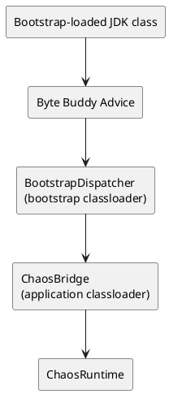

# 1. Overview

## Purpose

`chaos-agent-instrumentation-jdk` is the adapter layer between Byte Buddy’s advice model and the runtime’s normalized invocation model. Its job is to intercept selected JDK methods and translate them into calls on `ChaosRuntime`.

## Scope

In scope:

- Byte Buddy install configuration
- bootstrap bridge injection
- advice classes for supported JDK surfaces
- task wrappers used for scheduled and executor propagation

Out of scope:

- policy decisions
- configuration parsing
- diagnostics snapshot assembly

# 2. Architectural Context

This module is internal glue code. It depends on:

- `chaos-agent-api`
- `chaos-agent-core`
- Byte Buddy

It is invoked by bootstrap and calls back into the core through a bridge because several intercepted JDK types are bootstrap-loaded.

# 3. Key Concepts And Terminology

- Advice: Byte Buddy entry/exit hook bound to a JDK method
- Bootstrap bridge: minimal classes appended to the bootstrap classloader search path
- Delegate: `BridgeDelegate`, implemented by `ChaosBridge`
- Retransformation: install strategy that instruments already loaded classes where supported
- Reentrancy guard: thread-local depth counter preventing recursive self-triggering

# 4. End-to-End Behavior

For a typical intercepted method:

1. Byte Buddy advice runs at method entry or exit.
2. Advice calls `BootstrapDispatcher`.
3. Dispatcher checks the reentrancy guard.
4. Dispatcher forwards to the installed `BridgeDelegate`.
5. `ChaosBridge` calls `ChaosRuntime`.
6. The return value or thrown exception is mapped back into the intercepted method shape.

This layer therefore has to preserve method-shape fidelity. A boolean-return hook, a void pre-hook, and a return-rewriting resource lookup cannot share one generic suppression strategy.

# 5. Architecture Diagrams

## Bridge Diagram

Question answered: why does this module need a bootstrap bridge instead of calling the runtime directly?

Main takeaway: intercepted bootstrap-loaded classes cannot safely depend directly on application-classloader runtime classes, so the bridge is an explicit classloader boundary adapter.

No deployment diagram is included because this is an in-process classloader concern, not a network placement concern.

# 6. Component Breakdown

## `JdkInstrumentationInstaller`

Responsibility:

- install Byte Buddy transforms
- inject bridge classes into the bootstrap search path
- choose which JDK classes and methods are instrumented

Important design choices:

- `disableClassFormatChanges()`
- `RedefinitionStrategy.RETRANSFORMATION`
- ignore rules for `net.bytebuddy.*` and `io.macstab.chaos.*`

## `BootstrapDispatcher`

Responsibility:

- hold the volatile bridge delegate
- guard against reentrant recursion
- provide fallback values when recursion is detected

## `ChaosBridge`

Responsibility:

- adapt bridge calls to concrete `ChaosRuntime` methods

## Advice Classes

Responsibility:

- preserve intercepted method shape while invoking runtime logic

Examples:

- `ThreadAdvice`
- `ExecutorAdvice`
- `ScheduledExecutorAdvice`
- `QueueAdvice`
- `CompletableFutureAdvice`
- `ClassLoaderAdvice`
- `ShutdownAdvice`
- `ForkJoinAdvice`

# 7. Data Model And State

This module is mostly stateless. The notable mutable state is:

- `BootstrapDispatcher.delegate`
- `BootstrapDispatcher.DEPTH`

String operation names are intentionally hard-coded in advice and mapped to `OperationType` in the runtime. That means operation naming is a cross-module string contract, not a compile-time enum call at the advice site.

Wrappers created here:

- preserve session propagation for submitted tasks
- allow per-tick scheduled-task interception

# 8. Concurrency And Threading Model

Advice executes on the intercepted application thread.

Concurrency-relevant details:

- reentrancy depth is thread-local, so recursion suppression is per thread
- the bridge delegate is `volatile`, which is enough for safe publication after install
- scheduled wrappers move decision points from submission time to execution time for periodic work

The reentrancy guard is operationally important. Without it, runtime code that indirectly touches other instrumented paths could trigger recursive chaos evaluation and potentially stack overflow or distort behavior.

# 9. Error Handling And Failure Modes

## Installation Failures

- inability to write or append the bootstrap bridge jar
- missing bridge class resources
- Byte Buddy install failure

## Advice-Time Failures

Advice methods surface runtime failures according to hook shape:

- some paths propagate thrown exceptions
- some paths rewrite return values
- some paths convert failures into `IllegalStateException` wrappers inside helper wrappers

Important nuance:

- suppression semantics are constrained by the intercepted method shape
- a void pre-hook cannot always truly suppress the underlying method

This is why effect behavior must be documented at the core/runtime level, not only at the API type level.

# 10. Security Model

Instrumentation runs in a highly privileged position:

- it rewrites behavior of JDK classes in-process
- it executes before or during application code paths
- it can affect thread creation, queue behavior, completion semantics, and class/resource loading

There is no sandbox boundary inside this layer.

# 11. Performance Model

## Install-Time Cost

- class matching and retransformation
- temporary bridge jar creation
- bootstrap append operation

## Steady-State Cost

- advice dispatch overhead on every intercepted call
- wrapper allocation for submitted or scheduled tasks
- bridge dispatch and reentrancy checks

The design intentionally keeps the bridge small and the advice methods thin so the majority of decision cost remains in the core.

# 12. Observability And Operations

This module does not emit its own rich telemetry. Operational visibility is indirect through:

- runtime diagnostics
- JUL logs emitted by the core
- startup failures surfaced by bootstrap

Debugging instrumentation issues usually means checking:

- whether install succeeded
- whether the targeted method is actually instrumented
- whether the intercepted hook shape can express the desired effect semantics

# 13. Configuration Reference

This module has no independent operator-facing configuration. It is driven by:

- bootstrap installation
- runtime scenario activation

# 14. Extension Points And Compatibility Guarantees

To support a new JDK surface, changes are usually required in:

- `JdkInstrumentationInstaller`
- a new advice class
- `BridgeDelegate`
- `BootstrapDispatcher`
- `ChaosBridge`
- `ChaosRuntime`
- selector/effect and validator logic if the surface introduces new semantics

Treat all of these classes as internal. They are not stable extension APIs.

# 15. Stack Walkdown

## API Layer

Not directly relevant. This module is below the public contract surface.

## Application / Runtime Layer

Materially relevant because this module is the translation boundary between JDK calls and runtime invocation contexts.

## JVM Layer

Highly relevant. This module depends on Java instrumentation, classloading boundaries, retransformation, and method-shape-specific advice behavior.

## Memory / Concurrency Layer

Relevant for reentrancy suppression and safe delegate publication.

## OS / Container Layer

Only indirectly relevant through class retransformation and bootstrap append mechanics inside the host JVM.

## Infrastructure Layer

Not materially relevant.

# 16. References

- Reference: Java Platform SE API Specification — `java.lang.instrument`
- Reference: Java Virtual Machine Specification

