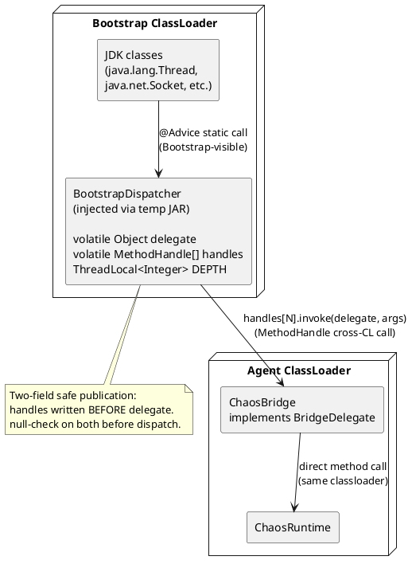
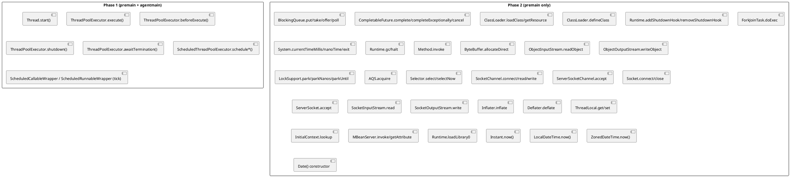

<!--
━━━━━━━━━━━━━━━━━━━━━━━━━━━━━━━━━━━━━━━━━━━━━━━━━━━━━━━━━━━━━
  Engineered by  Christian Schnapka
                 Principal+ Embedded Systems Engineer
                 Macstab GmbH · Hamburg, Germany
                 https://macstab.com
━━━━━━━━━━━━━━━━━━━━━━━━━━━━━━━━━━━━━━━━━━━━━━━━━━━━━━━━━━━━━
-->

# chaos-agent-instrumentation-jdk — Instrumentation Layer Reference

> Internal reference for the bootstrap bridge, ByteBuddy advice classes, reentrancy guard, and the 46-handle interception surface.
> 
> *Engineered by* **[Christian Schnapka](https://macstab.com)** — Principal+ Embedded Systems Engineer · [Macstab GmbH](https://macstab.com) · Hamburg, Germany

---

# 1. Overview

## Purpose

`chaos-agent-instrumentation-jdk` is the adapter between ByteBuddy's advice model and `ChaosRuntime`'s normalized dispatch API. Its responsibilities:

1. Package `BootstrapDispatcher` into a temp JAR and append it to the bootstrap classpath
2. Build a 46-slot `MethodHandle[]` array and wire it into `BootstrapDispatcher` via reflection
3. Assemble an `AgentBuilder` covering all Phase 1 and Phase 2 interception points and install it

After installation, this module has no further runtime role. All runtime execution paths go through `BootstrapDispatcher` → `ChaosBridge` → `ChaosRuntime`.

## Scope

In scope:
- `JdkInstrumentationInstaller` — entry point; orchestrates all startup steps
- `BootstrapDispatcher` — bootstrap-classloader-resident static dispatcher (46 dispatch methods + reentrancy guard)
- `BridgeDelegate` — interface defining the 46-method contract
- `ChaosBridge` — agent-classloader implementation of `BridgeDelegate`; thin delegation to `ChaosRuntime`
- All `@Advice` classes for Phase 1 and Phase 2 interception points
- `ScheduledCallableWrapper`, `ScheduledRunnableWrapper` — task wrappers for tick-level interception

Out of scope:
- Scenario policy evaluation (that is `chaos-agent-core`)
- Config loading (`chaos-agent-startup-config`)

## Non-Goals

- Dynamic advice deregistration (ByteBuddy transformations are permanent for the JVM lifetime)
- Intercepting non-JDK code paths
- Arbitrary user-defined instrumentation points

---

# 2. Engineerural Context

**Dependencies**:
- ByteBuddy (`net.bytebuddy`) for advice weaving and class transformation
- `chaos-agent-core` for `ChaosRuntime`, `OperationType`
- `chaos-agent-api` for `ChaosSelector`, `ChaosEffect`

**Called by**: `chaos-agent-bootstrap` during agent startup; specifically `ChaosAgentBootstrap` calls `JdkInstrumentationInstaller.install()`.

**The classloader problem**: JDK classes are loaded by the bootstrap classloader. Advice woven into JDK methods executes in whatever classloader loaded the JDK class — the bootstrap classloader, which cannot see agent-classloader classes by name. The bootstrap bridge solves this by placing `BootstrapDispatcher` in the bootstrap classpath so JDK-loaded advice can call it as a static method, then routing to agent-classloader code via `MethodHandle`.

---

# 3. Key Concepts and Terminology

| Term | Definition |
|------|-----------|
| **Bootstrap classloader** | The JVM root classloader; loads `java.*`, `javax.*`. Has no parent. Can only see classes from `rt.jar`/`java.base` and explicitly appended JARs. |
| **Agent classloader** | The classloader created for the agent JAR. Has the bootstrap classloader as parent (indirect). Can see all agent classes. |
| **Advice class** | A ByteBuddy concept: a class containing `@Advice.OnMethodEnter` and/or `@Advice.OnMethodExit` static methods, whose bytecode is inlined into the instrumented method. Not a real class instantiation at runtime — the advice body is copied as bytecode. |
| **BootstrapDispatcher** | A class that must be visible to the bootstrap classloader. Provides 46 static dispatch methods called from advice. |
| **BridgeDelegate** | Interface in the agent classloader defining the 46-method contract. Implemented by `ChaosBridge`. |
| **MethodHandle** | A typed reference to a method, invokable across classloader boundaries. Built from the agent classloader; stored in `BootstrapDispatcher.handles[]`. |
| **DEPTH guard** | `ThreadLocal<Integer>` in `BootstrapDispatcher`. Prevents infinite recursion when chaos code calls instrumented JDK methods. |
| **Phase 1** | Instrumentation installed in both premain and agentmain: `ThreadPoolExecutor`, `Thread`, `ScheduledThreadPoolExecutor`. |
| **Phase 2** | Instrumentation installed in premain only: all bootstrap-loaded JDK classes requiring retransformation. |
| **Retransformation** | Replacing the bytecode of an already-loaded class. Requires `Can-Retransform-Classes: true` in the agent manifest and premain-mode attachment. |

---

# 4. End-to-End Behavior

## Agent Startup Sequence

```
JdkInstrumentationInstaller.install(instrumentation, runtime, premainMode)
  ↓
1. injectBridge(instrumentation)
   — Read BootstrapDispatcher.class bytes from agent JAR resources
   — Read BootstrapDispatcher$ThrowingSupplier.class bytes
   — Write both into temp JAR at java.io.tmpdir
   — Register temp file for deleteOnExit()
   — instrumentation.appendToBootstrapClassLoaderSearch(new JarFile(tempJar))
   → BootstrapDispatcher is now visible to bootstrap classloader

2. installDelegate(new ChaosBridge(runtime))
   — buildMethodHandles(): 46 MethodHandle[] via MethodHandles.publicLookup() against BridgeDelegate
   — Class.forName("...BootstrapDispatcher", true, null)  // null CL = bootstrap CL
   — bootstrapDispatcherClass.getMethod("install", Object.class, MethodHandle[].class)
                              .invoke(null, bridgeDelegate, mh)
   → handles written before delegate (two-field safe publication)

3. AgentBuilder construction
   — Phase 1: ThreadPoolExecutor, Thread, ScheduledThreadPoolExecutor (always)
   — Phase 2: System, Runtime, LockSupport, AQS, NIO, Socket, BlockingQueue,
             CompletableFuture, ClassLoader, etc. (premainMode only)

4. agentBuilder.installOn(instrumentation)
   — RETRANSFORMATION strategy: retransforms already-loaded JDK classes
   — disableClassFormatChanges(): no structural changes; only adds advice bytecode inline
   — Error listener: logs warnings on per-class transformation failure; does not abort
```

## Per-Call Dispatch (hot path)

```
Instrumented method fires @Advice.OnMethodEnter
  ↓
Advice calls BootstrapDispatcher.someDispatchMethod(...)  [static call, visible from bootstrap CL]
  ↓
BootstrapDispatcher.invoke(supplier, fallback):
  if (DEPTH.get() > 0):
    return fallback    // reentrancy: return safe default immediately
  DEPTH.set(DEPTH.get() + 1)
  try:
    snapshot: MethodHandle[] h = handles; Object d = delegate;
    if (d == null || h == null): return fallback   // not yet installed
    return h[SLOT_INDEX].invoke(d, ...args...)     // ChaosBridge.method(args)
      → ChaosRuntime.method(args)
  catch Throwable t:
    sneakyThrow(t)         // rethrow without checked-exception wrapping
    return fallback        // unreachable, but satisfies compiler
  finally:
    int next = DEPTH.get() - 1;
    if (next == 0): DEPTH.remove()    // ThreadLocal cleanup for pooled threads
    else: DEPTH.set(next)
```

## ThreadLocal Reentrancy Special Case

`ThreadLocal.get()` and `ThreadLocal.set()` are globally instrumented in Phase 2. The DEPTH guard itself uses `DEPTH.get()`, which is a `ThreadLocal.get()` call. Without a special check, this would create infinite recursion: `ThreadLocal.get()` → advice → `BootstrapDispatcher.beforeThreadLocalGet()` → `invoke()` → `DEPTH.get()` → `ThreadLocal.get()` → ...

The special case in `ThreadLocalGetAdvice.onEnter()`:
```java
if (threadLocal == BootstrapDispatcher.depthThreadLocal()) return false;
```

This identity check fires before any delegation. When `DEPTH` reads itself, the advice detects `threadLocal == DEPTH` and skips the dispatch, returning `false` (no suppression). This is the only place in the entire codebase where `BootstrapDispatcher.depthThreadLocal()` is called externally.

---

# 5. Engineerure Diagrams

## Bootstrap Bridge Engineerure



**Takeaway**: The only crossing of the classloader boundary is via `MethodHandle.invoke()`. No class cast is performed across classloaders. Type erasure (`Object` typed parameters) absorbs the type mismatch.

## Phase 1 vs Phase 2 Interception Map



---

# 6. Component Breakdown

## JdkInstrumentationInstaller

**Responsibility**: One-time setup of the entire instrumentation stack. Stateless; `install()` is called once from a single thread.

**`injectBridge()`**: Reads class bytecode from the agent JAR's own classloader resources (the `.class` files are in the same JAR). Writes verbatim into a temp JAR. This ensures the bootstrap-injected class is byte-for-byte identical to the agent-classloader version — there is no separate bootstrap-dispatcher source; it is one class compiled once and loaded twice into different classloaders.

**`buildMethodHandles()`**: Uses `MethodHandles.publicLookup()` against `BridgeDelegate.class`. Public lookup is required because the bootstrap classloader must be able to invoke the handles; a full-access lookup with the agent classloader's module system would not be reachable from the bootstrap context. Each handle is a virtual method handle; when invoked with `delegate` as the first argument, it dispatches to the `ChaosBridge` implementation. The array has exactly 46 slots (indices 0–45); see §7 for the full slot table.

**`installDelegate()`**: Uses `Class.forName("...BootstrapDispatcher", true, null)` — the `null` classloader argument requests loading from the bootstrap classloader, ensuring the instance obtained is the bootstrap-classloader version, not the agent-classloader version. Reflective invocation of `install()` crosses the classloader boundary without sharing type references.

**`instrumentOptional()`**: Before registering a ByteBuddy type matcher for optional JDK classes (e.g., `javax.naming.InitialContext`, `javax.management.MBeanServer`), attempts `Class.forName(typeName, false, systemClassLoader)`. If absent, logs at FINE and skips the transformation. This prevents agent startup failure in environments where these classes are not on the classpath.

**`AgentBuilder` configuration**:
- `disableClassFormatChanges()`: prevents ByteBuddy from adding fields or changing the constant pool structure — required for retransformation
- `RedefinitionStrategy.RETRANSFORMATION`: allows transforming already-loaded classes; required for Phase 2 JDK classes that are loaded before the agent
- `ignore(nameStartsWith("net.bytebuddy.") or nameStartsWith("com.macstab.chaos."))`: prevents self-instrumentation of the agent and ByteBuddy itself

## BootstrapDispatcher

46 public static dispatch methods, each:
1. Constructs a `ThrowingSupplier<T>` lambda that snapshot-reads `handles` and `delegate` into locals
2. Calls `invoke(supplier, fallback)`
3. Returns the result or re-throws the exception

The snapshot-read pattern (`final MethodHandle[] h = handles; final Object d = delegate;`) is required because `handles` and `delegate` are separate `volatile` fields. Reading them in two separate reads could theoretically see a stale value for one but not the other if reads were not ordered. The safe publication protocol (handles written before delegate) guarantees that if `d != null` is observed, `h != null` is also guaranteed to be visible. The local snapshot prevents a second read from seeing a reset (though in practice `install()` is called once and never reset).

**DEPTH cleanup**: When `DEPTH` returns to 0, `DEPTH.remove()` releases the `ThreadLocal` entry. This is critical for thread pools: without removal, the `ThreadLocal` entry would persist on the pooled thread and accumulate garbage. `remove()` is called in the `finally` block, so it runs even if the supplier throws.

## ChaosBridge

Thin delegation layer. Every method is a one-line call to the corresponding `ChaosRuntime` method. No logic. Exists to:
1. Provide a concrete implementation of `BridgeDelegate` in the agent classloader
2. Decouple `BootstrapDispatcher` from the `ChaosRuntime` class directly (the bridge interface is the stable contract)

## Advice Classes

Each advice class is a static inner class following ByteBuddy's advice pattern:

```java
// Void dispatch (typical Phase 1):
public static class BeforeExecuteAdvice {
    @Advice.OnMethodEnter(suppress = Throwable.class)
    public static void onEnter(
        @Advice.This Object executor,
        @Advice.Argument(0) Thread worker,
        @Advice.Argument(1) Runnable task) throws Throwable {
        BootstrapDispatcher.beforeWorkerRun(executor, worker, task);
    }
}

// Value-returning dispatch (executor decoration):
public static class ExecuteAdvice {
    @Advice.OnMethodEnter(suppress = Throwable.class)
    public static Runnable onEnter(
        @Advice.This ThreadPoolExecutor executor,
        @Advice.Argument(value = 0, readOnly = false) Runnable task) throws Throwable {
        return BootstrapDispatcher.decorateExecutorRunnable("execute", executor, task);
    }
    @Advice.OnMethodEnter // argument assignment
    // task is reassigned to the decorated runnable
}
```

**`suppress = Throwable.class`**: When present, exceptions thrown from the advice are caught and logged (not propagated). Used on advice methods that should never abort the instrumented method due to agent errors.

**Exception-injecting advice** (e.g., `ExitRequestAdvice`): Does NOT use `suppress = Throwable.class` because it intentionally allows injected exceptions to propagate.

**Return-value rewriting advice** (e.g., `ClockMillisAdvice`): Uses `@Advice.OnMethodExit` with `@Advice.Return(readOnly = false)` to overwrite the return value. `ClockMillisAdvice` and `ClockNanosAdvice` are defined but cannot be woven into `java.lang.System.currentTimeMillis()` / `nanoTime()` due to the JVM limitation documented in §12 (Limitation 1). They remain available for instrumentation of non-bootstrap native methods in future releases.

**Skip-on advice** (e.g., `GcRequestAdvice`, `NioSelectNoArgAdvice`): Uses `@Advice.OnMethodEnter(skipOn = Advice.OnNonDefaultValue.class)` — if the advice method returns a non-default value (non-zero, non-null, non-false), ByteBuddy skips the actual method body. This is the mechanism for suppressing `System.gc()` and `Selector.select()`.

## ScheduledCallableWrapper / ScheduledRunnableWrapper

These wrappers are inserted around tasks submitted to `ScheduledThreadPoolExecutor`. When the task's timer fires, the wrapper calls `BootstrapDispatcher.beforeScheduledTick(executor, task, periodic)` before delegating to the original task. This enables per-tick interception (delay, suppress) distinct from the submit-time interception.

If `beforeScheduledTick()` returns `false` (SUPPRESS), the wrapper does not call the original task — the tick is silently dropped. If `beforeScheduledTick()` throws, the exception propagates to the `ScheduledExecutorService`'s uncaught-exception handler.

If the bridge is not installed (`BootstrapDispatcher.handles == null`), the wrapper delegates directly to the original task without any chaos processing — safe fallback for test environments where the agent is partially installed.

---

# 7. The 46 Interception Handles

| Index | Constant | JDK method(s) intercepted | Direction |
|-------|----------|--------------------------|-----------|
| 0 | `DECORATE_EXECUTOR_RUNNABLE` | `ThreadPoolExecutor.execute(Runnable)` | return-value decoration |
| 1 | `DECORATE_EXECUTOR_CALLABLE` | `ThreadPoolExecutor.submit(Callable)` | return-value decoration |
| 2 | `BEFORE_THREAD_START` | `Thread.start()` | enter |
| 3 | `BEFORE_WORKER_RUN` | `ThreadPoolExecutor.beforeExecute(Thread, Runnable)` | enter |
| 4 | `BEFORE_FORK_JOIN_TASK_RUN` | `ForkJoinTask.doExec()` | enter |
| 5 | `ADJUST_SCHEDULE_DELAY` | `ScheduledThreadPoolExecutor.schedule*(...)` | delay argument rewrite |
| 6 | `BEFORE_SCHEDULED_TICK` | `ScheduledCallableWrapper.call()`, `ScheduledRunnableWrapper.run()` | boolean skip |
| 7 | `BEFORE_QUEUE_OPERATION` | `BlockingQueue.put()`, `take()` | enter (void) |
| 8 | `BEFORE_BOOLEAN_QUEUE_OPERATION` | `BlockingQueue.offer()`, `poll()` | enter (Boolean skip) |
| 9 | `BEFORE_COMPLETABLE_FUTURE_COMPLETE` | `CompletableFuture.complete()`, `completeExceptionally()` | Boolean skip |
| 10 | `BEFORE_CLASS_LOAD` | `ClassLoader.loadClass(String)`, `loadClass(String, boolean)` | enter |
| 11 | `AFTER_RESOURCE_LOOKUP` | `ClassLoader.getResource(String)` | exit (URL rewrite) |
| 12 | `DECORATE_SHUTDOWN_HOOK` | `Runtime.addShutdownHook(Thread)` | argument decoration |
| 13 | `RESOLVE_SHUTDOWN_HOOK` | `Runtime.removeShutdownHook(Thread)` | argument rewrite |
| 14 | `BEFORE_EXECUTOR_SHUTDOWN` | `ThreadPoolExecutor.shutdown()`, `awaitTermination(...)` | enter |
| 15 | `ADJUST_CLOCK_MILLIS` | `System.currentTimeMillis()` | exit (long rewrite) |
| 16 | `ADJUST_CLOCK_NANOS` | `System.nanoTime()` | exit (long rewrite) |
| 17 | `BEFORE_GC_REQUEST` | `Runtime.gc()` | enter (boolean skip) |
| 18 | `BEFORE_EXIT_REQUEST` | `System.exit(int)`, `Runtime.halt(int)` | enter |
| 19 | `BEFORE_REFLECTION_INVOKE` | `Method.invoke(Object, Object[])` | enter |
| 20 | `BEFORE_DIRECT_BUFFER_ALLOCATE` | `ByteBuffer.allocateDirect(int)` | enter |
| 21 | `BEFORE_OBJECT_DESERIALIZE` | `ObjectInputStream.readObject()` | enter |
| 22 | `BEFORE_CLASS_DEFINE` | `ClassLoader.defineClass(String, ...)` | enter |
| 23 | `BEFORE_MONITOR_ENTER` | `AbstractQueuedSynchronizer.acquire(int)` | enter |
| 24 | `BEFORE_THREAD_PARK` | `LockSupport.park(Object)`, `parkNanos(...)`, `parkUntil(...)` | enter |
| 25 | `BEFORE_NIO_SELECT` | `AbstractSelector.select()`, `select(long)`, `selectNow()` | enter (boolean skip) |
| 26 | `BEFORE_NIO_CHANNEL_OP` | `SocketChannel.connect/read/write`, `ServerSocketChannel.accept` | enter |
| 27 | `BEFORE_SOCKET_CONNECT` | `Socket.connect(SocketAddress, int)` | enter |
| 28 | `BEFORE_SOCKET_ACCEPT` | `ServerSocket.accept()` | enter |
| 29 | `BEFORE_SOCKET_READ` | `SocketInputStream.read(...)` | enter |
| 30 | `BEFORE_SOCKET_WRITE` | `SocketOutputStream.write(...)` | enter |
| 31 | `BEFORE_SOCKET_CLOSE` | `Socket.close()` | enter |
| 32 | `BEFORE_JNDI_LOOKUP` | `InitialContext.lookup(String)` | enter |
| 33 | `BEFORE_OBJECT_SERIALIZE` | `ObjectOutputStream.writeObject(Object)` | enter |
| 34 | `BEFORE_NATIVE_LIBRARY_LOAD` | `Runtime.loadLibrary0(ClassLoader, String)` | enter |
| 35 | `BEFORE_ASYNC_CANCEL` | `CompletableFuture.cancel(boolean)` | enter (boolean skip) |
| 36 | `BEFORE_ZIP_INFLATE` | `Inflater.inflate(...)` | enter |
| 37 | `BEFORE_ZIP_DEFLATE` | `Deflater.deflate(...)` | enter |
| 38 | `BEFORE_THREAD_LOCAL_GET` | `ThreadLocal.get()` | enter (boolean skip) |
| 39 | `BEFORE_THREAD_LOCAL_SET` | `ThreadLocal.set(Object)` | enter (boolean skip) |
| 40 | `BEFORE_JMX_INVOKE` | `MBeanServer.invoke(ObjectName, String, Object[], String[])` | enter |
| 41 | `BEFORE_JMX_GET_ATTR` | `MBeanServer.getAttribute(ObjectName, String)` | enter |
| 42 | `ADJUST_INSTANT_NOW` | `Instant.now()` (no-arg static) | exit (`Instant` rewrite) |
| 43 | `ADJUST_LOCAL_DATE_TIME_NOW` | `LocalDateTime.now()` (no-arg static) | exit (`LocalDateTime` rewrite) |
| 44 | `ADJUST_ZONED_DATE_TIME_NOW` | `ZonedDateTime.now()` (no-arg static) | exit (`ZonedDateTime` rewrite) |
| 45 | `ADJUST_DATE_NEW` | `Date()` (no-arg constructor) | exit (embedded millis rewrite via `setTime`) |

---

## 7a. Higher-Level Java Time API Interception (slots 42–45)

The four handles added in slots 42–45 address a specific gap: application code that reads wall-clock time through `java.time` or `java.util.Date` rather than calling `System.currentTimeMillis()` directly. Direct interception of `currentTimeMillis()` and `nanoTime()` is blocked by the JVM constraints documented in §12 (Limitation 1). The higher-level APIs are free of both constraints — they are ordinary Java methods with no `native` modifier and no `@IntrinsicCandidate` annotation — so they can be woven at exit with `@Advice.OnMethodExit`.

### Why each target is instrumentable

**`java.time.Instant.now()` (slot 42)** — A pure Java static method in `java.time.Instant`. It delegates to `Clock.systemUTC().instant()`, which in turn eventually reaches `System.currentTimeMillis()` deep in the JDK. The top-level `now()` method itself carries no special JVM treatment: no `native`, no `@IntrinsicCandidate`. ByteBuddy can weave an `@OnMethodExit` that snapshot-reads the returned `Instant` and passes it to `BootstrapDispatcher.adjustInstantNow()`.

**`java.time.LocalDateTime.now()` (slot 43)** — Same family. The no-argument variant delegates to `Clock.systemDefaultZone().instant()` and then converts to local time via the system zone. No JVM restriction blocks exit-advice weaving.

**`java.time.ZonedDateTime.now()` (slot 44)** — Identical reasoning. The no-argument variant reads the system clock and attaches the system default zone. Zone identity is captured from the real return value before skewing and reattached after — see below for the preservation guarantee.

**`java.util.Date()` no-arg constructor (slot 45)** — `Date()` calls `System.currentTimeMillis()` internally to seed `this.fastTime`. Unlike the `java.time` methods, `Date()` is a constructor: it has no return value to rewrite. Instead, `DateNewAdvice` uses `@Advice.OnMethodExit` with `@Advice.This` to obtain the freshly-constructed `Date` instance, reads its time via `getTime()`, passes it to `BootstrapDispatcher.adjustDateNew()`, and if the adjusted value differs, calls `setTime(adjusted)` to overwrite the embedded field.

### The `DateNewAdvice` ClassCircularityError edge case

`@Advice.This` in a constructor exit advice must be typed to bind the constructed object. The naive type is `java.util.Date`. However, `java.util.Date` is referenced eagerly by `java.util.logging.SimpleFormatter`: the logger formatter instantiates a `Date` when formatting log records. During agent `premain`, logging fires while class loading is still being bootstrapped. If an advice class references `java.util.Date` directly in its signature, the JVM may attempt to load `Date` as part of verifying the advice bytecode at a point when `Date`'s own class initialization is in progress — triggering a `ClassCircularityError`.

The fix is to type `@Advice.This` as `Object` and insert an internal cast inside the advice body:

```java
static final class DateNewAdvice {
    @Advice.OnMethodExit
    static void exit(@Advice.This final Object self) throws Throwable {
        final java.util.Date date = (java.util.Date) self;
        final long realMillis = date.getTime();
        final long adjusted = BootstrapDispatcher.adjustDateNew(realMillis);
        if (adjusted != realMillis) {
            date.setTime(adjusted);
        }
    }
}
```

The cast to `java.util.Date` happens at runtime inside the advice body — not in the method descriptor. By the time the advice body executes, `Date` is fully loaded and the cast is safe. The JVM verifier never needs to resolve `java.util.Date` from the advice method signature.

### Zone metadata preservation for `ZonedDateTime`

When `ZonedDateTimeNowAdvice` rewrites the returned value, the implementation in `ChaosRuntime.adjustZonedDateTimeNow()` does not simply add milliseconds to the `ZonedDateTime`. Instead:

1. Extract the epoch-millisecond value: `realValue.toInstant().toEpochMilli()`
2. Pass it through `applyClockSkew()` to get the skewed millisecond value
3. Reconstruct via `Instant.ofEpochMilli(skewed).atZone(realValue.getZone())`

Step 3 explicitly carries the original `ZoneId` into the result. The zone is never lost or replaced with the system default. A test in `ClockSkewRuntimeTest$HigherLevelTimeApis` ("`adjustZonedDateTimeNowShiftsAndPreservesZone`") verifies that a `ZonedDateTime` in `America/New_York` retains that zone identity after skewing.

### Nanosecond sub-millisecond precision for `Instant`

`Instant` carries both an epoch-second count and a nanosecond-of-second field. The millisecond resolution of `applyClockSkew()` could, in principle, destroy the sub-millisecond nanosecond component if the implementation reconstructed the `Instant` from scratch. `ChaosRuntime.adjustInstantNow()` avoids this by applying the skew as a delta via `Instant.plusMillis(delta)`:

```java
final long realMillis = realInstant.toEpochMilli();
final long skewed = applyClockSkew(realMillis, OperationType.INSTANT_NOW);
final long delta = skewed - realMillis;
return delta == 0L ? realInstant : realInstant.plusMillis(delta);
```

`Instant.plusMillis()` adds exactly the specified number of milliseconds (converted to seconds + nanoseconds internally) without touching the existing nanosecond-of-second remainder. A test in `ClockSkewRuntimeTest$HigherLevelTimeApis` ("`adjustInstantNowShiftsWhenActive`") constructs a real `Instant` with a 123 456 789 ns nanosecond field and asserts that `adjusted.getNano() % 1_000_000 == real.getNano() % 1_000_000` after a 30-second fixed skew.

---

# 8. Concurrency and Threading Model

The dispatcher itself has no mutable per-call state. The two `volatile` fields (`handles`, `delegate`) are written once at startup and never reset. All dispatch methods are re-entrant provided the DEPTH guard is functioning.

**DEPTH ThreadLocal lifecycle**:
- Set to 1 at the start of the outermost `invoke()` call on the current thread
- Incremented if a nested `invoke()` fires (which returns the fallback without recursing)
- Decremented in `finally`
- `.remove()`d when it returns to 0

**Memory leak risk**: If a thread is interrupted or killed between `DEPTH.set(1)` and `DEPTH.remove()`, the `ThreadLocal` entry persists on the thread. This is benign for threads that terminate (the entry is GC'd with the thread), but for long-lived pooled threads that do not recycle, the entry persists. The `finally` block ensures removal under normal conditions, including exceptions.

**`MethodHandle.invoke()` and JIT**: After sufficient warm-up (~thousands of calls), the JIT inlines `MethodHandle.invoke()` through the `ChaosBridge` delegation into `ChaosRuntime`. The virtual dispatch overhead disappears. Pre-JIT, the cost is ~10–20 ns for the handle invocation itself.

---

# 9. Error Handling and Failure Modes

## Advice Transformation Failure

`AgentBuilder.Listener.Adapter.onError()` logs a `WARNING` for any class that fails transformation. The `AgentBuilder` continues with other classes — a single transformation failure does not abort agent startup. The affected class simply has no chaos advice installed.

## Bridge Injection Failure

`injectBridge()` throws `IllegalStateException` wrapping the `IOException` if:
- The temp JAR cannot be created (disk full, permissions)
- A required class resource is missing from the agent JAR
- `appendToBootstrapClassLoaderSearch()` fails

This is a fatal startup failure; the agent cannot operate without the bootstrap bridge.

## MethodHandle Construction Failure

`buildMethodHandles()` throws `Exception` if any method is not found on `BridgeDelegate`. This would indicate a mismatch between the handle index constants in `BootstrapDispatcher` and the methods on `BridgeDelegate`. This should never happen in a correctly built artifact but would be caught immediately at startup.

## Missing Optional Classes

`instrumentOptional()` silently skips JNDI, JMX, and native library instrumentation if the target class is absent. The agent logs at FINE. The affected operation types will never trigger chaos even if scenarios targeting them are registered.

---

# 10. Security Model

The instrumentation layer has two potential security implications:

1. **Bootstrap classpath extension**: `appendToBootstrapClassLoaderSearch()` makes `BootstrapDispatcher` visible system-wide. The class itself contains no security-relevant logic; it only routes calls. If an attacker can replace the temp JAR before the JVM reads it (TOCTOU), they could inject arbitrary bootstrap code. The temp file is created with `Files.createTempFile()` which uses secure-random-suffix naming and restrictive OS permissions on most platforms.

2. **`Class.forName(null)` for bridge wiring**: Resolving `BootstrapDispatcher` from the bootstrap classloader ensures the correct (agent-injected) version is obtained. A hostile class with the same name injected earlier into the bootstrap classpath would be used instead. This is a known risk of the bootstrap injection pattern; mitigated by the temp JAR being created and appended in the same startup call sequence.

---

# 11. Performance Model

## Advice Overhead (no matching scenario)

When `ScenarioRegistry.controllers` is empty:
- Advice fires: ~2–5 ns (advice bytecode inlined into method)
- `BootstrapDispatcher.invoke()`: `DEPTH.get()` (1 ThreadLocal read) + null-check of `delegate` → returns fallback
- Total additional overhead per intercepted method call: ~5–15 ns

## Advice Overhead (with scenarios)

See [overall-agent.md §11] for full hot-path cost breakdown.

## Retransformation Cost at Startup

`AgentBuilder.installOn(instrumentation)` with `RETRANSFORMATION` strategy triggers bytecode rewriting of every matched JDK class. This is a one-time cost at JVM startup, proportional to the number of instrumented classes and their method counts. Expected range: 50–500 ms for the full Phase 2 instrumentation suite on JDK 21. This adds to JVM startup time but has no ongoing cost.

---

# 12. Known Limitations

1. **`System.currentTimeMillis()` and `System.nanoTime()` cannot be intercepted** — Two
   independent JVM constraints block every known approach via a standard `-javaagent:` agent:

   *Constraint A — Retransformation cannot add methods or change native modifiers.*
   JVMTI `SetNativeMethodPrefix` works by transforming a native method into a Java wrapper that
   delegates to the renamed native (e.g. `$chaos$currentTimeMillis`). This requires:
   (a) adding a new native method to the class, and
   (b) removing the `native` modifier from the original method.
   Both operations are prohibited by the JVM specification for retransformation of already-loaded
   classes (`Instrumentation.retransformClasses` restrictions). `java.lang.System` is initialised
   before `premain` runs; class-load-time interception is therefore unavailable.

   *Constraint B — `@IntrinsicCandidate` JIT bypass.*
   HotSpot C2 recognises `java.lang.System.currentTimeMillis` / `nanoTime` by class+method name
   and replaces the callsite with a direct `RDTSC` / `MRS CNTVCT_EL0` hardware read after
   ~10 000 invocations, bypassing any Java-level wrapper that might exist.

   **Investigation result**: a second `AgentBuilder` with `enableNativeMethodPrefix("$chaos$")`
   and `RETRANSFORMATION` was tested empirically. ByteBuddy fires a TRANSFORM event for
   `java.lang.System` but the JVM silently retains the original native binding;
   `currentTimeMillis()` remains native. No error is surfaced. This is a hard JVM limitation.
   Workarounds (e.g. `-Xpatch:java.base`, a C-level JVMTI agent) are out of scope.

   **Clock skew works via two supported paths:**
   - Code explicitly wired through `BootstrapDispatcher.adjustClockMillis` / `adjustClockNanos`.
   - `java.time.Instant.now()`, `LocalDateTime.now()`, `ZonedDateTime.now()`, and `new java.util.Date()` — all four are non-native Java members woven at exit in the Phase 2 block. See §7a for implementation details including the `DateNewAdvice` `ClassCircularityError` edge case and the nanosecond-precision preservation guarantee for `Instant`.

2. **Agentmain Phase 2 not available**: Dynamic attach (`agentmain`) cannot retransform bootstrap-loaded classes that were loaded before the agent attached. Phase 2 interception points (sockets, NIO, LockSupport, etc.) require premain attachment.

3. **Native method wrapping for other bootstrap classes**: The `disableClassFormatChanges()`
   restriction in the primary `AgentBuilder` prevents ByteBuddy from creating native method
   wrappers. `Runtime.gc()` is intercepted via `@OnMethodEnter` (before the native call) which
   does not require adding methods. Return-value interception for native methods remains blocked.

4. **`AbstractSelector` subtypes**: NIO `Selector.select()` is instrumented on subtypes of `AbstractSelector` (e.g., `KQueueSelectorImpl` on macOS, `EPollSelectorImpl` on Linux). These are platform-specific classes loaded lazily at first `Selector.open()` call. If `Selector.open()` is called before the agent attaches (agentmain), the platform selector class may not be instrumented.

5. **Metaspace reclamation**: `MetaspacePressureStressor` defines classes into an isolated classloader. On `close()`, the classloader reference is dropped. Metaspace reclamation depends on GC cycle + classloader finalization. This may be slow on JVMs with G1/ZGC under low GC pressure.

---

# 13. References

- Reference: Byte Buddy — `AgentBuilder`, `@Advice`, `RedefinitionStrategy`, `disableClassFormatChanges()` — https://bytebuddy.net/#/tutorial
- Reference: `java.lang.instrument.Instrumentation` — `appendToBootstrapClassLoaderSearch`, `retransformClasses`, manifest attributes — https://docs.oracle.com/en/java/docs/api/java.instrument/java/lang/instrument/Instrumentation.html
- Reference: Java SE API — `java.lang.invoke.MethodHandles.Lookup`, `MethodHandle.invoke()` — https://docs.oracle.com/en/java/docs/api/java.base/java/lang/invoke/MethodHandle.html
- Reference: JVMS §5.3 — Classloader delegation model and bootstrap classloader visibility — https://docs.oracle.com/javase/specs/jvms/se21/html/jvms-5.html#jvms-5.3
- Reference: JVMS §6.5 opcodes — `invokevirtual`, `invokestatic`, `invokedynamic`, `monitorenter` — https://docs.oracle.com/javase/specs/jvms/se21/html/jvms-6.html
- Reference: JVMTI §11.2.2 — `RetransformClasses` class-format-change restrictions — https://docs.oracle.com/en/java/docs/api/java.instrument/module-summary.html
- Reference: JDK-8029999 — `@IntrinsicCandidate`; JIT inlining of `currentTimeMillis`, `nanoTime` bypasses advice — https://bugs.openjdk.org/browse/JDK-8029999
- Reference: JEP 444 — Virtual Threads; virtual-thread pinning under `synchronized` vs. AQS — https://openjdk.org/jeps/444
- Reference: JSR-133 §17.4.5 — Volatile write/read ordering and happens-before — https://jcp.org/aboutJava/communityprocess/mrel/jsr133/index.html
- Reference: Intel® SDM Vol. 3 — `MFENCE`, `LOCK XCHG` (x86-64 volatile write fence) — https://www.intel.com/content/www/us/en/developer/articles/technical/intel-sdm.html
- Reference: ARM Engineerure Reference Manual — `STLR` Store-Release, `LDAR` Load-Acquire for AArch64 volatile semantics — https://developer.arm.com/documentation/ddi0487/latest
- Reference: Linux `futex(2)` — underlying park/unpark and synchronized inflation mechanism — https://man7.org/linux/man-pages/man2/futex.2.html

---

<div align="center">

*Engineerure, implementation, and documentation crafted by*

**[Christian Schnapka](https://macstab.com)**  
Principal+ Embedded Systems Engineer  
[Macstab GmbH](https://macstab.com) · Hamburg, Germany

*Building systems that operate correctly at the edges — including the ones you deliberately break.*

</div>
