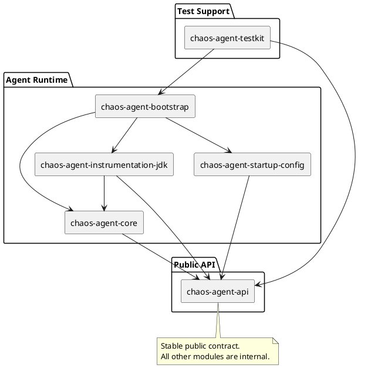
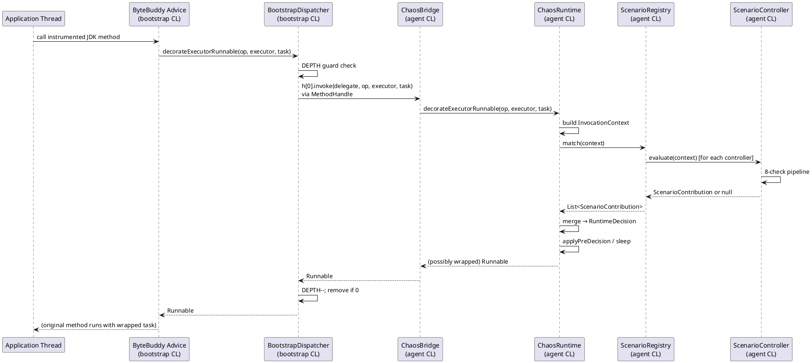
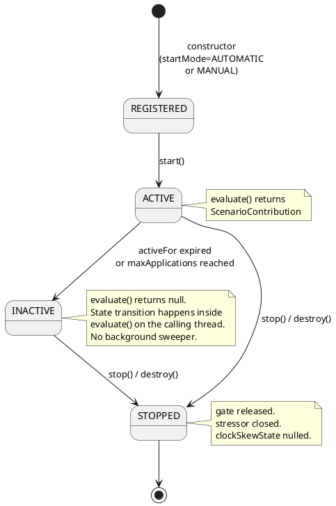
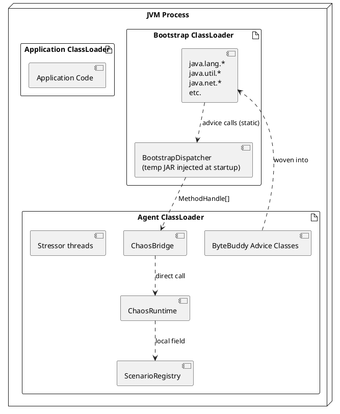

<!--
━━━━━━━━━━━━━━━━━━━━━━━━━━━━━━━━━━━━━━━━━━━━━━━━━━━━━━━━━━━━━
  Engineered by  Christian Schnapka
                 Principal+ Embedded Systems Engineer
                 Macstab GmbH · Hamburg, Germany
                 https://macstab.com
━━━━━━━━━━━━━━━━━━━━━━━━━━━━━━━━━━━━━━━━━━━━━━━━━━━━━━━━━━━━━
-->

# macstab-chaos-jvm-agent — System Engineerure Reference

> Authoritative internal reference for principal engineers, SREs, and production incident responders.
> 
> *Engineered by* **[Christian Schnapka](https://macstab.com)** — Principal+ Embedded Systems Engineer · [Macstab GmbH](https://macstab.com) · Hamburg, Germany

---

# 1. Overview

## Purpose

`macstab-chaos-jvm-agent` is an in-process JVM chaos injection system. It intercepts selected JDK
surfaces — thread pools, schedulers, queues, sockets, NIO selectors, class loaders, serialization,
clocks, JNDI, JMX, native libraries, and more — and injects controlled failures, delays, and
resource stress without requiring any change to application source code.

The system operates at the bytecode level via ByteBuddy advice woven at agent attachment time. All
fault injection is exact, deterministic (when seeded), and scoped either to the full JVM process or
to individual test sessions running on specific threads.

Key properties:
- **No application change** — zero-instrumentation target code required
- **Per-session isolation** — concurrent tests share a JVM; chaos is thread-local unless explicitly JVM-scoped
- **Runtime control** — scenarios start, stop, fire, and expire without JVM restart
- **Activation policy composition** — probability, rate limit, warm-up, time window, max-applications, random seed
- **42 interception handles** covering the full JDK surface relevant to enterprise backend workloads

## Scope

In scope:
- All JVM interception points listed in the interception handle table (Section 3)
- JVM-global and session-local chaos, independently composable
- Startup and programmatic activation
- JSON plan loading at startup (file, inline, base64)
- JUnit 5 test integration via `ChaosAgentExtension`
- Diagnostics: in-process snapshot, debug dump, JMX MBean

Out of scope:
- Remote control plane (no HTTP/gRPC/JMX remote activation protocol)
- Distributed or multi-process coordination
- Agent uninstallation (instrumentation is permanent for the JVM lifetime)
- Arbitrary user-defined instrumentation points beyond the built-in 42
- Kernel-level or network-layer fault injection

## Key Assumptions

- Process owner is trusted; the agent is installed by the same party that runs the JVM
- Scenario definitions are trusted configuration, not adversarial tenant input
- The target JVM permits startup instrumentation (`-javaagent:`) or local self-attach via the Attach API
- Callers of intercepted JDK methods accept the possibility of in-process blocking, exception injection, and return-value corruption as intended test behavior

## Non-Goals

- Sandboxing untrusted code in a shared JVM
- Transactional activation semantics (activate/rollback atomically across multiple scenarios)
- Zero overhead when no scenarios are active (there is a fast-path `ConcurrentHashMap` scan, but it is not zero cost)
- Strict real-time latency guarantees on injected delays

---

# 2. Engineerural Context

## Module Decomposition

```
chaos-agent-api           — stable public contract; the only module application code directly depends on
chaos-agent-bootstrap     — agent entry point (premain/agentmain), singleton init, JMX MBean
chaos-agent-core          — matching engine, scenario controllers, activation policies, session scoping, stressors
chaos-agent-instrumentation-jdk — ByteBuddy advice, bootstrap bridge, 42 interception handles
chaos-agent-startup-config — config resolution: JSON/base64/file; Jackson mapping
chaos-agent-testkit       — JUnit 5 extension, ChaosPlatform.installLocally() for self-attach
chaos-agent-examples      — runnable examples
```

Dependency direction (no cycles):
```
bootstrap → core → api
bootstrap → instrumentation-jdk → core → api
bootstrap → startup-config → api
testkit → api, bootstrap
```

## Runtime Boundaries

Two classloader realms are in play:

1. **Bootstrap classloader**: loads JDK classes (`java.*`, `javax.*`) and must also load
   `BootstrapDispatcher` so advice woven into JDK methods can call it.
2. **Agent classloader**: loads all other agent classes. `ChaosRuntime`, `ScenarioRegistry`,
   `ChaosBridge`, all advice classes, etc., live here.

The bridge between these realms is the `BootstrapDispatcher ↔ ChaosBridge ↔ ChaosRuntime` triple
described in Section 6 and the Instrumentation document.

## Trust Boundaries

- **Agent ↔ JVM**: fully trusted; the agent runs in the same process with the same credentials
- **Agent ↔ application code**: trusted consumer; scenarios fire on application threads, blocking or throwing is intentional behavior
- **Scenario configuration ↔ agent**: trusted at load time; no validation of semantic correctness beyond type safety and `CompatibilityValidator` structural checks
- **External configuration (file, env var, agent arg)**: validated for file path safety (no symlinks, no directory traversal), size-capped at 1 MiB, but JSON content is not sanitized against injection

## Deployment/Runtime Context

The agent is attached in one of two modes:
- **Premain** (`-javaagent:` on the JVM command line): enables Phase 1 + Phase 2 instrumentation; the `Instrumentation` handle allows retransformation of already-loaded JDK classes
- **Agentmain** (dynamic attach via `VirtualMachine.attach()` at runtime): Phase 1 instrumentation only; Phase 2 is skipped because retransformation of already-loaded bootstrap classes requires startup-time access

---

# 3. Key Concepts and Terminology

| Term | Definition |
|------|-----------|
| **Scenario** | A named combination of selector, effect, and activation policy. The atomic unit of chaos. |
| **Selector** | A matching rule specifying which JVM operations trigger the scenario. Evaluated against an `InvocationContext`. |
| **Effect** | What happens when a scenario fires: delay, reject, suppress, gate, exception injection, return-value corruption, clock skew, or background stressor. |
| **Activation policy** | A set of guards (probability, rate limit, warm-up count, time window, max applications) that filter matches before applying effects. All guards compose as AND. |
| **Plan** | A named list of scenarios; the unit of configuration at startup. |
| **Session** | A thread-local isolation scope. Chaos registered under a session is only applied to threads explicitly bound to that session. |
| **JVM scope** | Chaos that applies to all threads regardless of session binding. |
| **ScenarioController** | The per-scenario runtime object that owns lifecycle state, counters, and gate. |
| **ScenarioRegistry** | The `ConcurrentHashMap`-backed store of all active controllers. |
| **InvocationContext** | A value object capturing the operation type, class names, target name, and session ID at each instrumentation point. Built by `ChaosRuntime` dispatch methods. |
| **RuntimeDecision** | The merged output of all matching contributions: total delay, optional gate action, optional terminal action. |
| **BootstrapDispatcher** | Bootstrap-classloader-resident static dispatcher; the crossing point between instrumented JDK code and the agent. |
| **Handle** | `ChaosActivationHandle` — an `AutoCloseable` returned by `activate()`; close it to stop the scenario. |
| **Stressor** | A `ManagedStressor` that runs as a background thread or thread group for the duration of a stressor-effect scenario. |
| **Phase 1** | Instrumentation of thread pool, scheduler, queue, classloader, and ForkJoin surfaces. Installed in both premain and agentmain. |
| **Phase 2** | Instrumentation of clock, GC, exit, NIO, sockets, serialization, reflection, LockSupport, AQS, JMX, JNDI, native library load. Premain only. |

---

# 4. End-to-End Behavior

## Startup path (premain mode)

```
JVM starts with -javaagent:chaos-agent-bootstrap.jar[=args]
  ↓
ChaosAgentBootstrap.premain(agentArgs, instrumentation)
  ↓
ChaosRuntime created (Clock.systemUTC, NOOP metrics sink)
  ↓
JdkInstrumentationInstaller.install(instrumentation, runtime, premainMode=true)
    ├── injectBridge(): package BootstrapDispatcher into temp JAR,
    │                   appendToBootstrapClassLoaderSearch
    ├── installDelegate(): build 42-slot MethodHandle[], wire into BootstrapDispatcher.install()
    └── AgentBuilder: Phase 1 + Phase 2 ByteBuddy transformations installed via retransformation
  ↓
Optional<LoadedPlan> plan = StartupConfigLoader.load(agentArgs, System.getenv())
  if plan present:
    controlPlane.activate(plan)  ← registers scenarios with AUTOMATIC start mode
  ↓
MBeanServer registration: com.macstab.chaos:type=ChaosDiagnostics
  ↓
ChaosRuntime.setInstrumentation(instrumentation)
```

## Hot path (per-intercepted-method, on the application thread)

```
Application calls e.g. ThreadPoolExecutor.execute(task)
  ↓
ByteBuddy @Advice.OnMethodEnter fires
  ↓
BootstrapDispatcher.decorateExecutorRunnable("execute", executor, task)
  ↓
  [DEPTH guard: if DEPTH > 0 → return task immediately (reentrancy bypass)]
  DEPTH.set(DEPTH.get() + 1)
  ↓
  snapshot handles[], delegate → null-check
  ↓
  h[DECORATE_EXECUTOR_RUNNABLE].invoke(delegate, "execute", executor, task)
    → ChaosBridge.decorateExecutorRunnable(...)
    → ChaosRuntime.decorateExecutorRunnable(...)
  ↓
  ChaosRuntime builds InvocationContext{EXECUTOR_SUBMIT, executorClass, taskClass, ..., sessionId}
  ↓
  ScenarioRegistry.match(context) → stream all controllers, evaluate each, collect non-null contributions
    Per controller, ScenarioController.evaluate():
      1. started == true? (ACTIVE check)
      2. sessionId matches? (session scope filter)
      3. SelectorMatcher.matches(selector, context)? (pattern/operation check)
      4. activationWindow passes? (activeFor duration)
      5. warmUp passes? (matchedCount > activateAfterMatches)
      6. rateLimit passes? (synchronized sliding window)
      7. probability passes? (SplittableRandom draw)
      8. maxApplications CAS succeeds?
    Returns ScenarioContribution or null
  ↓
  RuntimeDecision merge:
    - delayMillis: SUM of all contributions' sampled delays
    - gateAction:  last GateEffect contribution's gate + timeout
    - terminalAction: highest-precedence non-null terminal action
  ↓
  Decision execution in decorateExecutorRunnable:
    if SUPPRESS → return NO_OP_RUNNABLE
    applyPreDecision:
      applyGate(gateAction)   → gate.await(maxBlock) — blocks until release() or timeout
      if THROW → throw throwable
      if RETURN(false) → throw RejectedExecutionException
      if SUPPRESS → return (no-op for remaining contexts)
    sleep(delayMillis)
    return sessionId != null ? scopeContext.wrap(sessionId, task) : task
  ↓
  DEPTH decremented; if 0 → DEPTH.remove() (ThreadLocal cleanup)
  ↓
  Advice returns wrapped task to ThreadPoolExecutor
    → ThreadPoolExecutor runs wrapped task, which restores session context on the worker thread
```

## Session scope propagation

Threads see session-scoped chaos only if bound:
1. `session.bind()` sets a `ThreadLocal<String>` in `ScopeContext` to the session ID (or current thread, depending on binding mode)
2. Every `ChaosRuntime` dispatch method reads `scopeContext.currentSessionId()`
3. The session ID is embedded in the `InvocationContext`
4. `ScenarioController.evaluate()` rejects if its `sessionId != null && !sessionId.equals(context.sessionId())`
5. Executor task submission wraps the `Runnable`/`Callable` to carry the session ID across thread pool boundaries via `ScopeContext.wrap()`

Consequence: a test can safely activate session-scoped chaos and submit work to a shared `ThreadPoolExecutor`; only tasks submitted from within `session.bind()` will carry the session ID and be subject to session-scoped chaos. Tasks from other threads — including other parallel tests — are unaffected.

---

# 5. Engineerure Diagrams

## Component Diagram — Answering: What depends on what?



**Takeaway**: Only `chaos-agent-api` is a stable external contract. All other modules are internal implementation detail, even if public in the Java sense.

## Sequence Diagram — Hot path through ByteBuddy → BootstrapDispatcher → ChaosRuntime



**Takeaway**: Every intercepted JDK operation crosses the bootstrap-to-agent classloader boundary via a pre-built `MethodHandle`. The full round-trip is: application thread → advice → BootstrapDispatcher → ChaosBridge → ChaosRuntime → ScenarioRegistry → ScenarioController × N → back.

## State Diagram — ScenarioController lifecycle



**Takeaway**: State transitions to INACTIVE happen lazily inside `evaluate()` on the calling thread — there is no background expiry sweeper. STOPPED is terminal; a stopped controller cannot be restarted; a new controller must be registered for a new scenario activation.

## Deployment Diagram — classloader structure at runtime



**Takeaway**: `BootstrapDispatcher` must be visible to JDK classes; it therefore lives in the bootstrap classloader. `ChaosRuntime` and all policy logic live in the agent classloader. The `MethodHandle[]` array is the only communication path across the classloader boundary; no class cast is performed across it.

---

# 6. Component Breakdown

## ChaosRuntime (`chaos-agent-core`)

**Responsibility**: Central dispatch hub. Implements `ChaosControlPlane`. Exposes ~40 `before*`/`after*`/`adjust*`/`decorate*` methods called by the instrumentation layer. Builds `InvocationContext`s, delegates to `ScenarioRegistry.match()`, merges `RuntimeDecision`s, and executes the decision (delay, gate, terminal action).

**Owned concerns**:
- `InvocationContext` construction per operation type
- `RuntimeDecision` merge across multiple contributions (delay accumulation, precedence-based terminal action selection)
- Delay execution (`Thread.sleep`)
- Gate application (`ManualGate.await`)
- Terminal action dispatch: throw, return-override, suppress, complete-exceptionally, corrupt-return
- Shutdown hook wrapping and resolution map (`ConcurrentHashMap<Thread, Thread>`)
- `ScopeContext` session-ID capture
- `Instrumentation` reference for stressors needing retransformation

**Thread safety**: All public methods are thread-safe. Shared mutable state:
- `registry`: `ConcurrentHashMap`-backed, lock-free read path
- `shutdownHooks`: `ConcurrentHashMap`
- `instrumentation`: `volatile Optional`
- No mutable instance fields beyond those; immutable after construction except `instrumentation`

**Why this design**: Centralizing the dispatch in one class prevents duplicate match/evaluate logic per operation. The runtime doesn't know or care about classloader boundaries — that separation is enforced by `BootstrapDispatcher` and `ChaosBridge` above it.

**Extension points**: `ChaosMetricsSink` injection at construction for custom metric forwarding.

**Misuse risks**:
- Calling `evaluate()` before any scenario is started returns `RuntimeDecision.none()` (safe fallback)
- Injecting a delay effect on `MONITOR_ENTER` or `THREAD_PARK` can cause secondary AQS activity inside `Thread.sleep()` — protected by the BootstrapDispatcher DEPTH guard
- Calling `close()` destroys all controllers; does not uninstall ByteBuddy advice

## ScenarioController (`chaos-agent-core`)

**Responsibility**: Per-scenario runtime guard. Evaluates an 8-check pipeline for every `InvocationContext` and either returns a `ScenarioContribution` or `null`.

**Evaluation pipeline** (all checks short-circuit on failure):
1. `started.get()` — `AtomicBoolean`, lock-free
2. `sessionId` match — string equality, lock-free
3. `SelectorMatcher.matches(selector, context)` — stateless switch over sealed selector hierarchy
4. `passesActivationWindow()` — `clock.instant().isBefore(startedAt.plus(activeFor))`; transitions state to INACTIVE
5. `matchedCount > activateAfterMatches` — `AtomicLong.incrementAndGet()` runs regardless
6. `passesRateLimit()` — sliding window, `synchronized(this)` on `rateWindowStartMillis` + `rateWindowPermits`
7. `passesProbability(matched)` — `new SplittableRandom(baseSeed ^ matched ^ scenarioId.hashCode()).nextDouble()`
8. `maxApplications` CAS loop — `appliedCount.compareAndSet(current, current+1)` to prevent overshoot under concurrency

**Why CAS loop for maxApplications**: A naive `incrementAndGet()` then check would allow the count to exceed the cap when multiple threads race through step 8 simultaneously. The CAS loop ensures the count never exceeds `maxApplications`.

**Why new `SplittableRandom` per call**: `SplittableRandom` is not thread-safe. The per-call seed (`baseSeed ^ matched ^ scenarioId.hashCode()`) is deterministic given the same inputs, enabling reproducible sampling with a fixed `randomSeed` while still varying across successive invocations.

**Rate limit synchronization**: The rate window uses `synchronized(this)` rather than a lock-free structure. This is a deliberate simplicity trade-off: rate-limited scenarios are not expected to be on ultra-hot paths where this contention would matter. The lock scope is minimal (a few nanoseconds).

## ScenarioRegistry (`chaos-agent-core`)

**Responsibility**: Thread-safe store of `ScenarioController` instances; implements `ChaosDiagnostics`.

**Match path**: `controllers.values().stream().map(evaluate).filter(nonNull).sorted(...).toList()` — scans all controllers on every invocation. This is the hot path. With N scenarios, it is O(N) per intercepted method call. In practice, N is small (single-digit to low tens), making the stream allocation the dominant cost, not the evaluation itself.

**Ordering guarantee**: Contributions are sorted by descending `precedence`, then ascending `id`. This is deterministic and stable, so tests can rely on predictable effect selection when multiple scenarios match.

**Failure recording**: `ConcurrentLinkedQueue<ActivationFailure>` accumulates activation errors (validation failures, duplicate registration, etc.). These are surfaced in `snapshot()` for operator inspection.

## SelectorMatcher (`chaos-agent-core`)

**Responsibility**: Stateless evaluation of a `ChaosSelector` against an `InvocationContext`. Uses an exhaustive `switch` over the sealed `ChaosSelector` hierarchy.

**Pattern**: Each selector variant carries its own matching predicates (class name patterns, operation type sets). The switch ensures compile-time exhaustiveness — adding a new selector subtype forces a new case here.

**Thread safety**: Stateless; all methods are static. May be called concurrently from arbitrarily many threads.

## BootstrapDispatcher (`chaos-agent-instrumentation-jdk`)

**Responsibility**: Bootstrap-classloader-resident static dispatcher. Provides the only callable surface visible to advice woven into JDK methods.

**Two-field volatile publication**: `handles` is written before `delegate` so that any thread that snapshot-reads a non-null `delegate` is guaranteed to also see a non-null `handles` array. Both fields are `volatile`. This is the minimal safe publication protocol for a two-field pair without synchronization.

**Reentrancy guard**: `ThreadLocal<Integer> DEPTH`. Incremented at the start of every `invoke()`, decremented in `finally`. When `DEPTH > 0`, any nested dispatch (e.g., chaos code calling `Thread.sleep()`, which is instrumented for `THREAD_PARK`) returns the fallback immediately. The `ThreadLocal` is `.remove()`d when DEPTH returns to zero to prevent memory leaks in pooled threads.

**Special case — ThreadLocal advice**: `ThreadLocalGetAdvice` and `ThreadLocalSetAdvice` include an identity check: `if (threadLocal == BootstrapDispatcher.depthThreadLocal()) return false`. Without this check, the advice on `ThreadLocal.get()` would fire when `DEPTH.get()` is called inside `invoke()`, creating an infinite recursion that the DEPTH guard cannot prevent (the DEPTH read is itself a `ThreadLocal.get()`).

**Sneaky throw**: The `sneakyThrow` helper rethrows any `Throwable` without checked-exception declarations by exploiting generic type erasure at the JVM level. This allows advice methods declared `throws Throwable` to propagate exceptions through the `invoke()` trampoline without wrapping.

## JdkInstrumentationInstaller (`chaos-agent-instrumentation-jdk`)

**Responsibility**: Assembles and installs all ByteBuddy transformations. Manages the bridge injection lifecycle.

**Bootstrap bridge injection**: Reads `BootstrapDispatcher.class` and `BootstrapDispatcher$ThrowingSupplier.class` from the agent JAR's resources and writes them into a temp JAR. The temp JAR is appended to the bootstrap classpath via `Instrumentation.appendToBootstrapClassLoaderSearch`. The temp file is registered for deletion on JVM exit.

**MethodHandle array construction** (`buildMethodHandles`): Uses `MethodHandles.publicLookup()` against `BridgeDelegate.class` to build 42 handles. All handles are resolved against the interface, not the implementation, so the bootstrap classloader can invoke them without visibility into `ChaosBridge`. The handle array is passed to `BootstrapDispatcher.install()` via reflection (`Class.forName(..., null)` with bootstrap classloader).

**Phase 1 vs Phase 2 distinction**:
- Phase 1: `ThreadPoolExecutor`, `ScheduledThreadPoolExecutor`, `Thread` — can be instrumented in both premain and agentmain because these are application-level classes or JDK classes loaded after the agent
- Phase 2: `System`, `Runtime`, `java.net.Socket`, `LockSupport`, AQS, `ThreadLocal`, NIO — already loaded before agentmain attach; retransformation requires premain access with `Can-Retransform-Classes: true`

**AQS instrumentation safety**: `ConcurrentHashMap` (used by `ScenarioRegistry`) is internally lock-free; it does not use AQS. `ManualGate` (based on `ReentrantLock`) does use AQS, but `ManualGate.await()` is only called from within `applyGate()`, which is reached only after `DEPTH` is already > 0 — so the DEPTH guard short-circuits before re-entering chaos evaluation.

**Clock intrinsic caveat**: `System.currentTimeMillis()` and `System.nanoTime()` are `@IntrinsicCandidate` native methods. On JDK 21+ with JIT enabled, the JVM inlines them to hardware clock reads, bypassing the Java wrapper entirely. ByteBuddy advice on the wrapper is never reached after JIT compilation. Clock skew works correctly via the `ChaosRuntime.applyClockSkew()` API path (direct call), but cannot intercept production `System.currentTimeMillis()` calls in JIT-compiled code. This is a fundamental JVM constraint.

## Stressors (`chaos-agent-core`)

Stressors implement `ManagedStressor extends AutoCloseable`. Each starts one or more background threads or performs background JVM operations for the duration of the scenario.

| Stressor | Mechanism | Close behavior |
|----------|-----------|----------------|
| `HeapPressureStressor` | Retains `byte[]` allocations in a list | Clears list, GC hint |
| `KeepAliveStressor` | Starts N non-daemon threads in a wait loop | Interrupts all threads |
| `MetaspacePressureStressor` | Defines synthetic classes via `ClassWriter` + `ClassLoader.defineClass` | Drops classloader; GC eventually reclaims metaspace |
| `DirectBufferPressureStressor` | Allocates `ByteBuffer.allocateDirect` slabs | Sets references to null; `Cleaner` reclaims off-heap on GC |
| `GcPressureStressor` | Continuously allocates short-lived `byte[]` in a background thread | Interrupts thread |
| `FinalizerBacklogStressor` | Creates `Object` subclasses with `finalize()` methods | Interrupts producer thread |
| `DeadlockStressor` | Two threads each acquire lock A then B vs B then A | Cannot interrupt (threads are deadlocked); JVM process must terminate to recover |
| `ThreadLeakStressor` | Starts N threads that park indefinitely | Cannot recover (threads are parked); requires JVM restart |
| `ThreadLocalLeakStressor` | Sets N `ThreadLocal` entries on a pooled thread that is never cleaned up | Interrupts carrier thread |
| `MonitorContentionStressor` | N background threads repeatedly `synchronized(sharedLock)` | Interrupts all contenders |
| `CodeCachePressureStressor` | Generates ByteBuddy classes via `ClassWriter` at high rate | Interrupts generator thread |
| `SafepointStormStressor` | Calls `System.gc()` + `Instrumentation.retransformClasses()` on a timer | Interrupts timer thread |
| `StringInternPressureStressor` | Interns unique strings in a background loop | Interrupts intern thread (interned strings are GC roots; memory is not recovered unless the pool is explicitly cleared) |
| `ReferenceQueueFloodStressor` | Enqueues `PhantomReference` objects targeting the JVM's reference queue | Interrupts flood thread |

**Critical operational note**: `DeadlockStressor` and `ThreadLeakStressor` are **non-recoverable within the JVM process**. `stop()`/`close()` cannot terminate deadlocked or permanently-parked threads. These stressors are intended only for short-lived test processes or scenarios where the test verifies deadlock-detection behavior.

---

# 7. Data Model and State

## InvocationContext

```java
record InvocationContext(
    OperationType operationType,   // the JDK surface being intercepted
    String targetClassName,        // primary class (executor, queue, socket, etc.)
    String subjectClassName,       // secondary class (task class, payload class)
    String targetName,             // method name, thread name, host, class name
    boolean periodic,              // for scheduled operations
    Boolean daemonThread,          // thread metadata
    Boolean virtualThread,         // thread metadata
    String sessionId               // current session ID or null for JVM scope
)
```

Built fresh per intercepted call. Not pooled. Allocation pressure on hot paths is a known trade-off of this design; it is proportional to the number of matched operations, not the total invocation rate.

## ScenarioContribution

```java
record ScenarioContribution(
    ScenarioController controller,
    ChaosScenario scenario,
    ChaosEffect effect,
    long delayMillis,
    Duration gateTimeout
)
```

Immutable value returned by `ScenarioController.evaluate()` when the scenario fires. Carries the sampled delay and gate timeout so the runtime can execute them without calling back into the controller.

## RuntimeDecision

```java
record RuntimeDecision(
    long delayMillis,         // accumulated sum across all matching contributions
    GateAction gateAction,    // last gate seen (only one gate can block at a time)
    TerminalAction terminalAction  // highest-precedence terminal action
)
```

Delay is additive: if three matching scenarios each contribute 100 ms, the total delay is 300 ms. Terminal actions are winner-take-all by precedence; ties broken by `scenario.id()` ordering via `ScenarioRegistry.match()` sort.

## TerminalAction Semantics by Operation Type

The same logical effect (e.g., `SuppressEffect`) produces different terminal actions depending on the operation type:

| Effect | Operation Type | Terminal behavior |
|--------|---------------|-------------------|
| Suppress | THREAD_START, VIRTUAL_THREAD_START | THROW `RejectedExecutionException` |
| Suppress | SYSTEM_EXIT_REQUEST | THROW `SecurityException` |
| Suppress | QUEUE_OFFER, ASYNC_COMPLETE | RETURN `false` |
| Suppress | RESOURCE_LOAD | RETURN `null` |
| Suppress | (default: executor decoration, worker run, etc.) | SUPPRESS (no-op passthrough) |
| Reject | QUEUE_OFFER, ASYNC_COMPLETE | RETURN `false` |
| Reject | RESOURCE_LOAD | RETURN `null` |
| Reject | (default) | THROW operation-specific exception via `FailureFactory` |

This per-operation specialization is necessary because operations have different contracts for indicating failure: `BlockingQueue.offer()` returns `false` for rejection, while `Thread.start()` throws. Mapping a uniform `SuppressEffect` to operation-specific behavior is centralized in `ChaosRuntime.suppressTerminal()` and `rejectTerminal()`.

## Scenario State Transitions

| Transition | Trigger | Thread that executes it |
|-----------|---------|------------------------|
| REGISTERED → ACTIVE | `ScenarioController.start()` | Thread calling `handle.start()` or `activate()` with AUTOMATIC start mode |
| ACTIVE → INACTIVE | `activeFor` exceeded inside `evaluate()` | Application thread triggering the interception |
| ACTIVE → INACTIVE | `maxApplications` CAS fails inside `evaluate()` | Application thread triggering the interception |
| ACTIVE/INACTIVE → STOPPED | `stop()` or `destroy()` | Thread calling `handle.close()` or `controlPlane.close()` |

**There is no background state-transition sweeper.** All ACTIVE→INACTIVE transitions happen lazily on the first application thread that calls `evaluate()` after the condition is met.

---

# 8. Concurrency and Threading Model

## Execution Model

The agent is strictly reactive — it does not introduce background threads unless a stressor effect is explicitly configured. The hot path (evaluate + decision) executes entirely on the application thread that triggered the instrumented JDK call.

## State Ownership

| State | Owner | Concurrency primitive |
|-------|-------|----------------------|
| `ScenarioController.started` | Per-controller | `AtomicBoolean` |
| `ScenarioController.matchedCount` | Per-controller | `AtomicLong` |
| `ScenarioController.appliedCount` | Per-controller | `AtomicLong` + CAS loop for maxApplications |
| `ScenarioController.state` / `reason` | Per-controller | `volatile` field |
| `ScenarioController.rateWindowStartMillis`, `rateWindowPermits` | Per-controller | `synchronized(this)` |
| `ScenarioController.stressor` / `clockSkewState` | Per-controller | `volatile` field |
| `ScenarioRegistry.controllers` | Registry | `ConcurrentHashMap` (lock-free read) |
| `ScenarioRegistry.failures` | Registry | `ConcurrentLinkedQueue` |
| `ChaosRuntime.instrumentation` | Runtime | `volatile Optional` |
| `ChaosRuntime.shutdownHooks` | Runtime | `ConcurrentHashMap` |
| `ScopeContext.currentSessionId()` | Per-thread | `ThreadLocal` |
| `BootstrapDispatcher.handles` / `delegate` | Static, JVM-wide | `volatile` (two-field safe publication protocol) |
| `BootstrapDispatcher.DEPTH` | Per-thread | `ThreadLocal<Integer>` |

## Visibility and Publication Guarantees

- **`BootstrapDispatcher.install()`**: `handles` is written before `delegate`. A reader that observes `delegate != null` is guaranteed to observe `handles != null` due to the happens-before established by `volatile` writes/reads (Reference: JSR-133 — Java Memory Model §17.4.5).
- **`ScenarioController.start()`**: Sets `started.set(true)` as the last meaningful write. Subsequent reads of `started.get()` in `evaluate()` either see `true` (if after the write) or `false` (safe fallback, returns null).
- **`ScenarioController.stop()`**: Sets `started.set(false)`, then releases the gate. Gate release is `java.util.concurrent.locks.ReentrantLock.unlock()`, which establishes a happens-before; any thread waiting in `gate.await()` observes the stopped state after returning.

## JMM Relevance

The rate-limit synchronized block (`synchronized(this)`) establishes full happens-before between the last write and the next read of `rateWindowStartMillis` / `rateWindowPermits`. Without this synchronization, two threads could both see an empty window and both issue permits, violating the rate limit.

The probability sampling creates a new `SplittableRandom` per call to avoid concurrent-access issues. `SplittableRandom` is not thread-safe (Reference: Java SE API, `SplittableRandom`).

## Virtual Thread Awareness

`FeatureSet.isVirtualThread(Thread)` uses reflection to call `Thread.isVirtual()` on JDK 21+. On older JDKs, the method is absent and the call returns `false` (all threads treated as platform threads). Virtual threads park on `LockSupport.park()`, which is instrumented; the DEPTH guard ensures the chaos agent's own internal parking does not trigger secondary chaos.

---

# 9. Error Handling and Failure Modes

## Scenario Activation Failures

Activation errors are caught in `ChaosRuntime.registerScenario()` and classified:

| Exception type | Category | Handling |
|---------------|----------|---------|
| `ChaosUnsupportedFeatureException` | `UNSUPPORTED_RUNTIME` | Recorded in registry, rethrown |
| `IllegalStateException` with "already active" | `ACTIVATION_CONFLICT` | Recorded in registry, rethrown |
| `IllegalStateException` (other) | `INVALID_CONFIGURATION` | Recorded in registry, rethrown |
| Any other `RuntimeException` | `INVALID_CONFIGURATION` | Recorded in registry, rethrown |

All activation failures are surfaced in `ChaosDiagnostics.snapshot().failures()`.

## Hot-Path Failures

- **Sleep interrupted**: If `Thread.sleep(delayMillis)` is interrupted, the thread's interrupt flag is restored and `IllegalStateException("chaos delay interrupted")` is thrown. This propagates to the application as an unexpected runtime exception from the instrumented call site.
- **Gate await interrupted**: `ManualGate.await()` uses `ReentrantLock.newCondition().await(timeout, unit)`. Interruption propagates as `InterruptedException` (which the calling `applyGate()` wraps and re-throws).
- **Exception injection failure**: If `Class.forName(exceptionClassName)` fails or the constructor is not accessible, a `RuntimeException` describing the failure is thrown instead. This is a partial failure mode: the scenario fires but injects a different exception than configured.

## Registry Cleanup

- `session.close()` unregisters all session-scoped controllers from `ScenarioRegistry` and stops them.
- JVM-scoped scenarios persist until `controlPlane.close()` or `handle.close()` is called.
- **JVM-scoped scenarios survive `session.close()`**: this is by design.

## Stressor Failure Modes

- `MetaspacePressureStressor` failure to define classes is silently swallowed (class definition may fail if metaspace is already exhausted).
- `CodeCachePressureStressor` generates classes without a target application method; classes are immediately eligible for GC if the code cache does not retain them.
- `SafepointStormStressor` calls `Instrumentation.retransformClasses()` on the current thread; if `Instrumentation` was not provided (e.g., agentmain mode), the stressor is a no-op for the retransformation step but still triggers `System.gc()`.

## Effect on JVM Stability

The following effects are inherently destabilizing and should only be used in controlled test environments:

- `DeadlockStressor`: creates a real JVM deadlock that cannot be recovered without process restart
- `ThreadLeakStressor`: grows the JVM thread count unboundedly; threads cannot be reclaimed
- `HeapPressureStressor` + `DirectBufferPressureStressor`: retain GC roots; can cause OOM if retention exceeds available memory
- `MetaspacePressureStressor`: fills metaspace; can cause `OutOfMemoryError: Metaspace`

## Destructive Effects Safeguard

`DeadlockEffect` and `ThreadLeakEffect` require an explicit opt-in flag in `ActivationPolicy`. Any attempt to activate a scenario using either effect without `allowDestructiveEffects = true` throws `ChaosActivationException` at registration time — before any stressor thread or lock is created.

This is enforced by `CompatibilityValidator.validateDestructiveEffects()`. It is a correctness guard, not a security boundary: the calling code is trusted. The guard prevents accidental activation in scenarios that were copied from test suites into long-running processes without adjusting the policy.

```java
// Required for DeadlockEffect and ThreadLeakEffect
ActivationPolicy.withDestructiveEffects()

// The JSON plan equivalent
"activationPolicy": { "allowDestructiveEffects": true }
```

---

# 10. Security Model

## Threat Surface

The agent is not a security boundary. It operates with full JVM privileges and is designed for use in test environments. The following is an analysis for operators who deploy it in controlled production-like environments.

## Trust Model

- **Configuration at startup**: Agent args and environment variables are read without sanitization beyond type validation and path safety. A hostile actor with access to JVM arguments or environment can inject arbitrary chaos scenarios.
- **Programmatic activation**: `ChaosControlPlane` has no authentication or authorization. Any code in the JVM that can obtain the control plane reference can activate arbitrary chaos.
- **File path security** (in `StartupConfigLoader`): paths are normalized (resolves `..`), symlinks are rejected via `LinkOption.NOFOLLOW_LINKS`, non-regular files are rejected, and files larger than 1 MiB are rejected. This prevents directory traversal and some forms of TOCTOU attacks on the resolved path.
- **`System.exit()` suppression**: A `SuppressEffect` on `SYSTEM_EXIT_REQUEST` throws `SecurityException`. This can interfere with legitimate shutdown flows if misconfigured in a production environment. Use only in test scenarios that explicitly verify exit-path behavior.
- **Serialization injection**: `beforeObjectDeserialize()` fires before `ObjectInputStream.readObject()`. A `RejectEffect` here throws a synthetic `InvalidClassException`. If applied to a production stream, it will corrupt deserialization. Do not activate on JVM-scoped scenarios targeting all `ObjectInputStream` instances in production.

## No Sensitive Data Handling

The agent does not transmit or log sensitive data. `InvocationContext` fields are class names, method names, and session IDs — all developer-assigned identifiers. The observability bus (`ObservabilityBus`) publishes to `ChaosEventListener` instances; log handlers should not log `payload` fields from real-data objects.

## Input Validation

- Agent arg parsing (`AgentArgsParser`): comma-separated `key=value` pairs; duplicate keys resolved as last-wins. No shell injection risk (parsing is pure Java string splitting, not shell evaluation).
- JSON config (`ChaosPlanMapper`): Jackson with strict unknown-fields policy. Unknown fields in the JSON cause `ConfigLoadException`. This prevents silent partial config application.
- Selector patterns: `ChaosSelector.*Pattern` fields are applied via substring match or regex; malformed patterns throw at construction time, failing fast before scenarios are activated.

---

# 11. Performance Model

## Hot Path Costs

Per intercepted JDK call that has at least one active matching scenario:

| Operation | Cost estimate |
|-----------|--------------|
| `ScopeContext.currentSessionId()` | 1 `ThreadLocal.get()` — nanoseconds (with `DEPTH` identity check overhead on ThreadLocal instrumentation) |
| `InvocationContext` allocation | 1 record allocation, ~60–80 bytes on-heap |
| `ScenarioRegistry.match()` | N `ScenarioController.evaluate()` calls; stream allocation; sort if N > 1 |
| Per-`evaluate()`: started + sessionId + SelectorMatcher | Lock-free reads; sub-microsecond for typical selectors |
| Per-`evaluate()`: rate limit | `synchronized(this)` — contended only if N threads are hitting the same scenario at the same time; typically nanosecond-range |
| Per-`evaluate()`: probability | `new SplittableRandom(...).nextDouble()` — allocation + compute; ~50 ns |
| `sleep(delayMillis)` | Actual blocking delay per scenario (intentional) |

## Zero-Scenario Fast Path

When `ScenarioRegistry.controllers` is empty (no scenarios registered), `match()` returns `Collections.emptyList()` and `evaluate()` returns `RuntimeDecision.none()` without any allocation. The only overhead is the `ConcurrentHashMap.values().stream()` traversal — effectively a null-check of the map.

When `DEPTH > 0` in `BootstrapDispatcher.invoke()`, the fallback is returned before any MethodHandle invocation — pure `ThreadLocal.get()` + integer comparison.

## Memory Footprint

- `ScenarioController`: ~200 bytes per instance (fields, AtomicLong, AtomicBoolean, volatile pointers)
- `ScenarioRegistry`: `ConcurrentHashMap` overhead proportional to N registered controllers
- `BootstrapDispatcher.handles`: 42 `MethodHandle` references, one array — ~400 bytes
- `DEPTH ThreadLocal`: removed when depth returns to 0; no leak under normal operation

## Bottlenecks

- **Stressor threads** are the dominant resource consumers when active; see Section 6 stressor table for specifics
- **Gate blocking** (`ManualGate.await()`) blocks the calling thread indefinitely until `release()` is called; unconstrained gate effects can exhaust thread pools
- **Delay accumulation** is additive; N overlapping delay scenarios each contributing D ms results in N×D ms per intercepted call — this is intentional but can compound unexpectedly

## Scaling Characteristics

- N active scenarios: `match()` cost is O(N) per intercepted call. Practical upper bound is ~20–30 scenarios before the scan overhead becomes observable (microseconds per call).
- P concurrent threads: no global lock on the hot path; `ConcurrentHashMap.values()` provides a stable view without locking; `AtomicLong` / CAS are contention-free under normal loads. The only contention points are per-controller rate-limit synchronized blocks.

---

# 12. Observability and Operations

## Logs

The agent uses `java.util.logging` (`java.util.logging.Logger`). Log output goes to the JVM's default log destination. Key log entries:

- `FINE`: Optional instrumentation target not present (e.g., `javax.naming.InitialContext` absent)
- `WARNING`: ByteBuddy transformation failure for a specific type (class name + throwable)
- (No log output on the hot path to avoid impacting latency measurements)

## Metrics

`ChaosMetricsSink` interface. Default: `NOOP`. Custom sinks can be injected at `ChaosRuntime` construction. The sole metric currently emitted is `chaos.effect.applied` with tags `scenarioId` and `operation`.

## Events

`ChaosEventListener` receives:
- `STARTED`: scenario started
- `STOPPED`: scenario stopped
- `RELEASED`: gate manually released
- `APPLIED`: scenario effect applied (on the hot path — listeners must be non-blocking)

Register via `controlPlane.addEventListener(listener)`. Listeners execute synchronously on the calling thread inside `ObservabilityBus.publish()`. **Do not perform I/O or blocking operations in listeners.**

## Diagnostics API

```java
ChaosDiagnostics diag = controlPlane.diagnostics();

// Full snapshot
Snapshot snap = diag.snapshot();
snap.capturedAt();                    // Instant
snap.scenarios();                     // List<ScenarioReport> — id, state, matchedCount, appliedCount, reason
snap.failures();                      // List<ActivationFailure> — activation-time errors
snap.runtimeDetails();                // Map<String, String> — JVM version, virtual thread support, current session

// Single scenario lookup
Optional<ScenarioReport> report = diag.scenario("my-scenario-id");

// Human-readable dump
String dump = diag.debugDump();  // multi-line text, suitable for logs
```

## JMX

MBean registered at: `com.macstab.chaos:type=ChaosDiagnostics`

Exposes `debugDump()` as a JMX operation. Allows operators to inspect agent state from `jconsole` or `jmxterm` without application code changes.

## Debugging Workflow

1. **Check registration**: `diag.snapshot().scenarios()` — verify scenario is in ACTIVE state
2. **Check counters**: `matchedCount > 0` means the selector is hitting; `appliedCount == 0` means all activation policy checks are failing
3. **Check reason**: `ScenarioReport.reason()` — e.g., `"expired"`, `"max applications reached"`, `"stopped"`, `"rate limited"` (note: reason is last-observed reason, not the reason for zero applied count specifically)
4. **Check failures**: `diag.snapshot().failures()` — validation or registration errors at activation time
5. **Enable startup dump**: `debugDumpOnStart=true` agent arg — dumps full state to stdout immediately after plan activation

## Operational Signals to Monitor

- `ScenarioReport.state == ACTIVE` with `appliedCount > 0` → scenario is actively injecting chaos
- `appliedCount == matchedCount` → every match applies (probability=1.0, no rate limit, no warm-up)
- `appliedCount == 0 && matchedCount > 0` → activation policy is filtering; check reason
- `state == INACTIVE` with reason `"expired"` → `activeFor` window has passed
- `state == INACTIVE` with reason `"max applications reached"` → scenario has exhausted its cap

---

# 13. Configuration Reference

## Agent Argument Syntax

```
-javaagent:chaos-agent-bootstrap.jar[=key1=value1,key2=value2,...]
```

Comma-separated `key=value` pairs. Values containing commas must be escaped with `\,`. Duplicate keys: last value wins.

## Startup Arguments

| Key | Default | Description |
|-----|---------|-------------|
| `configFile` | none | Absolute or relative path to a JSON plan file. Symlinks rejected. Max 1 MiB. |
| `configJson` | none | Inline JSON string of the plan. |
| `configBase64` | none | Base64-encoded JSON plan. Standard Base64 encoding (not URL-safe). |
| `debugDumpOnStart` | `false` | Print diagnostic dump to stdout after plan activation. |

## Environment Variables

| Variable | Equivalent arg | Description |
|----------|---------------|-------------|
| `MACSTAB_CHAOS_CONFIG_FILE` | `configFile` | Path to JSON plan file. Agent arg takes precedence. |
| `MACSTAB_CHAOS_CONFIG_JSON` | `configJson` | Inline JSON. Agent arg takes precedence. |
| `MACSTAB_CHAOS_CONFIG_BASE64` | `configBase64` | Base64 JSON. Agent arg takes precedence. |
| `MACSTAB_CHAOS_DEBUG_DUMP_ON_START` | `debugDumpOnStart` | `"true"` to enable. Agent arg takes precedence. |

## Priority Order

Agent arg `configJson` > env `MACSTAB_CHAOS_CONFIG_JSON` > agent arg `configBase64` > env `MACSTAB_CHAOS_CONFIG_BASE64` > agent arg `configFile` > env `MACSTAB_CHAOS_CONFIG_FILE`

## JSON Plan Format

```json
{
  "name": "plan-name",
  "metadata": { "description": "optional" },
  "scenarios": [
    {
      "id": "unique-scenario-id",
      "description": "optional",
      "scope": "JVM",
      "precedence": 0,
      "selector": { "type": "executor", ... },
      "effect": { "type": "delay", "minDelay": "PT0.1S", "maxDelay": "PT0.5S" },
      "activationPolicy": {
        "startMode": "AUTOMATIC",
        "probability": 1.0,
        "rateLimit": { "permits": 10, "window": "PT1S" },
        "activateAfterMatches": 0,
        "activeFor": null,
        "maxApplications": null,
        "randomSeed": null
      }
    }
  ]
}
```

Duration fields use ISO-8601 format (`PT0.1S` = 100 ms, `PT30S` = 30 seconds).

---

# 14. Extension Points and Compatibility Guarantees

## Stable API Surface

Only `chaos-agent-api` is a stable external contract. All interfaces, enums, records, and exceptions in that module have backward-compatible evolution guarantees (additive changes only; no removals without deprecation).

Internal modules (`chaos-agent-core`, `chaos-agent-instrumentation-jdk`, `chaos-agent-bootstrap`, `chaos-agent-startup-config`) may change at any release without notice.

## Extension Points

- **`ChaosMetricsSink`**: inject custom metric forwarding at `ChaosRuntime` construction time
- **`ChaosEventListener`**: register event listeners on the control plane for observability hooks
- **`ChaosSelector`**: sealed interface; cannot be extended outside the module (sealed hierarchy)
- **`ChaosEffect`**: sealed interface; cannot be extended outside the module
- **`ChaosPlanMapper`**: uses Jackson with `FAIL_ON_UNKNOWN_PROPERTIES` — extending the JSON format requires a library update

## Versioning

Current version: `0.1.0-SNAPSHOT`. No GA release. API stability guarantees are aspirational at this stage.

## Migration Notes

None at this time (pre-1.0).

---

# 15. Stack Walkdown

## API / Framework Layer

**What happens**: Application code calls `session.activate(scenario)` or `controlPlane.activate(scenario)`. `ChaosRuntime.registerScenario()` creates a `ScenarioController`, registers it in `ScenarioRegistry`, and returns a `DefaultChaosActivationHandle`. If `startMode == AUTOMATIC`, `handle.start()` transitions the controller to ACTIVE immediately.

**Costs**: `ConcurrentHashMap.putIfAbsent()` — effectively a CAS on the map segment; negligible cost.

## Application / Runtime Layer

**What happens on the hot path**: Instrumented JDK method fires ByteBuddy advice → `BootstrapDispatcher` → `ChaosBridge` → `ChaosRuntime`. Runtime builds `InvocationContext`, calls `ScenarioRegistry.match()`, merges the decision, executes delay + gate + terminal action.

**Costs**: 1 `InvocationContext` allocation per call; N controller `evaluate()` calls; `Thread.sleep()` for delays (OS scheduler interaction, minimum resolution ~1 ms on Linux/macOS).

## JVM Layer

**ByteBuddy advice weaving**: Advice is woven at agent startup via `AgentBuilder.installOn(Instrumentation)`. The JVM retransforms the target class bytecode once; thereafter, the advice is a compiled-in part of the method body. No JVM-level overhead per call beyond the instructions added by the advice.

**`MethodHandle` invocation**: `MethodHandle.invoke()` is JIT-compilable. After sufficient warm-up, the virtual dispatch through `BridgeDelegate` is inlined by the JIT and is functionally equivalent to a direct call.

**ThreadLocal access**: `DEPTH.get()` and `currentSessionId()` are `ThreadLocal.get()` calls. With the HotSpot JVM, `ThreadLocal.get()` on a non-inherited `ThreadLocal` is ~1–5 ns after JIT compilation. This is the dominant fixed overhead on the hot path when no scenario matches.

## Memory / Concurrency Layer

**`ConcurrentHashMap` read path**: `ScenarioRegistry.controllers.values()` acquires no lock; it returns a live view backed by the CHM's segment array. The stream operation iterates through segments without exclusive locking.

**`AtomicLong.incrementAndGet()`** (matchedCount): Lock-free CAS; ~3–10 ns on x86 under low contention.

**`SplittableRandom`**: Allocated per probability check. Each allocation is ~40 bytes; the GC cost is proportional to the rate of matched (not merely intercepted) operations.

## OS / Kernel / Network Layer

**`Thread.sleep(delayMillis)`**: Issues a `nanosleep(2)` system call on Linux (or equivalent). Actual sleep precision is limited by the kernel scheduler's timer resolution (typically 1 ms on HZ=1000 kernels, tunable via high-resolution timers). Under load, the sleep may overshoot the requested duration.

**Socket interception**: `beforeSocketConnect`, `beforeSocketRead`, etc., fire before the underlying blocking system call. An injected delay adds latency to the blocking call. A REJECT effect throws before the system call is issued — the connection is never attempted.

**LockSupport.park interception**: `park()` maps to `pthread_cond_timedwait` (or `futex` on Linux). An injected pre-park delay causes the thread to sleep before parking, extending the blocking duration beyond what the caller intended.

## Infrastructure Interactions

The agent has no direct infrastructure dependencies at runtime. It does not perform network calls, file I/O (beyond the startup temp-JAR creation), or external service lookups. The startup-time temp JAR (bootstrap bridge) is written to `java.io.tmpdir` and registered for `deleteOnExit()`.

---

# 16. References

- Reference: JVMS §5 — Classloader delegation model — https://docs.oracle.com/javase/specs/jvms/se21/html/jvms-5.html
- Reference: JVMS §6.5 — `monitorenter` / `monitorexit` / `invokevirtual` opcodes — https://docs.oracle.com/javase/specs/jvms/se21/html/jvms-6.html
- Reference: JSR-133 — Java Memory Model §17.4.5 happens-before, §17.4.7 well-formed executions — https://jcp.org/aboutJava/communityprocess/mrel/jsr133/index.html
- Reference: JLS §17 — Threads and Locks — https://docs.oracle.com/javase/specs/jls/se21/html/jls-17.html
- Reference: JLS §11.1 — Checked vs unchecked exceptions (sneaky-throw: JVM does not enforce checked exceptions at bytecode level) — https://docs.oracle.com/javase/specs/jls/se21/html/jls-11.html
- Reference: JEP 444 — Virtual Threads (Java 21) — https://openjdk.org/jeps/444
- Reference: JEP 374 — Deprecate and Disable Biased Locking — https://openjdk.org/jeps/374
- Reference: JVMTI Spec §11.2.2 — `RetransformClasses` constraints (class format change restrictions) — https://docs.oracle.com/en/java/docs/api/java.instrument/module-summary.html
- Reference: Byte Buddy — `AgentBuilder`, `@Advice`, `RedefinitionStrategy` — https://bytebuddy.net/#/tutorial
- Reference: `java.lang.instrument.Instrumentation` — `appendToBootstrapClassLoaderSearch`, `retransformClasses` — https://docs.oracle.com/en/java/docs/api/java.instrument/java/lang/instrument/Instrumentation.html
- Reference: Java SE API — `java.util.SplittableRandom` (not thread-safe; new instance per call required) — https://docs.oracle.com/en/java/docs/api/java.base/java/util/SplittableRandom.html
- Reference: Java SE API — `java.util.concurrent.ConcurrentHashMap` — https://docs.oracle.com/en/java/docs/api/java.base/java/util/concurrent/ConcurrentHashMap.html
- Reference: Java SE API — `java.util.concurrent.atomic.AtomicLong` — https://docs.oracle.com/en/java/docs/api/java.base/java/util/concurrent/atomic/AtomicLong.html
- Reference: JDK-8029999 — `@IntrinsicCandidate`; JIT intrinsic inlining bypasses bytecode advice — https://bugs.openjdk.org/browse/JDK-8029999
- Reference: Intel® 64 and IA-32 Engineerures SDM Vol. 3 — `LOCK CMPXCHG`, `LOCK XADD`, `MFENCE` memory ordering — https://www.intel.com/content/www/us/en/developer/articles/technical/intel-sdm.html
- Reference: ARM Engineerure Reference Manual — `STLR` (Store-Release), `LDAR` (Load-Acquire), `STXR` (Store-Exclusive) — https://developer.arm.com/documentation/ddi0487/latest
- Reference: Linux `futex(2)` — `FUTEX_WAIT`, `FUTEX_WAKE`, `FUTEX_WAIT_BITSET` — https://man7.org/linux/man-pages/man2/futex.2.html
- Reference: Linux `nanosleep(2)` — timer resolution, `CONFIG_HZ`, high-resolution timers — https://man7.org/linux/man-pages/man2/nanosleep.2.html
- Reference: Linux `pthread_mutex_lock(3)` — futex-backed mutex implementation — https://man7.org/linux/man-pages/man3/pthread_mutex_lock.3p.html

---

<div align="center">

*Engineerure, implementation, and documentation crafted by*

**[Christian Schnapka](https://macstab.com)**  
Principal+ Embedded Systems Engineer  
[Macstab GmbH](https://macstab.com) · Hamburg, Germany

*Building systems that operate correctly at the edges — including the ones you deliberately break.*

</div>
