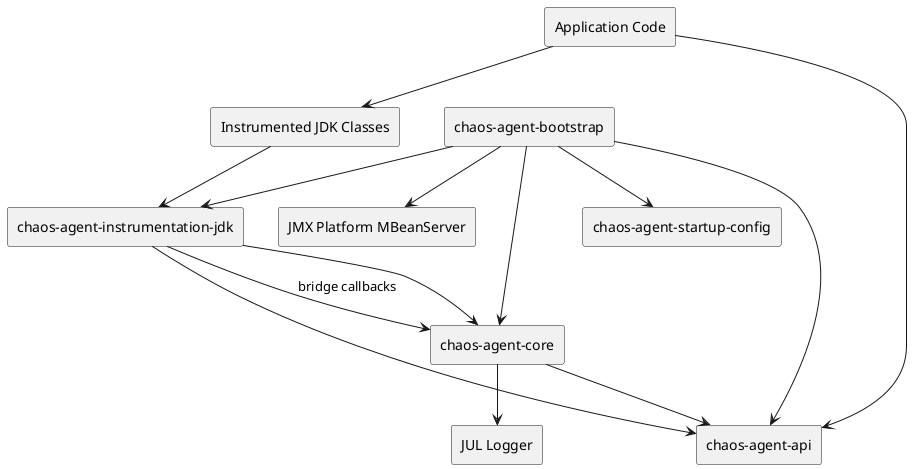
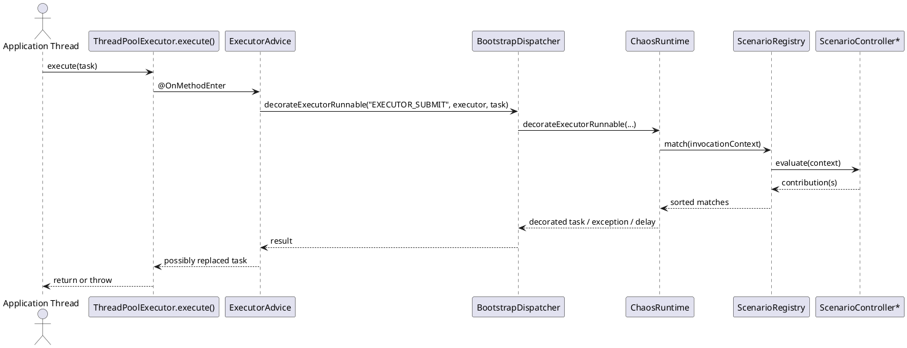

# 1. Overview

## Purpose

`macstab-chaos-jvm-agent` is an in-process JVM chaos system. Its purpose is to inject controlled failure and timing behavior into selected JDK concurrency and lifecycle surfaces without requiring application code changes at the call site. The current implementation is not a general fault-injection platform; it is a narrowly targeted runtime for a specific set of JDK classes and operations.

The agent is optimized for:

- executor and scheduler behavior
- queue operations
- thread start behavior
- `CompletableFuture` completion behavior
- class and resource loading
- shutdown hook registration
- long-lived lifecycle stressors such as heap retention and keepalive threads

## Scope

In scope:

- in-process control plane
- startup and local self-attach installation
- scenario matching and activation policies
- JVM-global and session-local chaos
- diagnostics through snapshots, debug dumps, JUL logging, and an MBean

Out of scope in the current codebase:

- remote control plane protocols
- distributed or multi-process coordination
- packet, socket, DNS, or HTTP fault injection
- arbitrary user-defined instrumentation points
- agent unload or true uninstallation

## Assumptions

- The process owner is trusted to install a Java agent.
- The target JVM permits startup instrumentation or local attach.
- Callers accept in-process blocking and exception injection as part of the fault model.
- Scenario definitions are trusted configuration, not untrusted tenant input.

## Non-Goals

- transparent sandboxing
- isolation between mutually untrusted workloads inside one JVM
- strict transactional activation semantics
- zero-overhead disabled state once the agent is installed

# 2. Architectural Context

## System Boundaries

This system lives entirely inside one JVM process. There is no network hop between the application and the agent. The same process contains:

- application threads
- instrumented JDK classes
- the bootstrap and runtime modules
- the configuration parser
- the diagnostics MBean

The only stable external contract in the repository is `chaos-agent-api`. All other modules are implementation modules that the API and the bootstrap path depend on.

## Dependencies

Direct implementation dependencies derived from the build:

- Byte Buddy 1.17.8 for bytecode advice and retransformation
- Byte Buddy Agent 1.17.8 for local self-attach
- Jackson 2.19.4 for startup plan JSON mapping
- JMX and JUL from the JDK for diagnostics exposure

The build uses a Java toolchain set to 25 while compiling with `--release 17`. Runtime support for virtual-thread selectors depends on runtime capability rather than compile target.

## Trust Boundaries

- The startup plan is trusted local configuration.
- The agent executes with the same effective privilege as the hosting JVM.
- There is no authentication or authorization boundary inside the control plane.
- If the process exports JMX remotely outside this repo, `debugDump()` data becomes part of that operator-visible surface.

## Deployment And Runtime Context

Two install modes exist:

- startup install through `-javaagent`
- local install through dynamic attach for tests or examples

The system is therefore most accurate to describe as an in-process instrumentation subsystem, not as a service.

# 3. Key Concepts And Terminology

- Control plane: the public activation surface exposed by `ChaosControlPlane`
- Plan: a named collection of scenarios
- Scenario: one selector plus one effect plus one activation policy
- Selector: the matching rule for an intercepted operation
- Effect: the action to apply when a match occurs
- Activation policy: gating conditions such as probability, manual start, rate limit, or lifetime
- Session: a thread-scoped and wrapper-propagated boundary for localized chaos
- Controller: the internal live runtime owner for one registered scenario
- Handle: the public lifecycle object returned when a scenario or plan is activated
- Runtime decision: the per-invocation merged result of all matching scenarios
- Stressor: a lifecycle-managed side effect that exists while a scenario is active

# 4. End-to-End Behavior

## What Happens At Startup

1. `ChaosAgentBootstrap.premain()` or `agentmain()` calls `initialize(...)`.
2. A `ChaosRuntime` is created unless an existing singleton is already visible.
3. `JdkInstrumentationInstaller` injects a bootstrap bridge and installs Byte Buddy advice on selected JDK classes.
4. The bootstrap module registers `io.macstab.chaos:type=ChaosDiagnostics` on the platform MBean server.
5. `StartupConfigLoader` resolves optional config from agent args or environment.
6. If a plan is present, the runtime activates it immediately.
7. If startup debug dumping is enabled, the runtime prints `ChaosDiagnostics.debugDump()` to `stderr`.

## What Happens On An Intercepted Call

1. A Byte Buddy advice class intercepts a JDK method.
2. The advice calls `BootstrapDispatcher`.
3. The dispatcher forwards to `ChaosBridge`, which delegates to `ChaosRuntime`.
4. The runtime constructs an `InvocationContext`.
5. `ScenarioRegistry` evaluates all registered controllers and collects matches.
6. Matching contributions are sorted by precedence and merged.
7. The runtime applies:
   - accumulated delay
   - optional gate wait
   - an operation-specific terminal action such as exception, false return, null return, or exceptional completion
8. Control returns to the intercepted JDK call.

## Important Behavioral Consequences

- Delay is compositional. Multiple matching delay scenarios add together.
- Plan activation is sequential and non-atomic. If one scenario in a plan fails after earlier scenarios were already activated, earlier ones remain active.
- `ChaosControlPlane.close()` stops controllers but does not uninstall instrumentation and does not clear the bootstrap singleton.
- In the current core implementation, stopping or closing a handle does not unregister its controller from the registry. The controller remains visible in diagnostics and can still block reactivation of the same scope/id key.

# 5. Architecture Diagrams

## Component Diagram

Question answered: what are the runtime boundaries and dependency directions inside the agent?

Main takeaway: the stable user-facing contract is the API module, while bootstrap, instrumentation, startup config, and runtime remain internal layers inside the same JVM.

## Sequence Diagram

Question answered: what happens when a thread submits work through an instrumented executor?

Main takeaway: the agent does not replace executor infrastructure wholesale. It intercepts specific methods, computes a decision in-process, and then returns control to the original JDK implementation.

## Deployment Diagram

No additional deployment diagram is included because the current system is not a distributed deployment topology. The materially relevant placement fact is that all components run in one JVM process.

# 6. Component Breakdown

## `chaos-agent-api`

Owns the stable data model and public control-plane contracts. This is the boundary callers should program against.

## `chaos-agent-bootstrap`

Owns installation, singleton runtime initialization, startup-plan loading, and MBean registration. This is the deployable agent jar.

## `chaos-agent-core`

Owns registration, validation, matching, activation policies, diagnostics, session scoping, and effect execution.

## `chaos-agent-instrumentation-jdk`

Owns Byte Buddy advice and the bootstrap bridge needed to reach the runtime from bootstrap-loaded JDK classes.

## `chaos-agent-startup-config`

Owns startup configuration precedence, agent-arg parsing, and JSON mapping.

## `chaos-agent-testkit`

Owns test convenience APIs and the JUnit 5 extension. It does not create an isolated runtime per test; it creates isolated sessions against a shared runtime.

# 7. Data Model And State

## Primary Structures

- `ChaosPlan(metadata, observability, scenarios)`
- `ChaosScenario(id, description, scope, selector, effect, activationPolicy, precedence, tags)`
- `InvocationContext(...)`
- `ScenarioContribution(...)`
- `RuntimeDecision(delayMillis, gateAction, terminalAction)`
- `ChaosDiagnostics.Snapshot(...)`

## Invariants

- `ChaosPlan.scenarios` must be non-empty.
- `ChaosScenario.id` must be non-blank.
- Selectors and effects are required.
- `SESSION` scope is not valid for selectors that are intrinsically JVM-global.
- Heap and keepalive stress effects require a matching stress selector.

## Registration Identity

The internal registration key is `scopeKey + "::" + scenario.id()`.

Consequences:

- JVM-global scenarios collide on `"jvm::<id>"`.
- Session scenarios collide only within the same session id.
- Because controllers are not currently unregistered on stop/close, reactivating the same JVM-scope scenario id can fail even after the old handle was closed.

## State Transitions

The public diagnostics enum contains `REGISTERED`, `ACTIVE`, `INACTIVE`, `STOPPED`, and `FAILED`, but the current implementation actively drives only `ACTIVE`, `INACTIVE`, and `STOPPED`. `REGISTERED` and `FAILED` exist in the API surface but are not emitted by the present core code.

# 8. Concurrency And Threading Model

## Execution Model

The agent is synchronous on the intercepted thread. Matching, delay, gate waits, and most failure decisions all happen inline on the thread performing the JDK operation.

## State Ownership

- `ScenarioRegistry` uses `ConcurrentHashMap` and `ConcurrentLinkedQueue`.
- `ScenarioController` uses `AtomicBoolean`, `AtomicLong`, `volatile` fields, and synchronized rate-limit updates.
- Session scope uses a `ThreadLocal<Deque<String>>`.

## Context Propagation

Opening a session in the current core implementation immediately binds that session to the calling thread until the session is closed. Additional propagation to other threads is done by wrapping `Runnable` or `Callable` instances. This is a stack discipline; bindings must be closed in LIFO order.

## JMM Relevance

This code relies on standard Java visibility primitives rather than lock-free custom protocols. The relevant guarantees come from:

- `volatile` publication for controller state
- atomic classes for counters and boolean lifecycle state
- `ThreadLocal` confinement for session scope

Reference: JSR-133 — Java Memory Model

# 9. Error Handling And Failure Modes

## Expected Failures

- invalid scenario definitions throw `ChaosValidationException`
- unsupported runtime features throw `ChaosUnsupportedFeatureException`
- activation misuse throws `ChaosActivationException`
- startup config parse/load errors throw `IllegalArgumentException`
- self-attach failure in local mode throws `IllegalStateException`

## Important Current Limitations

- Plan activation is not transactional.
- `ChaosDiagnostics.FailureCategory` defines several categories, but the current core only records `INVALID_CONFIGURATION`.
- `SuppressEffect` is not uniformly meaningful on every interception point. On generic pre-invocation void hooks it degrades to an effective no-op because the advice cannot suppress the underlying method from that path.
- `close()` is not an uninstall boundary. Instrumentation remains in place.

## Timeout Semantics

`GateEffect(maxBlock)` is a bounded wait, not a timeout exception. If `maxBlock` expires, the intercepted operation resumes.

## Idempotency

Activation is not idempotent by definition because registration keys must be unique. A repeated activation with the same scope/id key is a conflict in practice.

# 10. Security Model

There is no authn/authz model inside the agent. Security is therefore primarily about trust and blast radius.

- Anyone who can install or configure the agent can force thread blocking, exception injection, memory retention, or additional threads.
- The config parser accepts structured local input and treats it as trusted.
- The agent logs scenario ids, operations, and basic attributes. It does not currently implement secret redaction because it does not inspect business payloads.
- JMX exposure is only process-local unless operators export it externally.

The correct trust model is process-owner trust, not tenant isolation.

# 11. Performance Model

## Hot Path

The hot path is per intercepted operation:

1. allocate `InvocationContext`
2. iterate every registered controller
3. evaluate matches
4. sort matching contributions by precedence
5. apply delay, gate, or terminal action

This means runtime cost grows with the number of active registered controllers, not only the number of active matching controllers.

## Cost Drivers

- controller scan on every intercepted event
- sort of matching contributions
- thread blocking from delay and gate effects
- heap retention from `HeapPressureEffect`
- additional daemon or non-daemon thread from `KeepAliveEffect`

## Scaling Limits

This design is suitable for targeted chaos experiments, tests, and bounded scenario counts. It is not designed for thousands of active scenarios on a latency-critical hot path.

# 12. Observability And Operations

Available signals:

- `ChaosDiagnostics.snapshot()`
- `ChaosDiagnostics.debugDump()`
- JUL logs from `io.macstab.chaos`
- MBean `io.macstab.chaos:type=ChaosDiagnostics`

Operationally important gaps:

- no tracing integration
- no correlation id propagation
- no health endpoint semantics
- metrics support is partial; counters are emitted through `ChaosMetricsSink`, but `recordDuration(...)` is defined and currently unused

Operator debugging workflow in the current implementation is therefore:

1. inspect logs
2. inspect `debugDump()`
3. verify active/stopped state, match counts, applied counts, and recorded activation failures

# 13. Configuration Reference

Startup configuration is documented in [startup-config.md](startup-config.md). The most important operational settings are:

- `configFile`
- `configJson`
- `configBase64`
- `debugDumpOnStart`

Runtime compatibility facts:

- compile target is Java 17
- build toolchain is Java 25
- virtual-thread selectors require runtime support for `Thread.isVirtual()`, which in practice means a JDK with virtual thread support

# 14. Extension Points And Compatibility Guarantees

Stable:

- the `chaos-agent-api` types and serialized plan shape, subject to normal project versioning

Internal:

- registry internals
- controller lifecycle behavior
- instrumentation strategy
- startup precedence implementation details
- diagnostics MBean implementation shape beyond `debugDump()`

Adding a new selector or effect is cross-cutting work. It requires changes in:

- API model
- startup JSON mapping behavior
- validator rules
- matcher logic
- runtime decision semantics
- instrumentation advice if a new JDK surface is involved

# 15. Stack Walkdown

## API / Framework Layer

Callers interact with `ChaosControlPlane`, `ChaosSession`, and the plan/scenario records. This layer is the stable contract and should be the only part application code relies on directly.

## Application / Runtime Layer

The runtime is an in-process orchestrator. It owns scenario lifecycle, matching, diagnostics, and session scope. This layer materially affects application behavior because interception decisions execute synchronously on application threads.

## JVM Layer

The implementation depends on Java instrumentation, class retransformation, `ThreadLocal`, atomics, JMX, and the semantics of the intercepted JDK classes. Virtual thread support is runtime-dependent.

Reference: Java Virtual Machine Specification
Reference: Java Platform SE API Specification — `java.lang.instrument`

## Memory / Concurrency Layer

The memory model matters because controller state is read and written concurrently across instrumented threads. The implementation uses standard JMM-safe primitives rather than ad hoc unsafe publication.

## OS / Kernel / Container Layer

Material relevance is limited but not zero:

- local self-attach may be blocked by JVM flags or container hardening
- intentional delay and blocking ultimately consume real OS threads or scheduler time
- keepalive stressors create actual JVM threads backed by OS scheduling resources

There is no direct network or kernel protocol interaction implemented by the agent itself.

## Infrastructure Layer

The agent has no required external infrastructure. If an operator exports JMX or collects JUL logs into a broader platform, those become surrounding infrastructure concerns, not direct agent subsystems.

# 16. References

- Reference: JSR-133 — Java Memory Model
- Reference: Java Language Specification
- Reference: Java Virtual Machine Specification
- Reference: Java Platform SE API Specification — `java.lang.instrument`
- Reference: Java Platform SE API Specification — `java.lang.management`
- Reference: Java Platform SE API Specification — `javax.management`
- Reference: JEP 444 — Virtual Threads
