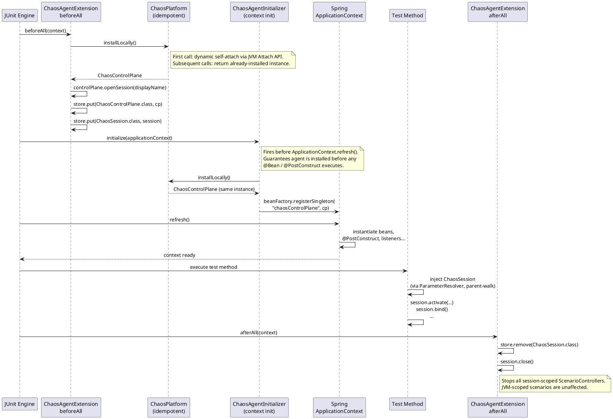
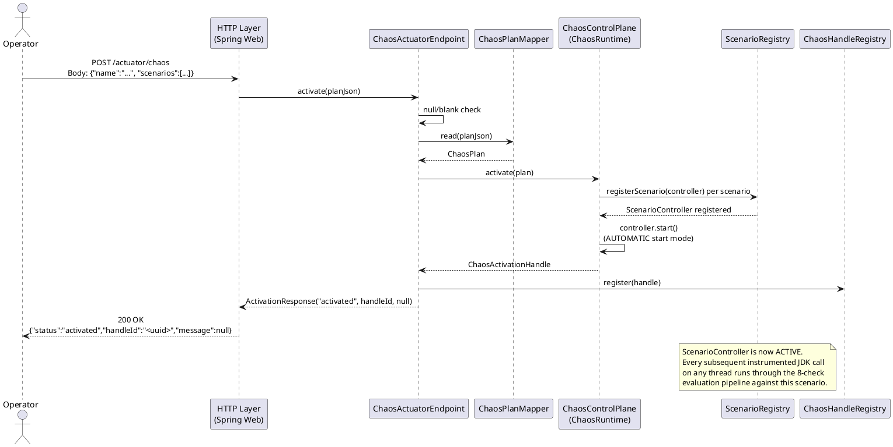

<!--
━━━━━━━━━━━━━━━━━━━━━━━━━━━━━━━━━━━━━━━━━━━━━━━━━━━━━━━━━━━━━
  Engineered by  Christian Schnapka
                 Embedded Principal+ Engineer
                 Macstab GmbH · Hamburg, Germany
                 https://macstab.com
━━━━━━━━━━━━━━━━━━━━━━━━━━━━━━━━━━━━━━━━━━━━━━━━━━━━━━━━━━━━━
-->

# Spring Integration — macstab-chaos-jvm-agent

> Technical reference for the four Spring Boot integration modules: test starters for Boot 3 and Boot 4, runtime starters for Boot 3 and Boot 4.
>
> *Engineered by* **[Christian Schnapka](https://macstab.com)** — Embedded Principal+ Engineer · [Macstab GmbH](https://macstab.com) · Hamburg, Germany

---

## 1. Module Overview

The Spring integration layer is organized along two independent axes:

- **Scope axis**: test-time vs runtime deployment
- **Version axis**: Spring Boot 3.x vs Spring Boot 4.x

This gives four modules, each compiled against its own Spring Boot BOM and carrying its own `Automatic-Module-Name`. No module carries a runtime Spring Boot dependency — all Spring artifacts are declared `compileOnly` so the starters are inert unless the consuming application supplies Spring Boot on the classpath.

| Module | Scope | Spring Boot | Automatic-Module-Name | Base Package |
|--------|-------|-------------|----------------------|--------------|
| `chaos-agent-spring-boot3-test-starter` | Test (JUnit 5 + `@SpringBootTest`) | 3.5.13 | `com.macstab.chaos.jvm.agent.spring.boot3.test` | `com.macstab.chaos.jvm.spring.boot3.test` |
| `chaos-agent-spring-boot4-test-starter` | Test (JUnit 5 + `@SpringBootTest`) | 4.0.5 | `com.macstab.chaos.jvm.agent.spring.boot4.test` | `com.macstab.chaos.jvm.spring.boot4.test` |
| `chaos-agent-spring-boot3-starter` | Runtime (production / soak / game day) | 3.5.13 | `com.macstab.chaos.jvm.agent.spring.boot3` | `com.macstab.chaos.jvm.spring.boot3` |
| `chaos-agent-spring-boot4-starter` | Runtime (production / soak / game day) | 4.0.5 | `com.macstab.chaos.jvm.agent.spring.boot4` | `com.macstab.chaos.jvm.spring.boot4` |

The test and runtime starters are intentionally separate. Combining them in a single artifact would put Actuator plumbing on the test classpath and test-only classes in production JARs. The separation enforces the blast-radius boundary at the Gradle dependency level rather than requiring callers to remember which scope to use.

---

## 2. Test Starter — `@ChaosTest` and `ChaosAgentExtension`

### 2.1 What the Test Starter Does (Floor 0)

Add the dependency, put `@ChaosTest` on your test class, and declare a `ChaosSession` parameter on any test method. The starter self-attaches the chaos agent into the test JVM, boots a full `@SpringBootTest` application context, and hands you a live session you can use to inject faults. No `-javaagent` flag, no XML, no manual lifecycle wiring.

### 2.2 `@ChaosTest` — Meta-Annotation Composition

`@ChaosTest` is a meta-annotation, not a standalone mechanism. It is assembled from two annotations:

```java
@SpringBootTest
@ExtendWith(ChaosAgentExtension.class)
public @interface ChaosTest { ... }
```

All `@SpringBootTest` attributes are re-declared on `@ChaosTest` and forwarded by annotation processors at compile time:

| Attribute | Forwarded to | Type |
|-----------|-------------|------|
| `properties` | `@SpringBootTest.properties` | `String[]` |
| `classes` | `@SpringBootTest.classes` | `Class<?>[]` |
| `webEnvironment` | `@SpringBootTest.webEnvironment` | `WebEnvironment` (default `MOCK`) |
| `args` | `@SpringBootTest.args` | `String[]` |
| `initializers` | `@SpringBootTest.initializers` | `Class<? extends ApplicationContextInitializer<?>>[]` |

This means callers pay zero annotation-composition cost. `@ChaosTest(webEnvironment = WebEnvironment.RANDOM_PORT)` works exactly as `@SpringBootTest(webEnvironment = RANDOM_PORT)` does, with the chaos extension layered on top.

The `@Inherited` meta-annotation on `@ChaosTest` means it propagates to subclasses. A base class annotated with `@ChaosTest` passes the extension and Spring Boot test wiring to every extending test class automatically.

### 2.3 `ChaosAgentExtension` — JUnit 5 Lifecycle

`ChaosAgentExtension` implements three JUnit 5 interfaces:

```
BeforeAllCallback
AfterAllCallback
ParameterResolver
```

#### `beforeAll` — agent installation and session open

```java
public void beforeAll(final ExtensionContext context) {
    final TrackingChaosControlPlane tracker =
        new TrackingChaosControlPlane(ChaosPlatform.installLocally());
    final ChaosSession session = tracker.openSession(context.getDisplayName());
    context.getStore(NAMESPACE).put(ChaosControlPlane.class, tracker);
    context.getStore(NAMESPACE).put(ChaosSession.class, session);
}
```

`ChaosPlatform.installLocally()` is idempotent — it uses a JVM-wide lock and returns the same `ChaosControlPlane` instance on every call within the same JVM process. The first call triggers dynamic self-attach of the chaos agent via the JVM Attach API. Subsequent calls, from subsequent `@ChaosTest` classes or nested tests in the same forked JVM, return the already-installed instance without attempting re-attachment.

The raw control plane is wrapped in a `TrackingChaosControlPlane` before being stored. This wrapper records every `ChaosActivationHandle` returned from `controlPlane.activate()` during the test class's lifecycle. `afterAll` calls `tracker.stopTracked()` to stop any JVM-scoped handles the test activated — preventing JVM-scoped scenario leakage into subsequent test classes in the same JVM.

`tracker.openSession(context.getDisplayName())` creates a new `ChaosSession` scoped to this test class's execution. The display name (the class name or whatever `@DisplayName` provides) is stored as the session's human-readable identifier, which appears in diagnostics snapshots.

Both the tracking control plane and the session are stored in the extension's `ExtensionContext.Store` under the type-keyed namespace:

```java
static final ExtensionContext.Namespace NAMESPACE =
    ExtensionContext.Namespace.create(ChaosAgentExtension.class);
```

This is a deliberate design choice. JUnit's `ExtensionContext.Namespace` creates a logically isolated keyspace per extension class. Storing by type (`ChaosControlPlane.class`, `ChaosSession.class`) rather than by string avoids collision with other extensions that might store values in the same context.

#### `afterAll` — session close and JVM-scoped handle cleanup

```java
public void afterAll(final ExtensionContext context) {
    final ChaosSession session =
        context.getStore(NAMESPACE).remove(ChaosSession.class, ChaosSession.class);
    final ChaosControlPlane controlPlane =
        context.getStore(NAMESPACE).remove(ChaosControlPlane.class, ChaosControlPlane.class);
    try {
        if (session != null) {
            session.close();
        }
    } finally {
        if (controlPlane instanceof TrackingChaosControlPlane tracker) {
            tracker.stopTracked();
        }
    }
}
```

`remove()` is atomic with respect to the store — it retrieves and removes in one operation, preventing double-close races. `session.close()` stops every session-scoped `ScenarioController` and unregisters them from `ScenarioRegistry`. `tracker.stopTracked()` runs in the `finally` block to ensure it executes even if `session.close()` throws — stopping any JVM-scoped handles the test class activated via `controlPlane.activate()`. JVM-scoped scenarios not created through the injected control plane are unaffected.

#### `ParameterResolver` — `ChaosSession` and `ChaosControlPlane` injection

The resolver supports two types:

```java
public boolean supportsParameter(ParameterContext parameterContext,
                                  ExtensionContext extensionContext) {
    final Class<?> parameterType = parameterContext.getParameter().getType();
    return parameterType == ChaosSession.class || parameterType == ChaosControlPlane.class;
}
```

Resolution walks the context hierarchy:

```java
public Object resolveParameter(ParameterContext parameterContext,
                                ExtensionContext extensionContext) {
    final Class<?> parameterType = parameterContext.getParameter().getType();
    ExtensionContext current = extensionContext;
    while (current != null) {
        final Object value = current.getStore(NAMESPACE).get(parameterType, parameterType);
        if (value != null) {
            return value;
        }
        current = current.getParent().orElse(null);
    }
    return null;
}
```

Walking upward through `current.getParent()` is what makes `@Nested` classes work. In JUnit 5, a `@Nested` class has its own `ExtensionContext`, which is a child of the outer class's context. If the outer class registered the extension, the inner class's `ExtensionContext` does not have an entry in its own store — but the parent does. The walk finds it there and returns the same session instance. This means all `@Nested` classes within a single `@ChaosTest` class share one session, one session ID, and one cleanup event in `afterAll`.

This is the only correct design for nested tests. Alternatives would either require each nested class to redeclare the extension (defeating the purpose of `@ChaosTest`) or open multiple sessions per outer-class lifecycle (making cleanup ambiguous). The walk ensures the model is: one `@ChaosTest` outer class = one session, regardless of nesting depth.

### 2.4 `ChaosAgentInitializer` — `ApplicationContextInitializer`

`ChaosAgentInitializer` implements `ApplicationContextInitializer<ConfigurableApplicationContext>`. Its role is to ensure the chaos agent is fully installed *before the application context is refreshed* — specifically before any `@Bean` method or `@PostConstruct` callback runs.

```java
public void initialize(final ConfigurableApplicationContext applicationContext) {
    final ChaosControlPlane controlPlane = ChaosPlatform.installLocally();
    applicationContext.getBeanFactory().registerSingleton("chaosControlPlane", controlPlane);
}
```

Why is this needed separately from the JUnit extension?

The JUnit extension's `beforeAll` fires before the test class methods run, but `@SpringBootTest` starts an `ApplicationContext` as part of test setup — potentially before `beforeAll` has run if the context is loaded from a shared context cache. The initializer fires at a precisely-defined point in the Spring context lifecycle: after the context is created but before `refresh()` is invoked. This guarantees that beans instantiated during refresh — `CommandLineRunner`, `ApplicationRunner`, beans with `@PostConstruct` that call instrumented JDK methods — see the chaos agent already installed and the `ChaosControlPlane` already registered as a singleton.

Without the initializer, there would be a window where Spring is starting beans and the agent is not yet installed. Any instrumented JDK call happening inside a bean constructor during that window would pass through the uninstalled fast path. The initializer closes that window.

The `registerSingleton("chaosControlPlane", controlPlane)` call makes the control plane available for `@Autowired` injection directly from the bean factory. It bypasses the normal `@Bean` lifecycle (no proxy, no destroy method registration from the factory side), which is intentional — the control plane's lifecycle is managed by `ChaosAgentExtension.afterAll()`, not by Spring's context close.

#### Registration

Boot 3 registers the initializer via `META-INF/spring.factories`:

```properties
org.springframework.context.ApplicationContextInitializer=\
  com.macstab.chaos.jvm.spring.boot3.test.ChaosAgentInitializer
```

Boot 4 uses the newer `.imports` mechanism:

```
META-INF/spring/org.springframework.context.ApplicationContextInitializer.imports
  → com.macstab.chaos.jvm.spring.boot4.test.ChaosAgentInitializer
```

This is one of the meaningful behavioral differences between Boot 3 and Boot 4 in this module. The `spring.factories` key-value format is still supported in Boot 4 but deprecated in favor of `.imports` files, which carry one fully-qualified class name per line. The Boot 4 test starter uses the `.imports` path exclusively.

### 2.5 `ChaosTestAutoConfiguration` — Auto-Configuration in Tests

`ChaosTestAutoConfiguration` is a `@TestConfiguration` that exposes `ChaosControlPlane` as a Spring bean when the chaos extension classes are on the test classpath:

```java
@TestConfiguration(proxyBeanMethods = false)
@ConditionalOnClass(ChaosAgentExtension.class)
public class ChaosTestAutoConfiguration {

    @Bean
    @ConditionalOnMissingBean(ChaosControlPlane.class)
    public ChaosControlPlane chaosControlPlane() {
        return ChaosPlatform.installLocally();
    }
}
```

`proxyBeanMethods = false` suppresses CGLIB proxying for this configuration class. There is no `@Bean` method that calls another `@Bean` method, so CGLIB proxying would add overhead without benefit.

`@ConditionalOnClass(ChaosAgentExtension.class)` is an existence guard. If somehow the test classpath lacks `ChaosAgentExtension` (e.g., the starter was excluded but `spring-boot-test-autoconfigure` still picked up the imports file from a transitive dependency), the configuration silently does nothing rather than failing with `ClassNotFoundException`.

`@ConditionalOnMissingBean(ChaosControlPlane.class)` is the standard back-off contract. If a test configuration already declares a `ChaosControlPlane` bean — for example a stub implementation for isolated unit testing without agent attachment — the auto-configuration steps aside. This is the same pattern used by `ChaosAutoConfiguration` in the runtime starters, keeping the override contract consistent across all four modules.

#### Registration

Both Boot 3 and Boot 4 test starters register via:

```
META-INF/spring/org.springframework.boot.test.autoconfigure.ImportAutoConfiguration.imports
  → com.macstab.chaos.jvm.spring.boot3.test.ChaosTestAutoConfiguration
  → (Boot 4 variant)   com.macstab.chaos.jvm.spring.boot4.test.ChaosTestAutoConfiguration
```

The `ImportAutoConfiguration.imports` mechanism is the test-specific analogue of `AutoConfiguration.imports`. It is processed by `@ImportAutoConfiguration`-based test slices and by `@SpringBootTest` when the auto-configuration is not already on the main imports path. Using a test-specific imports file keeps the configuration class out of production auto-configuration scanning entirely.

### 2.6 Sequence Diagram — Test Lifecycle



---

## 3. Runtime Starter — `ChaosAutoConfiguration` and Actuator

### 3.1 What the Runtime Starter Does (Floor 0)

Add the dependency, set `macstab.chaos.enabled=true` in `application.yml`, and the starter installs the chaos agent and exposes `ChaosControlPlane` as a Spring bean. Optionally point it at a JSON plan file to activate scenarios on startup. Optionally enable the Actuator endpoint to activate and stop scenarios at runtime via HTTP — no application restart required.

This is the deployment path for pre-production soak tests, game days, and controlled production experiments. It intentionally exposes no test APIs and uses no JUnit types.

Starting with the current release, the agent is self-attached during the Spring Boot environment preparation phase — before the application context is refreshed and before any Spring beans are instantiated. This is earlier than context-refresh time, which means instrumented JDK classes (Socket, HTTP client, JDBC connections) are rewritten before any Spring bean creates them. The `ChaosControlPlane` bean in `ChaosAutoConfiguration` is still created during context refresh but is now a no-op attachment (the agent is already installed); its purpose is solely to expose the control plane as a Spring-managed bean with a `close()` destroy method.

### 3.2 `ChaosAgentEnvironmentPostProcessor` — Early Attach

```java
public class ChaosAgentEnvironmentPostProcessor implements EnvironmentPostProcessor, Ordered {
    @Override
    public void postProcessEnvironment(
            final ConfigurableEnvironment environment,
            final SpringApplication application) {
        if (!Boolean.parseBoolean(environment.getProperty("macstab.chaos.enabled", "false"))) {
            return;
        }
        ChaosPlatform.installLocally();
    }

    @Override
    public int getOrder() {
        return Ordered.HIGHEST_PRECEDENCE;
    }
}
```

`EnvironmentPostProcessor` is the earliest Spring Boot extension point that has access to the resolved environment — it fires after `ConfigData` processing (so profiles, external config files, and system properties are fully resolved) but before the `ApplicationContext` is created. This is the correct place to attach the agent because:

1. The environment is fully resolved, so the `macstab.chaos.enabled` check accurately reflects the operator's intent (system properties, env vars, `application.yml`, and config server values are all in scope).
2. The `ApplicationContext` does not yet exist — no bean constructors, `@PostConstruct` callbacks, or Tomcat binding have run. When the context is subsequently created and refreshed, all instrumented JDK classes are already rewritten.

`getOrder()` returns `HIGHEST_PRECEDENCE`, ensuring this processor runs before other environment post-processors (metrics, cloud config, etc.) can trigger any instrumented JDK calls.

**Why the `ChaosAutoConfiguration.chaosControlPlane()` bean still exists**: `ChaosAgentEnvironmentPostProcessor` attaches the agent but does not register the `ChaosControlPlane` as a Spring bean. The bean in `ChaosAutoConfiguration` is still needed to:
- Expose `ChaosControlPlane` as an injectable bean for application code and the Actuator endpoint.
- Register `close()` as the Spring bean destroy method, ensuring all JVM-scoped stressor threads are stopped on `ApplicationContext.close()`.
- Back off via `@ConditionalOnMissingBean` when user code provides its own control plane.

Both registrations call `ChaosPlatform.installLocally()`, which is idempotent — whichever runs first performs the actual attach; the second returns the already-installed instance in nanoseconds.

**Registration difference between Spring Boot 3 and Spring Boot 4**:

In Spring Boot 3, `EnvironmentPostProcessor` lives in `org.springframework.boot.env` and is registered via `META-INF/spring/org.springframework.boot.env.EnvironmentPostProcessor.imports`:
```
com.macstab.chaos.jvm.spring.boot3.ChaosAgentEnvironmentPostProcessor
```

In Spring Boot 4, the interface moved to `org.springframework.boot.EnvironmentPostProcessor` (no `.env` sub-package). Spring Boot 4 loads `EnvironmentPostProcessor` instances via `SpringFactoriesLoader` reading `META-INF/spring.factories`, so registration uses the legacy factories format:
```properties
org.springframework.boot.EnvironmentPostProcessor=\
  com.macstab.chaos.jvm.spring.boot4.ChaosAgentEnvironmentPostProcessor
```

This is one of the two meaningful behavioral differences between the Boot 3 and Boot 4 runtime starters (the other being the `ApplicationContextInitializer` registration in the test starters).

### 3.3 `ChaosProperties` — Configuration Binding

`ChaosProperties` is a `@ConfigurationProperties("macstab.chaos")` class with flat properties and one nested object:

```java
@ConfigurationProperties("macstab.chaos")
public class ChaosProperties {
    private boolean enabled = false;
    private String configFile;
    private boolean debugDumpOnStart = false;
    private Actuator actuator = new Actuator();

    public static class Actuator {
        private boolean enabled = false;
    }
}
```

Every field defaults to off or null. The explicit opt-in design is non-negotiable: a chaos starter that activates by default would be a deployment incident waiting to happen. The default state — all flags false, no config file, no actuator — means the starter is a completely inert presence on the classpath until an operator deliberately enables it.

### 3.4 `ChaosAutoConfiguration` — Bean Wiring and Lifecycle

The top-level auto-configuration:

```java
@AutoConfiguration
@ConditionalOnProperty(prefix = "macstab.chaos", name = "enabled", havingValue = "true")
@EnableConfigurationProperties(ChaosProperties.class)
public class ChaosAutoConfiguration { ... }
```

`@AutoConfiguration` is the Boot 3/4 replacement for `@Configuration` + manual `AutoConfiguration.imports` registration. It carries slightly different processing semantics than `@Configuration` — notably, it is processed after user-defined `@Configuration` classes, giving user beans priority over auto-configured beans by default.

`@ConditionalOnProperty(prefix = "macstab.chaos", name = "enabled", havingValue = "true")` is a hard gate. If `macstab.chaos.enabled` is absent from the environment or is anything other than the string `"true"`, the entire configuration class is skipped. No beans from this class reach the application context. The `@EnableConfigurationProperties(ChaosProperties.class)` binding also does not activate — property binding is conditional on the configuration class being processed.

#### `chaosControlPlane` — the primary bean

```java
@Bean(destroyMethod = "close")
@ConditionalOnMissingBean
public ChaosControlPlane chaosControlPlane() {
    return ChaosPlatform.installLocally();
}
```

`destroyMethod = "close"` registers `ChaosControlPlane.close()` with Spring's bean destruction lifecycle. When the `ApplicationContext` is closed — on normal JVM shutdown, on a `SIGTERM`, or explicitly in tests via `context.close()` — Spring calls `chaosControlPlane.close()`, which stops all active `ScenarioController` instances in the JVM-scoped registry and releases any stressor threads they hold. Without this, stressor threads (heap pressure, monitor contention, etc.) would linger until the JVM exits.

`@ConditionalOnMissingBean` without a type argument defaults to checking for any existing bean of the same type — `ChaosControlPlane`. This is the standard override contract: if a user configuration already declares a `ChaosControlPlane` bean (e.g., a test double, a mock, or a custom implementation wrapping the real one), the auto-configuration backs off cleanly.

#### `chaosHandleRegistry` — activation handle tracking

```java
@Bean
@ConditionalOnMissingBean
public ChaosHandleRegistry chaosHandleRegistry() {
    return new ChaosHandleRegistry();
}
```

`ChaosHandleRegistry` is discussed in detail in section 3.6. Its presence here as a distinct Spring bean serves two purposes: it participates in the normal Spring lifecycle and is injectable wherever needed, and it is the only coupling point between `ChaosAutoConfiguration` and `ChaosActuatorEndpoint` — the endpoint depends on both the registry and the control plane, but not on anything Spring-internal.

#### `chaosStartupApplier` — `ApplicationReadyEvent` listener

```java
@Bean
@ConditionalOnMissingBean(name = "chaosStartupApplier")
public ApplicationListener<ApplicationReadyEvent> chaosStartupApplier(
        final ChaosControlPlane controlPlane,
        final ChaosProperties properties,
        final ChaosHandleRegistry handleRegistry) {
    return event -> applyStartup(controlPlane, properties, handleRegistry);
}
```

`ApplicationReadyEvent` fires after the context is fully refreshed and all `SmartLifecycle` beans have started. Using this event instead of `@PostConstruct` or `ContextRefreshedEvent` ensures that the chaos plan is activated only when the application is genuinely ready to receive load — specifically, after embedded web servers have bound their ports and all `SmartLifecycle.start()` callbacks have run.

The startup logic (`applyStartup`) performs two independent operations:

1. **Startup plan activation**: if `macstab.chaos.config-file` is non-blank, reads the file at `Path.of(configFile)`, deserializes it via `ChaosPlanMapper.read(json)`, calls `controlPlane.activate(plan)`, and registers the resulting `ChaosActivationHandle` in `handleRegistry`. Both `IOException` and `RuntimeException` are caught independently and logged at `SEVERE` without propagating — a missing or malformed chaos plan file does not crash the application.

2. **Diagnostics dump**: if `macstab.chaos.debug-dump-on-start` is true, calls `controlPlane.diagnostics().debugDump()` and logs the full text at `INFO`. This snapshot captures the activated scenario list, their states and counters, and JVM runtime details. It is intended as a one-shot startup confirmation that the plan loaded and the scenarios are in `ACTIVE` state.

`@ConditionalOnMissingBean(name = "chaosStartupApplier")` uses name-based matching rather than type-based matching. `ApplicationListener<ApplicationReadyEvent>` is a parameterized type; Spring's condition infrastructure checks the raw type without generic parameter matching by default. Name-based matching is more precise here — it allows a user to override specifically the startup applier behavior while keeping other `ApplicationListener<ApplicationReadyEvent>` beans in the context.

#### `ActuatorConfiguration` — nested, double-gated

```java
@Configuration(proxyBeanMethods = false)
@ConditionalOnClass(Endpoint.class)
@ConditionalOnProperty(prefix = "macstab.chaos.actuator", name = "enabled", havingValue = "true")
public static class ActuatorConfiguration { ... }
```

Two independent conditions must both be true:

1. `@ConditionalOnClass(Endpoint.class)` — Spring Boot Actuator must be on the classpath. If the host application does not include `spring-boot-actuator`, the entire nested configuration is skipped at class-presence check time, before any property resolution.

2. `@ConditionalOnProperty("macstab.chaos.actuator.enabled", havingValue = "true")` — explicit operator opt-in. Even with Actuator present, the chaos endpoint does not appear unless deliberately enabled.

This double-guard is the minimum safe design for an endpoint that can activate arbitrary fault injection. Classpath presence prevents `NoClassDefFoundError` on environments without Actuator; the property guard prevents accidental endpoint exposure on environments that have Actuator for other reasons (health checks, metrics) but don't intend to expose chaos operations.

### 3.5 `ChaosActuatorEndpoint` — Runtime Operations via HTTP

```java
@Endpoint(id = "chaos")
public class ChaosActuatorEndpoint { ... }
```

`@Endpoint(id = "chaos")` registers the endpoint under the path `/actuator/chaos`. Spring Boot Actuator's endpoint infrastructure maps the four JUnit-style operation annotations to HTTP verbs automatically:

| Annotation | HTTP method | Path | Description |
|-----------|-------------|------|-------------|
| `@ReadOperation` | `GET` | `/actuator/chaos` | Returns `ChaosDiagnostics.Snapshot` |
| `@WriteOperation` | `POST` | `/actuator/chaos` | Activates a plan from inline JSON body |
| `@WriteOperation` (stopAll) | `POST` | `/actuator/chaos/stopAll` | Stops all starter-managed scenarios |
| `@DeleteOperation` | `DELETE` | `/actuator/chaos/{scenarioId}` | Stops a specific scenario by ID |

The `@WriteOperation` annotation is applied to two methods (`activate` and `stopAll`). Spring Boot Actuator disambiguates them at runtime by path: `activate` maps to the base path, `stopAll` maps to the `stopAll` sub-path.

#### `snapshot()` — `GET /actuator/chaos`

```java
@ReadOperation
public ChaosDiagnostics.Snapshot snapshot() {
    return controlPlane.diagnostics().snapshot();
}
```

Returns a `ChaosDiagnostics.Snapshot` record containing:
- `capturedAt()` — `java.time.Instant` of the snapshot
- `scenarios()` — `List<ScenarioReport>` with id, state, matchedCount, appliedCount, reason per scenario
- `failures()` — `List<ActivationFailure>` for activation-time errors
- `runtimeDetails()` — `Map<String, String>` with JVM version, virtual thread support status, current session ID

This is a point-in-time snapshot — not a live stream. All counts reflect the state at the moment of the `GET` call.

#### `activate(planJson)` — `POST /actuator/chaos`

```java
@WriteOperation
public ActivationResponse activate(final String planJson) {
    if (planJson == null || planJson.isBlank()) {
        return new ActivationResponse("error", null, "plan JSON must not be blank");
    }
    final ChaosPlan plan = ChaosPlanMapper.read(planJson);
    final ChaosActivationHandle handle = controlPlane.activate(plan);
    handleRegistry.register(handle);
    return new ActivationResponse("activated", handle.id(), null);
}
```

Accepts a raw JSON string in the request body. `ChaosPlanMapper.read(planJson)` deserializes it using Jackson with strict unknown-field policy — a typo in the JSON produces a `ConfigLoadException` rather than silently ignoring the field. The resulting `ChaosActivationHandle` is registered in `ChaosHandleRegistry` so that the DELETE operation can stop it later.

Response record:

```java
public record ActivationResponse(String status, String handleId, String message) {}
```

On success: `status = "activated"`, `handleId = <handle.id()>`, `message = null`.
On blank body: `status = "error"`, `handleId = null`, `message = "plan JSON must not be blank"`.

#### `stop(scenarioId)` — `DELETE /actuator/chaos/{scenarioId}`

```java
@DeleteOperation
public StopResponse stop(@Selector final String scenarioId) {
    final boolean stopped = handleRegistry.stop(scenarioId);
    if (stopped) {
        return new StopResponse("stopped", scenarioId, null);
    }
    if (controlPlane.diagnostics().scenario(scenarioId).isPresent()) {
        return new StopResponse("unmanaged", scenarioId,
            "scenario is registered but not managed by this starter; stop via its activation handle");
    }
    return new StopResponse("not-found", scenarioId, "no scenario with id " + scenarioId);
}
```

`@Selector` binds `scenarioId` to the path segment. The three-state response is deliberate:

- `"stopped"` — the handle was in the registry and `handle.stop()` succeeded.
- `"unmanaged"` — the scenario exists in the JVM's `ScenarioRegistry` (registered by some other activation path — perhaps by agent startup config or a direct API call) but this starter's `ChaosHandleRegistry` does not track a handle for it. The endpoint correctly refuses to stop it silently; the caller needs to locate the appropriate handle.
- `"not-found"` — the scenario ID is unknown to both the handle registry and the diagnostic snapshot.

```java
public record StopResponse(String status, String scenarioId, String message) {}
```

#### `stopAll()` — `POST /actuator/chaos/stopAll`

```java
@WriteOperation
public StopAllResponse stopAll() {
    final int stoppedCount = handleRegistry.stopAll();
    return new StopAllResponse(stoppedCount);
}
```

Stops every scenario in `ChaosHandleRegistry` — specifically, every scenario activated through this starter (startup plan or Actuator calls). Scenarios activated via other paths (direct API, agent startup args, test sessions) are unaffected. The response carries the count of handles successfully stopped.

```java
public record StopAllResponse(int stoppedCount) {}
```

#### Security note

`ChaosActuatorEndpoint` is protected by whatever security the host application applies to the Actuator namespace. The endpoint must not be reachable from the public internet without authentication. A `POST /actuator/chaos` endpoint that accepts arbitrary chaos plan JSON and activates it in the live JVM is an extremely high-impact surface. Protect it as you would a shutdown endpoint.

Standard Spring Security configuration for Actuator:

```yaml
management:
  endpoints:
    web:
      exposure:
        include: health,info,chaos
  endpoint:
    chaos:
      access: restricted
```

And a security rule restricting actuator access to an internal role or network:

```java
http.requestMatcher(EndpointRequest.to(ChaosActuatorEndpoint.class))
    .authorizeHttpRequests(a -> a.anyRequest().hasRole("CHAOS_OPERATOR"));
```

### 3.6 `ChaosHandleRegistry` — Why It Exists

`ChaosControlPlane` is the public API. `ScenarioRegistry` is an internal implementation class in `chaos-agent-core`. The Actuator endpoint needs to stop individual scenarios by ID — but `ScenarioRegistry` is package-private and not a dependency of the Spring starter module, nor should it be.

`ChaosHandleRegistry` is the decoupling layer:

```java
public final class ChaosHandleRegistry {
    private final Map<String, ChaosActivationHandle> handles = new ConcurrentHashMap<>();

    public void register(final ChaosActivationHandle handle) { ... }
    public boolean stop(final String id) { ... }
    public Collection<String> ids() { ... }
    public int stopAll() { ... }
}
```

Every `ChaosActivationHandle` returned by `controlPlane.activate()` from within the starter's scope (startup plan load, Actuator activate call) is registered here. The registry holds only the handles that this starter produced. When `stop(id)` is called, the registry removes and calls `handle.stop()` — it never reaches into `ScenarioRegistry` or calls any `chaos-agent-core` internal API.

The `ConcurrentHashMap` backing is intentional. Both `register()` and `stop()` can be called concurrently — `register` from the startup event listener thread, `stop` from an HTTP thread serving a DELETE request. `ConcurrentHashMap` provides the necessary thread safety without requiring explicit locking in the registry methods.

`stopAll()` uses a deliberate iteration-and-remove pattern:

```java
public int stopAll() {
    int count = 0;
    for (final Map.Entry<String, ChaosActivationHandle> entry : handles.entrySet()) {
        handles.remove(entry.getKey());
        try {
            entry.getValue().stop();
            count++;
        } catch (final RuntimeException ignored) {
            // best-effort stop-all
        }
    }
    return count;
}
```

`RuntimeException` is caught and swallowed because `stopAll` is a bulk best-effort operation. If one scenario's stop call throws (e.g., the stressor thread was already terminated by a JVM shutdown hook), the remaining scenarios should still be attempted. The count reflects successful stops only.

### 3.7 Sequence Diagram — POST `/actuator/chaos/activate`



---

## 4. Spring Boot 3 vs Spring Boot 4 Differences

### What Differs

There are two meaningful differences between the Boot 3 and Boot 4 variants.

**First difference — `ApplicationContextInitializer` registration in the test starters**:

**Boot 3 test starter** uses `META-INF/spring.factories` (key-value format, Spring Framework legacy mechanism):

```properties
org.springframework.context.ApplicationContextInitializer=\
  com.macstab.chaos.jvm.spring.boot3.test.ChaosAgentInitializer
```

**Boot 4 test starter** uses `META-INF/spring/org.springframework.context.ApplicationContextInitializer.imports` (one class per line, the Boot 4 factory mechanism):

```
com.macstab.chaos.jvm.spring.boot4.test.ChaosAgentInitializer
```

Spring Boot 4 moved from `spring.factories` to `.imports` files for most factory types. The `.imports` format is simpler (no key prefix needed, no backslash continuation), and Spring's factory scanning preferentially uses it. The `spring.factories` file is still processed by Boot 4 for backward compatibility but is considered the legacy path.

**Second difference — `EnvironmentPostProcessor` interface package and registration**:

**Boot 3 runtime starter**: `org.springframework.boot.env.EnvironmentPostProcessor` (the interface is in the `.env` sub-package). Registered via `META-INF/spring/org.springframework.boot.env.EnvironmentPostProcessor.imports`.

**Boot 4 runtime starter**: `org.springframework.boot.EnvironmentPostProcessor` (interface moved to the top-level `org.springframework.boot` package in Boot 4). Registered via `META-INF/spring.factories` using the `org.springframework.boot.EnvironmentPostProcessor` key, because Boot 4's `EnvironmentPostProcessorsFactory.fromSpringFactories()` still uses `SpringFactoriesLoader` for this type.

Both the auto-configuration registration (runtime starters) and the test auto-configuration registration (test starters) use `*.imports` files in both Boot 3 and Boot 4:

| File | Boot 3 | Boot 4 |
|------|--------|--------|
| Runtime auto-configuration | `org.springframework.boot.autoconfigure.AutoConfiguration.imports` | Same |
| Test auto-configuration | `org.springframework.boot.test.autoconfigure.ImportAutoConfiguration.imports` | Same |
| `ApplicationContextInitializer` (test starter) | `META-INF/spring.factories` | `META-INF/spring/org.springframework.context.ApplicationContextInitializer.imports` |
| `EnvironmentPostProcessor` (runtime starter) | `META-INF/spring/org.springframework.boot.env.EnvironmentPostProcessor.imports` | `META-INF/spring.factories` keyed on `org.springframework.boot.EnvironmentPostProcessor` |

### What is Identical

Everything else is source-identical between Boot 3 and Boot 4 variants. The differences are limited to:

- Package names (`spring.boot3` vs `spring.boot4`)
- The `Automatic-Module-Name` in the JAR manifest
- The Spring Boot BOM version used for compilation (`3.5.13` vs `4.0.5`)
- The `ApplicationContextInitializer` registration file (as described above)
- The `EnvironmentPostProcessor` interface package and registration file (as described above)

All class names, method signatures, annotation usages, `@ConditionalOn*` expressions, JUnit 5 extension logic, parameter resolution, session lifecycle, and property key names are identical. The Java source of `ChaosProperties`, `ChaosAutoConfiguration`, `ChaosActuatorEndpoint`, `ChaosHandleRegistry`, `ChaosAgentExtension`, `ChaosAgentInitializer`, `ChaosTestAutoConfiguration`, and `@ChaosTest` contain no conditional logic — they compile against their respective BOMs and work identically at runtime.

`ChaosAgentEnvironmentPostProcessor` carries the same logic in both Boot 3 and Boot 4. The only difference is the import: `org.springframework.boot.env.EnvironmentPostProcessor` in Boot 3 vs `org.springframework.boot.EnvironmentPostProcessor` in Boot 4, and the registration file as described above.

The duplication is intentional and has a concrete justification: Spring Boot 3 and Spring Boot 4 have incompatible `@AutoConfiguration` processing semantics and compile-time annotation processor outputs. A shared module compiled against Boot 3 cannot be used in a Boot 4 application without classloader issues, and vice versa. The clean separation means each module's JAR has a single, unambiguous compile-time dependency graph.

---

## 5. Configuration Reference

All properties live under the `macstab.chaos` prefix and apply to both Boot 3 and Boot 4 runtime starters.

| Property | Type | Default | Description |
|----------|------|---------|-------------|
| `macstab.chaos.enabled` | `boolean` | `false` | Master switch. All beans in `ChaosAutoConfiguration` are conditional on this being `true`. |
| `macstab.chaos.config-file` | `String` | `null` | Absolute or relative path to a JSON plan file. Loaded on `ApplicationReadyEvent`. Null or blank = no startup plan. |
| `macstab.chaos.debug-dump-on-start` | `boolean` | `false` | If `true`, logs the full `controlPlane.diagnostics().debugDump()` output at `INFO` after the startup plan activates. |
| `macstab.chaos.actuator.enabled` | `boolean` | `false` | Enables `ChaosActuatorEndpoint`. Requires both this flag and `spring-boot-actuator` on the classpath. |

Full YAML example showing all options:

```yaml
macstab:
  chaos:
    enabled: true                           # explicit opt-in required
    config-file: /etc/chaos/soak-plan.json  # optional; loads and activates on startup
    debug-dump-on-start: true               # logs scenario list and state at startup
    actuator:
      enabled: true                         # exposes /actuator/chaos endpoint
```

Minimal configuration to enable the agent with no startup plan and no Actuator:

```yaml
macstab:
  chaos:
    enabled: true
```

All properties participate in Spring's full environment abstraction — they can be set via `application.yml`, `application.properties`, system properties (`-Dmacstab.chaos.enabled=true`), environment variables (`MACSTAB_CHAOS_ENABLED=true` using Spring's relaxed binding), or any `PropertySource` registered in the context.

---

## 6. Test Coverage

| Test Class | Module | What It Verifies | Test Count |
|------------|--------|-----------------|-----------|
| `ChaosAgentExtensionTest` (Boot 3) | `chaos-agent-spring-boot3-test-starter` | `ChaosSession` parameter injection; `ChaosControlPlane` parameter injection; session id non-null; session open and `bind()` usable during test; session identity stable across methods in a class; `@TestInstance(PER_CLASS)` + bind lifecycle | 6 |
| `ChaosAgentExtensionTest` (Boot 4) | `chaos-agent-spring-boot4-test-starter` | Same contract as Boot 3 variant; exercises Boot 4 Spring Boot BOM | 6 |
| `ChaosAutoConfigurationTest` (Boot 3) | `chaos-agent-spring-boot3-starter` | `ChaosControlPlane` bean present when `enabled=true`; `ChaosHandleRegistry` bean present when `enabled=true`; no bean when `enabled` absent (default); no bean when `enabled=false`; user-supplied `ChaosControlPlane` overrides auto-config (`@ConditionalOnMissingBean`) | 5 |
| `ChaosAutoConfigurationTest` (Boot 4) | `chaos-agent-spring-boot4-starter` | Same contract as Boot 3 variant | 5 |
| `ChaosActuatorEndpointTest` (Boot 3) | `chaos-agent-spring-boot3-starter` | Endpoint bean present when `actuator.enabled=true`; absent when default; absent when `actuator.enabled=false`; `snapshot()` returns non-null with non-null `scenarios()` and `runtimeDetails()`; `stop()` returns `not-found` for unknown ID; `stopAll()` returns 0 when registry empty | 6 |
| `ChaosActuatorEndpointTest` (Boot 4) | `chaos-agent-spring-boot4-starter` | Same contract as Boot 3 variant | 6 |
| `ChaosPropertiesTest` (Boot 4) | `chaos-agent-spring-boot4-starter` | `enabled` defaults to `false`; `actuator.enabled` defaults to `false`; `configFile` defaults to `null`; `debugDumpOnStart` defaults to `false` | 4 |

All test classes use `ApplicationContextRunner` for the Spring wiring tests (lightweight, no embedded server) and `@ExtendWith(ChaosAgentExtension.class)` for the extension tests (no Spring context needed to verify JUnit lifecycle). Stub `ChaosControlPlane` implementations avoid attaching the real agent in tests that only verify Spring bean wiring, keeping those tests fast and environment-agnostic.

---

<div align="center">

*Architecture, implementation, and documentation crafted with Love and Passion by*

**[Christian Schnapka](https://macstab.com)**
Embedded Principal+ Engineer
[Macstab GmbH](https://macstab.com) · Hamburg, Germany

*Building systems that operate correctly at the edges — including the ones you deliberately break.*

</div>
